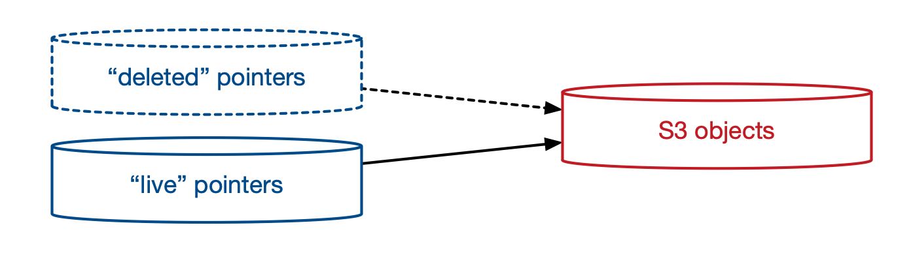

# Removing deleted records from (re)indexes

In the pipeline, when a record is deleted from a source system, we don't expunge it from the pipeline -- instead, we create a stub Work "this has been deleted".
This returns a 410 Gone from the API and a special message on /works:

as opposed to a 404 Not Found for a work ID that doesn't exist:

At time of writing, we have 1.4M deleted Works (44% of the 3.2M works in the index).
Every time we reindex, we have to reprocess all of these records – almost certainly a non-trivial cost of a reindex.

We should remove deleted source records from reindexes.

## The proposal

Currently we keep track of source records in a VHS.
Every source record that has ever existed has an object in S3 and a pointer to that object in DynamoDB:

When we reindex, we read every item from the DynamoDB table and send that to the pipeline.

The proposed approach: we have two DynamoDB tables with an identical structure:

-   A "live" table where we write new records in the adapter, and which is used by the catalogue pipeline and the reindexer.
    This is a continuation of the deleted table.

-   A "deleted" table.
    We move pointers to this table for source records that we don't want in the pipeline.
    This table is ignored by the catalogue pipeline and the reindexer.

We'd keep the same set of records overall, but now they're split over two tables.
Over time, we move records between the two tables as we want to expose or hide them in the catalogue pipeline.

We'd have per-source scripts with two options:

-   Move all records deleted before a given date from "live" to "deleted"
-   Move specific records from "deleted" to "live"

This is intentionally a lossless, reversible process.
We're not permanently deleting any data, and we could revert it later if there are unforeseen issues.

## Benefits

-   **We'd save money on reindexes.**
    Deleted works account for 44% of the index, which means they're probably a substantial reindex cost.

    (I don't have exact numbers, but a reindex costs ~$150.
    Deleted Works are smaller than visible Works so they're a bit cheaper, but a lot of the costs are the same.
    I'd guess we're spending ~$50 per reindex to process deleted works.)

-   **Reindexes would go faster.**
    Having less records means less work to do in a reindex, so they should finish faster.

## Risks and mitigations

-   **410 Gone would become 404 Not Found for any Works that we moved.**
    If we don't put deleted Works in the final Elasticsearch index, the API will serve them as 404 Not Found instead of 410 Gone.
    This is potentially annoying for anybody who has a URL to a work that was previously available.

    As a first pass, we can avoid this by only removing Works that were deleted before the new catalogue API/website -- and so never had public URLs with the current URL scheme.
    If you filter to anything deleted before 1 Jan 2017, there are 876k Works (27% of the 3.2M total Works), and so still a significant saving.

    After that, we could move records to the "deleted" table on a rolling window -- say, anything deleted more than a year previously.

    We could also move individual records back to the "live" table as required.

-   **We don't want to lose an audit trail around source data.**
    Different source systems track deletions differently:

    -   Sierra does "soft" deletes.
        When a record is deleted, Sierra still keeps a stub record to say *"there used to be a record XYZ which was deleted"*.
        We can retrieve a deleted record from the Sierra API.
    -   Calm does "hard" deletes.
        When a record is deleted, Calm removes it from the database and API calls (which is why we have the Calm deletion checker).
        The only way to know the record ever existed is to look at our source data tables.

    Completely removing these source records might cause us unforeseen issues later -- which is why the proposal is to move them into a separate table, rather than delete them.

-   **Reindex stability might take a temporary hit.**
    The pipeline services process Works in batches, e.g. write 50 Works to Elasticsearch, read 30 Works.
    If the size of all the Works in a batch is too big, you get an out-ofmemory error (either from our apps or Elasticsearch) -- so we've picked batch sizes that don't hit these limits.

    Deleted Works are pretty small -- when they're removed from the pipeline, the average size of a batch will go up, and we might need to tweak the batch sizes if we start hitting memory errors.

-   **Some as-yet-unforeseen issue.**
    If this doesn't work in practice, we reverse the process: merge the "deleted" table back into the "live" table, remove the "deleted" table, and we're back at our current setup.
