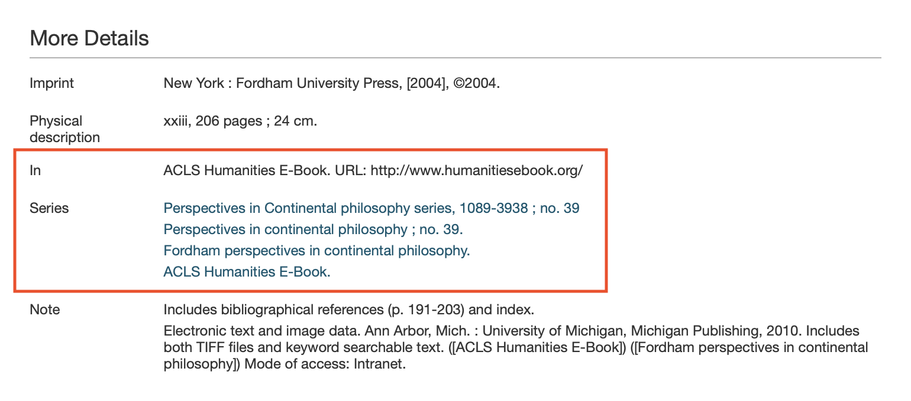
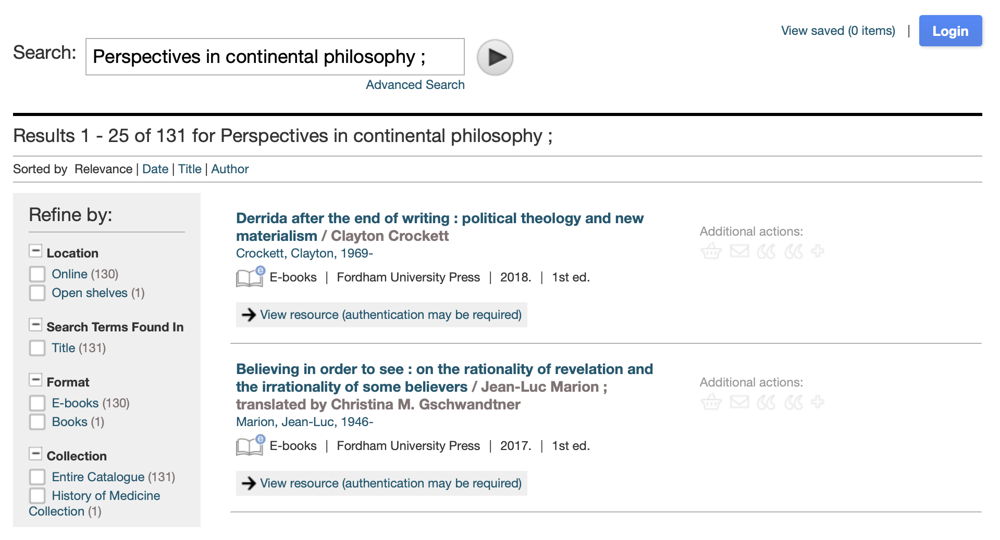
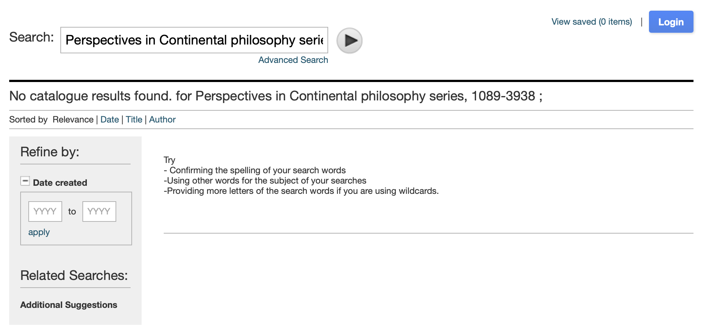

# Work relationships in Sierra

There are various ways to represent relationship between Works in the library and the archive. One example is collections in archives,
where Works are organized in hierarchy with parents, children and siblings.

In Sierra, there are multiple ways to represent relationships between bib records (which become Works):

*   A group of bibs can form a **series** (for example, a series of books written by the same author)
*   A bib can be **part of** another bib (for example, a chapter is part of a book)
*   Conversely, a bib can **contain** other bibs (for example, a book can contain chapters)

There are other ways in Sierra to represent relationships, but this RFC is focusing on these three.
The goal is to define an approach that's flexible enough to be reused for other types of relationship.

## How these relationships appear in Encore


These relationships are exposed in Encore (<https://search.wellcomelibrary.org>), but now our new site (<https://wellcomecollection.org/works>).
We need to add these relationships to the new site, so we can finish migrating users away from Encore.

If you look at an individual bib record in Encore, these links are shown as part of the bib metadata.
For example, [b31787691]:



The "Series" values are links, and take the user to a pre-filled search for the title of the series.
For example, clicking the second link "Perspectives in continental philosophy ; no. 39." takes you to [this search][continental_philosophy]:



This only does a free text search on the record, and sometimes returns inaccurate results.
If you click the first link on b31787691, [the search is empty][empty_search] – even though we know at least one work in this series!



This is an obvious opportunity for improvement – we can provide a more accurate way to browse works by series link.

[b31787691]: https://search.wellcomelibrary.org/iii/encore/record/C__Rb3178769?lang=eng
[continental_philosophy]: https://search.wellcomelibrary.org/iii/encore/search/C__SPerspectives%20in%20continental%20philosophy%20SMCLN__Orightresult?lang=eng&suite=cobalt
[empty_search]: https://search.wellcomelibrary.org/iii/encore/search/C__SPerspectives%20in%20Continental%20philosophy%20series%2C%201089-3938%20SMCLN__Orightresult?suite=cobalt&lang=eng


## MARC representation

### Sierra series
Sierra series are in Marc tag 490 (plus sometimes 830) of the bib record.
Legacy series are in tag 440 and will me migrated to 490 by collections team.

Based on investigation of the Sierra data done at the end of March 2021, there are 131883 record with a Sierra series statement.
The biggest series is
[Early European Books : Printed sources to 1700 ;](https://search.wellcomelibrary.org/iii/encore/search/C__SEarly%20European%20Books%20%3A%20Printed%20sources%20to%201700%20SMCLN__Orightresult__U?lang=eng&suite=cobalt) with 31956 bibs, followed by
[ACLS Humanities E-Book](https://search.wellcomelibrary.org/iii/encore/search/C__SACLS%20Humanities%20E-Book.__Orightresult__U?lang=eng&suite=cobalt) with 5118.

Series can have volumes in subfield $v. Volume "Collection 3"
of "Early European Books : Printed sources to 1700 ;" is the biggest in the library and contains 10245 works.
Series can also have identifiers in subfield $l (Library of Congress call number) or $x (ISSN).
Records with the same identifier in a Series statement can have different volumes in subfield $v.

### Host Item Entry and Constituent Unit Entry
Host Item Entry is in 773 MARC tag. Host Item entries can have a title, related parts in $g that can be volumes or dates,
identifers such as ISSN in $x, ISBN in $z or record control number in $w.

At the time of the investigation there are 492529 works with a Host Item entry statement. The Host Item entry with
the most works is "Eighteenth Century collections online" with 182106 works followed by "Early European Books." with 31956 works.

Some records in Host Item Entry overlap partially or entirely with series: "ACLS Humanities E-Book." is in 773 and 830 and
"Early European Books.” in 773 also nearly completely overlaps with “Early European Books : Printed sources to 1700 ;" in 490.

Not all Host Item entries refer to Series though, like for example
[1377450](https://search.wellcomelibrary.org/iii/encore/record/C__Rb1377450?lang=eng&suite=cobalt&marcData=Y) which refers to another work.

Constituent Unit Entry is in 774 MARC tag. Constituent Unit entries can have a title, related parts in $g that can be volumes or dates,
identifiers such as ISSN in $x, ISBN in $z or record control number in $w. There are 760 works with a 774 MARC tag.

## Proposal
The proposal is to use properties `parts` and `partOf` of the Work model that are already used to represent
archive collections. This is an example of how relations are rendered by the Catalogue API for archive works for
[dq3spb42](https://api.wellcomecollection.org/catalogue/v2/works/dq3spb42?include=parts,partOf):
```yaml
"parts": [
  {
    "id": "fncn55x6",
    "title": "Articles on Nutrition Education",
    "referenceNumber": "PP/DSM/3/1",
    "totalParts": 0,
    "totalDescendentParts": 0,
    "type": "Work"
  },
  {
    "id": "a8hbc266",
    "title": "Articles on Dietetics",
    "referenceNumber": "PP/DSM/3/2",
    "totalParts": 0,
    "totalDescendentParts": 0,
    "type": "Work"
  },
  {
    "id": "qhvzeece",
    "title": "Nutrition Newsletters, Conference Literature etc",
    "referenceNumber": "PP/DSM/3/3",
    "totalParts": 0,
    "totalDescendentParts": 0,
    "type": "Work"
  },
  {
    "id": "cpp2xh99",
    "title": "Articles and Papers on Nutrition",
    "referenceNumber": "PP/DSM/3/4",
    "totalParts": 0,
    "totalDescendentParts": 0,
    "type": "Work"
  },
  {
    "id": "ur5sakg9",
    "title": "\"Nutrition in Britain in the twentieth century\" - PhD thesis",
    "referenceNumber": "PP/DSM/3/5",
    "totalParts": 0,
    "totalDescendentParts": 0,
    "type": "Work"
  },
  {
    "id": "k4vp98bp",
    "title": "Miscellaneous Items",
    "referenceNumber": "PP/DSM/3/6",
    "totalParts": 0,
    "totalDescendentParts": 0,
    "type": "Work"
  }
],
"partOf": [
  {
    "id": "hb9hqd8p",
    "title": "McLaren, Dr Donald S",
    "referenceNumber": "PP/DSM",
    "partOf": [],
    "totalParts": 3,
    "totalDescendentParts": 9,
    "type": "Collection"
  }
],
```
For archive collections, the website renders these as a collapsible hierarchy:


Given the size of many series and Host Item Entry that would not be practical in this case, so the proposal
is for the frontend to render differently the information in `partOf` based on the `type` property of the work.

In the case of archive works, the frontend should render the hierarchy as in the example above.

In the case of Sierra works, the frontend should provide a link to a search page where the user can paginate through
all works linked by the same Series or Host Item Entry.
To do this the Catalogue API should provide a filter that matches exactly on the contents of `partOf` along the lines of
`/works?partOf.title=Morphogenesis of the vertebrate brain`.

As series and Host Item Entries can have volumes, the proposal is to represent them by creating one record for the Series or
Host Item Entry and one for the volume with a nested `partOf` property (see example below).

Additionally, if a series or Host Item Entry has an identifier (such as ISSN os ISBn or other) the proposal is
to mint a canonical identifier in the pipeline and to expose that identifier in the API.
Finally, the proposal is to model a series statement or a Host Item Entry with a type `Work`.

### Examples

- [1074785](https://search.wellcomelibrary.org/iii/encore/record/C__Rb1074785?lang=eng&suite=cobalt&marcData=Y)
This is an example of a series statement in 490 + 830. In this example the information contained in 830 and 490 is
  exactly the same, so the result is just one statement.
```yaml
"partOf": [
  {
    "title": "Morphogenesis of the vertebrate brain; 2",
    "workType": {
      "id": "???",
      "label": "Volumes",
      "type": "Format"
    },
    "partOf": [
      {
        "title": "Morphogenesis of the vertebrate brain",
        "type": "Series"
      }
    ],
    "type": "Series"
  }
]
```
- [3109805](https://search.wellcomelibrary.org/iii/encore/record/C__Rb3109805?lang=eng&suite=cobalt&marcData=Y)
  490 + 773 with slightly different information
```yaml
"partOf": [
  {   //490
    "title": "Early European Books : Printed sources to 170; Collection 4",
    "workType": {
      "id": "???",
      "label": "Volumes",
      "type": "Format"
    },
    "partOf": [
      {
        "title": "Early European Books : Printed sources to 170",
        "type": "Series"
      }
    ],
    "type": "Series"
  },
  {   //773
    "title": "Early European Books",
    "type": "Work"
  }
]
```

- [3178769](https://search.wellcomelibrary.org/iii/encore/record/C__Rb3178769?lang=eng&suite=cobalt&marcData=Y) 490 + 830 multiple entries + 773
```yaml
"partOf": [
  {   // 490 & 830 with same information
    "title": "Perspectives in Continental philosophy series; no. 39",
    "partOf": [
      {
        "id": "abcdefg",
        "identifiers": [
          {
            "identifierType": {
              "id": "issn",
              "label": "ISSN",
              "type": "IdentifierType"
              },
            "value": "1089-3938",
            "type": "Identifier"
          }
        ],
        "title": "Perspectives in Continental philosophy series",
        "type": "Series"
      }
    ],
    "type": "Series"
  },
  {  // Second 830 with slighly different information
    "title": "Fordham perspectives in continental philosophy",
    "type": "Series"
  },
 {   // 830 & 773 contain the same information
    "title": "ACLS Humanities E-Book.",
    "type": "Work" //or Series?
  }
]
```
- [2125597](https://search.wellcomelibrary.org/iii/encore/record/C__Rb2125597?lang=eng&suite=cobalt&marcData=Y)
  490 with ISSN + 830 and 773. There are 1037 bibs that have the same ISSN in a series statement but
  with different volume subfield.
```yaml
"partOf": [
  {   // 490 +830 contain duplicated info
    "title": "Methods in Molecular Biology, Methods and Protocols; 212",
    "partOf": [
      {
        "id": "abcdefg",
        "identifiers": [
          {
            "identifierType": {
              "id": "issn",
              "label": "ISSN",
              "type": "IdentifierType"
            },
            "value": "1064-3745",
            "type": "Identifier"
          }
        ],
        "title": "Methods in Molecular Biology, Methods and Protocols",
        "type": "Series"
      }
    ],
    "type": "Series"
  },
  {   // 773
    "title": "Springer eBooks",
    "type": "Work"
  }
]
```
- [3001878](https://search.wellcomelibrary.org/iii/encore/record/C__Rb3001878?lang=eng&suite=cobalt&marcData=Y)
  Only 830 with no 490/440 or 773
```yaml
"partOf": [
    {
        "title": "Adamson Collection Wellcome Library", // subfield $a concatenated with $p
        "type": "Series"
    }
]
```
- [1110225](https://search.wellcomelibrary.org/iii/encore/record/C__Rb1110225?lang=eng&suite=cobalt&marcData=Y)
Series statement in 440 with only the title
```yaml
"partOf": [
    {
        "title": "Monographs on inorganic and physical chemistry",
        "type": "Series"
    }
]
```
- [1204561](https://search.wellcomelibrary.org/iii/encore/record/C__Rb1204561?lang=eng&suite=cobalt&marcData=Y) 440 with id
```yaml
"partOf": [
  {
    "title": "Brill's studies in intellectual history; v. 13",
    "partOf": [
      {
        "id": "abcdefgh",
        "identifiers": [
          {
            "identifierType": {
              "id": "issn",
              "label": "ISSN",
              "type": "IdentifierType"
            },
            "value": "0920-8607",
            "type": "Identifier"
          }
        ],
        "title": "Brill's studies in intellectual history",
        "type": "Series"
      }
    ],
    "type": "Series"
  }
]
```
- [2301867](https://search.wellcomelibrary.org/iii/encore/record/C__Rb2301867?lang=eng&suite=cobalt&marcData=Y)
  773 not overlapping with series and no id.
```yaml
"partOf": [
    {
        "title": "Eighteenth Century collections online",
        "type": "Work"
    }
]
```
- [1186777](https://search.wellcomelibrary.org/iii/encore/record/C__Rb1186777?lang=eng&suite=cobalt&marcData=Y)
  773 with an id in subfield $w which links to another Work in our library (see example below)
```yaml
"partOf": [
   {
    "title": "Basil Hood. Photograph album; page 9",
    "partOf": [
      {
        "id": "abcdefgh",
        "identifiers": [
          {
            // identifier from $w
            "identifierType": {
              "id": "???",
              "label": "???",
              "type": "IdentifierType"
            },
            "value": "(Wcat)9175i",
            "type": "Identifier"
          }
        ],
        "title": "Basil Hood. Photograph album",
        "type": "Work"
      }
    ],
    "type": "Work"
  }
]
```
- [1172977](https://search.wellcomelibrary.org/iii/encore/record/C__Rb1172977?lang=eng&suite=cobalt&marcData=Y)
  774 with ids (related to above 773)
```yaml
"parts": [
  {
    "title": "Basil Hood. Photograph album; Page 5",
    "totalParts": 1,
    "totalDescendentParts": 1,
    "parts": [
      {
        "id": "abcdefgh1", // minted based on subfield $w
        "title": "Charing Cross Hospital: a portrait of house surgeons. Photograph, 1906.",
        "totalParts": 0,
        "totalDescendentParts": 0,
        "type": "Work"
      }
    ],
    "type": "Work"
  },
  {
    "title": "Basil Hood. Photograph album; Page 6",
    "totalParts": 1,
    "totalDescendentParts": 1,
    "parts": [
          {
            "id": "abcdefgh2", // minted based on subfield $w
            "title": "Charing Cross Hospital: a portrait of house surgeons. Photograph, 1906.",
            "totalParts": 0,
            "totalDescendentParts": 0,
            "type": "Work"
          }
    ],
    "type": "Work"
  },
  ...
  {
    "title": "Basil Hood. Photograph album; Page 9",
    "totalParts": 1,
    "totalDescendentParts": 1,
    "parts": [
          {
            "id": "abcdefgh3", // minted based on subfield $w
            "title": "Charing Cross Hospital: full-length portrait of Basil Hood. Photograph, 1906.",
            "totalParts": 0,
            "totalDescendentParts": 0,
            "type": "Work"
          }
    ],
    "type": "Work"
  },
]
```

- [3017508](https://search.wellcomelibrary.org/iii/encore/record/C__Rb3017508?lang=eng&suite=cobalt&marcData=Y)
  774 no ids
```yaml
"parts": [
    {
        "title": "Lists of plants collected in January 1885.",
        "physicalDescription": "30 p.; 34 x 21 cm",
        "totalParts": 0,
        "totalDescendentParts": 0,
        "type": "Work"
    },

]
```
