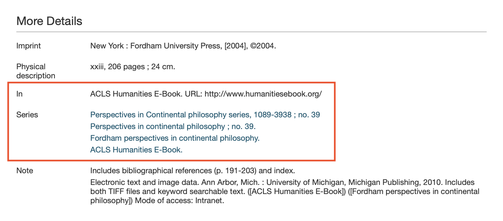
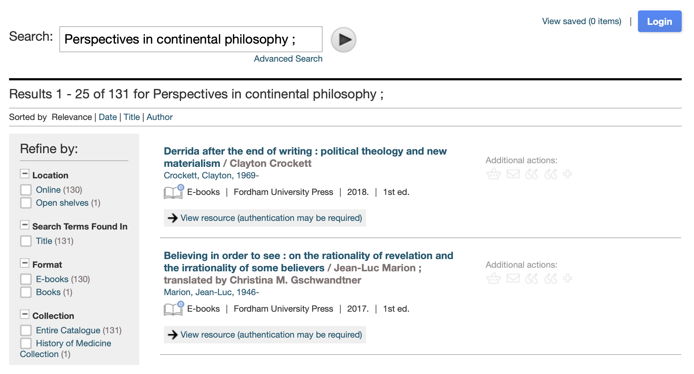
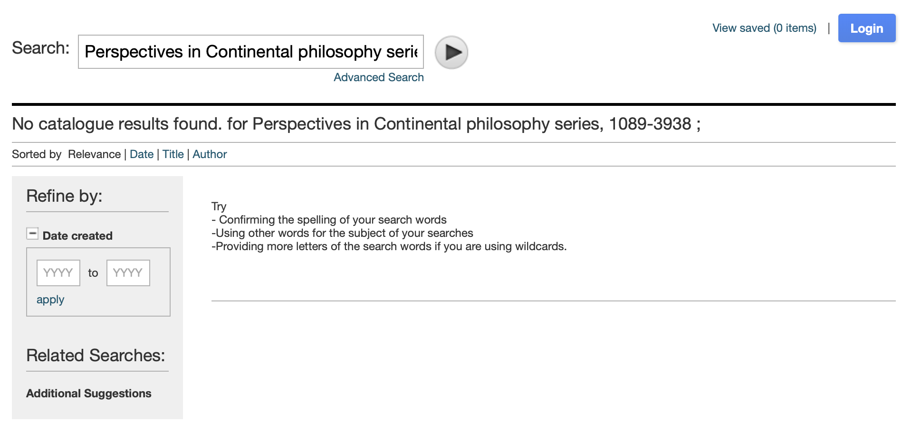
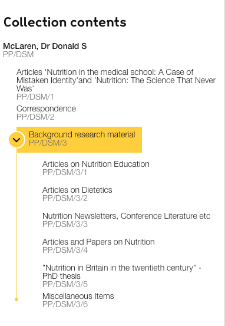

# Work relationships in Sierra

---

This RFC has been superceded by [sierra-work-relationships](../../045-sierra-work-relationships) and is 
preserved here to provide context.

---

There are various ways to represent relationship between Works in the library and the archive. One example is collections in archives,
where Works are organized in hierarchy with parents, children and siblings.

In Sierra, there are multiple ways to represent relationships between bib records (which become Works):

*   A group of bibs can form a **series** (for example, a series of books written by the same author)
*   A bib can be **part of** another bib (for example, a chapter is part of a book)
*   Conversely, a bib can **contain** other bibs (for example, a book can contain chapters)

There are other ways in Sierra to represent relationships, but this RFC is focusing on these three.
The goal is to define an approach that's flexible enough to be reused for other types of relationship.


## How these relationships appear in Encore

These relationships are exposed in Encore (<https://search.wellcomelibrary.org>), but now our new site (<https://wellcomecollection.org/works>).
We need to add these relationships to the new site, so we can finish migrating users away from Encore.

If you look at an individual bib record in Encore, these links are shown as part of the bib metadata.
For example, [b31787691]:



The "Series" values are links, and take the user to a pre-filled search for the title of the series.
For example, clicking the second link "Perspectives in continental philosophy ; no. 39." takes you to [this search][continental_philosophy]:



This only does a free text search on the record, and sometimes returns inaccurate results.
If you click the first link on b31787691, [the search is empty][empty_search] – even though we know at least one work in this series!



This is an obvious opportunity for improvement – we can provide a more accurate way to browse works by series link.

[b31787691]: https://search.wellcomelibrary.org/iii/encore/record/C__Rb3178769?lang=eng
[continental_philosophy]: https://search.wellcomelibrary.org/iii/encore/search/C__SPerspectives%20in%20continental%20philosophy%20SMCLN__Orightresult?lang=eng&suite=cobalt
[empty_search]: https://search.wellcomelibrary.org/iii/encore/search/C__SPerspectives%20in%20Continental%20philosophy%20series%2C%201089-3938%20SMCLN__Orightresult?suite=cobalt&lang=eng


## How it should work on wellcomecollection.org

Users should be able to:

-   See whether a work is part of a series, part of another work, or contains other works
-   Find other works in the same series, or which are part of the same work, or contained by this work

We can reuse some of the functionality we have for modelling relations and archive trees, but the size of some series means we can't reuse the UI components.


## How these relationships are modelled in MARC

There are five variable-length fields ("varfields") in Sierra that we'll look at for this work:

-   [**490 Series Statement.**](https://www.loc.gov/marc/bibliographic/bd490.html)
    This is used to mark a bib as part of a series, for example:

    ```
    490 1  Perspectives in Continental philosophy series,|x1089-3938
           ;|vno. 39
    ```

    The field is structured to distinguish between the title of the series (`Perspectives in Continental philosophy series`) and the bib's place within this series (`no. 39`).

    This is present on ~60k bibs.

    The interesting subfields are $a (series statement) and $v (volume).
    We will ignore the other subfields – either they're not useful for this work, they're non-standard fields, or their use is likely an error on the original Sierra record.

*   [**440 Series Statement.**](https://www.loc.gov/marc/bibliographic/bd440.html)
    For example:

    ```
    440  0 Folk literature of South American Indians
    ```

    This is legacy data that will eventually be migrated to 490, but it's currently present on 60k+ bibs, so we have to include it in this work.

    The interesting subfields are $a (series statement) and $v (volume).

*   [**830 Series Added Entry-Uniform Title.**](https://techdocs.iii.com/sierraapi/v2/Content/zReference/objects/varFieldsArray.htm)
    This is another field for marking a bib as part of a series, for example:

    ```
    830  0 Published papers (Wellcome Chemical Research Laboratories)
           ;|vno. 149.
    ```

    This is present on ~36k bibs.

*   [**773 Host Item Entry.**](https://www.loc.gov/marc/bibliographic/bd773.html)
    If this is present on a bib, it tells us about the containing bib.
    For example:

    ```
    773 00 |tBulletin of the history of dentistry.|gVol. 26 (1978)
           |gno. 1, Apr.|w(OCoLC)1537778
    ```

    The bib on which this appears is part of this volume of the bulletin of the history of dentistry.

    This is present on ~492k bibs.

*   [**774 Constituent Unit Entry.**](https://www.loc.gov/marc/bibliographic/bd774.html)
    This is the opposite of 773, and tells us about the component parts of this bib.
    For example:

    ```
    774 18 |gFol. 1 left|aCavalieri, Giovanni Battista, ca. 1525-
           1601.|tConjoined twins sharing one pair of legs, born in
           1584. Etching by G.B. Cavalieri, 1585.|w(Wcat)653161i
    774 18 |gFol. 1 right|aCavalieri, Giovanni Battista, ca. 1525-
           1601.|tEngraved titlepage to G.B. Cavalieri, 'Opera nela
           quale vi e molti mostri'.  Engraving by G.B. Cavalieri,
           1585.|w(Wcat)653162i
    ```

    The bib on which these fields appear has two component parts.

    This is only present on 749 bibs.

We'll continue to refine our use of these fields and subfields as we go along – it's very hard to define an exact specification upfront.

We will likely do some cleanup (e.g. deduplication across fields) once we've done the first transformation of the data, but where possible we should try to fix data at source (in Sierra) rather than writing code to deal with it.


## Notable series

*   Some series have thousands of items, e.g. "ACLS Humanities E-Book." appears in 5k+ instances of 830 Series Added Entry-Uniform Title.

*   "Early European Books : Printed sources to 1700" appears in 31k+ instances of 440 Series Statement, divided into individual volumes.

*   We should consider dismissing or removing certain values in subfield $a as unlikely to be useful for navigation, including:

    *   ` ` (a single space) which appears in 1k+ instances of 830


## How we will model these relationships in the catalogue API

Previously, all the relationships in the catalogue API have been to other Works.
We're not going to create Works for series (unless the Library team have created one in Sierra).

We will use use the `parts` and `partOf` properties on the Work model, that are current used to represent archive collections.

This is how relations are modelled for the archive collection on [dq3spb42](https://api.wellcomecollection.org/catalogue/v2/works/dq3spb42?include=parts,partOf):

```json
"parts": [
  {
    "id": "fncn55x6",
    "title": "Articles on Nutrition Education",
    "referenceNumber": "PP/DSM/3/1",
    "totalParts": 0,
    "totalDescendentParts": 0,
    "type": "Work"
  },
  ...
  {
    "id": "k4vp98bp",
    "title": "Miscellaneous Items",
    "referenceNumber": "PP/DSM/3/6",
    "totalParts": 0,
    "totalDescendentParts": 0,
    "type": "Work"
  }
],
"partOf": [
  {
    "id": "hb9hqd8p",
    "title": "McLaren, Dr Donald S",
    "referenceNumber": "PP/DSM",
    "partOf": [],
    "totalParts": 3,
    "totalDescendentParts": 9,
    "type": "Collection"
  }
],
```

These are [rendered on the website](https://wellcomecollection.org/works/dq3spb42) as a collapsible hierarchy:



Some series can have thousands of entries, so this UI isn't practical – we'll need to render the information differently.
We'll determine how to render them based on the `type` property of the entry in `partOf`.

*   For archive works, we'll use `partOf: Collection` and render an archive tree
*   For works which are part of a series (440, 490, 830), we'll use `partOf: Series` and display a link as part of the work metadata (similar to Encore)
*   For works which have constituent parts or are part of something else, we'll use `partOf: Work`

If a series or host item entry has a volume, we'll use a nested `partOf` property to record the series and the volume individually (see example below).

If a series or host item entry has an identifier (such as an ISSN), we'll add it to the `partOf` and mint a canonical identifier for it.

### Examples

-   b10747850

    ```
    490 1  Morphogenesis of the vertebrate brain ;|v2
    830  0 Morphogenesis of the vertebrate brain ;|v2
    ```

    We'll deduplicate because the information in 490 and 830 is the same:

    ```json
    "partOf": [
      {
        "title": "Morphogenesis of the vertebrate brain; 2",
        "workType": {
          "id": "???",
          "label": "Volumes",
          "type": "Format"
        },
        "partOf": [
          {
            "title": "Morphogenesis of the vertebrate brain",
            "type": "Series"
          }
        ],
        "type": "Series"
      }
    ]
    ```

    We have a nested `partOf` because there's volume information in subfield $v.


-   b31098058

    ```
    490 0  Early European Books : Printed sources to 1700 ;
           |vCollection 4
    773 0  |tEarly European Books.
    ```

    Here we have 490 and 773 with slightly different information.

    ```json
    "partOf": [
      { // 490
        "title": "Early European Books : Printed sources to 170; Collection 4",
        "workType": {
          "id": "???",
          "label": "Volumes",
          "type": "Format"
        },
        "partOf": [
          {
            "title": "Early European Books : Printed sources to 170",
            "type": "Series"
          }
        ],
        "type": "Series"
      },
      { // 773
        "title": "Early European Books",
        "type": "Work"
      }
    ]
    ```

    Although we could write logic to deduplicate these, it's better to do the deduplication (if we want to) in Sierra itself.

-   b31787

    ```
    490 1  Perspectives in Continental philosophy series,|x1089-3938
           ;|vno. 39
    773 0  |tACLS Humanities E-Book.|nURL: http://
           www.humanitiesebook.org/
    830  0 Perspectives in continental philosophy ;|vno. 39.
    830  0 Fordham perspectives in continental philosophy.
    830  0 ACLS Humanities E-Book.
    ```

    ```json
    "partOf": [
      {   // 490 & 830 with same information
        "title": "Perspectives in Continental philosophy series; no. 39",
        "partOf": [
          {
            "id": "abcdefg",
            "identifiers": [
              {
                "identifierType": {
                  "id": "issn",
                  "label": "ISSN",
                  "type": "IdentifierType"
                  },
                "value": "1089-3938",
                "type": "Identifier"
              }
            ],
            "title": "Perspectives in Continental philosophy series",
            "type": "Series"
          }
        ],
        "type": "Series"
      },
      {  // Second 830 with slighly different information
        "title": "Fordham perspectives in continental philosophy",
        "type": "Series"
      },
     {   // 830 & 773 contain the same information
        "title": "ACLS Humanities E-Book.",
        "type": "Work" //or Series?
      }
    ]
    ```
- [2125597](https://search.wellcomelibrary.org/iii/encore/record/C__Rb2125597?lang=eng&suite=cobalt&marcData=Y)
  490 with ISSN + 830 and 773. There are 1037 bibs that have the same ISSN in a series statement but
  with different volume subfield.
```yaml
"partOf": [
  {   // 490 +830 contain duplicated info
    "title": "Methods in Molecular Biology, Methods and Protocols; 212",
    "partOf": [
      {
        "id": "abcdefg",
        "identifiers": [
          {
            "identifierType": {
              "id": "issn",
              "label": "ISSN",
              "type": "IdentifierType"
            },
            "value": "1064-3745",
            "type": "Identifier"
          }
        ],
        "title": "Methods in Molecular Biology, Methods and Protocols",
        "type": "Series"
      }
    ],
    "type": "Series"
  },
  {   // 773
    "title": "Springer eBooks",
    "type": "Work"
  }
]
```
- [3001878](https://search.wellcomelibrary.org/iii/encore/record/C__Rb3001878?lang=eng&suite=cobalt&marcData=Y)
  Only 830 with no 490/440 or 773
```yaml
"partOf": [
    {
        "title": "Adamson Collection Wellcome Library", // subfield $a concatenated with $p
        "type": "Series"
    }
]
```
- [1110225](https://search.wellcomelibrary.org/iii/encore/record/C__Rb1110225?lang=eng&suite=cobalt&marcData=Y)
Series statement in 440 with only the title
```yaml
"partOf": [
    {
        "title": "Monographs on inorganic and physical chemistry",
        "type": "Series"
    }
]
```
- [1204561](https://search.wellcomelibrary.org/iii/encore/record/C__Rb1204561?lang=eng&suite=cobalt&marcData=Y) 440 with id
```yaml
"partOf": [
  {
    "title": "Brill's studies in intellectual history; v. 13",
    "partOf": [
      {
        "id": "abcdefgh",
        "identifiers": [
          {
            "identifierType": {
              "id": "issn",
              "label": "ISSN",
              "type": "IdentifierType"
            },
            "value": "0920-8607",
            "type": "Identifier"
          }
        ],
        "title": "Brill's studies in intellectual history",
        "type": "Series"
      }
    ],
    "type": "Series"
  }
]
```
- [2301867](https://search.wellcomelibrary.org/iii/encore/record/C__Rb2301867?lang=eng&suite=cobalt&marcData=Y)
  773 not overlapping with series and no id.
```yaml
"partOf": [
    {
        "title": "Eighteenth Century collections online",
        "type": "Work"
    }
]
```
- [1186777](https://search.wellcomelibrary.org/iii/encore/record/C__Rb1186777?lang=eng&suite=cobalt&marcData=Y)
  773 with an id in subfield $w which links to another Work in our library (see example below)
```yaml
"partOf": [
   {
    "title": "Basil Hood. Photograph album; page 9",
    "partOf": [
      {
        "id": "abcdefgh",
        "identifiers": [
          {
            // identifier from $w
            "identifierType": {
              "id": "???",
              "label": "???",
              "type": "IdentifierType"
            },
            "value": "(Wcat)9175i",
            "type": "Identifier"
          }
        ],
        "title": "Basil Hood. Photograph album",
        "type": "Work"
      }
    ],
    "type": "Work"
  }
]
```
- [1172977](https://search.wellcomelibrary.org/iii/encore/record/C__Rb1172977?lang=eng&suite=cobalt&marcData=Y)
  774 with ids (related to above 773)
```yaml
"parts": [
  {
    "title": "Basil Hood. Photograph album; Page 5",
    "totalParts": 1,
    "totalDescendentParts": 1,
    "parts": [
      {
        "id": "abcdefgh1", // minted based on subfield $w
        "title": "Charing Cross Hospital: a portrait of house surgeons. Photograph, 1906.",
        "totalParts": 0,
        "totalDescendentParts": 0,
        "type": "Work"
      }
    ],
    "type": "Work"
  },
  {
    "title": "Basil Hood. Photograph album; Page 6",
    "totalParts": 1,
    "totalDescendentParts": 1,
    "parts": [
          {
            "id": "abcdefgh2", // minted based on subfield $w
            "title": "Charing Cross Hospital: a portrait of house surgeons. Photograph, 1906.",
            "totalParts": 0,
            "totalDescendentParts": 0,
            "type": "Work"
          }
    ],
    "type": "Work"
  },
  ...
  {
    "title": "Basil Hood. Photograph album; Page 9",
    "totalParts": 1,
    "totalDescendentParts": 1,
    "parts": [
          {
            "id": "abcdefgh3", // minted based on subfield $w
            "title": "Charing Cross Hospital: full-length portrait of Basil Hood. Photograph, 1906.",
            "totalParts": 0,
            "totalDescendentParts": 0,
            "type": "Work"
          }
    ],
    "type": "Work"
  },
]
```

- [3017508](https://search.wellcomelibrary.org/iii/encore/record/C__Rb3017508?lang=eng&suite=cobalt&marcData=Y)
  774 no ids
```yaml
"parts": [
    {
        "title": "Lists of plants collected in January 1885.",
        "physicalDescription": "30 p.; 34 x 21 cm",
        "totalParts": 0,
        "totalDescendentParts": 0,
        "type": "Work"
    },

]
```
