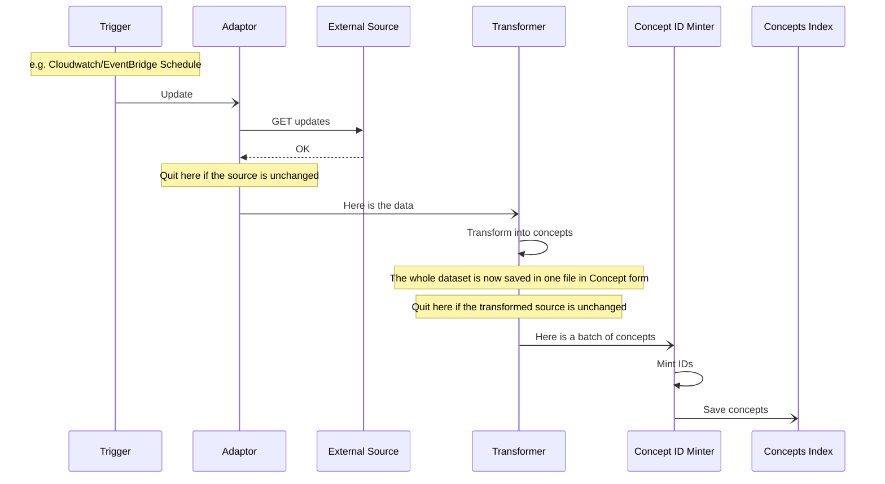

# RFC: 052: The Concepts Pipeline - phase one

**Status:** :construction: Draft :building_construction:

## Executive Summary

In order to populate a new index with concept data harvested from external sources, we will
create a new concepts pipeline. This pipeline will fetch data from the source, mint Wellcome IDs 
(with a new Concepts ID Minter), and save the concepts to the new index. This unfiltered concepts
index will be used by the Concepts API in the first phase. 

At first, the pipeline will only import a single source, and will therefore not need to handle merging of synonyms.

We will then add further stages to this pipeline to merge synonyms, filter unused concepts and support the knowledge graph.

## End Goal

A new index to feed the concepts API with concepts, harvested from Library of Congress, MeSH, and
Wikidata (with the possibility of adding other sources as we see fit), and assigned Wellcome IDs.

To allow the API to be as lightweight as possible, the indexed documents will match the form in which 
they are returned by the Concepts API e.g.

```json
{
  "id": "ews89aeb",
  "label": "United States",
  "identifiers": [
    {
      "identifierType": {
        "id": "lc-subjects",
        "label": "Library of Congress Subject Headings (LCSH)",
        "type": "IdentifierType"
      },
      "type": "Identifier",
      "value": "n78095330"
    }
  ],
  "type": "Subject"
}
```


```json
{
  "id": "deadbeef",
  "label": "United States",
  "identifiers": [
    {
      "identifierType": {
        "id": "lc-subjects",
        "label": "Library of Congress Subject Headings (LCSH)",
        "type": "IdentifierType"
      },
      "type": "Identifier",
      "value": "n78095330"
    },
    {
      "identifierType": {
        "id": "someones-identifiers",
        "label": "A list of important identifiers compiled by some important organisation",
        "type": "IdentifierType"
      },
      "type": "Identifier",
      "value": "baadf00d"
    }
  ],
  "type": "Subject"
}
```
## Open Questions

### Deleting and Renaming

How do we ensure that the index of all concepts is an accurate representation of the source?
Do old entries ever get removed?
Do we have to delete everything when pulling in a new version?

### Platform

Do we run this in a similar fashion to the Catalogue Pipeline, or should we use this opportunity to migrate to
an orchestration system like Airflow or AWS Step Functions?

###

## A New Pipeline



### Triggering

This pipeline is to be triggered periodically based on the expected frequency with which we expect relevant updates to 
occur in the source concept list.

### Quitting Early
There are two conditions under which the pipeline may quit early.

1. The document fetched from the source is unchanged since the previous run.
   - There is no need to run the pipeline if there is nothing to do
   - How this is determined may depend on the source
2. The document produced by the Transformer is unchanged since the previous run.
    - It is possible that some changes to a source document are irrelevant to our use of concepts and are dropped in transformation

### Data Flow

This pipleline is expected to run on bulk batches only, and not on updates of single concept entries.  Therefore, the 
entire batch of concepts is to be kept intact as far into the pipeline as possible.

If, instead, the lists were split into individual concepts at the earliest opportunity, then later stages would have 
to gather batches for efficient processing.  Sending queries for multiple IDs to the Minter database, 
and bulk updates to Elasticsearch are better than doing the same thing one record at a time.

Data is stored between stages, and the next stage is then notified about the document to process.

### The new Concepts ID Minter

Unlike catalogue entries, IDs are in a predictable location in Concept objects, and at this stage in the pipeline, 
any Concept object will only contain one ID.  This means that the minter for these can be simpler.

A new id minter application should be created for this pipeline, to mint IDs for objects in the identifiers list. It will
accept a JSONL document, and process an appropriate number of lines with each pass.

The new minter application will use the same database as the catalogue pipeline minter, and identifier objects will be 
in the same form.  This means that any external Concept Identifiers found in Catalogue Works will receive the same 
Wellcome canonical identifier.

Currently, the 

Although the existing id minter in the catalogue pipeline is mostly agnostic as to the format of the JSON it processes, 
it is not perfectly reusable as-is. At the top level, it still relies on processing Works retrieved from Elasticsearch.
This minter will be processing Concepts extracted from a JSONL document.

Wikidata Q166907 tells us that these two are the same:
MeSH: D003027 
LCSH: sh85027252

So, assuming we have a canonicalID of h3adp4ne for that same concept, when we encounter MeSH: D003027 or
LCSH: sh85027252 in a Work, then the id_minter will assign h3adp4ne to it.

The trouble is that there are two uniqueness constraints in the ID Minter DB, and both of them are used to ensure that 
the system works.  Our canonicalids are the primary key, and collectively, the source identifier and scheme are the other
uniqueness constraint.  

I think that what we will need is a prior step (and database) that handles sameAs relationships.

id problems:
1. How do we ensure that we don't coin new ids in the catalogue first, which would cause D003027 and sh85027252 get different canonicalIds?
2. How do we work around the uniqueness constraints in the id minter db, such that D003027 and sh85027252 can both return the same canonicalId?
3. How do we handle changes to sameAs relationships?
4. (In Works) At the end of the pipeline, do we want to distinguish between concept ids added by cataloguers and those inherited by sameness?
5. (In Works) How do we ensure changes like 3, above, are reflected?
6. What is the best order for any of this?

I think that 1 can be solved by having a different format so that concepts in Works are not mintable until they
have been through the sameAs step.

Day 1:
D003027 = Q166907
sh85027252 not present on Wikidata

D003027 = canonical_id_1
sh85027252 = canonical_id_2

Day 2:
D003027 = Q166907
sh85027252 = Q166907

Now we need to make sh85027252 = canonical_id_1


## Out of scope

There are some aspects that are out of scope for this phase.

### Fetching from more than one data source

At this point, we will only be importing from LCSH.

### Identifying synonyms

As we only have one data source, there are no synonyms to identify. Eventually, Wikidata will be the 
source of sameAs relationships that will allow us to assign the same Wellcome id to all ids referring to
the same concept.

### The Knowledge Graph

A knowledge graph that links different concepts will eventually exist.  When it does, it can be used
in a new stage in the pipeline.

### Filtering Unused Concepts

At first, we will simply use the entire set of imported concepts. This will be needed regardless of whether we filter 
them.  Later, we can add a stage to filter the concepts based on what we actually use.

                
