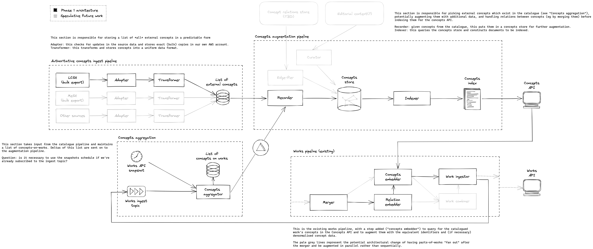

# RFC: 052: The Concepts Pipeline - phase one

## Summary

## Background

### Source Data

Authorities[^1] publish documents[^3] containing identifiers[^2], which we will fetch and process.

Works in the Collection contain references to these identifiers, and also contain Unidentified Concepts that only 
have a name.

In the first phase, only LCSH will be fetched.  Later, other sources will be included, and merged using Wikidata
as a source of sameAs relationships between the terms.

### End Goal

The result of running data through this pipeline is an index to serve the concepts API with concept data,
harvested from an external authority (Initially Library of Congress, then MeSH, and Wikidata, with the possibility
of adding other sources as we see fit).

## Overview

In order to populate a new index with relevant concept data harvested from external sources, we will
create three new concepts pipelines, and modify the Sierra transformer to ensure that Wellcome canonical ids are
minted for all concepts in Works.  We will also add a stage to the Catalogue Pipeline that uses the resulting data
from this pipeline to update Works.

### The Concepts Ingest Pipeline

This pipeline will be triggered 
- periodically, based on the update schedule of the source and how up-to-date we want each source to be
- manually, if the update schedule is irregular, and we want to bring our data up-to-date immediately

It will:

- fetch data from the source,
- transform it to a common format
- store that common form in a database

The result of this is a store (ES Index) containing all the concepts from all chosen external sources, 
in a common format. This will contain Concepts not in use at Wellcome.  

This will not contain any Concepts that are exclusive to Wellcome (those identified by name only in Works).

Records will only contain the data provided by the external source, and will not have been embellished with Wellcome
data in any way.

Records will contain:

* the identifier, 
* the authority,
* the primary name
* a list of alternative names

### The Concept Aggregation Pipeline

This pipeline will be triggered:

- by the ingest of new Works by the Catalogue Pipeline
- manually to ingest the data from all Works

It will:

- extract any Concept Identifiers present on those Works 
- store them in a database

The result of this is a store (ES Index) containing all the concepts in use in Wellcome Collection Works.

This will contain a mixture of Concepts from external sources and those exclusive to The Collection.

Records will only contain records for those identifiers explicitly used in Works.  The records will contain
* the identifier,
* the authority,
* the name used for the concept on the Work
* the corresponding Wellcome canonical identifier

### The Concept Augmentation Pipeline

This pipeline will be triggered when either of the stores at the end of the Aggregation or Ingest pipelines change.

It will
- combine corresponding records from the Aggregation and Ingest pipelines
- from that, build the concepts store knowledge graph 
  - At this point, there are no relations in the graph, this is future work
- from that, populate the concepts index to be used by the Concepts API

### Update to the Catalogue Pipeline

A new stage will be added, at a point after the Merger.  This new stage will 

* Find Concepts mentioned in the Work
* request Concept records for any of them from the Concepts API 
* Replace the data in the Concept objects in the Work with the data from the Concepts API

## Skeleton Delivery Plan

* The Ingest and Aggregation pipelines can be worked on independently in parallel at first.
* To be complete, the Aggregation pipeline also requires changes to the Sierra Transformer (catalogue pipeline)
  so that identifiers are minted for unidentified concepts.
* In the first phase, with only one source of external identifiers, 
the Augmentation pipeline should skip the knowledge graph, rather than creating a kind of graph-less graph.
* Finally the new catalogue pipeline stage can be added.
  * It is also possible to work on adding this using the current dummy implementation of the API.

## Other Considerations

## Workflow Orchestration

These pipelines will be implemented using AWS Step Functions.

### ID Minter

We do not need to provide our own identifiers for external concepts or identifiers that we do not use in works.
This means that these pipelines do not need to interact with the ID Minter or its database.  All Wellcome Canonical
IDs used in the Augmentation pipeline will come from records in the Concept Aggregation pipeline.

#### Batch vs single-message

Concepts Aggregation will run in two distinct modes.  A Batch mode that sees the whole set of Works and builds 
a list from that, and a single-message mode that adds any new Concepts found on the corresponding Work.

### Periodic or event-based?

Originally, we discussed updating the Concept Aggregation Pipeline periodically based on the Works Snapshot.

If we drive it from Works ingest, then we do not need this periodic update.

With this approach, it may be the case that we end up with some concepts that have been deleted from Works 
left in the final index.  However, deleting all references to a given concept is not likely to be a common
occurrence, and the most appropriate resolution could be occasional manual refreshes in the same manner 
as reindexing the catalogue pipeline, or a periodic full refresh on a slow schedule.

Keeping up to date with deletions is less pressing than with new data.

The alternative is to also store the identifiers of all the Works that refer to a given Concept on the Concept record
and remove the current Work's id if it no longer mentions that Concept.  This is likely to be an inefficient solution 
for a rare occurrence.

### Why not just use Wikidata?

As we intend to use Wikidata as the authoritative source for sameAs relationships, it may seem appropriate to 
use it as the source for all external ids.  However, this is not the case.

We cannot use Wikidata alone, because:

- It is not necessarily complete - there may be LCSH or MeSH (or other) terms that we use, but have not yet been added.
- We also require other data (lists of alternative names, descriptions), which are exclusively published
  by the source authority and not duplicated elsewhere.
- We want to use the label from LCSH as the preferred label for the concept. This is not always present on a Wikidata record.
- The "never wrong for long" approach of a Wiki is OK for relationships, but relying on it for the preferred name of a concept may be problematic

### When does a Work know

One of the goals of this product is to replace out-of-date concept names on Works that were catalogued a long time ago
and where the official name of the concept has changed.

To do this, the current name corresponding to an identifier from the Source Authority should be used and stored on the 
Work to be returned by the Works API, in place of the name used in the original data from the catalogue.

We need to denormalise the concepts back on to the works in order to do this, once the data from the Authority has
been processed.

Ideally, a relevant update in the Concepts pipeline would trigger concept changes in affected Works.  However,
once the application is in a steady state, such name changes are likely to be infrequent.

Because this is likely to be infrequent, the reprocessing can happen on the next catalogue pipeline reindex.
This means that we will have to reindex after the concepts index is first populated, but after then, it can
wait until the next catalogue reindex. This does mean that there could be a significant delay between an update 
to a name at an authority and the update to the name in Works, but if a particular change is deemed urgent, a 
manual reindex can be triggered.

We should log significant differences for reporting to cataloguing staff, in order to help keep the source records up 
to date with the latest names.  The exact definition of significance can be explored in development, but is likely to 
involve ignoring terminal punctuation.

## Data Sources

The Library of Congress publishes [monthly lists of changes](https://classweb.org/approved-subjects/), implying
that it would be sufficient to run the Ingest Pipeline for that source on a similar frequency.

## Further Work

The following aspects are not considered here.

* Knowledge Graph construction
* Synonyms and redirects
* Composite Identifiers                                                                             

## Local Glossary

### Authority

[^1]:An external organisation that maintains a set of concept identifiers.

### External Identifier

[^2]:The identifier used by an Authority for a Concept.

### Source Document

[^3]:The published, downloadable form of an authority's set of concepts, e.g. a JSONL dump, XML file or similar.

### Unidentified Concept
[^4]:A concept referred to in Works by name only, not an explicit unique identifier.
