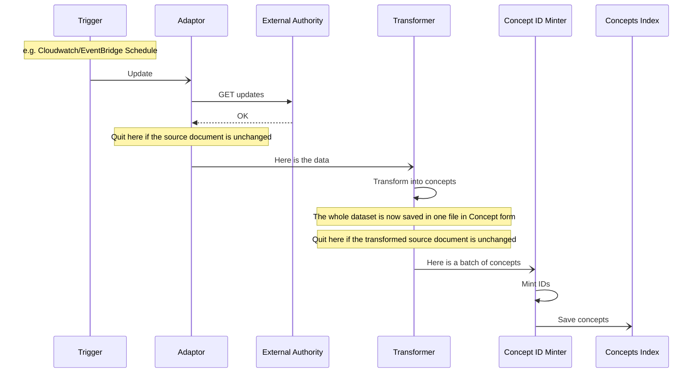
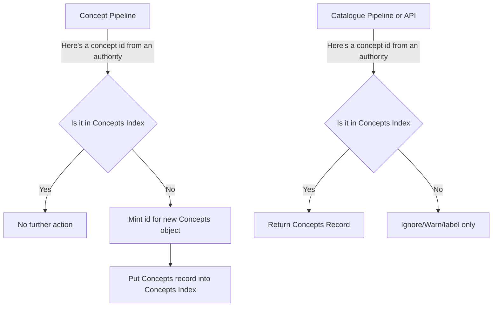

# RFC: 052: The Concepts Pipeline - phase one

**Status:** :construction: Draft :building_construction:

## Executive Summary

In order to populate a new index with concept data harvested from external sources, we will
create a new concepts pipeline. This pipeline will fetch data from the source, mint Wellcome IDs 
(with a new Concepts ID Minter), and save the concepts to the new index. This unfiltered concepts
index will be used by the Concepts API in the first phase, with filtering added in a later phase.

At first, the pipeline will only import a single source, and will therefore not need to handle merging of synonyms.

We will then add further stages to this pipeline to merge synonyms, filter unused concepts and support the knowledge graph.

## End Goal

The result of running data through this pipeline is an index to serve the concepts API with concept data, 
harvested from an external authority (Initially Library of Congress, then MeSH, and Wikidata, with the possibility 
of adding other sources as we see fit), and assigned Wellcome canonical ids.

To allow the API to be as lightweight as possible, the indexed documents will match the form in which 
they are returned by the Concepts API - currently as below:

```json
{
  "id": "ews89aeb",
  "label": "United States",
  "identifiers": [
    {
      "identifierType": {
        "id": "lc-subjects",
        "label": "Library of Congress Subject Headings (LCSH)",
        "type": "IdentifierType"
      },
      "type": "Identifier",
      "value": "n78095330"
    }
  ],
  "type": "Subject"
}
```

## A New Pipeline



### Triggering

This pipeline is to be triggered periodically based on the expected frequency with which we expect relevant updates to 
occur in the authority's concept list, and our desire to keep up to date with 

### Quitting Early
There are two conditions under which the pipeline may quit early.

1. The document fetched from the authority is unchanged since the previous run.
   - There is no need to run the pipeline if there is nothing to do
   - How this is determined may depend on the authority
2. The document produced by the Transformer is unchanged since the previous run.
    - It is possible that some changes to a source document are irrelevant to our use of concepts and are dropped in transformation

A third situation where the pipeline produces no change, would be where all of the identifiers are already present
in the index, but as this would be discovered in the final stage, it is not really an early exit.

### Data Flow

This pipeline is expected to run on bulk batches only, and not on updates of single concept entries.  Therefore, the 
entire batch of concepts is to be kept intact as far into the pipeline as possible.

If, instead, the lists were split into individual concepts at the earliest opportunity, then later stages would have 
to gather batches for efficient processing.  Sending queries for multiple IDs to the Minter database, 
and bulk updates to Elasticsearch are better than doing the same thing one record at a time.

Data is stored between stages, and the next stage is then notified about the document to process.

### The new Concepts ID Minter

A new id minter application should be created for this pipeline, to mint IDs for objects in the identifiers list. It will
accept a JSONL document, and process an appropriate number of lines with each pass.

The new minter application will use the same database as the catalogue pipeline minter, and identifier objects will be
in the same form.  This ensures that we do not have identifier collisions between Concepts and Works.

Although the existing id minter in the catalogue pipeline is mostly agnostic as to the format of the JSON it processes,
it is not perfectly reusable as-is. At the top level, it still relies on processing Works retrieved from Elasticsearch.
This minter will be processing Concepts extracted from a JSONL document.

Unlike catalogue entries, which may contain multiple identifiers referring to other documents, a Concept object is the 
thing being identified itself.  The identifiable object is a Concept with an identifierType of wellcome-concept, akin 
finding this JSON snippet in a Work.

```
"sourceIdentifier": {
   "identifierType": {
      "id": "wellcome-concept"
   },
   "value": "${canonicalId}",
   "ontologyType": "Concept"
}
```
Where canonicalId is an identifier newly created by the same method as in [Identifiable.scala](https://github.com/wellcomecollection/catalogue-pipeline/blob/main/pipeline/id_minter/src/main/scala/weco/pipeline/id_minter/utils/Identifiable.scala),
This identifier string will serve as the id for the Concept record, and will also be stored in the indentifiers list:

```json
{
  "id": "ews89aeb",
  "label": "United States",
  "identifiers": [
     {
        "identifierType": {
           "id": "wellcome-canonical",
           "label": "Wellcome Canonical Identifier",
           "type": "IdentifierType"
        },
        "type": "Identifier",
        "value": "ews89aeb"
     },
    {
      "identifierType": {
        "id": "lc-subjects",
        "label": "Library of Congress Subject Headings (LCSH)",
        "type": "IdentifierType"
      },
      "type": "Identifier",
      "value": "n78095330"
    }
  ],
  "type": "Subject"
}
```

Thus, any new identifier encountered will create a new record with two identifiers.
1. The new identifier from the authority
2. The wellcome canonical identifier generated by the minter.

Subsequent identifiers for the same concept from different authorities will be added to that list.

This diagram shows the expected flow for an individual concept identifier when encountered in either pipeline.



In both cases, the process will be batched appropriately, rather than operating on individual identifiers, but this
illustrates the per-ID behaviour.  This flow also omits synonym resolution, which is out of scope for this RFC.

### Indexing

Each concept should index (at least) the following keyword fields from each of its identifiers.

* identifierType.id
* a concatenation of the identifierType.id and the identifier value (QName)

Indexing the identifier type id allows us to create queries with type filters for efficient Elasticsearch querying.

Indexing the combined identifier type and identifier as a QName guards against potential id collisions across different
schemes.  When Elasticsearch indexes the fields from an array of objects, it does so independently, meaning that it is
difficult or impossible to write a query that unambiguously matches one of these records but not the other:

* a record with a field containing an object with field1=value1 and field2=value2
* a record with a field containing at least two objects, one with this field1=value1 and another with field2=value2

Indexing in this way would allow a terms query to be used to batch retrieve identifiers when checking if they already
exist.

```json
{
   "query": {
      "filter": {
          "term": {",identifiers.identifierType": "lc-subjects"}
      },
      "terms": {
         "indentifiers.qname": [
            "lc-subjects:n78095330",
            "lc:subjects:sh85027252",
            ...
         ]
      }
   }
}
```

## Out of scope

There are some aspects of the eventual pipeline that are out of scope of this RFC.

### Fetching from more than one data source

At this point, we will only be importing from LCSH.  This RFC considers the need to fetch from multiple sources
and merging synonyms, and attempts to ensure that we do not put something in place that makes it difficult or 
impossible to do so, but does not specify how this will work.

#### Identifying synonyms

As we only have one data source, there are no synonyms to identify. Eventually, Wikidata will be the 
source of sameAs relationships that will allow us to assign the same Wellcome id to all ids referring to
the same concept.

### Fetching/prcessing deltas

When the LCSH dataset is updated, a dump of the whole set is published.  It is expected to be small enough to
process the whole set in a reasonable time.  Therefore, no consideration is given in this RFC to the method of
processing updates, instead of full dumps.

Other datasets may publish a stream of updates (e.g. Wikidata) or periodic deltas.  Where a dataset is very large,
it would be beneficial to process the full set once, then process only the updates in subsequent runs.

### Destructive changes

There are two types of destructive change that may occur in the completed pipeline:

1. Deletion of an external identifier
2. Moving an external identifier to a different Concept

#### Deletion

Although there are [processes for deletion](https://www.loc.gov/aba/publications/FreeSHM/H0193.pdf) of LCSH entries,
the eventual Concepts index is expected to be driven by Wellcome's usage of identifiers.  Deleting identifiers
when the external authority deletes them should be driven by cataloguing practice.

#### Moving

In this phase, there will be a 1:1 correspondence between external authority identifiers and Wellcome identifiers.
Moving identifiers will become an issue when we incorporate multiple data sources and resolve synonyms, and should
be given some serious thought when that implementation is designed.

##### Example

An example for consideration when designing for moving identifiers:

Wikidata Q166907 currently tells us that these two are the same, but at one point, they were not.

- MeSH: D003027
- LCSH: sh85027252

Day 1:
- D003027 = Q166907
- sh85027252 not present on Wikidata

After processing:
- D003027 = canonical_id_1
- sh85027252 = canonical_id_2

Day 2:
- D003027 = Q166907
- sh85027252 = Q166907

Now sh85027252 should be canonical_id_1 (or D003027 should be canonical_id_2)

Day 3:
- D003027 = not present on Wikidata - how do we detect that?
- sh85027252 = Q166907

What happens now?

### The Knowledge Graph

A knowledge graph that links different concepts will eventually exist.  When it does, it can be used
and/or populated in a new stage in the pipeline.

### Filtering Unused Concepts

At first, we will simply use the entire set of imported concepts. This will be needed regardless of whether we filter 
them.  Later, we can add a stage to filter the concepts based on what we actually use.  This will likely come after the 
end of the pipeline described in this document, and will copy all matching concepts from the index created here into a 
new index which will become the Concepts Index used by the Concepts API and Catalogue pipeline.

## Other Future/Related Work

### ID Minter Service

For some time, the idea of an ID Minter service (e.g. an API) has been floated. This would be a service used by 
the existing catalogue pipeline and any other system that requires it.

The Concepts pipeline would be one such "other system". This RFC does not propose setting up that service now
as a prerequisite to the pipeline.  However, were one to exist, this would use it.

## Open Questions

### Platform

Do we run this in a similar fashion to the Catalogue Pipeline, or should we use this opportunity to migrate to
an orchestration system like Airflow or AWS Step Functions?

## Glossary

### Authority

An external organisation that maintains a set of concept identifiers.

### Source Document

The published, downloadable form of an authority's set of concepts, e.g. a JSONL dump.

### External Identifier

The identifier used by an Authority for a Concept.

## Random thoughts

So, assuming we have a canonicalID of h3adp4ne for that same concept, when we encounter MeSH: D003027 or
LCSH: sh85027252 in a Work, then the id_minter will assign h3adp4ne to it.

The trouble is that there are two uniqueness constraints in the ID Minter DB, and both of them are used to ensure that
the system works.  Our canonicalids are the primary key, and collectively, the source identifier and scheme are the other
uniqueness constraint.

I think that what we will need is a prior step (and database) that handles sameAs relationships.

id problems:
1. How do we ensure that we don't coin new ids in the catalogue first, which would cause D003027 and sh85027252 get different canonicalIds?
2. How do we work around the uniqueness constraints in the id minter db, such that D003027 and sh85027252 can both return the same canonicalId?
4. (In Works) At the end of the pipeline, do we want to distinguish between concept ids added by cataloguers and those inherited by sameness?
5. (In Works) How do we ensure changes like 3, above, are reflected?
6. How do we mint an id for an object that doesnt' yet have an id?
   1. By minting an id for it and seeing if it works.

1 Can be solved by having a different format so that concepts in Works are not mintable until they
have been through the sameAs step (and, in fact, if we're fetching them out of a DB at that point, why bother minting in Works,
just go straight to having the canonicalID in there).

In 2, the uniqueness constraints are really important for the way the existing minter works. I think this needs to be
handled prior to, distinct from, or combined with minting in the concepts pipeline, to be stored in a separate database.

This all points to the need for a minter service (passim).
