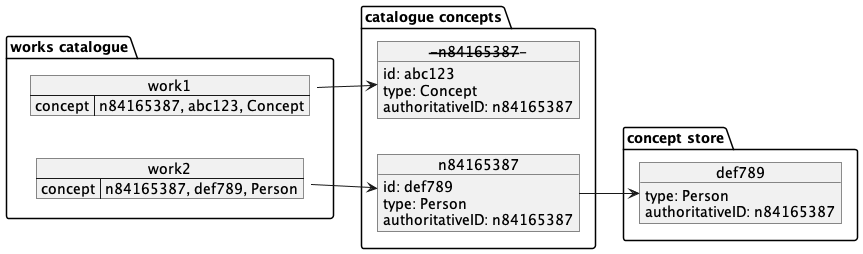
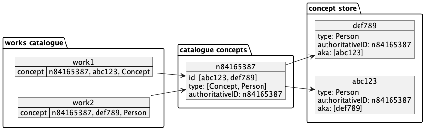

# RFC 054: Authoritative ids with multiple Canonical ids.

## The problem

Some authoritative ids (including label-derived ones) correspond to more than one Concept in the Works catalogue.
It is therefore not possible to reliably link by id between a work and a concept
because the canonical id used in _this_ work for a given concept is not the same 
as the one used in _that_ work.

The root cause of this is that the ontologyType of a concept forms part of the
key used to mint a canonical id, and the ontologyType of a concept is determined
from the MARC field it comes from in a Sierra document.

Further, the Concepts pipeline currently assumes a 1:1 relationship between a Concept and 
an authoritative id.  This causes some expected Concepts to be absent from the concepts API.

Finally, this blocks the implementation of Genres as Concepts, because we cannot reconcile
genre-as-a-subject with genre-of-a-work whilst also marking genres with a distinct ontologyType.

## How it is

The Concepts Aggregator extracts Concepts from Works, and uses 
[the bulk API](https://www.elastic.co/guide/en/elasticsearch/reference/current/docs-bulk.html) to store 
them, keyed on the authoritative id, in the catalogue-concepts index.  The Recorder then reconciles
these records with the corresponding official records and stores the combined record in the concepts-store
index, keyed on the canonicalId.



## Proposal

The Aggregator will extract Concepts in the same way, but the bulk command will now
include [an ingest pipeline](https://www.elastic.co/guide/en/elasticsearch/reference/8.6/ingest.html)
with [append processors](https://www.elastic.co/guide/en/elasticsearch/reference/8.6/append-processor.html)
to collect ids and types.

The Recorder will then create a record for each canonicalId in the list, choosing
the "best" ontologyType and applying it to all of the output records.


The "best" ontologyType is the most specific.  Concept < Agent < Everything else.
This hierarchy is currently in use to choose the best type when the same authoritative
id occurs in multiple places in a single document.
There may be some conflicts where multiple types of the same specificity are 
present on the same catalogue concept, but this is unlikely to occur, adn if it 
does, then it is likely to be an error in the source data.

This proposal also allows us to start considering same-as relationships in 
the Concepts API. The entries in the concept store can contain a list of
all the canonicalids of other concepts with the same authoritative id 
(possibly also including its own).

### Why merge and split?

The alternative to merging and splitting would be to have a separate record for 
each authoritative/canonical id pair in catalogue concepts.

For each authoritative id, the Recorder currently fetches one Concept Record
by id.  Changing it to search for multiple records would be a significant change,
whereas the change to the output is much less extreme.

### Why use an ingest pipeline?

The alternative is for the Aggregator to first fetch any records it will overwrite,
then populate the id and type members accordingly, deduplicating members of the
list etc. All adding significant complexity.

An append processor will do this declaratively and efficiently inside the database.


## Even better/eventually

Ideally, the root cause of this should be fixed, by removing ontologyType from 
the id minter. However, that is a very complex change and we would still need to 
take an approach like the one proposed here to collect the ontologyTypes and
choose the most appropriate one.

## Out of scope

### How to find works

This proposal does not consider exactly how the API, search, or Concepts pages
will make use of the new sameAs data.  

Essentially, this behaviour will be expected:

```gherkin
GIVEN two synonymous concepts, 'abc123' and 'def789'
WHEN works containing 'abc123' are requested
THEN works containing either 'abc123' and 'def789' are returned
```

Similarly, the concept pages for the two identifiers will be identical, 
whether by redirection or by virtue of containing the same data.

### Choosing a "preferred" Concept

Eventually, this will be required for the Relation Embedder, which will replace
synonymous Concepts in Works with a single preferred Concept.

This may also be required in order to create redirects for the Concepts API and
pages.  There are no real-world criteria with which to select a blessed
Concept as they are all the same.

Eventually, we may need a persistent store to record the chosen preferred concepts.
