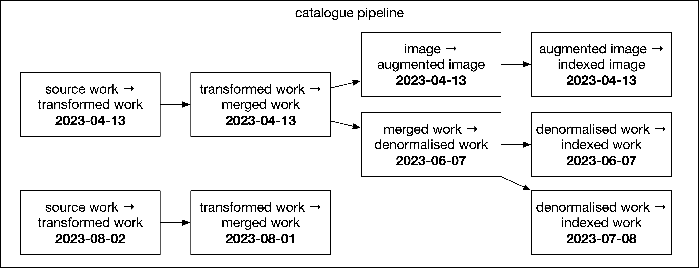
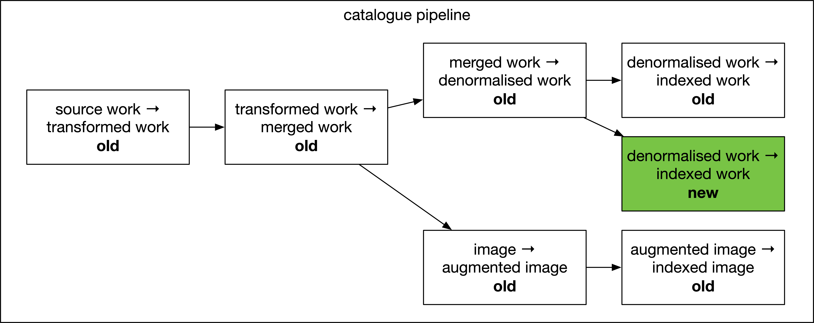
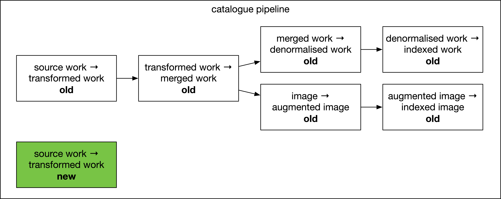
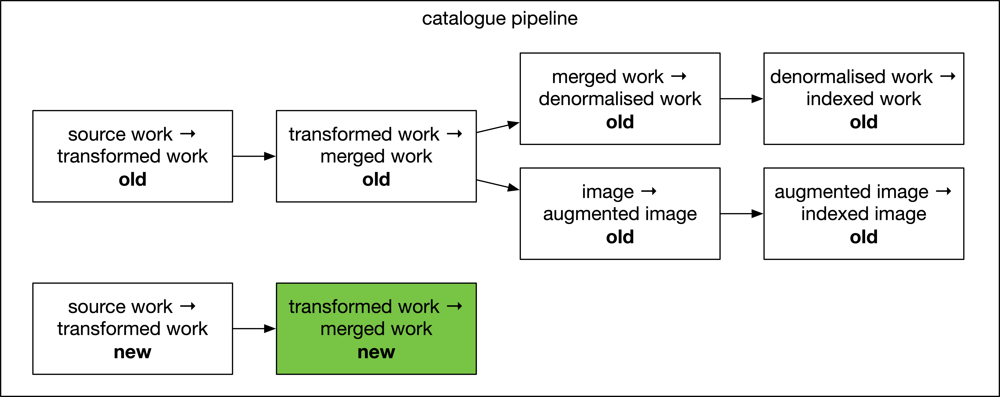
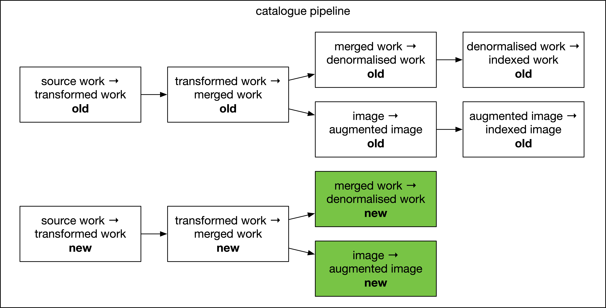
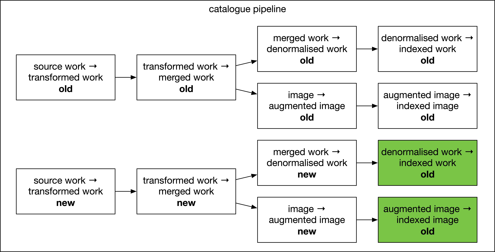

# RFC 057: Restructuring the catalogue pipeline

There are several problems with the catalogue pipeline, especially when it comes to reindexes:

*   Running a reindex is slow, cumbersome, and expensive
*   Reindexes are somewhat wasteful -- we're often repeating transformations that have happened elsewhere, but we're not reusing the output
*   We have a growing number of Elastic clusters, which is getting expensive

We've talked about addressing these problems a number of times and tried various solutions; this is another suggestion.
I'm not saying we should definitely do this, but I'm writing the RFC to help me clarify some thoughts.

Here are some desirable properties of any change:

*   Reindexes are faster and easier.
    This is hard to measure, but I think everyone knows we're not there yet – for example, see all the unfavourable comments we make when comparing the content or concepts pipeline.

*   A smaller Elastic Cloud and AWS bill.

*   A single Elastic Cloud cluster for all our APIs.
    Currently we have separate clusters for catalogue, concepts, and content.
    If we want to make them all highly available and performant, that's going to get expensive – at our scale, it would be significantly cheaper to consolidate them into a single cluster.

*   It doesn't require "boiling the ocean".
    We don't have a lot of engineering capacity to make major changes; ideally we should reuse as much of what we already have as possible.

## Thesis

Although it contains microservies, we still manage the catalogue pipeline as a monolith -- we deploy it as a single unit.
There are lots of potential gains if we're willing to break it into smaller pieces.

## The idea

What we call the "catalogue pipeline" could be thought of as a series of "mini" pipelines that are connected together.
The interface between them is the separate Elasticsearch indexes.


What if we could deploy and reindex each of these pipelines separately?
And create more complex pipeline topologies?
Rather than recreating and reindexing the entire pipeline every time, you could reindex at the appropriate stage -- reducing the amount of repetitive work and making your reindex faster.

These boundaries already exist conceptually, and are sometimes reflected in the code -- this is mostly a repackaging of existing apps and their Terraform, without major app changes required.

I hope this diagram gives an idea of the sort of thing I imagine this enabling:



Here there are two separate "denormalised/indexed work" mini-pipelines, each with different Elasticsearch mappings.
There's also the start of a brand new pipeline that isn't connected to anything else yet, maybe where we're experimenting with a new transformation.

## Worked examples

### Example 1: changing a small number of records

Suppose you want to send a small number of records through the transformation pipeline again.
You identify the IDs of the records you want to retransform, then send those IDs to the "source record -> transformed work" pipeline.

They then flow through the pipeline, like they currently do.

### Example 2: changing the final index mapping

Suppose you want to change the way the data is mapped/indexed in Elasticsearch for the API, in a way that isn't compatible with the existing index.

Then you could just reindex at the final stage:

1.  Create a new mini-pipeline "denormalised -> indexed work".
    Run a reindex in this pipeline only.

    

2.  Point the API at the new index; delete the old "denormalised -> indexed work" pipeline/index.

This involves less work than our current approach, and should be much faster.

### Example 3: changing the way a lot of records are transformed

1.  Create a new mini-pipeline "source record -> transformed work", not connected to anything.
    Run a reindex in this pipeline only, to retransform all the source records.

    

2.  Connect it to a new mini-pipeline "transformed -> merged work".
    Run a reindex in this pipeline only, to retransform all the merged records.

    

3.  Connect this to mini-pipelines for "merged -> denormalised work" and "initial -> augmented image".
    Run a reindex in these two pipelines.

    

4.  Connect this to mini-pipelines for "denormalised -> indexed work" and "augmented -> indexed image".
    Run a reindex in these two pipelines.

    

5.  Point the API at the new index; delete the old pipelines/indexes.

You might combine a couple of steps in practice, but the ability to break it into distinct steps like this has a particular benefit at the "merged -> denormalised" and "denormalised -> indexed work" stages.

e.g. currently a single work may come out of the merger multiple times -- once for itself, and once for every other work it gets merged with.
In this approach, the relation embedder would only have to process it once, rather than multiple times.

## Implementation notes

*   This is some very rough thinking on what this might look like in Terraform: one module per "mini-pipeline", which can take inputs from previous pipelines:

    ```hcl
    module "source_to_transformed_work_2023-04-13" {
      source = "./pipelines/source_to_transformed_work"

      label = "2023-04-13"
    }

    module "transformed_to_merged_work_2023-04-13" {
      source = "./pipelines/transformed_to_merged_work"

      label  = "2023-04-13"
      inputs = [module.source_to_transformed_work_2023-04-13.output]
    }

    module "merged_to_denormalised_work_2023-06-07" {
      source = "./pipelines/merged_to_denormalised_work"

      label  = "2023-06-07"
      inputs = [module.transformed_to_merged_work_2023-04-13.output]
    }
    ```

*   We have various tools for reindexing at different stages at the pipeline – the reindexer app is one, the "reingest display documents" script is another.
    I'd suggest pulling these together into a single new tool, which can reindex at any stage.

*   In the past, one of the challenges of having pipelines that reuse an Elastic cluster is cleaning up old indexes -- but I think we could have Terraform do this for us.

    You can manage Elasticsearch indexes in Terraform.
    We could still leave the mapping/settings to the apps, but if each module managed the index resources, those indexes would get cleaned up when we deleted the module.
