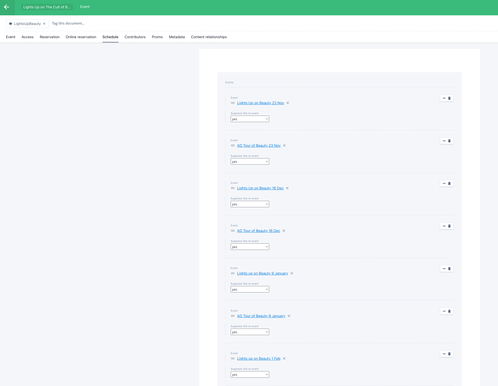
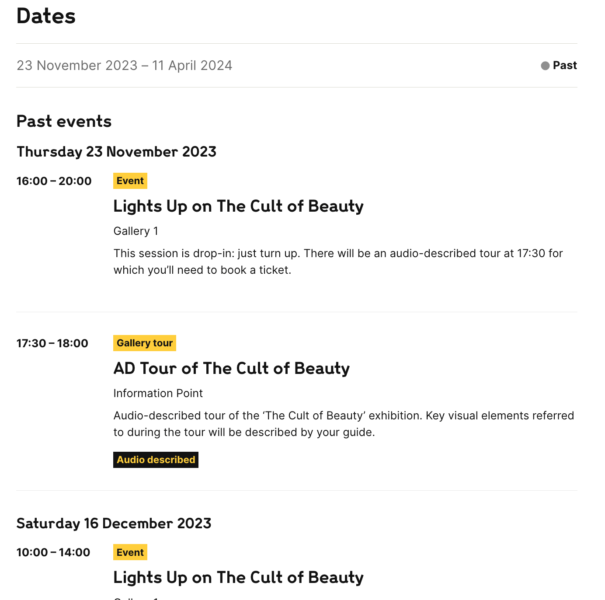

# Content-api: next steps

[Background information](#background-information)  
[Challenges encountered and decisions made](#challenges-encountered-and-decisions-made)

- Scheduled events
- Delist
- Sorting and filter by date

[Proposal](#proposal)

- Events endpoint and response
- Event endpoint and response
- Filters
- Aggregations
- Sorting

Further requests for opinions and insights

- [Prismic IDs](https://github.com/wellcomecollection/content-api/issues/129)
- [How granular do we want to be for filtering by time and date on Events?](https://github.com/wellcomecollection/content-api/issues/130)

## Background information

Around October 2023, we started work on adding our Prismic Events to the Content API ([see reasoning here for why we need the Content API](https://github.com/wellcomecollection/docs/tree/main/rfcs/055-prismic-api#background)). We did this without writing an RFC first, opting for a few chats and relying on the [Original suggestion for Events](https://github.com/wellcomecollection/docs/blob/main/rfcs/055-prismic-api/events.md) that was written at the start of building the Content API. We realised this should not have been the case, and are now choosing to write one for a few reasons; to document the challenges we’ve come across, the decisions we've made along the way and how we propose it changes and ends up looking like.

**The active endpoints are:**

- https://api.wellcomecollection.org/content/v0/events
- https://api.wellcomecollection.org/content/v0/events/[eventId]

**Document of interest:**

- [Original suggestions for future versions of Content API](https://github.com/wellcomecollection/docs/blob/main/rfcs/055-prismic-api/future-versions.md) (includes suggestions of filters and such for events)

**Notes:**

- This document will be using the term “Scheduled” to talk about “children” events.
- This API only serves Prismic `Events` content types. Please note that it doesn't fetch anything from the `Events Series` content type. The name of a series does get considered at the display level as it gets displayed on the result card along with a “Part of” prefix, but gets pulled from the `Event` data.
- Some of these challenges also affect the `Articles` endpoint. If that is the case, it will be indicated.

## Challenges encountered and decisions made

### Scheduled events

This [Github PR](https://github.com/wellcomecollection/content-api/issues/93#issue-2088674788) described this and applied a solution that is subject to change.

#### Challenge

There is no way to create an event hierarchy at the moment. In reality, some events come as a set (they become “Scheduled” events) and could use such a thing. The solution adopted by the team is to create a “Parent” event first, which contains the general information including promotional images. Then, “Scheduled” events are added to its “Scheduled” tab:



These Scheduled events are, in reality, sibling events, as, as we said, there is no hierarchy within the Event content type. They are created only to be listed in the Parent event:



As they contain minimal other information (lacking images, description...), the Scheduled events are not to be seen individually, nor displayed in listing pages. This is done by tagging the event with delist.

The problem with search is that the Scheduled events contain important information such as date/time and access needs (interpretations). A Parent event would have no interpretation, but it might have a Scheduled event that is a BSL tour, and another one that is an Audio-described one.

The parent points to its children by ID, the child has no knowledge of what its parent is.

#### Decision

- Scheduled events must be findable/filterable based on their interpretation, audience, etc... which are not set on the parent
- The API returns the Parent event, not the Scheduled events to avoid duplication and/or evenst being listed without image or description.
- Basically we want to be able to match on a Scheduled event but return its parent in the API response.

Therefore, we need the Parent event document to contain all the filterable values for its Scheduled events, at all levels - display, query, aggregrations.
In order to achieve this, we modify the graphQuery to fetch the Scheduled event’s data alongside its Parent’s.

```javascript
const query = `{
  events {
    title
    isOnline
    availableOnline
    format {
      ... on event-formats {
        title
      }
    }
    interpretations {
      interpretationType {
        title
      }
    }
    audiences {
      audience {
        title
      }
    }
    locations {
      location {
        title
      }
    }
    times {
      startDateTime
      endDateTime
      isFullyBooked
      onlineIsFullyBooked
    }
    // we add format, interpretations, audiences and locations to the graphQuery here 
    schedule {
      event {
        title
        format {
          ... on event-formats {
            title
          }
        }
        interpretations {
          interpretationType {
            title
          }
        }
        audiences {
          audience {
            title
          }
        }
        locations {
          location {
            title
          }
        }
        times {
          startDateTime
          endDateTime
        }
      }
    }
    promo {
      ... on editorialImage {
        non-repeat {
          caption
          image
        }
      }
    }
    series {
      series {
        title
        contributors {
          contributor {
            ... on people {
              name
            }
            ... on organisations {
              name
            }
          }
        }
      }
    }
  }
}`;
```

We also modify the event transformer to pull in the Scheduled event's format, interpretations, audiences and locations into the Parent and add them to the Parent's filterable and aggregatable values. We will mostly likely need to deduplicate as some Scheduled events have the same interpretations, locations, etc.

As a result, when a user filters by say, "Audio described" we may return a Parent event that is not audio described but has a Scheduled event that is.

### Delist

#### Challenge

In the articles endpoint, we purposefully chose to allow articles that were tagged with `delist`. In our current usage of the Prismic API, we hide those articles from list views.
In the context of search, which the Content API was originally built for, the decision was made to make them available.
It turns out this is not a blanket decision that can be made for all endpoints, as the `delist` tag is used for different purposes across Prismic. In the Event content type, it is used to identify “Scheduled” events so the front-end can hide them, as they are not fit for display.

#### Decision

In the events endpoint, we chose to add `isChildScheduledEvent: true` to events tagged with `delist`. The ES query is designed to IGNORE these documents.

### Sorting and filter by date

> :warning: This section is subject to change based on the outcome of [this ticket](https://github.com/wellcomecollection/content-api/issues/130). It does represent the current state of the conversation, but the ticket should be consulted and considered source of truth on the decision.

#### Challenges

1. **Filtering by dates**
   The Prismic API currently offers a [date filter](https://prismic.io/docs/rest-api-technical-reference#date-filters) for fetching events. In the FE we use the logic below to determine which filter to use based on our needs.  
   We will need something similar in Content API in order to match our current offering, as well as being able to be more efficient in the search.<br>
   Currently, sorting by date doesn’t discriminate between past and future events. Therefore, you can either go from “farthest event in the past” to “farthest event in the future” or the opposite, which is very confusing and not very intuitive for people not expecting to be offered the whole catalogue of events.

```javascript
    // The 'current-and-coming-up' and 'past' filters should split
    // events into two segments -- every event/exhibition should match
    // exactly one of these.
    //
    // We use today() as the comparison value so events get removed from
    // the What's On page as soon as they're done -- otherwise we get
    // events appearing with a "Past" label in the event list.

    case 'current-and-coming-up':
      return [prismic.filter.dateAfter(endField, today())];

    case 'past':
      return [prismic.filter.dateBefore(endField, today())];

    case 'coming-up':
      return [prismic.filter.dateAfter(startField, endOfToday)];

    case 'today':
      return [
        prismic.filter.dateBefore(startField, endOfToday),
        prismic.filter.dateAfter(endField, startOfToday),
      ];

    case 'this-weekend':
      return [
        prismic.filter.dateBefore(startField, weekendDateRange.end),
        prismic.filter.dateAfter(endField, weekendDateRange.start),
      ];

    case 'this-week':
      return [
        prismic.filter.dateBefore(startField, endOfWeek(now)),
        prismic.filter.dateAfter(startField, startOfWeek(now)),
      ];

    case 'next-seven-days':
      return [
        prismic.filter.dateBefore(startField, endOfDay(addDays(now, 6))),
        prismic.filter.dateAfter(endField, startOfToday),
      ];
```

2. **Scheduled events dates**
   Another issue is caused by Scheduled events. Their Parent event gets sorted based on the `startDateTime` of its first Scheduled event, which might be in the past. It might have other Scheduled events coming up, but that gets ignored, so it looks like there is no logic to the order.

3. **Granularity of dates**
   In the current Proposal, we only offer filtering by date with `YYYY-MM-DD`, not with the time of the event. So an event that finished at 10 AM this morning would still be considered upcoming/current until the end of today. We could look at offering a more granular query parameter, but do we want to? What kind of filter do we want to offer our users? Date picker? Drop down with “Past/Today/This week/Future” options?

#### Decisions

1. **Filtering by dates**  
   We will add a query filter that allows the FE to query based on `dates.to=` and/or `dates.from=` that will take in a Date string (`YYYY-MM-DD`).

2. **Scheduled events dates**
   The issue with the Scheduled events will be dealt with by having an array of all the scheduled events time on the Parent. If any of the Scheduled events is happening within the filtered dates, the Parent event would display in the results.

3. **Granularity of dates**
   TBC. [See ticket](https://github.com/wellcomecollection/content-api/issues/130).

## Proposal

### Events endpoint and response

`https://api.wellcomecollection.org/content/v0/events?aggregations=format%2Caudiences%2CisAvailableOnline%2Clocations.attendance%2Cinterpretations.label`

See response by consulting [events-api-response.json](./events-api-response.ts).

Changes are in the `aggregations` part of the reponse:

```javascript
"aggregations": {
    "audiences": { // change in bucket name
      "buckets": [
        {
          "data": {
            "type": "EventAudience",
            "id": "WlYWECQAACcAWdBf",
            "label": "Youth event"
          },
          "count": 45,
          "type": "AggregationBucket"
        },
      ...moreBuckets
      ],
      "type": "Aggregation"
    },
    "format": {
      "buckets": [
        {
          "data": {
            "type": "EventFormat",
            "id": "Wd-QYCcAACcAoiJS",
            "label": "Discussion"
          },
          "count": 167,
          "type": "AggregationBucket"
        },
      ...moreBuckets
      ],
      "type": "Aggregation"
    },
    "isAvailableOnline": {
      "buckets": [
        {
          "data": {
            "type": "OnlineAvailabilityBoolean",
            "value": false,
            "label": "Catch-up event"
          },
          "count": 419,
          "type": "AggregationBucket"
        },
        {
          "data": {
            "type": "OnlineAvailabilityBoolean",
            "value": true,
            "label": "Catch-up event"
          },
          "count": 63,
          "type": "AggregationBucket"
        }
      ],
      "type": "Aggregation"
    },
    "locations.attendance": { // change in bucket name
      "buckets": [
        {
          "data": {
            "id": "in-our-building",
            "label": "In our building",
            "type": "EventAttendance"
          },
          "count": 376,
          "type": "AggregationBucket"
        },
        {
          "data": {
            "id": "online",
            "label": "Online",
            "type": "EventAttendance"
          },
          "count": 81,
          "type": "AggregationBucket"
        }
      ],
      "type": "Aggregation"
    },
    "interpretations.label": {
      // added bucket for interpretations/access needs
      // using interpretations.label to avoid duplication caused by interpretations with same label but different ids
      "buckets": [
        {
          "data": {s
            "type": "EventInterpretation",
            "id": "W5JXVSYAACYAGtkh",
            "label": "Relaxed"
          },
          "count": 132,
          "type": "AggregationBucket"
        },
      ...moreBuckets
      ],
      "type": "Aggregation"
    }
  }
```

### Event endpoint and response

`https://api.wellcomecollection.org/content/v0/events/[eventId]`

See response by consulting [event-api-response.json](./event-api-response.ts).

No change to the API response.

### Filters

This applies both for Events and Articles; we want to align them on [API faceting principles & expectations](https://github.com/wellcomecollection/docs/tree/main/rfcs/037-api-faceting-principles) ([there is a ticket for this](https://github.com/wellcomecollection/content-api/issues/121)):

- Filters are named by the JSON paths of the identified object that they filter or, if applied to an attribute other than the identifier, the path of that attribute.
- Aggregations are always paired with identically named filters.

We are proposing an alignment to the filter names, paired aggregations and corresponding query params with the identified object that they filter, see values in "Identified object that they filter" column below.

#### Events

|   Index filter    | Identified object that they filter | Paired aggregation |    Query param    |
| :---------------: | :--------------------------------: | :----------------: | :---------------: |
|     formatId      |               format               |       format       |      format       |
|    audienceIds    |             audiences              |     audiences      |     audience      |
|    locationIds    |        locations.attendance        |     locations      |     location      |
| isAvailableOnline |         isAvailableOnline          | isAvailableOnline  | isAvailableOnline |

#### Articles

|  Index filter   | Identified object that they filter | Paired aggregation |       Query param        |
| :-------------: | :--------------------------------: | :----------------: | :----------------------: |
|    formatId     |               format               |       format       |          format          |
| contributorsIds |      contributors.contributor      |    contributors    | contributors.contributor |
| publicationDate |          publicationDate           |   no aggregation   | publicationDate.from/to  |

### Aggregations

#### Events

1. See "[Solve duplicate aggregation buckets/filter options (interpretations)](https://github.com/wellcomecollection/content-api/issues/106)" ticket for context.

We want to use labels instead of ids for aggregating interpretations.
That means that the (paired/matching) filter needs to be
`“interpretations.label”: [“Audio described”, "Speech-to-text"]`
and the aggregation:

```
"interpretations.label”: [
  """{"label":"Audio described","type":"InterpretationLabel"}""",
  """{"label":"Speech-to-text","type":"InterpretationLabel"}"""
]
```

2. Align `aggregatableValues` in index with their paired filter

Change `aggregatableValues.locations` to `aggregatableValues.locations.attendance`  
The other `aggregatableValues` are already aligned with the identified object they aggregate on.

### Sorting

[See challenges for more information on date sorting](#sorting-and-filter-by-date)

Options for sorting:

- times.startDateTime
  asc or desc
- relevance, scored on
  - id
  - title (x100)
  - captions (x10)

Currently, the “relevance” for an event’s query is only scored based on `id`, `title` and `caption`. If no query keyword is entered, the tie-breaker is `startDateTime` in `descending` order.

We suggest adding these field to calculate the relevance score:

- format
- audiences
- series
