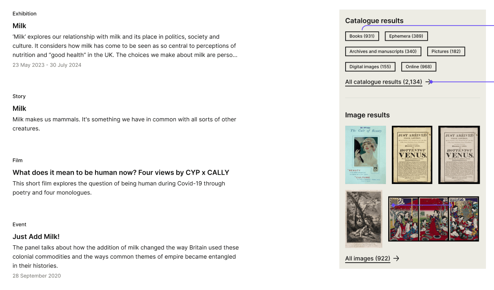
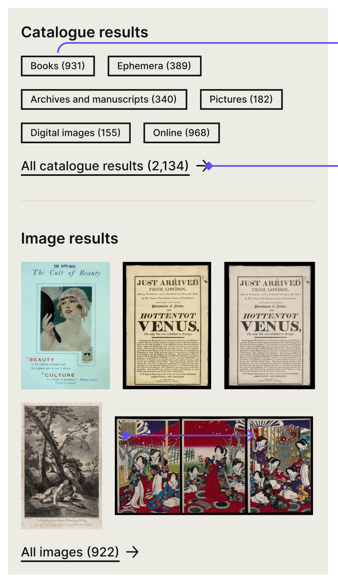

# Content API: All search and indexation of missing content types

<!-- TODO add relevant sections -->

- [Background information](#background-information)
- ["All" index](#all-index)

## Background information

The current "All" search (wellcomecollection.org/search) displays separate, statically-ordered grids for Stories, Works, Images and Events. In doing so, we are unwillingly creating a hierarchy of importance between those content types which does not match their actual level of relevance. Each grid also requires its own query call, which is not efficient.

As a next step, we are looking at making the "All" search expose all Prismic content types whose documents are available to our users through a UID-based URL (["Addressable content types"](#addressable-content-types)), with the results being ordered by each individual document's relevance score. Works and Images ("Catalogue search") will also still be available on the page, although their relevance scores will not be weighed against Addressable content types', as you can see on the image below.



[Consult the design prototype here](https://www.figma.com/design/qssPpJy1lOWSFtuACajkZr/Global-search?node-id=4656-12994&node-type=canvas&m=dev).

There is to be no filtering nor sorting feature on this page. Therefore, we aim to build something with minimalism in mind, allowing us to have query performance at the forefront of our concerns.

We will do so by creating a new endpoint: https://api.wellcomecollection.org/content/v0/all.

Its response will return [an ordered list of Addressable content types](#api-response-addressable-content-types-list), as well as [the relevant results for the Catalogue search](#api-response-collection-search). (**TODO: figure out what that looks like**)

### Existing endpoints and indexes

We have wondered if this new endpoint removed the need for our existing, specialist ones (https://api.wellcomecollection.org/content/v0/articles, for example). Could we only use this new one and use a filter when needed? We have determined that the answer was no, as they serve a different purpose.

As the new endpoint and index are to be as minimalistic as possible, these "specialist" ones will still be the ones used in Content type-specific listing pages (wellcomecollection.org/stories) or search (wellcomecollection.org/search/articles), as they allow us to provide much more complex information, such as filters and aggregations.

## "All" index

We will be creating a single index in Elasticsearch containing all Addressable content types in their most minimalistic form (**TODO add link detailed this**).

### Addressable content types

Here is a list of which Prismic content types we consider to be Addressable, in that their documents are all accessible to our users under a UID-based URL.

This list also link to a file which describes what they are to look like in the Elasticsearch index. You may consult [the complete list here](./transformed-documents) instead.

- **Events**: [Transformed indexed Event example](./transformed-documents/eventDocument.ts)
- **Exhibitions**: [Transformed indexed Exhibition example](./transformed-documents/exhibitionDocument.ts)
- **Stories**: [Transformed indexed Story example](./transformed-documents/storyDocument.ts)
- **Pages**: [Transformed indexed Page example](./transformed-documents/pageDocument.ts)
- **Visual stories**: [Transformed indexed Visual story example](./transformed-documents/visualStoryDocument.ts)
- **Exhibition text**: [Transformed indexed Exhibition Text example](./transformed-documents/exhibitionTextDocument.ts)
- **Exhibition highlight tour**: [Transformed indexed Exhibition Highlight examples](./transformed-documents/exhibitionHighlightDocument.ts). This document gets transformed into two different ones, consult [Exhibition highlight tour section](#exhibition-highlight-tour) below.
- **Books**: [Transformed indexed Book example](./transformed-documents/bookDocument.ts)
- **Projects**: [Transformed indexed Project example](./transformed-documents/projectDocument.ts)
- **Seasons**: [Transformed indexed Season example](./transformed-documents/seasonDocument.ts)

### Exhibition highlight tour

This document is a special case, in that it is one Prismic document that needs to be indexed as two documents: "Audio with transcripts" and "British sign language with subtitles", as they are two different pages on the website ([Audio with transcripts](https://wellcomecollection.org/guides/exhibitions/jason-and-the-adventure-of-254/audio-without-descriptions) and [British sign language with subtitles](https://wellcomecollection.org/guides/exhibitions/jason-and-the-adventure-of-254/bsl)).

### Have all fields in the "query" object align

Something that will help the search performance would be to have as little fields to look through as possible, and have their names match across content types. I suggest:

```
query: {
  type: string,
  title: string,
  description: string,
  contributors: string[]
}
```

Most content types will allow this to fit, with one note on the `decription` field: 

#### Description, captions, standfirsts and intro texts

We have built our content types to use an array of fields to serve the same purpose; what could be called a "description" of the document gets called "Promo caption", "standfirst" (which is a slice, so part of the body), or "Intro text". There is [a ticket which aims to address the case of the Standfirst slices](https://github.com/wellcomecollection/wellcomecollection.org/issues/10753), but in the meantime, I suggest we use only one name for these in the index: "`description`". We will need to determine which content type should use which field as a description, but once that gets indexed, it becomes much easier to reference it by one name, at least in the "display" object.

<!-- How does it get updated? -->

### Indexation/Updates

<!-- Same as the other endpoints? Every 15 minutes? -->

## API response: Addressable content types list

<!-- TODO figure out default order -->
<!-- TODO -->

[Full API response](./api-response/api-response.ts)

## API response: Catalogue search

<!-- WIP -->
### Prototype image



### Works
Works will be represented by their `workType` (formats) being listed under a "Catalogue results" heading. To render the UI, we will need:
- `label`
- `count`
- `id` (for linking to a pre-filtered works search)

We can take those from the [Catalogue API reponse's aggregations' `workType` buckets](https://api.wellcomecollection.org/catalogue/v2/works?aggregations=workType%2Cavailabilities%2Cgenres.label%2Clanguages%2Csubjects.label%2Ccontributors.agent.label&include=production%2Ccontributors%2CpartOf&pageSize=25) and transform them to it simplest form for the Content API response:

<!-- Discuss, should we keep "workType" or change it to "formats"? -->

```
works: {
  type: "Works",
  totalResults: 2134,
  workType: [
    {
      id: "a",
      label: "Books",
      count: 931,
    },
    {
      id: "h", 
      label: "Archives and manuscripts",
      count: 398,
    },
    ...
  ],
}
```

### Images

For the Images results, we need the first 5 results and the total count. The individual results objects can be reduced from [the Catalogue API's image response](https://api.wellcomecollection.org/catalogue/v2/images?aggregations=locations.license%2Csource.genres.label%2Csource.subjects.label%2Csource.contributors.agent.label&pageSize=30). 
<!-- TODO develop -->

```
images: {
  type: "Images",
  totalResults: 922,
  results: [
    {
      imageSrc: "http://...",
      alt: "Lorem ipsum",
      workId: "yxcd6m5x", // for link
      size: {}, // ?
    },
    {
      imageSrc: "http://...",
      alt: "Lorem ipsum",
      workId: "b5kqccbb", // for link
      size: {}, // ?
    },
    ...
  ],
}
```
