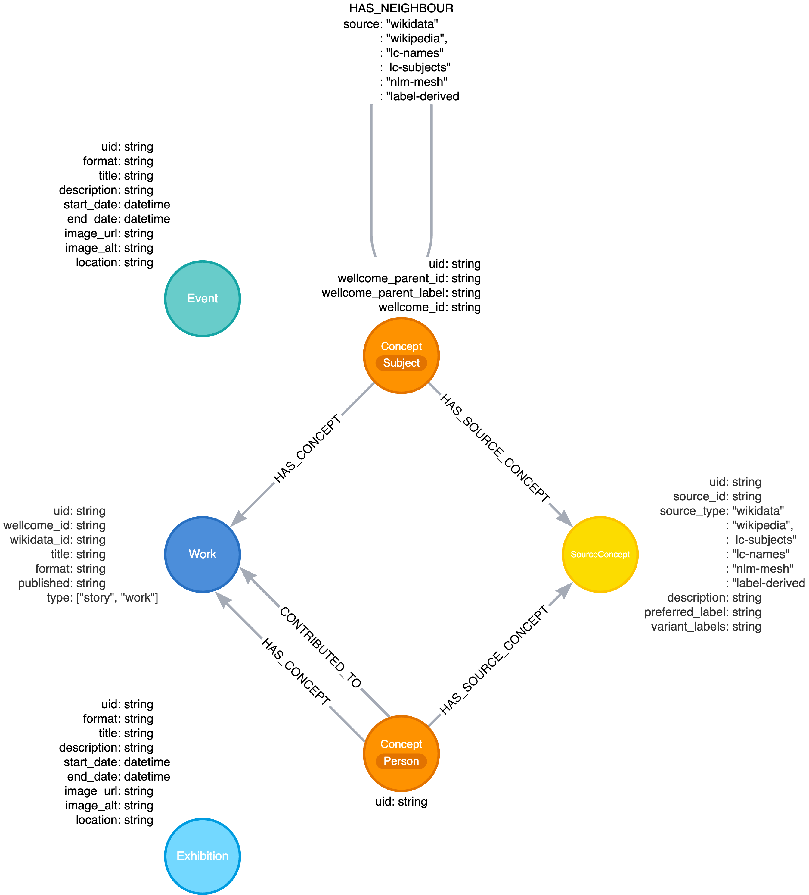

# RFC 062: Wellcome Collection Graph overview and next steps

[Context](#context)

[Background](#background)

[Overview of knowledge graph v1](#overview-of-knowledge-graph-v1-archived)
* Data sources
* Architecture
* Graph model
* Pipeline
* Output

[Next steps: Wellcome Collection Graph v2](#next-steps-wellcome-collection-graph-v2)
* Data sources
* Graph model
* Pipeline
* Infrastructure
* MVP and future directions

## Context

Concepts are identifiable entities like subjects, contributors, languages, genres, etc. Works can be tagged with concepts, and concepts can be linked to other concepts. The aim of these concepts is to enhance discovery and exploration of the collection online.

Manually tagged concepts are available in the source catalogues, but currently only add limited value to a user's search experience. It is currently not possible to traverse a concept hierarchy or explore works based on similar/related concepts. There is only limited information available relating to concepts themselves.

The usefulness of these concepts could be greatly enhanced by enrichment from external data sources such as the [Library of Congress](https://id.loc.gov/), [Medical Subject Headings (MeSH)](https://www.nlm.nih.gov/mesh/meshhome.html), and [Wikidata](https://www.wikidata.org/wiki/Wikidata:Main_Page). These provide us with variant names, descriptions, useful dates, and connections to neighbouring concepts, among other things. All of this data can be modelled as a graph of interconnected concepts and collections content, which will also allow us to apply machine learning techniques and visualise the collection in new ways (see below).

## Background

A graph consists of two main components: 
1. Nodes, which represent the unique entities within the graph. For example, there can be a node for each story in the collection, and a node for each concept. Each of these nodes can have other metadata attached to it, such as IDs or publication dates (these are also called node properties).
2. Edges, which are the connections between the nodes. An edge represents some type of relationship between two nodes, and this can be directed or undirected. For example, there can be an undirected edge between two related concepts which have the same semantic meaning, but come from different ontologies. Or a directed edge from a parent to a child concept within a hierarchy.

Using this approach, we can create a map of all the works and concepts in the collection, with meaningful connections between them. Modelling collection data as a graph offers several advantages:

* A graph can capture complex relationships between diverse sources of information with multiple types of edges and properties. This can include both structured and unstructured data.
* A graph can evolve as new data becomes available or obsolete. One can add/remove nodes and edges without restructuring the entire model.
* Graph databases are optimised for executing complex queries and traversal of relationships, revealing new paths and connections between concepts which can be utilised in search
* The graph structure enables mathematical functions and machine learning, such as finding shortest paths or patterns, clustering, entity disambiguation, predicting missing attributes, recommending new concepts, and more.
* Graphs can be visualised, making it possible to show patterns, outliers, or clusters within the data.

A prototype graph was developed for the Collection in the past, linking existing concepts to external ontologies such as Wikidata (discussed in detail in the next section). There is some information available online from other institutions which have developed graphs for collection/museum content, namely the Science Museum's heritage connector [1] and a graph created by the Chinese Palace Museum [2]. The Science Museum's approach also seems to be primarily focused around linking records to Wikidata, with an additional component involving named entity recognition (NER) and entity linking. The Chinese Palace Museum's approach seems slightly different and follows a more traditional knowledge graph construction via NER and relation extraction from item descriptions. It is also worth noting that the machine learning team at Wellcome has successfully built a graph in Neo4j containing more than one billion historic citation relationships and other metadata relating to academic entities (Wellcome Academic Graph), however this is only available internally. 

## Overview of knowledge graph v1 (archived)

Prototype pipelines were developed in 2022 to construct a [Neo4j](https://neo4j.com/) graph for the Collection. The source code (written in Python) can be viewed in the archived [knowledge-graph](https://github.com/wellcomecollection/knowledge-graph) repository on GitHub. The code is not well-documented and does not include tests. Specific pipeline logic can only be deduced from reading the code itself. The purpose of this graph was to enrich existing concepts with data from Library of Congress, Medical Subject Headings (MeSH), and Wikidata. These sources reference each other via fields such as "closely matching" identifiers, and this was used to create edges between concepts in the graph. This graph was only used for enrichment of existing concepts, not to extract/infer new concepts. Its main purpose was to surface this data in an Elasticsearch index. As far as it is possible to tell from the repository code, the graph database itself was not associated with any dedicated infrastructure and only created locally.

```bash
.
├── LICENSE
├── README.md
├── data
├── docker-compose.yml
├── docs # High level overviews of architecture and graph model, sample commands and Cypher queries
├── neo4j # Docker container for Neo4j graph db
├── notebooks # Notebooks containing exploratory analysis (on graph build, es indexing, queries etc.)
├── pipeline
│   ├── Dockerfile
│   ├── README.md
│   ├── add_neighbours.py # Fetches neighbour concepts from source and adds them to the graph
│   ├── deduplicate.py # Cypher queries to find and merge duplicate source concepts
│   ├── index.py # CLI to reindex data from the graph into elasticsearch
│   ├── ingest.py # CLI to ingest stories, works, whats-on (exhibitions) iteratively into the graph
│   ├── requirements.in
│   ├── src
│   │   ├── __init__.py
│   │   ├── elasticsearch
│   │   │   ├── __init__.py
│   │   │   ├── format.py # Format graph data for elasticsearch
│   │   │   ├── index.py # Create elasticsearch index for graph data (stories, works, subjects, people, whats-on)
│   │   │   └── manage.py # Utility functions for elasticsearch (create/delete index etc.)
│   │   ├── graph
│   │   │   ├── __init__.py
│   │   │   ├── enrich
│   │   │   │   ├── __init__.py
│   │   │   │   ├── loc.py # Get data from LoC for a particular ID
│   │   │   │   ├── mesh.py # Get data from MeSH API for a particular ID
│   │   │   │   ├── wikidata.py # Get data from Wikidata API for a particular ID or search term
│   │   │   │   └── wikipedia.py # Get data from Wikipedia API for a Wikipedia label (via Wikidata entry)
│   │   │   ├── ingest
│   │   │   │   ├── __init__.py
│   │   │   │   ├── decorators.py # Handle Neo4j session timeout
│   │   │   │   ├── events.py # Add event node to the graph
│   │   │   │   ├── exhibitions.py # Add exhibition node to the graph
│   │   │   │   ├── stories.py # Add `type=story` work node and associated subject and person concept nodes to the graph
│   │   │   │   └── works.py # Add `type=work` work node and associated subject and person concept nodes to the graph
│   │   │   ├── models.py # Neomodel graph schema definitions
│   │   │   ├── neighbours
│   │   │   │   ├── __init__.py
│   │   │   │   ├── loc.py # Get neighbour concepts from LoC via broader and narrower terms
│   │   │   │   ├── mesh.py # Get neighbour concepts from MeSH via "seeAlso", "hasDescriptor", "hasQualifier", "broaderDescriptor", "broaderQualifier" keys
│   │   │   │   ├── wikidata.py # Get neighbour concepts from Wikidata via "P31", "P279","P361", "P527", "P1542", "P460", "P2579" claims
│   │   │   │   └── wikipedia.py # Get neighbour concepts from Wikipedia via "see also" section
│   │   │   └── sources.py # Functions to look up concepts in LoC, Wikidata, MeSH and add them to the graph as SourceConcept nodes
│   │   ├── prismic.py # Functions to extract stories (via ID) and relevant metadata, exhibitions and events from prismic API
│   │   ├── utils.py # Utility functions (for fetching json, cacheing, logging, data cleaning)
│   │   └── wellcome.py # Functions to extract works (via ID) and relevant metadata from catalogue API 
│   ├── update_docs.py # Update documents in elasticsearch concepts index
│   └── update_mapping.py # CLI to update mapping for elasticsearch index from a .json in data/mappings
├── search # next.js app for searching stories
├── tasks
└── terraform # Provision Elasticsearch stack
```

### Data sources

The graph database was populated with data from internal and external sources:

**Internal data sources**
* Catalogue API (https://api.wellcomecollection.org/catalogue/v2)
* Stories spreadsheet (stored locally at /data/stories/stories.xlsx, sheet name "Articles")
* Prismic (https://wellcomecollection.cdn.prismic.io/api): stories, exhibitions, events

**External data sources**
* Library of congress
    * Data is fetched from http://id.loc.gov/authorities/subjects/{source_id}.skos.json and http://id.loc.gov/authorities/names/{source_id}.skos.json, where `source_id` is the LoC ID
* MeSH 
    * Data is fetched from https://id.nlm.nih.gov/mesh/{mesh_id}.json, where `mesh_id` is the MeSH descriptor
    * The hierarchy is not explicitly extracted (parent terms are added to the graph as neighbours)
* Wikidata
    * Data is fetched from https://www.wikidata.org/w/api.php for a search term, or http://www.wikidata.org/wiki/Special:EntityData/{wikidata_id}.json for a Wikidata ID
    * There is also some functionality to fetch data from Wikipedia (https://en.wikipedia.org/w/api.php)

### Architecture

There is some documentation available on the overall architecture in the [knowledge-graph repo](https://github.com/wellcomecollection/knowledge-graph/blob/main/docs/architecture.md). Here is the visual overview:


* Graph database local build from Neo4j official Docker image (version 4.4.3)
* Elasticsearch configured in terraform (`elastic/ec` version 0.2.1)
* UI hosted on vercel to query the elasticsearch index

### Graph model

A detailed overview of the graph model is not provided as part of the knowledge-graph repository. The image below is an attempt at visualising the graph model based on the neomodel schema defined within the graph pipeline code. This also includes the available node and relationship properties:


### Pipeline

The pipeline was built using `neomodel` at its core, which is an object graph mapper for Python and Neo4j. Neomodel was used to define the graph model (schema) and to load data to Neo4j, instead of Cypher queries.

Main components:
* Code to ingest works and stories
* Graph model defined as `neomodel` components (see above)
* "Ingestion": Load source data for works/stories and manually tagged concepts
* "Enrichment": Fetch data from external sources and add to these manually tagged concepts

Works/stories are loaded into the graph in an iterative fashion: 

1. add Work node
2. add associated Person/Subject Concept nodes
3. add SourceConcept nodes for each Concept node via cross-references from external data sources

### Output

Data from works, stories, concepts, exhibitions, and events are indexed in elasticsearch. 

Neighbour and source concepts from the graph are added to concepts in the following format:

```
{
    "label": subject.label,
    "preferred_label": subject.label,
    "type": "subject",
    "works": works,
    "work_ids": work_ids,
    "neighbour_labels": neighbour_labels, # This is where neighbour concepts are added
    "neighbour_ids": neighbour_ids,
    "stories": stories,
    "story_ids": story_ids,
    "variants": variants,
}
```
If a source node is present, the following is added depending on the source:
```
# MeSH
{
    "mesh_description": mesh_source.description,
    "mesh_id": mesh_source.source_id,
    "mesh_preferred_label": mesh_source.preferred_label,
    "preferred_label": mesh_source.preferred_label,
}
# Library of Congress
{
    "lc_names_id": lc_names_source.source_id,
    "lc_names_preferred_label": lc_names_source.preferred_label,
    "preferred_label": lc_names_source.preferred_label,
    "preferred_label_source": "lc-names",
}
# or
{
    "lc_subjects_id": lc_subjects_source.source_id,
    "lc_subjects_preferred_label": lc_subjects_source.preferred_label,
    "preferred_label": lc_subjects_source.preferred_label,
    "preferred_label_source": "lc-subjects",
}
# Wikidata
{
    "wikidata_description": wikidata_source.description,
    "wikidata_id": wikidata_source.source_id,
    "wikidata_preferred_label": wikidata_source.preferred_label,
    "preferred_label": wikidata_source.preferred_label,
    "preferred_label_source": "wikidata",
}
```

## Next steps: Wellcome Collection Graph (v2)

Here is a brief overview of things to consider when developing v2 of a graph for Wellcome Collection:

**Data sources**

Ensure that local data sources like spreadsheets are excluded. Verify that URLs of external data sources are current and functional, and consider schema verification for input data. Reassess external data acquisition methods, comparing API queries and full data downloads. Explore potential additional data sources and confirm that all relevant information is being captured. Consider update schedules of the different data sources and how these feed into graph updates. 

**Graph model**

Re-evaluate the graph model and make sure it represents internal and external data effectively. Ensure the graph model is efficient and supports downstream tasks like indexing, machine learning analyses, and visualisation. Verify that edge directionality aligns with the edge labels, such as reversing HAS_CONCEPT edges to reflect semantic directionality. Consider whether undirected edges should exist between source concept nodes.

**Pipeline**

Apply learnings from the Wellcome Academic Graph's pipeline design where applicable. For example, consider using the Neo4j driver with Cypher queries to load data to Neo4j and removing the neomodel dependency for better performance, leveraging existing expertise from the machine learning team. Refactoring changes to increase pipeline performance may also include preprocessing all source data into nodes and edges before bulk loading them to Neo4j, instead of enriching and loading each work iteratively. Finally, ensure the code meets machine learning team standards by improving Python import readability, adding correctly formatted docstrings, enabling auto-formatting, and adding unit tests.

**Infrastructure**

Consider deploying the Neo4j database, which was initially only set up locally with the official Docker image in v1 of the graph, which would enable broader access by the platform and ML teams. If the graph is used to enrich concepts for search, plan its integration with existing infrastructure and processes. As above, apply learnings from the Wellcome Academic Graph's setup where applicable.

**MVP and future directions**

As in v1 of the graph, the MVP use case can be focused on concept enrichment for search, connecting manually tagged concepts in source catalogues to content from external sources. Future extensions may include adding text/image embeddings for graph machine learning, enabling things like clustering of content and concept recommentation through link prediction with graph neural networks. Other extensions to consider may be entity extraction and linking, as used in projects like the Science Museum's heritage connector and the Chinese Palace Museum graph. Another use case may be focused around concept disambiguation, although it remains to be determined to what extent this is still needed after modelling existing linkages/references between the various data sources as edges in the graph.


[1]: https://www.sciencemuseumgroup.org.uk/projects/heritage-connector
[2]: https://heritagesciencejournal.springeropen.com/articles/10.1186/s40494-023-01042-y
