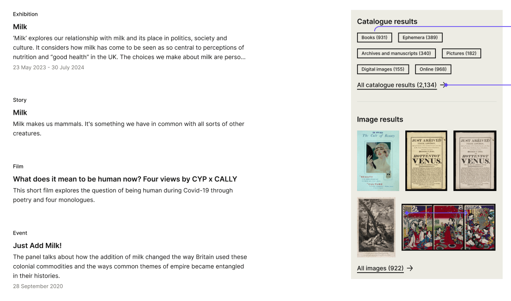
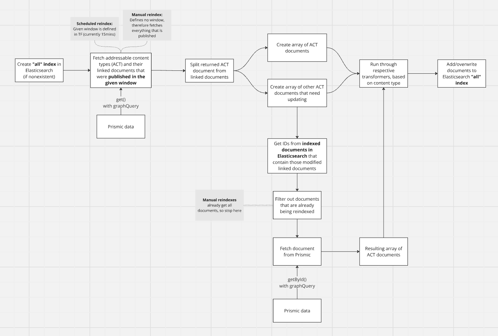
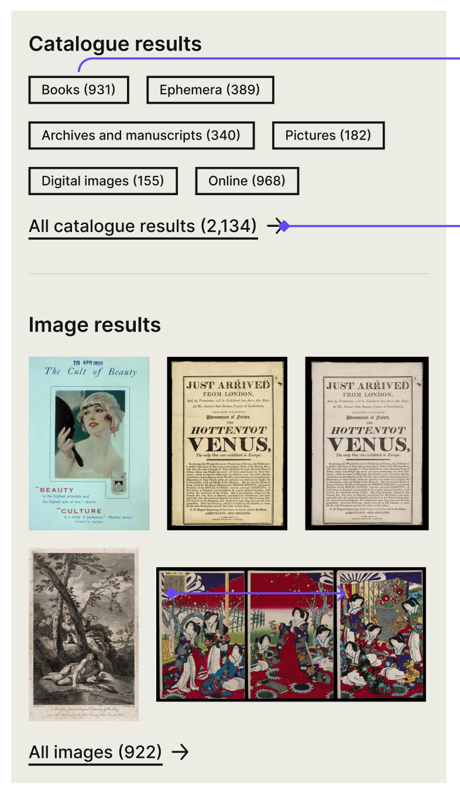

# Content API: All search and indexing of addressable content types

- [Background information](#background-information)
- [Elasticsearch "All" index](#elasticsearch-all-index)
  - [Addressable content types](#addressable-content-types)
  - [Query objects alignment](#query-objects-alignment)
- [Indexing](#indexing)
  - [ETL diagram](#diagram-of-etl-extract-transform-load-pipeline)
  - [Mapping](#mapping)
- [Content API response](#content-api-response)
- [Catalogue search](#catalogue-search)

## Background information

The current "All" search (wellcomecollection.org/search) displays separate, statically-ordered grids for Stories, Works, Images and Events. In doing so, we are unwillingly creating a hierarchy of importance between those content types which does not match their actual level of relevance. Each grid also requires its own query call, which is not efficient.

As a next step, we are looking at making the "All" search expose all Prismic content types whose documents are available to our users through a UID-based URL (["Addressable content types"](#addressable-content-types)), with the results being ordered by each individual document's relevance score. Works and Images ("Catalogue search") will also still be available on the page, although their relevance scores will not be weighed against Addressable content types', as you can see on the image below.



[Consult the design prototype here](https://www.figma.com/design/qssPpJy1lOWSFtuACajkZr/Global-search?node-id=4656-12994&node-type=canvas&m=dev).

There is to be no filtering nor sorting feature on this page. Therefore, we aim to build something with minimalism in mind, allowing us to have query performance at the forefront of our concerns.

We will do so by creating a new endpoint: `https://api.wellcomecollection.org/content/v0/all`

Its response will return [an ordered list of Addressable content types](#api-response-addressable-content-types-list), as well as everything we need for pagination.

### Existing endpoints and indexes
**TLDR; This won't affect them in any way.**

We have wondered if this new endpoint removed the need for our existing, specialist ones (https://api.wellcomecollection.org/content/v0/articles, for example). Could we only use this new one and use a filter when needed? We have determined that the answer was no, as they serve a different purpose.

As the new endpoint and index are to be as minimalistic as possible, these "specialist" ones will still be the ones used in Content type-specific listing pages (wellcomecollection.org/stories) or search (wellcomecollection.org/search/articles), as they allow us to provide much more complex information, such as filters and aggregations.

## Elasticsearch "All" index

We will be creating a single index in Elasticsearch containing all Addressable content types in their most minimalistic form.

### Addressable content types

Here is a list of which Prismic content types we consider to be **Addressable**, in that their documents are all accessible to our users under a UID-based URL.

This list also link to a file which describes what they are to look like in the Elasticsearch index. You may consult [the complete list here](./transformed-documents) instead.

- **Events**: [Transformed indexed Event example](./transformed-documents/eventDocument.ts)
- **Exhibitions**: [Transformed indexed Exhibition example](./transformed-documents/exhibitionDocument.ts)
- **Stories**: [Transformed indexed Story example](./transformed-documents/storyDocument.ts)
- **Pages**: [Transformed indexed Page example](./transformed-documents/pageDocument.ts)
- **Visual stories**: [Transformed indexed Visual story example](./transformed-documents/visualStoryDocument.ts)
- **Exhibition text**: [Transformed indexed Exhibition Text example](./transformed-documents/exhibitionTextDocument.ts)
- **Exhibition highlight tour**: [Transformed indexed Exhibition Highlight examples](./transformed-documents/exhibitionHighlightDocument.ts). This document gets transformed into two different ones, consult [Exhibition highlight tour section](#exhibition-highlight-tour) below.
- **Books**: [Transformed indexed Book example](./transformed-documents/bookDocument.ts)
- **Projects**: [Transformed indexed Project example](./transformed-documents/projectDocument.ts)
- **Seasons**: [Transformed indexed Season example](./transformed-documents/seasonDocument.ts)

#### Exhibition highlight tour

This document is a special case, in that it is one Prismic document that needs to be indexed as two documents: "Audio with transcripts" and "British sign language with subtitles", as they are two different pages on the website ([Audio with transcripts](https://wellcomecollection.org/guides/exhibitions/jason-and-the-adventure-of-254/audio-without-descriptions) and [British sign language with subtitles](https://wellcomecollection.org/guides/exhibitions/jason-and-the-adventure-of-254/bsl)).

### Query objects alignment

Something that will help the search performance would be to have as little fields to look through as possible, and have their names match across content types. We suggest:

```
query: {
  type: string,
  title: string,
  description: string,
  body?: string,
  contributors?: string[]
}
```

Should we want any other field to be queriable (such as "Format" for Projects), we will append them to one of the above, based on how we want that field to score. The only other one worth discussing is the `description` field:

#### Description, captions, standfirsts and intro texts

We have built our content types to use an array of fields to serve the same purpose; what could be called a "description" of the document gets called "Promo caption", "standfirst" (which is a slice, so part of the body), or "Intro text". There is [a ticket which aims to address the case of the Standfirst slices](https://github.com/wellcomecollection/wellcomecollection.org/issues/10753), but in the meantime, we suggest we use only one name for these in the index: `description`. We will need to determine which content type should use which field as a description, but once that gets indexed, it becomes much easier to reference it by one name, at least in the "display" object.

An audit of all such fields will be done as a separate ticket: https://github.com/wellcomecollection/wellcomecollection.org/issues/11401, so all references to such fields in the transformed objects should be taken with this in mind.

## Indexing

### Diagram of ETL (extract, transform, load) pipeline


### Mapping
[See our suggestion for the mapping here](./mapping.ts). I've gone with what we have on our other indices, although I'm sure they could have different parameters, they have served us well so far. Any improvement suggestions welcome.

## Content API response

We have decided not to worry about a default order for a queryless call to the endpoint, as it might have nothing to do with the Content API and be rendered through Prismic content or static code. We are therefore taking that out of the scope of this RFC.

```
{
  type: "ResultList",
  results: [
    {
      type: "Event",
      id: "WwQHTSAAANBfDYXU",
      uid: "lorem-ipsum",
      title: "Lorem ipsum dolor sit amet",
      description: "Aliquam erat volutpat."
    },
    {
      type: "Visual story",
      id: "ZdTCPREAACEA3zK4", 
      uid: "jason-and-the-adventure-of-254-visual-story",
      title: "Jason and the adventure of 254 visual story",
      description: "Aliquam erat volutpat"
    },
    ...
  ],
  pageSize: 10,
  totalPages: 49,
  totalResults: 482,
  nextPage: "https://api.wellcomecollection.org/content/v0/all?page=2",
}
```

## Catalogue search

As per [this conversation](https://github.com/wellcomecollection/docs/pull/112#discussion_r1836539803), we will be fetching the Catalogue information from the Catalogue API, asynchronously, from the client. This will allow for a separation of concerns should one of the services be unhealthy.



### Works

Works will be represented by their `workType` (formats) being listed under a "Catalogue results" heading. To render the UI, we only will need:

- `label`
- `count`
- `id` (for linking to a pre-filtered works search)
- `totalResults` count

The required fields can be taken from the Catalogue API reponse's aggregations' `workType` buckets:
https://api.wellcomecollection.org/catalogue/v2/works?aggregations=workType&include=languages&pageSize=1
(adding a query keyword to the params should one be entered).

As the `workType` bucket is the only thing we really need from the response (with the `totalResults` count), I tried to tweak the query to be as simple as possible (e.g. adding an include param limits the results objects), suggestions welcome.

### Images

For the Images results, we need the first 5 results and the `totalResults` count. We will use the Catalogue API's image endpoint:
https://api.wellcomecollection.org/catalogue/v2/images?pageSize=5,
adding a query param should one be entered.
