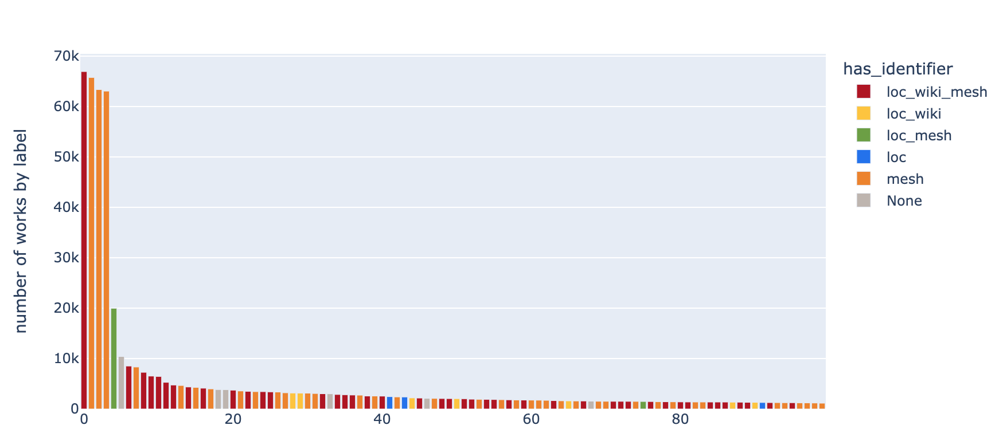

# RFC 064: Graph data model

## Context

Following from [062-knowledge-graph](../062-knowledge-graph/README.md), which provides an overview of a past prototype and proposal for a new graph based on data from the Collection and external ontologies, this RFC focuses on a new graph data model. While the primary/current focus of the suggested model is the enrichment of concepts, other data and attributes are also included as these may enable future machine learning work and visualisation. The graph data model is designed to enable enrichment of concepts while keeping original labels and sources intact. This is to make sure we are always able to tell where a new link or piece of information was acquired from, whether it be manual tagging, a particular source ontology, or ML inference.

## Overview

Here is a visual overview of the proposed data model:

## Nodes

### Work

Properties on `Work` nodes can be found in [work.yaml](yaml_files/work.yaml). These are derived from information available in the works snapshot. There are several properties which could be linked directly to source nodes in the future, such as language and production location. Attributes containing potentially useful text and descriptions are all included. Any free text which provides useful information about the work may be relevant for future machine learning work. This includes title, description, physical description, notes, lettering.

### Series

Series nodes only have a `title` property (see [series.yaml](yaml_files/series.yaml)). These are extracted from works and their main purpose is to represent meaningful links between different works which are part of the same series.

### Image

Nodes for images which are part of works. Suggested attributes can be viewed in [image.yaml](yaml_files/image.yaml), and include information such as the identifier and iiif url.

### Location and language (optional)

Some works have information available on their production location and/or language. While this may not be a priority, there is an opportunity to link these to external ontologies in the future (this may require extensive data cleaning and/or a ML approach). In particular, LoC and Wikidata have rich information available about both geographical locations and languages, which can be distinguished from other concepts via properties such as `instance of`. Note that in the current graph data model, these nodes are disconnected from `Work` nodes (but indirectly queryable via `Work` properties). This is due to the potential for the formation of supernodes (highly connected nodes for very common categories such as the English language), which can otherwise negatively impact query performance.

### Concept

These are the concepts that works have been manually tagged with. Any concept which has a unique 8-digit identifier will be represented as a `Concept` node. There is no split into Person and Concept nodes at this level, in contrast to the previous graph model. This is because (i) concepts tagged as Person can also include other terms which are not names, and (ii) there are additional types other than Concept and Person (see table below). As these can potentially all be linked to external vocabularies, it makes more sense to keep all of these as `Concept` nodes and add the type tag as a node property (see [concept.yaml](yaml_files/concept.yaml)).

| Concept type  | Count |
| ------------- | ----- |
| Person    | 364483    |
| Concept   | 122812    |
| Organisation  | 57517 |
| Place | 11149 |
| Agent | 8828 |
| Meeting   | 5153 |
| Genre | 1494 |
| Period    | 1032 |

In some cases, these manually tagged concepts already come with an identifier from an external ontology (see table below). These sources are also added to concept nodes as a property.

| Concept source    | Count |
| --------  | ------    |
| label-derived | 308908 |
| lc-names  | 197509 |
| lc-subjects   | 37343 |
| nlm-mesh  | 28425 |
| viaf  | 153 |
| fihrist   | 130 |

### SourceConcept

Nodes for concepts from the following external ontologies: Library of Congress Subject Headings (LCSH), Wikidata, or Medical Subject Headings (MeSH). Aside from the source identifier and label, properties include a description, alternative identifiers, and alternative labels/synonyms (see [sourceconcept.yaml](yaml_files/sourceconcept.yaml)). Additional properties can be added to incorporate more information from source ontologies, if needed. A full list of source properties is available for [MeSH](https://www.nlm.nih.gov/mesh/xml_data_elements.html) and [Wikidata](https://www.wikidata.org/wiki/Wikidata:Database_reports/List_of_properties/all). It is worth noting that Wikidata in particular has a wide range of properties, including links to various other external databases (e.g.the National Portrait Gallery, OpenAlex and many more), and a decision may need to be made whether to include all of these under `alternative_ids`.

### SourceName

Nodes for names from Library of Congress Name Authority File (LCNAF) (excluding concepts which are an instance of `MADS/RDF Geographic`, see below) and corresponding Wikidata concepts. MeSH is not included here as it does not include any names. Additional properties are included on `SourceName` nodes which specifically provide relevant context for names (see [sourcename.yaml](yaml_files/sourcename.yaml)): date of birth, date of death, and place of birth. Note that, for simplicity, there is currently no further split into different name categories such as organisation or meeting names (therefore the additional birth date/place properties for these will be empty). However, it should be relatively straightforward to split these further, if necessary, as they are identifiable via source vocabulary subdivisions and/or parent terms. For instance, there may be a need to incorporate specific information for organisations such as their location, founder etc.

### SourceLocation

Nodes for concepts from LCSH or LCNAF which are an instance of `MADS/RDF Geographic` and MeSH Geographicals (`Z` tree codes). Location-specific properties are included on `SourceLocation` nodes (see [sourcelocation.yaml](yaml_files/sourcelocation.yaml)), such as their coordinates.

## Edges

All edges can be viewed in [edges.yaml](yaml_files/edges.yaml).

### `Work`-->`Work`

* `PART_OF` and `SUCCEEDED_BY`: Works can be linked to other works, when a work is succeeded by or part of another work. For example, [rjdt9j3h](https://wellcomecollection.org/works/rjdt9j3h) is linking various records from the Medical Women's Federation. These relationships can be represented by SUCCEEDED_BY and PART_OF edges.

### `Work`-->`Concept`

* `HAS_CONCEPT`: Edges from works to their manually tagged concepts.

* `CONTRIBUTUED_TO`: Edges to works from their manually tagged contributors.

### `Work`-->`Image`

* `HAS_IMAGE`: Edges from works to their images, if available.

### `Image`-->`Image`

* `VISUALLY_SIMILAR`: Edges between similar image embeddings. This is optional, as the most similar image embeddings can alternatively be retrieved directly from the vector store as needed.

### Edges from concepts to source nodes

* `HAS_SOURCE_CONCEPT`: Edges between manually tagged concepts and their source ontologies, if a match can be made via a provided source ID, label, or a ML algorithm. Information about the source of the match is stored in the `matched_by` edge attribute. For example, if we want to match a subset of label-derived concepts to LCSH, we can log the source of these matches under `matched_by='label'`. It is also worth noting that there are 770 MeSH concepts which do not match the true label, and 617 MeSH IDs are not correctly formatted with a 'D' at the start (at least some of these look like LoC IDs). A data cleaning step is therefore likely required before linking concept IDs to their source.

### Edges between source nodes

* `SAME_AS`: This can include concepts matched on label (such as between label-derived concepts and LCSH or MeSH), machine learning derived, or directly from source ontologies (exactly and closely matching concepts from LoC,  Wikidata to MeSH via property P486). In each case, the source of the link can be added as an edge attribute `source`.

* `RELATED_TO`: Edges between source nodes which are closely related, but do not refer to the same entity and are not hierarchical. This includes similar entries from MeSH to MeSH via `SeeRelatedDescriptor` and `Related Terms` from LoC to LoC.

* `HAS_PARENT`: Edges between source nodes which are hierarchical. This includes MeSH tree parent terms, as well as properties P31/`instance of` and p279/`subclass of` from Wikidata. The hierarchical nature of this relationship can be understood like this: if you have a work tagged with a concept that has a parent, it should, in theory, make sense to also display that work under its parent concept. For example, a work tagged with 'Cardiotoxicity' could reasonably also be tagged with its parent term 'Heart Diseases'.

* `NARROWER_THAN`: Edges between related source nodes where one is broader/narrower than the other, but which may not represent a parent/child relationship in the strictest sense. This includes LoC `Broader Terms` and `Narrower Terms` as well as component terms, where the composite concept is narrower than either component (for example `Malaria--Prevention`, which is narrower than both `Malaria` and `Prevention`).

* `LOCATED_IN`: Hierarchical relationship between locations. For example, when mapping locations from LoC to Wikidata, countries can be identified via property P17, and cities/states/counties via P131.

## Future directions and other considerations

The graph data model includes a variety of information and links from the different source ontologies. This can enable various improvements to concept pages in the future, such as:

* Filtering and aggregating works related to a single, unified concept which exists in multiple source ontologies. This extends to label-derived concepts which can be matched to these.
* Displaying relevant information from external data sources on concept pages, such as descriptions, birth dates, and links to other data.
* Providing onward journeys from concept pages to related, broader/narrower concepts and concepts that frequently co-occur on works.

Furthermore, a graph enables network analysis which can identify isolated concept pages, highly connected clusters of interlinked concepts, and concepts acting as bridges between such groups.

However, the intention is not to make any assumptions on what should eventually be displayed on concept pages and how, as this will require more extensive user research. Furthermore, while enrichment of concept pages via source ontologies is the current focus of the graph, it is only one of its possible use cases. For example, a graph can also facilitate visualisation of the Collection and support ML tasks via graph embeddings, as described previously in [RFC #62]((../062-knowledge-graph/README.md)). Having said that, it is possible to incrementally build the graph based on the above data model, starting with concepts and adding more data as needed.

## Appendix

**Overall concept linkage**

An estimate of the amount of linkage which can be achieved through a combination of (i) exact matches between label-derived concepts and LCSH, (ii) exact matches between label-derived concepts and MeSH, (iii) existing links between ontologies via `SAME_AS` relationships between `SourceConcept` nodes:

Number of concept IDs before linkage:

Number of concept IDs after linkage:

**Top 100 most common concepts**

If you look at the top 100 most common concept labels, 94 of these can actually be matched to a vocabulary entry in at least one source via existing identifiers and the above linkage process (click on image for interactive version):

