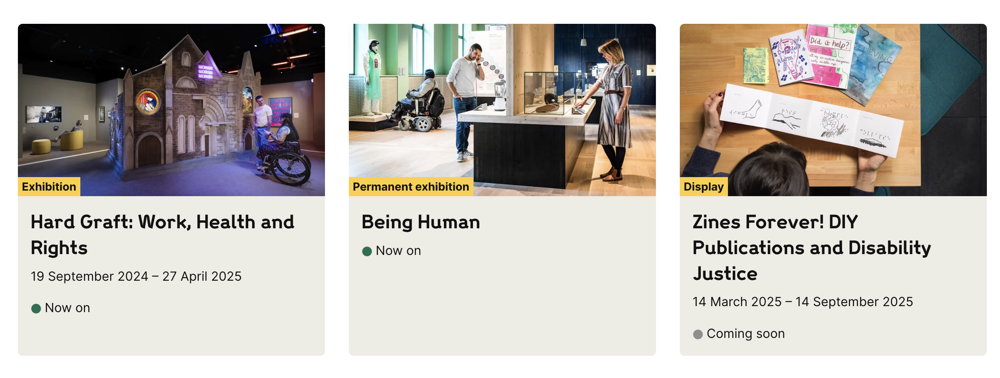

# RFC 068: Exhibitions in Content API
Exhibitions are to be added to Events search, becoming Events & Exhibitions search. We'll therefore be working on indexing Exhibitions in a more intentional manner. 
That indexing and subsquent API endpoint will power the Events & Exhibitions search as well as, eventually, the existing listing pages.

## Indexing Exhibitions
I can think of two ways to go about indexing Exhibitions for ranking against Events to make sense and be easier to handle.

### Suggestions
#### Exhibitions-only index
- We create a new index (`exhibitions`) and index exhibition documents in there.
- We then create a new endpoint (`events-exhibitions`?) that [searches through both the events and the exhibitions index](https://www.elastic.co/guide/en/elasticsearch/reference/current/search-multiple-indices.html).
- We use that endpoint in `/search/events`.

Meaning that the `/events` endpoint can then still be used for events listing pages, and a separate new one for exhibitions can be used in exhibitions listing pages.

This feels cleaner and clearer, but might end up meaning duplicate work (e.g. we want to support a new field). 

#### Exhibitions added to Events index
- We pull Exhibitions in the existing `events` index, with something marking them as `Exhibitions`, possibly the `format` field (see [Format](#format) section below).
- Individual listing pages (`/events`, `/exhibitions`) would be rendered using a filter to ensure only the relevant ones are displayed.

It would simplify the work when adding filters or maintaining the indices, only doing it once, but is possibly harder to maintain in the long run, should the two content types grow apart or more complicated.

## Decision on Exhibition indexing
After RFC discussions, we'll aim to do a mix of the two solutions above. 
1. Create a new `exhibitions` index comprised of all exhibitions, coupled with a new `/exhibitions` endpoint. They would be formatted to work on Exhibitions listing pages and individual Exhibition fetching. This will be out of scope for the "Exhibitions search" milestone.
2. Add exhibitions to the `events` index, where they would fully be considered to be Events. This will ensure that, should we want to bring the events search further, we can tweak the indexed Exhibition documents to match without having to tweak the Prismic model. 
  For example, we can currently filter Events with "Catch-up events only"/`isAvailableOnline`. This is not a field in the Exhibition content type model. If we only used the `exhibition` index, we'd have to go add it in, even though it's not useful for exhibition listing pages. So it is a separation of concern.


## Format
All exhibitions will fit under the Format filter "Exhibition":


but their format on the card (yellow label) will be the Exhibition Format that was selected in Prismic (e.g. Display, Installation...):


Meaning the value of "format" should differ in the `filter` and `aggregrations` objects versus the `display` object. I suggest we concatenate the Exhibition type with the string "Exhibition" in the `query` object format, so both are queryable. 

For the sake of this document, let's determine that the "custom UUID" for the Event type "Exhibition" (which does not exist in Prismic) is `abcdef-123`. 
In this example, this document is of Exhibition type "Season":
```
  display: {
    format: {
      type: 'EventFormat',
      id: "Xk5QHxEAACUAe4gV",
      label?: "Season"
    };
  },
  query: {
    format: 'Exhibition, Season' // This way it's queryable under both identifiers
  },
  filter: {
    format: "abcdef-123"
  }
  aggregatableValues: {
    format: """{"type":"EventFormat","id":"abcdef-123","label":"Exhibition"}"""
  }
```

May it be noted that having a different value for `format` in those objects is not the preferred way of operating; this is an exception that will be documented in the code. We considered adding a new field (`label`), but it seemed overkill for now, as only Exhibitions need a different value from `format`.
Should we want to have a third Content Type that should "become an event", we might want to change the logic across.

## Filter out exhibitions
We won't be creating a new endpoint, so we need the capacity to filter out Exhibitions to feed Events listing pages. I suggest we do so with a `must_not` `match` query.

```
"must_not": {
  "match": { 
    "filter.format": "abcdef-123"
  }
}
```


## Front-end integration decisions
- Exhibitions should use [the same rendering component on the Front-end](https://github.com/wellcomecollection/wellcomecollection.org/blob/main/content/webapp/components/EventsSearchResults/index.tsx) (will there be renaming to do?), with the required tweaks where displayed fields differ (e.g. "Now on" dot).
- Search tab title to be changed from "Events" to "Events & Exhibitions".
- Metadata copy changes to include exhibitions.

Aside from the last two, we're not referring to Exhibitions anymore. Within search, exhibitions are considered to be a type of Event. So:
- No change to search events URL (`/search/events`).
- "Event type" filter keeps its name.
- The future date filter will also just mention events, for example "all future events".


### Out of scope but have been discussed
- Redirect `events/past?availableOnline=true` to `/search/events?isAvailableOnline=true`. The other listing pages stay as is as they serve a different purpose than the search page.