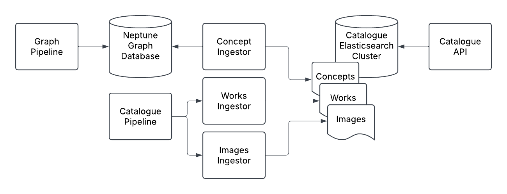
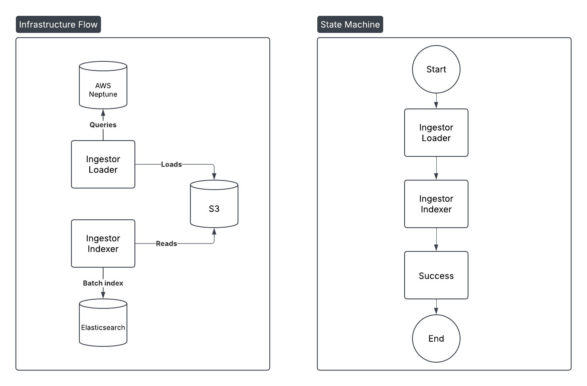

# RFC 069: Catalogue Graph Ingestor

Following on from the [Catalogue Graph pipeline](https://github.com/wellcomecollection/docs/tree/main/rfcs/066-graph_pipeline), this RFC outlines the requirements for the Catalogue Graph Ingestor to replace the existing Concepts Pipeline. 

## Background

The Catalogue Graph Ingestor will be responsible for ingesting data from the Graph database into Elasticsearch so that it can be made available via the Catalogue API. The intention is to replace the [Concepts Pipeline](https://github.com/wellcomecollection/concepts-pipeline/tree/main) with the exisiting Catalogue Graph pipeline. The Catalogue Graph Ingestor will replace the role of the [Recorder service](https://github.com/wellcomecollection/concepts-pipeline/tree/main?tab=readme-ov-file#recoder-service) in the Concepts Pipeline. 

Currently theme/concepts pages are made available via the [Concepts API](https://github.com/wellcomecollection/docs/tree/main/rfcs/050-concepts-api) which is powered by the [Concepts Pipeline](https://github.com/wellcomecollection/docs/tree/main/rfcs/052-concepts-pipeline). We aim to replace the Concepts Pipeline with the Catalogue Graph utilising a graph database in order to enable improved discovery and navigation of the catalogue, this is in alignment with the original goals and design of the Concepts Pipeline.

The catalogue graph will become part of the existing catalogue pipeline and we will aim to replace the existing concepts pipeline and the concepts API with data backed by the catalogue graph.

## Requirements

The Catalogue Graph Ingestor will be responsible for ingesting data from the Graph database into Elasticsearch so that it can be made available via the Catalogue API. The Catalogue Graph Ingestor will be responsible for the following:

1. Ingesting data from the Graph database into Elasticsearch
2. Keeping data in Elasticsearch up to date with the graph database and catalogue source data
3. Providing data that is API compatible with the existing Catalogue API `/concepts` endpoints
4. Aligning with the existing catalogue pipeline to simplify the ingestion process and development effort
5. Following existing Wellcome Collection standards and best practices including:
   - New services should avoid using Scala 
   - New CI/CD pipelines should be implemented using GitHub Actions

## Implementation Plan

The Catalogue Graph Ingestor will be implemented as part of the existing Catalogue pipeline as a new "Ingestor" service, alongside the "works" and "images" ingestors. Following the requirement to reduce the use of Scala the ingestor will be implemented in Python. We should ingest concept data into a new index in the existing catalogue pipeline Elasticsearch cluster to align with the catalogue pipeline and reduce the number of clusters we need to maintain.



The Catalogue Graph pipeline is currently orchestrated using AWS Step Functions and the ingestor will be triggered by a new state machine that will update the concepts index in Elasticsearch daily. The ingestor will be responsible for querying the graph database for concept data and ingesting it into Elasticsearch. 

### Reproducing the current Concepts API

Currently the Concepts API provides the following endpoints in use by the Wellcome Collection website:

`GET /concepts/{id}`

```json
{
  "id": "avkn7rq3",
  "identifiers": [
    {
      "identifierType": {
        "id": "nlm-mesh",
        "label": "Medical Subject Headings (MeSH) identifier",
        "type": "IdentifierType"
      },
      "value": "D001255",
      "type": "Identifier"
    }
  ],
  "label": "Astrology",
  "alternativeLabels": [],
  "type": "Concept",
  "sameAs": [
    "g4ek4ccz"
  ]
}
```

A search endpoint is also provided, following [this RFC](https://github.com/wellcomecollection/docs/tree/main/rfcs/050-concepts-api#endpoint-3-listing-and-searching-concepts) but is not currently in use by the website. We should aim to provide enough data to reproduce the existing in-use API endpoint, and consider providing for the search endpoint out of scope for now.

The current index mapping in the concepts pipeline [is visible here](https://github.com/wellcomecollection/concepts-pipeline/blob/main/recorder/src/main/resources/index.json). The transform from concept object to indexable document is [defined here](https://github.com/wellcomecollection/concepts-pipeline/blob/main/common/src/main/scala/weco/concepts/common/model/Concept.scala#L17). We should aim to reproduce this data model in the Catalogue Graph Ingestor.

**We will not reproduce the `sameAs` field**, which is catering to situations where the same concept identifier in the same external ontology as been minted with multiple identifiers. Instead we will aim to remove all duplicates of this kind by making it impossible to mint the same concept with multiple identifiers elsewhere in the pipeline.

#### Data Model and Cypher Queries

The following Cypher query can be used to extract the required data from the graph database:

```cypher
MATCH (s:Concept) 
OPTIONAL MATCH (s)-[r]->(t)
RETURN s as source, r as relationship, t as target SKIP 10 LIMIT 10
```

This will return data in the form:

```json
{
  "results": [
    {
      "source": {
        "~id": "cqasd7dz",
        "~entityType": "node",
        "~labels": [
          "Concept"
        ],
        "~properties": {
          "id": "cqasd7dz",
          "label": "Proclamations",
          "source": "label-derived",
          "alternativeLabels": ["Shouting"],
          "type": "Genre"
        }
      },
      "relationship": {
        "~id": "HAS_SOURCE_CONCEPT:cqasd7dz-->sh85107158",
        "~entityType": "relationship",
        "~start": "cqasd7dz",
        "~end": "sh85107158",
        "~type": "HAS_SOURCE_CONCEPT",
        "~properties": {}
      },
      "target": {
        "~id": "sh85107158",
        "~entityType": "node",
        "~labels": [
          "SourceConcept"
        ],
        "~properties": {
          "id": "sh85107158",
          "label": "Proclamations",
          "source": "lc-subjects"
        }
      }
    }
  ]
}
```

We can paginate through records by using the `SKIP` and `LIMIT` clauses in the query. We should aim to page through all records in the graph database, and then ingest them into Elasticsearch in batches. We **will not consider a static scroll** window for this implementation as data will not be updated while we are ingesting it.

The table describes the mapping of the graph database response to that required for the Elasticsearch index:

| API response      | Graph database response                  |
|-------------------|------------------------------------------|
| id                | source.~properties.id                    |
| label             | source.~properties.label                 |
| type              | source.~properties.type                  |
| sameAs            | n/a: Not implemented                     |
| alternativeLabels | target.~properties.alternative_labels    |
| identifiers.value | target.~properties.id                    |
| identifiers.type  | n/a: "Identifier"                        |
| identifiers.identifierType.id    | target.~properties.source |
| identifiers.identifierType.label | n/a: Use lookup table?    |
| identifiers.identifierType.type  | n/a: "IdentifierType"     |

### Ingestor Implementation

The ingestor will be implemented in Python and will be responsible for querying the graph database for concept data and ingesting it into Elasticsearch. The ingestor will be triggered by a new state machine that is part of the catalogue pipeline infrastructure. 

We should implement the ingestor using AWS Lambda initially, and if we discover the process exceeds the 15 minute limit we should consider using an ECS task to process the data in batches. In the first case we should implement the code in a way that allows us to invoke it locally using the command line, which can form a potential basis for the ECS task implementation if required. See the [catalogue graph extractor for reference](https://github.com/wellcomecollection/catalogue-pipeline/blob/d0aff621472f5bbec9ecdb5626a9bc4d7a77a78f/catalogue_graph/src/extractor.py#L70) on how to implement this.

#### Splitting the Ingestor

The ingestor could be split into 2 steps; a loading step from neptune into S3, then an indexing step from S3 into Elastisearch. Splitting the ingestor is desirable for these reasons:

- We may want to control the ingestion rate into Elastisearch separately from extracting data from Neptune for ingestion, to avoid overwhelming the Elastisearch cluster when we perform batch updates.
- Trialling having services use S3 as an intermediate data-store rather than Elastisearch as a model for other pipeline services (we might have the services read and write data in parquet to S3).
- Allows chunkability if we want to further parallelise operations in the future, e.g. split the batch read into blocks of 10,000 records, each is their own file which can be built and operated on independently. This might be useful in the future with Elastisearch serverless as read and write operations are decoupled and scaling up writing might be desirable.
- Allows more interruptibility of services, if the ingestion step fails, only that needs to be re-run, rather than extraction and ingestion.
- Allows parallelising work on these services in the following sprint, someone can write the extractor while someone else writes the ingestion steps.

An alternative to splitting the ingestor is to have the ingestor read from the graph database and stream directly to Elastisearch. This would be simpler to implement but would not allow for the benefits listed above, and may require more complex error handling, retry logic, and rate limiting to avoid overwhelming the Elastisearch cluster. 

As a compromise for simplicity we propose implementing the split ingestor, but without implementing chunking logic for parallelisation. This will allow us to implement the ingestor in a simpler way dealing with the whole dataset in each invocation, and we can add chunking logic in the future if required.

The split ingestor will be implemented as follows:

1. **Concept ingestor state machine**: The state machine will;
   - Be responsible for orchestrating the extraction and ingestion steps. 
   - Will be triggered daily after completion of the catalogue graph pipeline to update the concepts index in Elasticsearch.
2. **Ingestor Loader**: The extractor will;
   - Be responsible for querying the graph database for concept data and writing it to S3. 
   - Be implemented as a Python Lambda function.
   - Write the data to S3 in parquet format for compaction and efficiency. 
   - Be triggered by the start of new ingestions state machine.
3. **Ingestor Indexer**: The ingestor will;
   - Be responsible for reading the data from S3 and ingesting it into Elasticsearch. 
   - Be implemented as a Python Lambda function. 
   - Be triggered by the new ingestions state machine, on completion of the loader step.



#### Python services with shared code in the catalogue pipeline

Above we state that it makes sense to put the concept ingestor code alongside the existing catalogue pipeline code. 

With the current implementation of the catalogue graph code, placing the ingestor code in a separate folder will make importing catalogue graph code slightly more complicated, we’ll probably have to modify `PYTHONPATH` or similar. It would be preferable to reuse existing catalogue graph code (e.g. the BaseNeptuneClient class) in the ingestor, so we will need to cater for this in the setup of the catalogue pipeline project.

## Further work

There is further work to be done in order to extract more complex relationships and flatten them on to records ingested into Elasticsearch, this will be covered in future RFCs.
