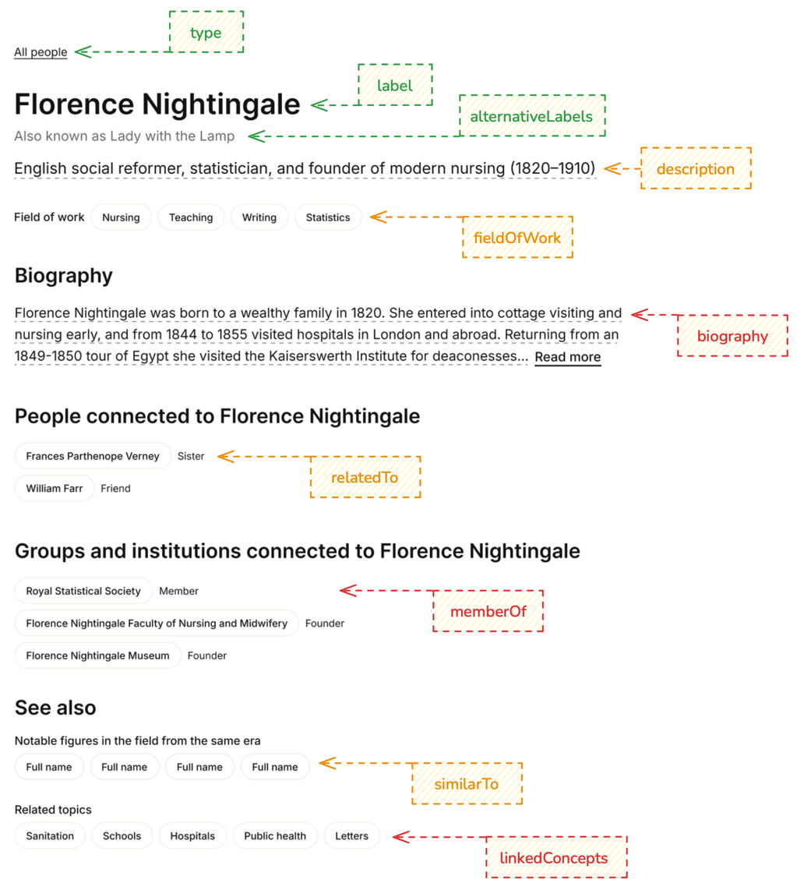
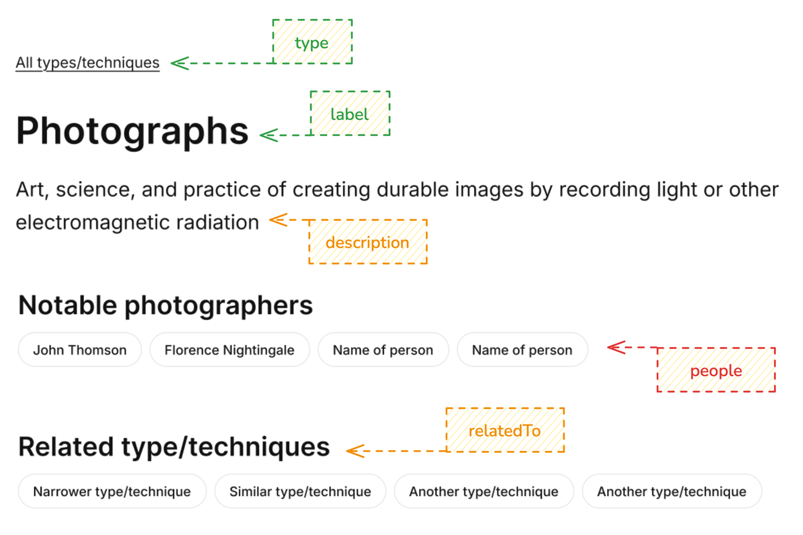
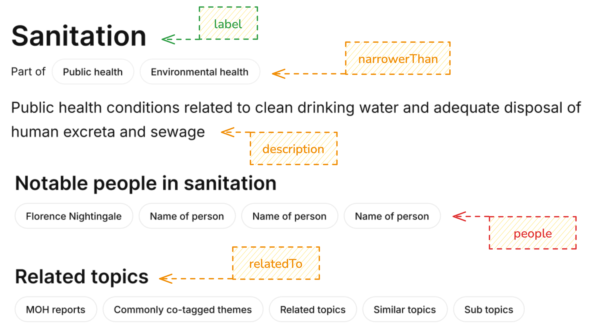
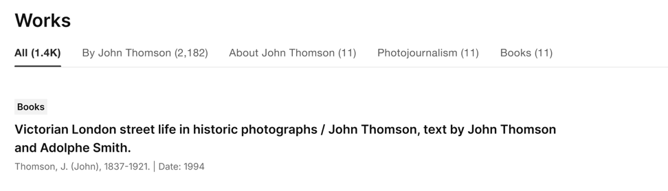
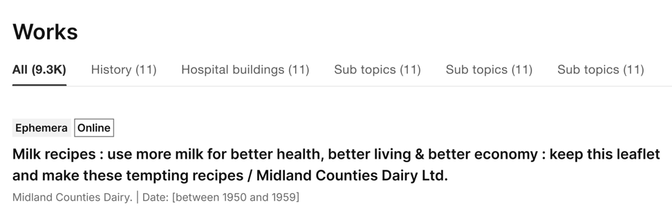
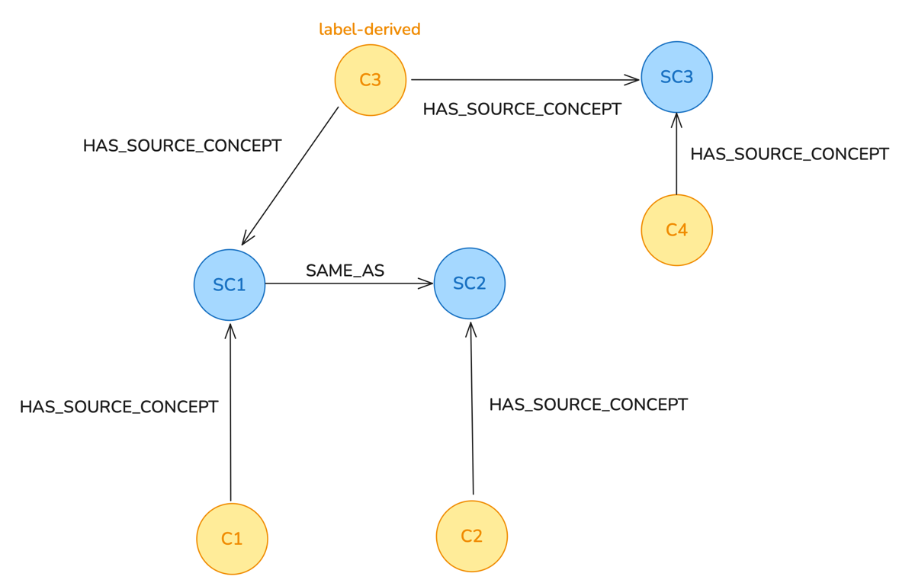
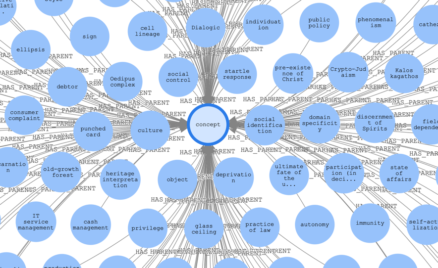
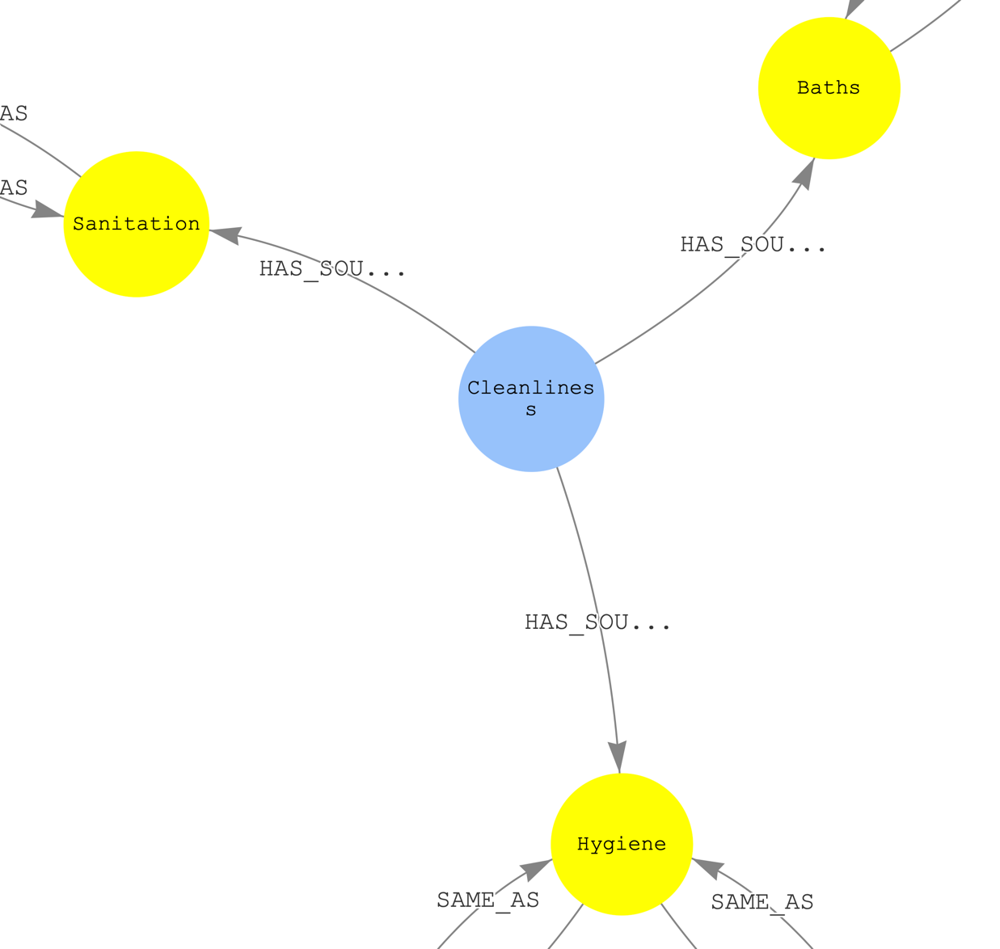

# RFC 070: Concepts API changes

## Background

This RFC outlines plans towards replacing our existing concepts API (introduced in [this RFC](https://github.com/wellcomecollection/docs/tree/main/rfcs/050-concepts-api) and implemented [here](https://github.com/wellcomecollection/catalogue-api/tree/main/concepts)) 
with a new API to deliver all features included in our newly designed theme pages. The RFC builds on top of existing RFCs,
including [the graph pipeline RFC](https://github.com/wellcomecollection/docs/tree/main/rfcs/066-graph_pipeline) and the [catalogue graph ingestor RFC](https://github.com/wellcomecollection/docs/tree/main/rfcs/069-catalogue_graph_ingestor).

## The concepts API

The current concepts API is implemented in TypeScript and exposes two endpoints:
* *Single concept endpoint*: A GET endpoint for retrieving a single concept given an ID
* *Search endpoint*: A GET endpoint returning a list of concepts given some filters

When processing a request, both endpoints retrieve concepts data from an Elasticsearch index and return a response 
without doing any processing on the returned data.

The *single concept endpoint* is called whenever a user views a theme page. The *search endpoint* is not being
actively utilised.

## Replacing the concepts API

The new API will mirror the structure of the existing API, exposing the same *single concept endpoint*.
It will get its data from a new Elasticsearch index populated by the catalogue graph ingestor (see [here](https://github.com/wellcomecollection/docs/tree/main/rfcs/069-catalogue_graph_ingestor)).

Given the similarity of the two APIs, it makes sense to build the new API by modifying the existing one instead of starting from scratch.
This way we can make use of existing utilities (e.g. functions connecting to Elasticsearch and AWS) and the existing deployment setup. 

Since the current *search endpoint* is not being utilised and is not required to implement new theme pages,
only the *single concept endpoint* will be implemented.  

## New *single concept endpoint*

The *single concept endpoint* needs to supply all metadata displayed on a given theme page. The designs include three
kinds of theme pages, each with its own set of metadata — Contributor theme pages (based on Agent, Person, or Organisation concepts), Type/technique theme pages (based on `Genre` concepts),
and Subject theme pages (for all other concept types).

### Contributor theme pages

The screenshot below shows an example Agent/Organisation/Person theme page. All metadata fields are labelled with suggested field
names to be returned from the API. The labels are colour-coded:

* Information in green is already returned by the current concepts API and will be easy to reproduce in the new API.
* Information in orange is not currently returned by the concepts API, but it is already stored in the graph and will be easy to return from the new API. 
* Information in red is not currently returned by the concepts API and is not stored in the graph. Including it in the API response might involve a lot of effort.

(The screenshot does not show the full theme page. It only includes information which can be returned from the concepts API.
Information not in included in the screenshot will be returned from other APIs.)

> 

Refer to the table below for more details about each field:

| Field name        | Details                                                                                                                                                                                                                                                                                                                                                                                                                                                                                                                                                                                                                                                                                                                                                                                                                                                                                                                                                                                                                                                                                                                                                                                                                    |
|-------------------|----------------------------------------------------------------------------------------------------------------------------------------------------------------------------------------------------------------------------------------------------------------------------------------------------------------------------------------------------------------------------------------------------------------------------------------------------------------------------------------------------------------------------------------------------------------------------------------------------------------------------------------------------------------------------------------------------------------------------------------------------------------------------------------------------------------------------------------------------------------------------------------------------------------------------------------------------------------------------------------------------------------------------------------------------------------------------------------------------------------------------------------------------------------------------------------------------------------------------|
| type              | Stored in the graph under the `type` field on all Concept nodes.                                                                                                                                                                                                                                                                                                                                                                                                                                                                                                                                                                                                                                                                                                                                                                                                                                                                                                                                                                                                                                                                                                                                                           |
| label             | Stored in the graph under the `label` field on all Concept and SourceConcept nodes. Sometimes multiple labels might be available (in cases where a concept is linked to multiple source concepts), in which case we will have to choose one label based on a priority ranking between sources (e.g. MeSH over LoC over Wikidata).                                                                                                                                                                                                                                                                                                                                                                                                                                                                                                                                                                                                                                                                                                                                                                                                                                                                                          |
| alternativeLabels | Stored in the graph under the `alternativeLabels` field on all SourceConcept nodes. Sometimes many alternative labels might be available and choosing the most relevant one to display to the user might be difficult. In many cases, none of the alternative labels are relevant. For example, alternative labels for Library of Congress names often include transliterations of a given name into different scripts (rather than alternative names used by English speakers). Even if we decided to display transliterations, we cannot display all of them as there are often too many (20+ in some cases).                                                                                                                                                                                                                                                                                                                                                                                                                                                                                                                                                                                                            |
| description       | Stored in the graph under the `description` field on all SourceConcept nodes. Sometimes multiple descriptions might be available (in cases where a concept is linked to multiple source concepts), in which case we will have to choose one description based on a priority ranking between sources (e.g. MeSH over Wikidata).                                                                                                                                                                                                                                                                                                                                                                                                                                                                                                                                                                                                                                                                                                                                                                                                                                                                                             |
| fieldOfWork       | Stored in the graph as SourceConceptHasFieldOfWork edges between Wikidata SourceName nodes and Wikidata SourceConcept nodes.                                                                                                                                                                                                                                                                                                                                                                                                                                                                                                                                                                                                                                                                                                                                                                                                                                                                                                                                                                                                                                                                                               |
| relatedTo         | Family relationships are stored in the graph as SourceNameRelatedTo edges between pairs of Wikidata SourceName nodes. Other kinds of relationships are not stored in the graph and generally cannot be obtained from Wikidata. However, it is possible to show 'collaborator' relationships by listing people who are frequently referenced in the same works (i.e. connecting people through their edges to Work nodes).                                                                                                                                                                                                                                                                                                                                                                                                                                                                                                                                                                                                                                                                                                                                                                                                  |
| similarTo         | Can be obtained from the graph by filtering for people who are linked to a given field of work and whose birth date is in a given range. In some cases many people might be returned and choosing the most 'notable' ones might be difficult. One approach would be to determine notability based on how many works reference a given person as a concept (i.e. counting the number of edges).                                                                                                                                                                                                                                                                                                                                                                                                                                                                                                                                                                                                                                                                                                                                                                                                                             | 
| memberOf          | Not stored in the graph at the moment, but can easily be obtained from the Wikidata API through the 'member of' field (P463) or the 'owner of' field (P1830).                                                                                                                                                                                                                                                                                                                                                                                                                                                                                                                                                                                                                                                                                                                                                                                                                                                                                                                                                                                                                                                              |
| biography         | Not stored in the graph at the moment. To source this information from Wikipedia, we would need to extract it from the Wikipedia API via a new transformer. Alternatively, it might be possible to source this information from catalogue works, utilising the 'biographical note' field. However, there are a few practical limitations to this approach: <ul><li>The biographical note field is not very common and only exists for ~4,000 authors.</li><li>Where a biographical note is available, it often (in approx. 1,000 cases) contains general information, such as `Author contact details printed in source journal` or `Died Jun. 14 2000. GP Middlesbrough`.</li><li>In approx. 1,000, works with a biographical note have multiple contributors assigned to them, which makes it difficult to determine which contributor the note belongs to.</li><li>In some cases, the biographical note field does not contain any biographical information. For example, see [this work](https://wellcomecollection.org/works/btkphaqj) or [this work](https://wellcomecollection.org/works/qurf5s7c).</li></ul>  After filtering out all of these problematic biographical notes, we would be left with ~2,000 notes. |
| linkedConcepts    | Can be obtained from the graph by querying for concepts which are commonly referenced in the same works (similar to 'collaborator' relationships in the `relatedTo` field).                                                                                                                                                                                                                                                                                                                                                                                                                                                                                                                                                                                                                                                                                                                                                                                                                                                                                                                                                                                                                                                |


### Type/technique theme pages

These theme pages are based on concepts of type `Genre`. The screenshot below shows all concept metadata exposed on this page type:

> 

This page has a few new pieces of information (refer to the table above for all other fields):

| Field name | Details                                                                                                                                                                                                                                                                                                                                                                                                                                                                                  |
|------------|------------------------------------------------------------------------------------------------------------------------------------------------------------------------------------------------------------------------------------------------------------------------------------------------------------------------------------------------------------------------------------------------------------------------------------------------------------------------------------------|
| relatedTo  | Stored in the graph as a combination of multiple edge types — SourceConceptNarrowerThan (edge direction reversed), SourceConceptHasParent (edge direction reversed), and SourceConceptRelatedTo.                                                                                                                                                                                                                                                                                         |
| people     | Stored in the graph as the SourceConceptHasFieldOfWork edge (edge direction reversed). However, these edges link people to subjects (e.g. Photography) rather than techniques (e.g. Photograph). Linking subjects to techniques might be possible in some cases but it would require us to insert new edges into the graph. For example, the Wikidata entry for Photography links to the entry for Photograph via the `product, material, or service produced or provided` field (P1056). |


### Subject theme pages

Subject theme pages are based on any concept type that's not categorised as a Contributor or as a Type/technique. This includes Concept, Place, Meeting, and Period.
The screenshot below shows all concept metadata exposed on this page type:

> 

This page only has one additional piece of information not shown on other theme pages (refer to tables above for all other fields):


| Field name   | Details                                                                            |
|--------------|------------------------------------------------------------------------------------|
| narrowerThan | Stored in the graph as SourceConceptNarrowerThan and SourceConceptHasParent edges. |


## Works and images shown on theme pages

Like current theme pages, new theme page designs include sections listing works and images related to the given theme.
However, new theme pages expand the number of available tabs, providing more extensive filtering options.

Current theme pages populate their Works tabs by making requests to the catalogue API, specifying the Wellcome ID of
the given theme as a filter. New theme pages will use the same approach, applying additional filters as needed.

### Contributor theme pages

New Contributor theme pages include tabs for filtering all works linked to the given Person/Agent/Organisation by 'format' (also known as `workType`): 

> 

These tabs will be populated by applying the relevant `workType` filter. For example, to obtain all books about John Thomson,
a search request will be made to the catalogue API, specifying a `subjects` filter (including IDs of all 'linked' John Thomson concepts)
and a `workType` filter (including the ID of the 'Books' `workType`).

### Subject theme pages

New subject theme page designs include additional tabs listing works linked to sub topics (child themes) of the given theme:

> 

To retrieve these works from the catalogue API, we need the *single concept endpoint* to return a list of relevant narrower topics
(in addition to the fields listed in the tables above):

| Field name  | Details                                                                                                                                                                                                                                          |
|-------------|--------------------------------------------------------------------------------------------------------------------------------------------------------------------------------------------------------------------------------------------------|
| broaderThan | Stored in the graph as SourceConceptNarrowerThan (edge direction reversed) and SourceConceptHasParent (edge direction reversed) edges. |

We can then make separate API calls to the catalogue API to retrieve a list of works for each sub topic.

However, this poses a challenge, because the relationships between works and concepts are not inherited. For example, if a work references
the concept `Sanitation - history`, it does **not** automatically reference the concept `Sanitation`, even though
`Sanitation - history` is a child (sub topic) of `Sanitation`. In general, this means that works which reference a child of
a given theme (but do not reference the theme directly) will not be automatically included in the `All` tab in
the screenshot above.

We can address this by modifying the catalogue API call to filter for all works referencing a given theme **or** any of its
sub topics (i.e. retrieving all works referencing either `Sanitation` or `Sanitation - history`). However, this would become complicated
and computationally expensive if done across multiple levels (i.e. retrieving works referencing sub topics, works referencing
sub topics of sub topics, etc.). Therefore, we should limit ourselves to one level only (i.e. direct children).


## Connecting concepts across sources

Due to storing `HAS_SOURCE_CONCEPT` edges between catalogue concepts and source concepts, and `SAME_AS` edges
between source concepts, the catalogue graph allows us to make connections between concepts derived from different
ontologies. For example, if a work references a LoC subject heading `Sanitation` and a different work references
a MeSH term `Sanitation`, we can connect the two works and show them on both the LoC-derived concept page,
and the MeSH-derived concept page.

To enable this functionality, the new *single concept endpoint* should return the Wellcome IDs of all 'connected' (or 'linked') concepts
so that we can retrieve the works and images from all of them.

In practice, this implies showing some works on multiple theme pages. For example, given the graph below (where 'C' nodes
refer to concepts and 'SC' nodes refer to source concepts), the implications for individual theme pages would be as follows:

| Concept page | Show works and images from |
|--------------|----------------------------|
| C1           | C1 and C2                  |
| C2           | C1 and C2                  |
| C3           | C1, C2, C3, and C4         |
| C4           | C3 and C4                  |

Because C3 is connected to two source concepts (SC1 and SC3), it would show works and images referencing any of the four concepts.
This can only happen for label-derived concepts, which are linked to source concepts based on labels rather than
hard-coded source concept IDs. This behaviour is acceptable (and even desirable), because label-derived concepts are often ambiguous,
which means we often cannot accurately link them to just one concrete source concept. 

> 

## New *single concept endpoint* API response example

Imagine a scenario where a user visits the following `Sanitation` theme page: https://wellcomecollection.org/concepts/eva7r2dw.

The Wellcome ID in the URL is `eva7r2dw`, which corresponds to a MeSH-derived source concept:

| Source concept ID | Source | Label      | Description                                                                                          |
|:------------------|--------|------------|------------------------------------------------------------------------------------------------------|
| D012499           | MeSH   | Sanitation | The development and establishment of environmental conditions favorable to the health of the public. |

Running a graph query utilising `SAME_AS` and `HAS_SOURCE_CONCEPT` edges reveals that there are two more source concepts linked to this concept:

| Source concept ID | Source               | Label      | Description |
|:------------------|----------------------|------------|-------------|
| sh85117296        | LoC subject headings | Sanitation |             |
| sh00007929        | LoC subject headings | Sanitation |             |

And these source concepts are linked to a Wikidata source concept:

| Source concept ID | Source   | Linked to                  | Label      | Description                                                                                                |
|:------------------|----------|----------------------------|------------|------------------------------------------------------------------------------------------------------------|
| Q949149           | Wikidata | `D012499` and `sh85117296` | Sanitation | public health conditions related to clean drinking water and adequate disposal of human excreta and sewage |


The metadata from all of these source concepts will be used to populate various fields in the API response (e.g. `description`).

Running more graph queries reveals that all of these source concepts link to three more Wellcome concepts:

| Concept ID                                                                                                    | Source               | Label       |
|:--------------------------------------------------------------------------------------------------------------|----------------------|-------------|
| [mwyumfq2](https://wellcomecollection.org/concepts/mwyumfq2)                                                  | label-derived        | Cleanliness |
| [d8z89dv6](https://wellcomecollection.org/concepts/d8z89dv6)                                                  | LoC subject headings | Sanitation  |
| [jubdg55b](https://wellcomecollection.org/concepts/jubdg55b)                                                  | label-derived        | Sanitation  |

All of these concept IDs will be included in the *single concept endpoint* API response so that we can use them when querying
the catalogue API for works/images to show on the theme page. 

Next, we can use a combination of `NARROWER_THAN` and `SAME_AS` edges between source concepts, and `HAS_SOURCE_CONCEPT` edges
to obtain a list of catalogue concepts which are broader than the four catalogue concepts listed above:

| Concept IDs                            | Label                        |
|:---------------------------------------|------------------------------|
| sagccnc9, z44pyycv                     | Environmental Health         |
| c9ayxjtj, uj4hz4ct, zvpgcgjv, hfhs58ra | Public health                |

In a similar way, we can obtain a list of related concepts by utilising `RELATED_TO`/`HAS_PARENT` edges between source concepts:

| Concept IDs                            | Label                        |
|:---------------------------------------|------------------------------|
| g7nnn9wn, dwqd7gvs, xtndzsda           | Environmental Policy         |
| z7azx5qx, mwyumfq2, sjxv6uys           | Hygiene                      |
| yz3xs9c9, cqpmracr                     | Communicable Disease Control |
| zc9y7m45, kx79h6jm, xcdy58xp, mz9syutk | Sanitary Engineering         |

Putting everything together, we can construct a full JSON response returned to the front-end:

```
GET /concepts/eva7r2dw
{
  "id": "eva7r2dw"
  
  // Only the identifier of the linked MeSH concept is included
  "identifiers": [
    {
      "identifierType": "nlm-mesh",
      "value": "D012499",
      "type": "Identifier"
    }
  ]
  
  // The MeSH label takes priority over any other labels
  "label": "Sanitation",
  
  // All labels from all source concepts can be included (though they might not be needed).
  // Even if we do not include them in the API response, they should still be indexed in case we
  // want to use them in the future for querying.
  "alternativeLabels": [
    "public sanitation",
    "Cleanliness",
    "House drainage",
    "Sanitary affairs",
    "Sanitation services"
    "Sanitation systems"
  ]
    
  "type": "Concept"

  // The MeSH description takes priority over the Wikidata description.
  "description": "The development and establishment of environmental conditions favorable to the health of the public.",
  
  "matchedConcepts": [
    {
      "id": "d8z89dv6",
      "identifiers": [
        {
          "identifierType": "lc-subjects",
          "value": "sh85117296",
          "type": "Identifier"
        }
      ]
    },
    {
      "id": "jubdg55b",
      "identifiers": [
        {
          "identifierType": "label-derived",
          "value": "sanitation",
          "type": "Identifier"
        }
      ]
    },    
    {
      "id": "mwyumfq2",
      "identifiers": [
        {
          "identifierType": "label-derived",
          "value": "cleanliness",
          "type": "Identifier"
        }
      ]
    } 
  ]  
    
  // Only one Wellcome ID is listed for each linked concept even when multiple 'linked' IDs are available.
  // When choosing which ID to include, IDs from the same ontology will be preferred. (For example, if we are on 
  // a LoC-derived theme page and there is a LOC-derived page narrower than the current page, we choose it 
  // over other narrower pages from different ontologies.)
  "narrowerThan": [
    {
        "label": "Public Health",
        "id": "c9ayxjtj"
    },
    {
        "label": "Environmental Health",
        "id": "sagccnc9" 
    }
  ],
  
  "relatedTo": [
    {
        "label": "Communicable Disease Control",
        "id": "yz3xs9c9"
    },
    {
        "label": "Hygiene",
        "id": "sjxv6uys"
    },
    {
        "label": "Sanitary engineering",
        "id": "zc9y7m45"
    },
    {
        "label": "Environmental policy",
        "id": "xtndzsda"
    }
  ]
}
```

## Other considerations

### Wikidata edges to 'concept' node

There are ~200 Wikidata nodes which link to a node labelled `concept` ([Q151885](https://www.wikidata.org/wiki/Q151885)) via the `HAS_PARENT` edge. This node is too
general, and we should probably exclude it when returning `relatedTo` or `narrowerThan` nodes.
> 

### Too many source concept edges

Some label-derived concepts are currently linked to multiple source concepts from the same source ontology via `HAS_SOURCE_CONCEPT` edges. 
For example, the label-derived concept `Cleanliness` is connected to three separate LoC subject headings — `Sanitation`, `Hygiene`, and `Baths`.
All of these connections were created by matching the label of the label-derived concept to alternative labels of the LoC source concepts.
This and similar connections can pose several issues:
  * By linking all of these concepts together, we would be showing works and images referencing any of the three LoC
    concepts on a single concept page. 
  * In cases where a concept is connected to a given source concept **and** the parent of the source concept, we would end up
    listing a given concept as a related concept on its own theme page (i.e. a concept would be related to, or part of, itself).

To avoid these issues, we should limit ourselves to creating at most one `HAS_SOURCE_CONCEPT` edge per ontology. When choosing
which edge to create, we could prioritise labels over alternative labels (i.e. only use alternative labels for matching
if matching based on labels did not produce an edge). In cases where multiple matches are found, the source
identifiers of the matches could be sorted and the first one could be chosen (to guarantee consistency between
transformer runs).

Implementing this would ensure that the 'Cleanliness' concept (and similar label-derived concepts) would be matched
to only one of the three source concept nodes, preventing them from being merged into a single theme page.

> 
