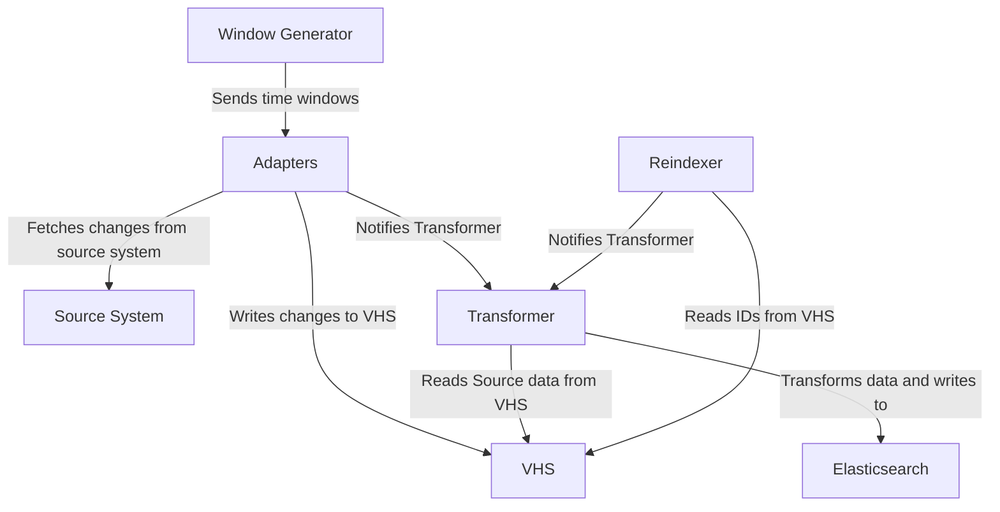
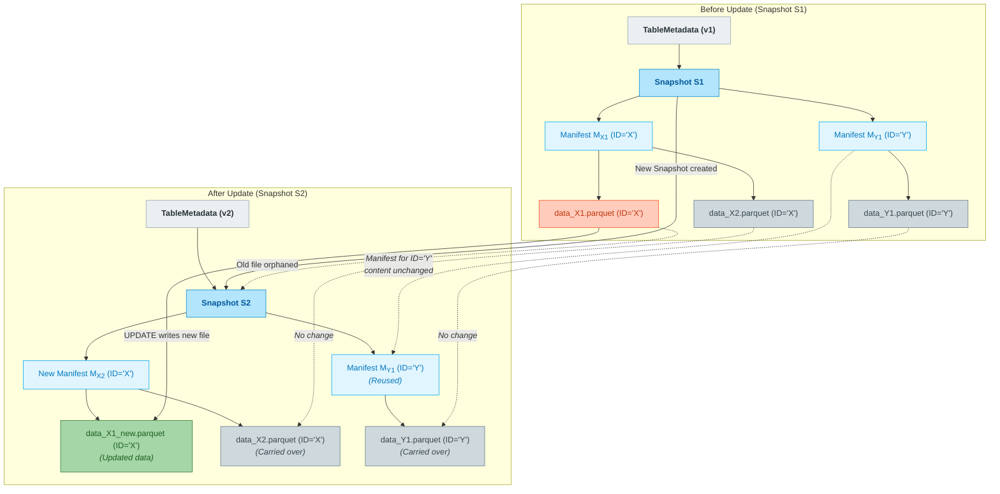

# RFC 075: Using Apache Iceberg tables in Catalogue Pipeline adapters

Discussing a replacement architecture for the catalogue pipeline adapters, moving away from the Versioned Hybrid Store (VHS) using Apache Iceberg as the underlying storage format.

**Last modified:** 2025-06-02T14:01:45Z

## Table of contents

- [Context](#context)
    - [Required functionality of adapters](#required-functionality-of-adapters)
    - [Current architecture overview](#current-architecture)
    - [Problems with current architecture](#problems-with-current-architecture)
    - [Other considerations](#other-considerations)
- [Proposal to use Apache Iceberg](#proposal)
  - [Why is it suited to this problem?](#why-is-it-suited-to-this-problem)
  - [Iceberg tables in more detail](#iceberg-tables-in-more-detail)
    - [Why columnar formats?](#why-columnar-formats)
    - [Parquet files](#parquet-files)
    - [Iceberg table metadata](#iceberg-table-metadata)
    - [Updates in Iceberg](#updates-in-iceberg)
    - [Maintaining Iceberg tables](#maintaining-iceberg-tables)
  - [Initial testing](#initial-testing)
    - [Performance performing queries and upserts](#performance-performing-queries-and-upserts)
    - [Table schemas and partitions](#table-schemas-and-partitions)
    - [Testing with calm and sierra data](#testing-with-calm-and-sierra-data)\
    - [Reproducing processing in reindex and incremental update modes](#reproducing-processing-in-reindex-and-incremental-update-modes)
      - [Incremental mode](#incremental-mode)
      - [Full reindex mode](#full-reindex-mode)
  - [Conclusion of initial testing](#conclusion-of-initial-testing)
- [New adapter architecture using iceberg](#new-adapter-architecture-using-iceberg)
- [Impact](#impact)
- [Next steps](#next-steps)

## Context

The function of "adapters" in the catalogue pipeline is to provide a standard interface for the rest of the catalogue pipeline to act on data from source systems without direct concern for the load or availability of those systems. See this [description of adapters in the pipeline](https://docs.wellcomecollection.org/catalogue-pipeline/fetching-records-from-source-catalogues/what-is-an-adapter).

An adapter decouples synchronizing changes from a source system, with the process of transforming, matching and merging that happen later in the pipeline. An adapter can be thought of as serving 4 main purposes:

### Required functionality of adapters

- Noticing and fetching changes from a source system.
- Writing changes to a storage system, which can be queried later.
- Notifying the rest of the pipeline that changes have occurred, so that they can be processed.
- During a reindex, notifying the rest of the pipeline about the current state of the source system, so that it can be transformed and indexed in totality.

### Current architecture overview

The current adapters use a Versioned Hybrid Store (VHS) to store data from source systems, which is a custom storage format that provides versioning and schema-less data storage. This has worked well for many years, but has some drawbacks that we want to address.

See this blog post on the [Versioned Hybrid Store (VHS)](https://stacks.wellcomecollection.org/creating-a-data-store-from-s3-and-dynamodb-8bb9ecce8fc1) for more information about the current implementation. In summary the VHS is a custom storage format that combines S3 and an index in DynamoDB to provide a versioned, schema-less data store that can be queried on the id and version of a record. 

The VHS allows for storing multiple versions of a record, and was originally designed to overcome the limitations of S3 as a data store, which did not at the time provide [read after write consistency](https://aws.amazon.com/blogs/aws/amazon-s3-update-strong-read-after-write-consistency/).

The current architecture consists of several components:

- **Window generators**: This is a service that generates time windows for processing data from source systems. Windows are sent to adapters to fetch changes from source systems within a given time window. It can be used to control the frequency of updates from source systems, and to track missing completed windows.
- **Adapters**: These are services that fetch changes from source systems and write them to the Versioned Hybrid Store (VHS). They also notify the rest of the pipeline about changes.
- **Reindexer**: This is a service that understands how to query the VHS and generates upstream notifications for the rest of the pipeline. It is used to reindex data from source systems when necessary, e.g. when the `Work` model changes and we need to re-transform and reindex all data.

The Window Generator sends message to the Adapters, which gets data from the source system, store stores the data in the VHS, and notifies the Transformer about changes. The Transformer reads from the VHS, transforms the data into a format suitable for indexing, and writes it to Elasticsearch. The reindexer is used to reindex data from the VHS when necessary, e.g. when the `Work` model changes.

The Reindexer is initiated when we wish to reprocess all data from a source system, and is not part of the normal data processing flow. It reads from the VHS and sends messages to a Transformer to process data, which then writes it to Elasticsearch. The reindexer also reindexes data from the VHS, which is useful when we need to reprocess all data from a source system.




#### Relationship to the Work model

The granularity of the data stored in the VHS is at the level of individual records, that can be transformed into the `Work` model. The VHS stores data in a schema-less format, which allows for flexibility in the data model, but also means that we have to handle schema changes upstream in the source systems. 

Transformer services read data from the VHS, transforms it into a format suitable for indexing, and writes it to Elasticsearch. 

Notifications from the adapters are used to trigger the transformers to process data, this happens in a "push" model where the adapters notify the transformers about changes to individual records via SNS/SQS.

### Problems with current architecture

There are several problems with the current architecture that we want to address, apart from updating the design to use more modern technologies and without the need to work around previous limitations of S3.

1. **Keeping unused versions**: The VHS retains all versions of a record, however we do not make use of the versioning functionality in the VHS, there is no mechanism for accessing old versions, and there is no provision for cleaning up old versions of records. This has resulted in large amounts of unused data being stored, which is costly.

2. **Difficult to inspect source data**: As records are stored in S3 with an index in DynamoDB and the data stored in S3 is scheme-less, it is difficult to inspect the source data directly and understand its structure and contents in aggregate. 

3. **Novel approach, difficult to understand**: The VHS is a custom storage format that is not  used outside of Wellcome Collection, which makes it difficult for new developers to understand and work with. It also means that we have to maintain our own custom code for reading and writing data, which adds complexity.

4. **Schema-less data storage**: The VHS allows for schema-less data storage, which means that we do not enforce a schema on the data stored in the VHS. This can lead to issues with data quality and consistency, as we do not have a mechanism for validating the structure of the data before it is written to the store. While this has allowed us to handle changes in source systems more easily, it has also led to records of the same data model having different structures.

   Although data stored in the VHS is schema-less transformers are responsible for decoding source data, and reference source data types in their code. This means that if a source system changes its schema, we have to update the transformers to handle the new schema in any case, negating some of the benefits of schema-less storage.

### Other considerations

The ongoing Wellcome Collection Systems Transformation Project (WCSTP) aims to replace the current Library Management System (LMS) and Collection Management System (CMS). This will involve rewriting the adapters for these systems, which provides an opportunity to update the architecture of the adapters to use more modern technologies and approaches.

We are in the process of moving to use Lambda functions for many of our catalogue pipeline components, in order to reduce infrastructure management overhead and improve scalability, and to do so using Python as the primary language for development. We will need to ensure that the new adapter architecture is compatible with this approach.

Recent development of the catalogue graph discussed in other RFCS [RFC 066: Catalogue Graph](https://github.com/wellcomecollection/docs/tree/main/rfcs/066-graph_pipeline) has shown that we can use AWS Step Functions to orchestrate complex workflows, which could be used to manage the flow of data through the adapters and transformers.

## Proposal to use Apache Iceberg

We propose to replace the current Versioned Hybrid Store (VHS) with Apache Iceberg tables as the underlying storage format for the catalogue pipeline adapters. 

[Apache Iceberg](https://iceberg.apache.org/) is an open-source table format for large analytic datasets that provides features such as ACID transactions, schema evolution, and time travel. It is designed to work with cloud storage systems like Amazon S3, and has support in a variety of data processing libraries in Python.


### Why is it suited to this problem?

Iceberg is well-suited to this problem for several reasons:

- **Good compression**: Iceberg tables can be stored in columnar formats like Parquet, which provides efficient storage and query performance.
- **ACID transactions**: Iceberg provides support for ACID transactions, which allows us to ensure data consistency and integrity when writing changes to the store.
- **Support in tooling**: Iceberg has support in a variety of data processing libraries, including Python libraries like Polars and DuckDB, as well as Spark. This means that we can use familiar tools to work with the data.
- **Support in the data engineering community**: Iceberg is widely used in the data engineering community, which means that there is good knowledge and resources available for working with it.
- **Support in AWS**: Iceberg has good support in AWS, with features like S3 Tables, Glue Catalog, and querying using Athena. This means that we can easily integrate Iceberg tables into our existing AWS infrastructure.
  - **S3 Tables**: Iceberg tables can be stored in S3, which provides a cost-effective and scalable storage solution. In addition, [S3 Tables](https://docs.aws.amazon.com/AmazonS3/latest/userguide/s3-tables.html) support for automatic table maintenance operations like cleaning up old snapshots and optimizing partitions.
  - **Glue Catalog**: Iceberg tables can be registered in the [AWS Glue Catalog](https://docs.aws.amazon.com/glue/latest/dg/components-overview.html#data-catalog-intro), which provides a REST API adhering to the Iceberg specification, but also allows integration with other AWS services like Athena for querying.
- **Querying using SQL**: Iceberg tables can be queried using SQL, which makes it easy to work with the data and allows us to use familiar query languages.
- **Support for schema evolution**: [Iceberg allows us to evolve the schema](https://iceberg.apache.org/docs/latest/evolution/) of our tables over time, which is important as source systems change and we need to adapt to new data structures.
- **Time travel**: Iceberg provides support for time travel, which allows us to query historical versions of the data. This is useful for debugging and understanding changes in the data over time. Automatically cleaning up old snapshots is also supported.

### Iceberg tables in more detail

Iceberg tables are a logical abstraction that provides a structured way to manage large datasets. They consist of metadata and data files, where the metadata describes the structure of the table, including its schema, partitions, and snapshots. The data files are typically stored in columnar formats like Parquet, which allows for efficient storage and querying.

**Why columnar formats?** Columnar formats like Parquet are well-suited for analytical workloads, as they allow for efficient compression and query performance. They store data in a column-oriented fashion, which means that data for each column is stored together, allowing for better compression and faster access to specific columns when querying.

**Parquet files** are a popular columnar storage format that is widely used in the data engineering community. Finding data inside a [Parquet file](https://parquet.apache.org/docs/file-format/) is aided by the use of [row groups](https://parquet.apache.org/documentation/latest/#row-groups), which are logical partitions of the data within a Parquet file. Row groups allow for efficient reading of specific subsets of data, as they contain metadata about the data stored within them.

**Immutability in Parquet files**: Parquet files are immutable, meaning that once they are written, they cannot be modified. Storing data using Parquet alone would require us to write a new file for each change, which can lead to inefficiencies and increased storage costs. Iceberg tables address this by providing a layer of abstraction that allows us to manage changes to the data without having to rewrite entire files.

**Iceberg table metadata**: Iceberg tables maintain metadata that describes the structure of the table, including its schema, partitions, and snapshots. This metadata is stored in a separate file (the "metadata file") and is used to manage the data files that make up the table. The metadata file allows us to efficiently query the table and understand its structure without having to read all the data files.

**Updates in Iceberg**: Iceberg tables support updates and deletes by creating new data files that contain the changes, rather than modifying existing files. This allows us to maintain a history of changes to the data, which can be useful for auditing and debugging purposes. The metadata file is updated to reflect the new state of the table after each change.

**Maintaining Iceberg tables**: Table updates and schema changes result in new data files being created, and the metadata file being updated to reflect the new state of the table via snapshots. When these operations happen old data files are not immediately deleted, but are instead retained for a period of time to allow for time travel and auditing per table configuration. Consequently, Iceberg tables can grow in size over time, and it is important to have a mechanism for cleaning up old data files and snapshots to manage storage costs.

**Example of a table update in Iceberg**

The following diagram illustrates how an Iceberg table update works in a table partitioned by `id`, showing the creation of new data files, the update of the metadata file, and the retention of old data files.



See the [Iceberg documentation](https://iceberg.apache.org/docs/latest/) for more information about how Iceberg tables work, including details about the metadata file, snapshots, and partitioning.

### Initial testing

We have conducted some initial testing of Iceberg tables to understand their performance characteristics when making queries and upserts on the scale of the adapter source data we currently have in the catalogue pipeline, and with upsert operations that are similar to those performed by the current adapters.

#### Performance performing queries and upserts

There is reason to be cautious as the current adapters perform many individual updates to records, a model that may not be well-suited to Iceberg tables, which [although it is used for stream processing](https://aws.amazon.com/blogs/big-data/stream-real-time-data-into-apache-iceberg-tables-in-amazon-s3-using-amazon-data-firehose/) may have limitations. We will need to move to a model where we batch updates and writes to the Iceberg tables, rather than performing many individual updates.

As discussed above, upserts create new data files that contain the changes, rather than modifying existing files, and table maintenance operations like cleaning up old snapshots are required to manage storage costs.

Using [this script to upsert small dummy data into Iceberg tables](./upsert_dummy_data.py), we did some initial testing.

**Dummy schema**

```python
from pyiceberg.schema import Schema, NestedField, IntegerType, StringType, TimestampType
from pyiceberg.partitioning import PartitionSpec, PartitionField
from pyiceberg.transforms import BucketTransform, DayTransform

schema = Schema(
    NestedField(1, "id", IntegerType(), required=True),
    NestedField(2, "name", StringType(), required=False),
    NestedField(3, "message", StringType(), required=True),
    # last modified field
    NestedField(4, "last_modified", TimestampType(), required=True),
    identifier_field_ids=[1]  # 'id' is the primary key
)

partition_spec = PartitionSpec(
    fields=[
        PartitionField(source_id=1, field_id=1000, transform=BucketTransform(num_buckets=10), name="id"),
        PartitionField(source_id=4, field_id=1001, transform=DayTransform(), name="last_modified")
    ]
)

# Generate dummy data

import random
import datetime

data = []

for i in range(1000000):
    # generate random data for the above schema
    id_value = i
    name_value = f"name_{i}" if random.random() > 0.1 else None  # 10% chance of being None
    message_value = f"message_{i}"
    data.append({
        "id": id_value,
        "name": name_value,
        "message": message_value,
        "last_modified": datetime.datetime.now(datetime.timezone.utc)
    })
```

Performance results using S3 Tables with Iceberg:

```
Upserting 1 records...
Upserted 1 records in 4.25 seconds
Upserting 10 records...
Upserted 10 records in 8.08 seconds
Upserting 100 records...
Upserted 100 records in 13.05 seconds
Upserting 1000 records...
Upserted 1000 records in 15.29 seconds
Upserting 10000 records...
Upserted 10000 records in 23.25 seconds
Upserting 100000 records...
Upserted 100000 records in 96.67 seconds
Upserting 1000000 records...
Upserted 1000000 records in 896.22 seconds
```

Queries in Iceberg can result in scanning a large amount of data depending on table partitioning, so reducing the amount of data scanned to find the required records is important for performance. This can be achieved both by partitioning the table effectively and by batching reading many records in a single query, rather than reading individual records.

#### Table schemas and partitions

Another change from the VHS is that Iceberg tables require a schema to be defined for the data stored in them. This means that we will need to define a schema for each adapter, which will be used to validate the data before it is written to the table. 

In testing we we're able to quickly define schemas for the Calm and Sierra source data, which allowed us to validate the data before writing it to the Iceberg tables.

**Example schema for Sierra source data**

```python
from pyiceberg.schema import Schema, NestedField
from pyiceberg.partitioning import PartitionSpec, PartitionField
from pyiceberg.transforms import BucketTransform
from pyiceberg.types import (
    StringType,
    ListType,
    MapType,
    TimestampType,
    StructType,
)

def make_record_map_type(base_field_id, base_element_id):
    """
    Helper to generate a MapType for item_records, holdings_records, or order_records.
    Ensures unique field_ids and element_ids for each usage.
    """
    return MapType(
        key_id=base_field_id + 100,  # must be unique and int
        value_id=base_field_id + 200,  # must be unique and int
        key_type=StringType(),
        value_type=StructType(
            NestedField(field_id=base_field_id + 0, name="id", field_type=StringType(), required=False),
            NestedField(field_id=base_field_id + 1, name="data", field_type=StringType(), required=False),
            NestedField(field_id=base_field_id + 2, name="modified_date", field_type=TimestampType(), required=False),
            NestedField(field_id=base_field_id + 3, name="bib_ids", field_type=ListType(element_id=base_element_id + 0, element_type=StringType(), element_required=False), required=False),
            NestedField(field_id=base_field_id + 4, name="unlinked_bib_ids", field_type=ListType(element_id=base_element_id + 1, element_type=StringType(), element_required=False), required=False),
        )
    )

sierra_iceberg_schema = Schema(
    NestedField(
        field_id=1,
        name="id",
        field_type=StringType(),
        required=True
    ),
    NestedField(
        field_id=2,
        name="maybe_bib_record",
        field_type=StructType(
            NestedField(field_id=21, name="id", field_type=StringType(), required=False),
            NestedField(field_id=22, name="data", field_type=StringType(), required=False),
            NestedField(field_id=23, name="modified_date", field_type=TimestampType(), required=False),
        ),
        required=False
    ),
    NestedField(
        field_id=3,
        name="item_records",
        field_type=make_record_map_type(31, 340),
        required=True
    ),
    NestedField(
        field_id=4,
        name="holdings_records",
        field_type=make_record_map_type(41, 440),
        required=True
    ),
    NestedField(
        field_id=5,
        name="order_records",
        field_type=make_record_map_type(51, 540),
        required=True
    ),
    NestedField(
        field_id=6,
        name="modified_time",
        field_type=TimestampType(),
        required=True
    ),
    identifier_field_ids=[1]
)

sierra_iceberg_partition_spec = PartitionSpec(
    fields=[
        PartitionField(source_id=1, field_id=1000, transform=BucketTransform(num_buckets=100), name="id"),
    ]
)
```

**Example schema for Calm source data**

```python
from datetime import datetime

from pyiceberg.schema import Schema, NestedField, BooleanType, StringType, TimestampType, StructType, ListType
from pyiceberg.partitioning import PartitionSpec, PartitionField
from pyiceberg.transforms import BucketTransform, DayTransform

calm_data_fields = [
   'UserText2', 'Link_To_Digitised', 'Appraisal', 'Level', 'Location', 'Format',
    'PreviousNumbers', 'UserWrapped5', 'UserText7', 'Created', 'UserWrapped6',
    'CountryCode', 'UserText3', 'Title', 'ACCESS', 'Arrangement', 'CustodialHistory',
    'SDB_Type', 'CONTENT', 'Inscription', 'SDB_Ref', 'Transmission', 'AccessStatus',
    'TargetAudience', 'Condition', 'CreatorName', 'CONSERVATIONREQUIRED', 'Format_Details',
    'UserWrapped2', 'Digital_Date_Created', 'UserText9', 'Copyright_Expiry', 'Accruals',
    'Material', 'Description', 'Acquisition', 'UserText8', 'AccessCategory',
    'Digitised', 'UserText4', 'Modifier', 'Copyright', 'UserDate1', 'ClosedUntil',
    'Ordering_Status', 'Digital_Last_Modified', 'Bnumber', 'Creator', 'ConservationStatus',
    'AV_Timecode', 'MISC_Reference', 'Language', 'IDENTITY', 'RCN', 'Producible_Unit',
    'RelatedMaterial', 'Digital_File_Path', 'UserText5', 'Access_Licence',
    'Sources_Guides_Used', 'RefNo', 'ExitNote', 'UserWrapped4', 'AccessConditions',
    'RepositoryCode', 'UserWrapped7', 'CONTEXT', 'Digital_File_Format', 'Data_Import_Landing',
    'ALLIED_MATERIALS', 'Date', 'ConservationPriority', 'Originals', 'Notes',
    'Metadata_Licence', 'UserText6', 'AV_Target_Audience_Details', 'Extent', 'AltRefNo',
    'RecordID', 'RecordType', 'Player_Code', 'SDB_URL', 'UserWrapped3', 'PublnNote',
    'UserWrapped8', 'Credits', 'CatalogueStatus', 'AdminHistory', 'Copies', 'Modified',
    'Document'
]

# reproduce the schema in Iceberg

# Starting field_id for fields within the 'data' struct.
# Ensure this range doesn't overlap with top-level field_ids.
# We also need unique element_ids for the ListType.
# Let's assign field_ids from 100 onwards, and element_ids from 1000 onwards.
next_data_field_id = 100
next_element_id = 1000 # For elements within ListType

data_fields_list = []
for field_name in calm_data_fields:
    current_field_id = next_data_field_id
    current_element_id = next_element_id
    next_data_field_id += 1
    next_element_id +=1

    data_fields_list.append(
        NestedField(
            field_id=current_field_id,
            name=field_name,
            field_type=ListType(
                element_id=current_element_id,
                element_type=StringType(),
                element_required=False
            ),
            required=False # Assuming the list field itself is optional
        )
    )

# Construct the StructType for 'data' using the generated list of NestedFields
data_schema = StructType(*data_fields_list)

# Define the main schema using the compacted data_schema
calm_iceberg_schema = Schema(
    NestedField(field_id=1, name="id", field_type=StringType(), required=True),
    NestedField(field_id=2, name="data", field_type=data_schema, required=False),
    NestedField(field_id=3, name="retrieved_at", field_type=TimestampType(), required=False),
    NestedField(field_id=4, name="published", field_type=BooleanType(), required=False),
    identifier_field_ids=[1] # Assign a schema ID as a list
)

# bucket partition on id into 100 buckets
calm_iceberg_partition_spec = PartitionSpec(
    fields=[
        PartitionField(source_id=1, field_id=1000, transform=BucketTransform(num_buckets=100), name="id"),
        # PartitionField(source_id=3, field_id=1001, transform=DayTransform(), name="retrieved_at"),
    ]
)
```

#### Testing with Calm and Sierra data

We have conducted some initial testing using the Calm and Sierra source data, which is representative of the scale of data we expect to handle in the catalogue pipeline. This testing has shown that Iceberg tables can handle the scale of data we expect, and that they provide good performance for both querying and upserting data.

Testing was performed by loading the Calm and Sierra source data into Iceberg tables using the schemas defined above, and then performing queries and upserts on the data.

See the associated script to extract and load from Sierra and Calm source data into Iceberg tables: [load_adapter_data.py](./load_adapter_data.py).

#### Reproducing processing in reindex and incremental update modes

Source data stored in an Iceberg table needs to be easily queryable from the relevant transformer. Two transformer modes of operation need to be supported — _incremental mode_ and _full reindex mode_.

**Incremental mode**

When running in incremental mode, transformers need to be able to run filter queries to retrieve items which were modified in a given time window (i.e. 'return all records which changed in the last 15 minutes'). We can achieve this using pyiceberg by calling `scan` on the required table and including a row filter:

```python
from pyiceberg.expressions import GreaterThanOrEqual, And, LessThan
import polars as pl
from datetime import datetime


def get_incremental_chunk(window_start: str, window_end: str) -> pl.DataFrame:
    start = datetime.strptime(window_start, "%Y-%m-%d %H:%M:%S")
    end = datetime.strptime(window_end, "%Y-%m-%d %H:%M:%S")

    df = table.scan(
        row_filter=And(GreaterThanOrEqual("modified_time", start), LessThan("modified_time", end))
    ).to_polars()

    return df

window_start = "2025-05-14 13:15:00"
window_end = "2025-05-14 13:30:00"

print(get_incremental_chunk(window_start, window_end))
```

When running in a Lambda function, this query takes ~10 seconds. When running locally, it usually takes much longer (60+ seconds), depending on data transfer speed.

Once the data is retrieved, we can transform it as usual and index it into Elasticsearch.

**Full reindex mode**

When running in full reindex mode, transformers need to be able to split the Iceberg data into a reasonably-sized chunks for processing in parallel. (Downloading and processing all data at once would be memory-intensive and likely slower.) 

To achieve this, we can make use of Iceberg's partitioning system. Each table partition is stored in a separate parquet file, which can be downloaded and processed independently. The example snippet below retrieves the fifth partition  and converts it into a Polars dataframe, utilising a snapshot ID to ensure consistency across parallel transformer runs:

```py
import polars as pl

def get_full_reindex_chunk(snapshot_id: int, index: int) -> pl.DataFrame:
    scan = table.scan(snapshot_id=snapshot_id)
    tasks = scan.plan_files()

    task = tasks[index]
    s3_uri = task.file.file_path
    
    df = pl.read_parquet(s3_uri)
    return df

snapshot_id = 7984644022679652000
index = 5
get_full_reindex_chunk(snapshot_id, index)
```

Assuming the Iceberg table has 10 partitions in total, we could run 10 parallel instances of the transformer, each processing a separate partition. (In practice, we might need to reduce the parallelism so that we don't overwhelm the Elasticsearch cluster.)

#### Conclusion of initial testing

We were looking to specifically understand the following anecdotally the results of our initial testing are as follows:

- **Can we reduce the amount of storage space we use for adapters?**
   _Yes, Iceberg tables are significantly smaller than their VHS object store equivalent with the proviso this benefit may dfrop if we store many snapshots_.

- **Can we make source data in catalogue pipeline adapters more accessible to developers?**
  _Yes, source data can be queried in minutes with a variety of tools_.

- **Is the tooling for Iceberg in Python sufficient to write an adapter?**
   _Yes, it seems to be the case that `pyiceberg` and other tools are in a state to enable writing a full adapter_.

- **Can we achieve performant table updates at a scale required by current adapters?**
   _Yes, dependent on correct table partitioning and sorting we can perform updates at a useful scale in a reasonable time_.

- **Which tools do we need:**
  - **Can we use Parquet with Iceberg?** 
     _No, this will likely not be practical at our scale due to memory constraints_ 
  - **Do we need S3 Tables, or can we use plain S3?**
    _Yes, it's likely that S3 Tables automated compaction / snapshot removal will be useful, without significantly compromising access to the underlying data_
        
### New adapter architecture using iceberg

    What might things look like if we used Iceberg:

    #### Use of AWS Step Functions
        success in catalogue graph project, 
        how often might updates propagate? should aim for 15 minutes?
        adapters will write iceberg table
        transformers will read iceberg table 
        transformers will continue to write to ES (for now)

    #### Use of Lambda / ECS Tasks
        python lambdas where possible
        ECS tasks if we exceed time limits
        both can be orchestrated using step functions (examples in catalogue graph project)

    #### Use of S3 Tables
        provides table clean up, optimised for performance
        how this works
            provides iceberg REST API, get object only

    #### Iceberg Table Configuration
        cleaning up table snapshots
        table partitions for optimal performance

    #### Reproducing reindexer functionality
        new reindexer can query iceberg tables
        standard parts of schema required for this

## Alternatives considered
    why we might use it, why it's not suitable

    monolithic parquet file
    manual sharding in parquet
    file per source work
    using plain S3 buckets with Iceberg

## Impact
    easier to query source data
    schema required for source data in adapter
    reduction in catalogue data pipeline novelty
    potentially cheaper with reduced storage requirements (storing all versions at the moment)
    simpler from architecture perspective
    
    diverse adapters (we'll need to accomodate both approaches as we switch over)

## Next steps
    move an existing adapter over to familiarise ourselves further and test in production?
    begin implementation for new CMS?
    