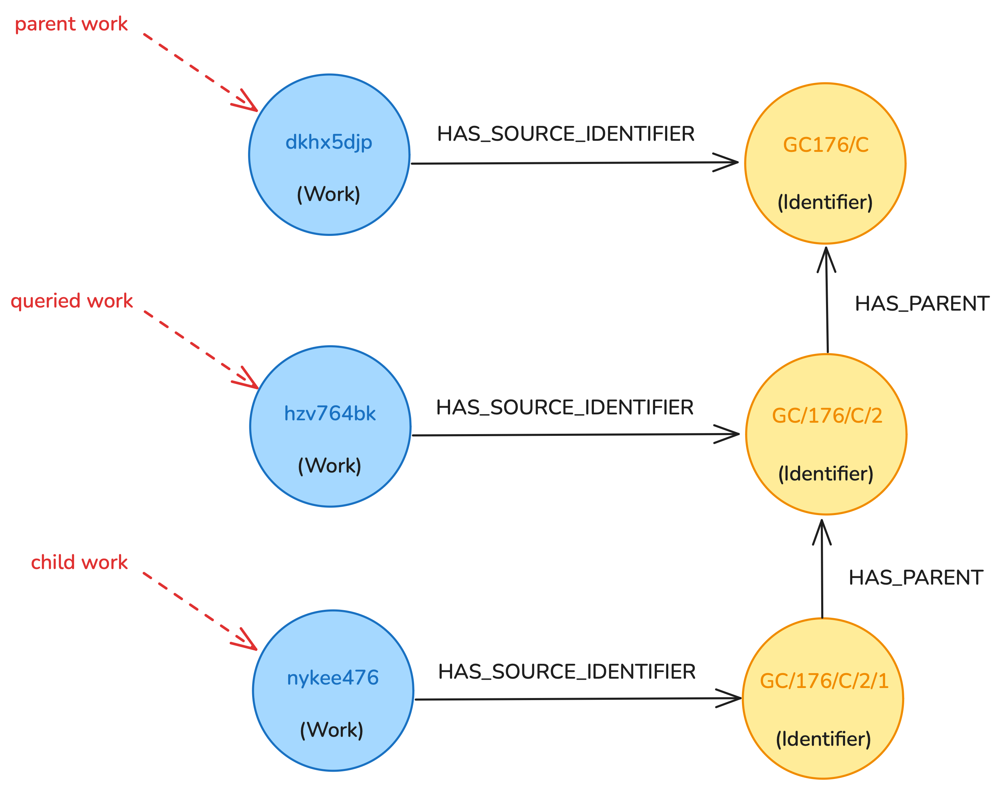

# RFC 076: Integrating the catalogue graph into the works pipeline

## Introduction

The _catalogue graph_ has become an integral part of the catalogue pipeline, allowing us to enrich the production
concepts index with additional metadata and with connections to related concepts. However, due to architectural
constraints, we are currently unable to make full use of the graph. This RFC proposes modifications to catalogue
pipeline architecture, addressing several shortcomings of the current architecture and allowing us to enrich the
production works index in the same way as the concepts index.

## Current catalogue pipeline architecture

The current architecture of the catalogue pipeline is captured in Figure 1. At a high level, it consists of several
Scala services communicating via SNS/SQS, utilising Elasticsearch indexes for persistent storage, and ultimately
populating the _final works index_. This is followed by a set of Python services (together referred to as the _concepts
pipeline_) orchestrated via AWS Step Functions and utilising the catalogue graph to populate the _concepts index_.

This architecture comes with several disadvantages which need to be addressed:

1. The catalogue graph is downstream of the final works index, which means we are unable to utilise the graph when
   populating the index and enrich work pages with additional information. Moreover, we are unable to fully
   address a long-running issue with duplicate (synonymous) concepts, causing a disparity between works displayed on
   theme pages (which utilise ID-based filtering and 'merge' duplicate concepts into a single page) and works displayed
   in filtered search (which utilises label-based filtering and does not account for duplicates).
2. The concepts pipeline runs only once per day, which means it can take up to 24 hours for changes to source data to
   propagate to the concepts index. (The works index, on the other hand, is refreshed continuously.)

*Figure 1: A high-level diagram of the current catalogue pipeline architecture*

## Proposed catalogue pipeline architecture

To address the issues outlined above, the following changes are proposed (refer to Figure 2):

* The graph pipeline will be integrated deeper into the catalogue pipeline, extracting data from the denormalised index
  instead of the works snapshot.
* A new works ingestor service will be created based on the same architecture as the concepts ingestor, utilising
  the catalogue graph to populate the final works index and replacing the existing Scala ingestor service.
* The relation embedder subsystem (including the _batcher_ and the _path concatenator_) will be removed.
  Instead, relations between works will be stored in the graph and retrieved via graph queries during ingestion into the
  final works index.

*Figure 2: A high-level diagram of the proposed catalogue pipeline architecture*

### What are the benefits of removing the relation embedder?

The relation embedder subsystem consists of three Scala services which employ graph-like operations to identify work
hierarchies and embed hierarchical relationships into each work document. The _path concatenator_ service first
constructs full _collection paths_ of ancestors and descendants of each work. The _batcher_ then collects works
with shared hierarchies for optimisation purposes before passing the resulting groups to the
_relation embedder_, which uses the collection paths to enrich each work document with information about siblings,
parents, and children. A single 'flat' Elasticsearch index is utilised for persistent storage.

Moving this functionality into the catalogue graph would allow for a significantly simpler implementation, consisting of
two steps:

1. In the catalogue graph, an edge would be created between each source identifier and its parent (if a parent exists).
   Performing this step for all works would lead to the creation of complete work hierarchies, replicating the
   functionality of the path concatenator without requiring explicit logic for constructing full collection paths.
2. In the works ingestor, work hierarchies would be retrieved from the graph at query time and denormalised into final
   work documents, replicating the functionality of the relation embedder service.

### How will the catalogue graph allow us to enrich the final works index?

The recently implemented 'More works' section on work pages shows similar works based on shared metadata, such
as subjects or periods. At the moment, this section is populated at page load time by making several API calls
from the frontend.

Populating the works index with the help of the catalogue graph will allow us to add related works to each document
at index time, removing the need for the additional API calls. Furthermore, the graph will allow for more customisable
queries, utilising connections between works, concepts, and external concepts.

### Why not move the graph before matcher/merger?

Like the relation embedder, the matcher/merger subsystem utilises graph operations which could be offloaded on to
the catalogue graph. However, doing so would imply either integrating the existing Scala services into the catalogue
graph or rewriting them in Python, both of which would be involved.

This RFC suggests to keep the matcher/merger intact for now and to integrate its functionality into the catalogue graph
at a later stage. This two-stage approach is more manageable and does not introduce significant overhead over
a one-stage approach.

### What will happen to the final _images_ index?

The production images index is populated independently of the works index and does not involve any of the affected
services.

### How will this address the label vs ID-based filtering issue?

This issue arises from the fact that some concepts which are considered to be synonymous on theme pages are not
considered synonymous on search pages due to having different labels. Populating the works index based on data from
the catalogue graph will allow us to use a single consistent label across all synonymous concepts, removing this
issue without having to switch to ID-based filtering on search pages.

## Incremental mode and full reindex mode

The catalogue pipeline should support two distinct modes — an _incremental mode_, and a _full reindex mode_. When
operating in incremental mode, the pipeline should continuously 'listen to' changes to source works and propagate
them into the production indexes as soon as possible (within tens of minutes at most). Conversely, during a full
reindex, the pipeline should be able to process _all_ works within a short timespan and ingest them into new indexes.

The *works pipeline*, which involves all services up to the final works index, utilises SQS to propagate individual
works through the pipeline. This is ideal when running in incremental mode but suboptimal during a full reindex
(since sending millions of individual messages adds overhead). On the other hand, the *concepts pipeline* utilises
file streaming and bulk graph queries to process large numbers of concepts at once. This approach is optimised for full
reindex mode but unsuitable for incremental mode.

This RFC proposes that all affected services (i.e. all services following the _denormalised index_) add incremental mode
support in addition to the current bulk processing architecture. Bulk processing will continue to be used during
a full reindex, and incremental mode will be utilised during normal operation.

### Full reindex mode

Full reindex operations will be orchestrated by AWS Step Functions, using a single _works pipeline_ state machine. This
state machine will be structured in the same way as existing catalogue pipeline state machines, consisting of three
steps:

1. An _extractor_ will be employed to retrieve work documents from the denormalised index, transform each document into
   nodes and edges to be stored in the graph, and stream the results into Neptune bulk load files.
2. A set of _bulk loaders_ will be triggered to load all nodes and edges into the catalogue graph. As part of this step,
   a [clone](https://docs.aws.amazon.com/neptune/latest/userguide/manage-console-cloning.html) of the catalogue graph
   will be created to keep different versions of the pipeline fully isolated.
3. An _ingestor_ will be used to extract all works from the catalogue graph in chunks, transform them into final work
   documents, and index them into Elasticsearch, with parquet files utilised for intermediate storage.

All _catalogue pipeline_ services preceding the denormalised index will keep their current SQS-based architecture for
now. When running a full reindex, the _works pipeline_ state machine will only be started once the denormalised index
has been fully populated.

### Incremental mode

Incremental mode can be implemented using _time windows_ (pull approach) or by utilising _SQS messages_ (push approach).

A _time window_ approach could utilise the _works pipeline_ step function described in the previous section, scheduled
to run at regular intervals (e.g. every 15 minutes). Each run of the state machine would only
process works which were modified since the previous run (e.g. within the previous 15-minute window), utilising
a _modified time_ filter when querying for works from the denormalised index or from the catalogue graph.

An _SQS-based_ approach could mirror the communication system of existing Scala services, sending SQS messages
corresponding to individual modified works. Messages would be sent from the matcher/merger to the extractor, and from
the extractor to the ingestor.

This RFC suggests using the time window approach due to being easier to implement, sharing the same architecture
as the full reindex mode. The only drawback of this approach is that it is likely to be slower due to a pause in
processing while modified works are waiting for the next scheduled run. However, this pause is relatively short
(7.5 minutes on average if using 15-minute windows), and so the approach still meets the requirement of processing
each work within tens of minutes.

Finally, when operating in incremental mode, the extractor does not need to populate Neptune bulk load files and can
instead insert transformed nodes and edges directly into the graph. This is more efficient as the number of
processed entities will almost always be small.

## Catalogue graph changes

While the catalogue graph already stores works, each node includes only the information necessary for populating the
concepts index. To populate the works index and replace the relation embedder with graph relationships, the structure of
the graph will need to be modified. This RFC proposes the following changes:

* The graph will store _all_ data about each work, becoming a single source of truth for all downstream services. This
  will enable the works ingestor to extract all required data from the graph, as opposed to piecing together data from
  multiple sources.
* Source identifiers (e.g. Sierra identifiers) will be stored as separate nodes. Parent/child relationships between
  identifiers and associations between works and identifiers will be captured as edges (see Figure 3). This is necessary
  to replicate the functionality of the relation embedder.
* All other work data will be stored as properties of work nodes. Nested properties will be stored in stringified JSON
  format.

 

*Figure 3: Hierarchical relationships between works will be captured via dedicated _Identifier_ nodes.*

### Why not break out all nested fields into separate nodes?

Neptune does not support storing nested fields as properties, which means we only have two options when it comes to
storing such fields — we can either store them as stringified JSON properties, or we can extract them into separate
nodes. While the latter option allows for more powerful queries, it comes with performance costs and adds complexity
to the graph pipeline. Therefore, this RFC proposes that all nested fields are stored as stringified properties until
being able to query on them becomes a requirement.

### How do these changes affect performance?

To test the performance implications of the proposed changes, all data was bulk loaded into an experimental version of
the catalogue graph. This included all 3.1 million work nodes, 5 million source identifier nodes, and all corresponding
edges. Creating the necessary CSV bulk load files involved streaming all documents from the denormalised Elasticsearch
index, which took approximately **25 minutes**. Each bulk load took less than 5 minutes, and all 4 bulk loads together
took less than **15 minutes**.

Next, an experimental works ingestor was created to retrieve work data from the graph and construct the necessary
Elasticsearch documents. Visible works were retrieved via a combination of three graph queries (one for retrieving work
nodes, one for retrieving related source identifiers and their parent/child relationships, and one for retrieving
related concepts). Together, these three queries return the necessary data to fully construct documents for
indexing into the final index. The remaining 2 million works (invisible, redirected, and deleted) were retrieved using
a single query (the other two queries are not required since non-visible work documents do not store parent/child
relationships or concepts).

With three ingestor instances running in parallel and a batch size of 20,000 works, data to construct
all 1.17 million visible documents was retrieved in approximately **20 minutes**. All non-visible documents were
retrieved in under **15 minutes**.

These experiments show that the proposed changes would add approximately **1 hour** to the total runtime of the
catalogue pipeline during a full reindex. However, this does not account for time saved by removing the relation
embedder. In addition, the experiments above were conducted outside of our VPC, which likely had a negative impact
on performance.

## Next steps

The modifications suggested in this RFC can be implemented in three steps:

1. Modify the graph pipeline to start extracting data from the denormalised index and to populate the graph with
   complete information about each work (including dedicated _Identifier_ nodes).
2. Rewrite the works ingestor in Python, following the same architecture as the existing concepts ingestor.
3. Add incremental mode support to the graph pipeline and to the works and concepts ingestors.

The resulting architecture will allow us to retire the relation embedder and the Scala works ingestor, simplifying
the pipeline. More importantly, it will make the catalogue graph available to the works ingestor, allowing us to start
enriching work pages with data from the graph and develop a more robust _related works_ feature,
which is currently [implemented on top of existing catalogue API endpoints](./current-logic.md).
