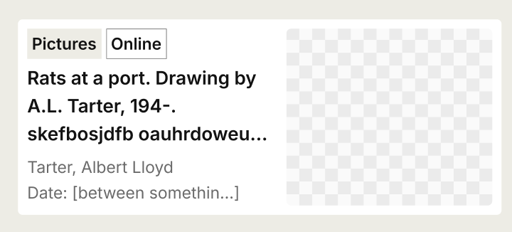
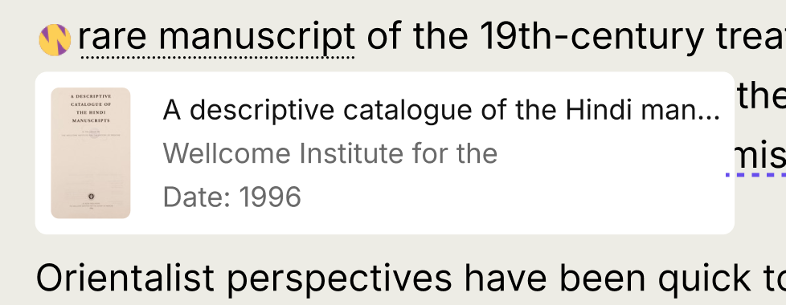

# RFC 077: Content API: Enriching addressable content types with Works data

We'd like to enrich the content pages of our website, i.e. those whose data is retrieved from Prismic, with previews of Works that are linked to within them. This RFC proposes augmenting the [Addressable content types](https://github.com/wellcomecollection/docs/tree/main/rfcs/062-content-api-all-search#addressable-content-types) with Works data and creating a new endpoint for retrieving individual Addressable items, so that we can create the desired UI with a single API call.

**Last modified:** 2025-07-07T15:15:00+00:00

## Table of contents

- [Background information](#background-information)
- [Proposal](#proposal)
- [Integration with the front-end](#integration-with-the-front-end)
- [Alternatives](#alternatives)

## Background information

We wish to provide previews of the Works linked to from our content pages. See ['Works recap in this article (cards at end of article)'](https://github.com/wellcomecollection/wellcomecollection.org/issues/12065) and ['Work links in Prismic content: Preview component'](https://github.com/wellcomecollection/wellcomecollection.org/milestone/86)

The main focus for this work to date has been Stories, but other content types can include links to Works. For example, they currently appear in Exhibitions, Events, Guides, Articles and Pages, and there is nothing preventing them from being added to other Addressable Prismic content types in the future. We'd like to provide the same UI for any content types that include Works links.

We need to:

- Account for all the possible Addressable Prismic content types
- Retrieve the data to display the Work previews with as few requests as possible
- Retrieve only the data necessary to display the Work previews
- Keep using Prismic's preview functionality, so we will still render the main content of the page using Prismic's API

We already have all the [Addressable content types in an Elasticsearch index, which we use for the 'all' search](https://github.com/wellcomecollection/docs/blob/main/rfcs/062-content-api-all-search/README.md).

- We have an `https://api.wellcomecollection.org/content/v0/all/` endpoint which returns a list of Addressable content types.

## Proposal

- Augment the Addressable content types in the elastic search index with data from any Works they reference
- Create a new endpoint for retrieving individual Addressable items

### Proposed model for Work data

We would add a `linkedWorks` property to the `display` property of each of the indexed Addressables. The `linkedWorks` property would contain an array of Works. Each Work would have the following properties populated from the Catalogue API response for the Work:

- `id`: `work.id`
- `title`: `work.title`
- `type`: `work.type`
- `thumbnailUrl`: `work.thumbnail.url`
- `date`: `work.production.flatMap(productionEvent => productionEvent.dates.map(date => date.label))[0]`
- `mainContributor`: `work.contributors.find(contributor => contributor.primary)?.agent.label`
- `workType`: `work.workType.label`
- `isOnline`: `(work.availabilities ?? []).some(({ id }) => id === 'online')`

These are sufficient to render the desired Works previews.

#### Featured in article card:



#### Popup preview card:



#### Query object

We would add an array of the worksIds to the query object to make it possible to look up which Prismic content references a Work.

This will help us with updating the content should a work change and allow us to link from works to Prismic content should we wish to in the future.

```
 query {
  ...
  linkedWorks?: string[]
 }
```

### New endpoint

The new endpoint will be `https://api.wellcomecollection.org/content/v0/all/{id}`

Its response will return:

```json
{
  "type": "Article",
  "id": "Z-FyfxEAACIAwNl_",
  "uid": "waking-the-dead",
  "title": "Waking the dead",
  "linkedWorks": [
    {
      "id": "a2239muq",
      "title": "Ueber den Krebs der Nasenhöhle ... / vorgelegt von Hermann Wolter.",
      "type": "Work",
      "thumbnailUrl": "https://iiif.wellcomecollection.org/thumbs/b30598977_0001.jp2/full/!200,200/0/default.jpg",
      "date": "1900",
      "mainContributor": "Wolter, Hermann (Wilhelm Victor Hermann), 1868-",
      "workType": "Books",
      "isOnline": "true"
    }
  ]
}
```

## Integration with the front-end

The Work previews on the content pages are considered an enhancement and shouldn't prevent the main page content from rendering. A call to the new endpoint for the Work preview data will be made client-side. This will occur on page load if the page includes the Works 'recap' component; otherwise, it will be triggered on the first hover of a Works link. The data will then be available for all Work previews.

How we decide where the 'recap' component lives is tbc. We know we want it on all stories except those with an 'In pictures' format. We need to confirm whether or not we want it on other content types. We'll then need a way on the front end of determining if the page contains links to Works items.

## Alternatives

For completeness, consideration has also been given to:

1. Amending/creating indexes for each of the addressable types and adding the works data into them. This would then be available at `/events/{id}`, `/seasons/{id}`, `/guides/{id}`, etc. (we already have `/events`, for example)
2. Creating an index just for the works data attached to a Prismic ID, which would be available at `/{something}/{id}`

The preferred solution proposed here, i.e. making use of the existing addressables index, seemed the most appropriate extension, without the need to create multiple new indexes and endpoints.
