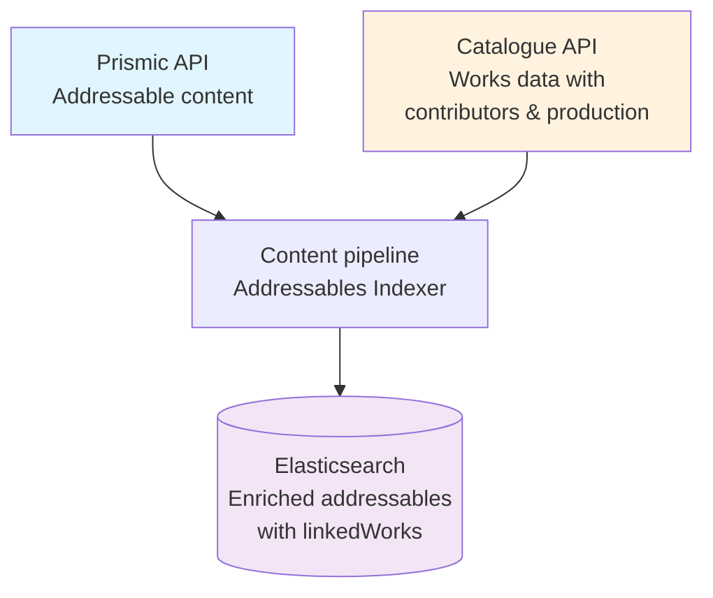
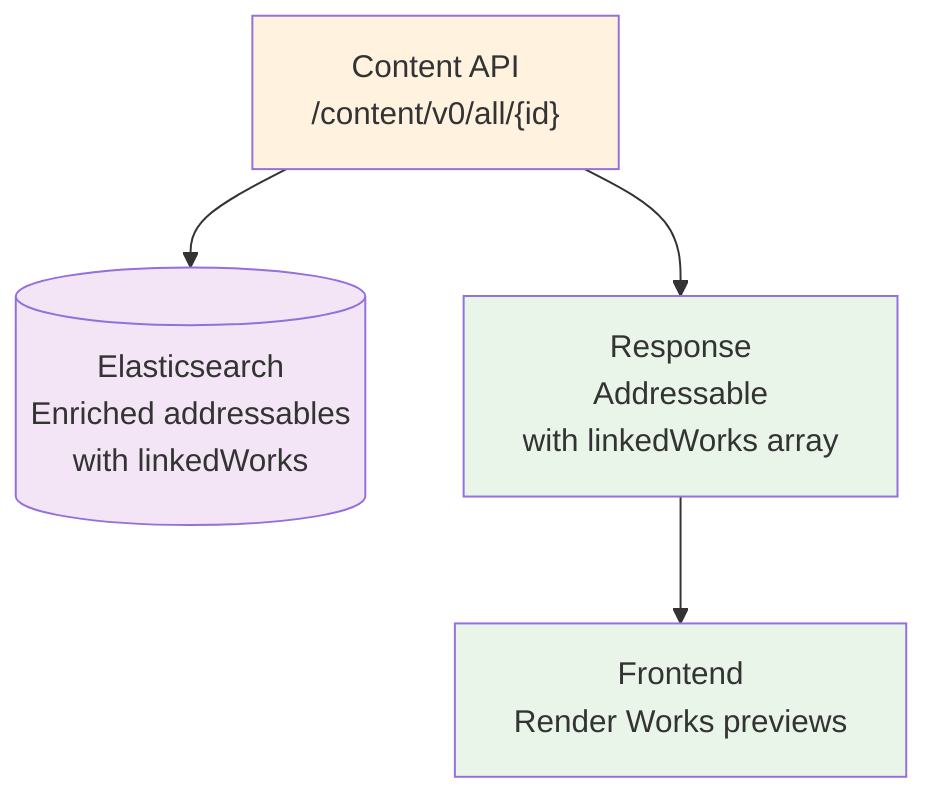
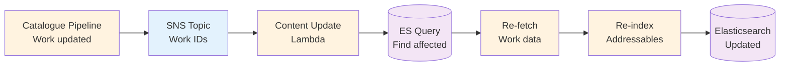

# RFC 077: Content API: Enriching addressable content types with Works data

We'd like to enrich the content pages of our website, i.e. those whose data is retrieved from Prismic, with previews of Works that are linked to within them. This RFC proposes augmenting the [Addressable content types](https://github.com/wellcomecollection/docs/tree/main/rfcs/062-content-api-all-search#addressable-content-types) with Works data and creating a new endpoint for retrieving individual Addressable items, so that we can create the desired UI with a single API call.

**Last modified:** 2025-07-07T15:15:00+00:00

## Table of contents

- [Background information](#background-information)
- [Proposal](#proposal)
- [Integration with the front-end](#integration-with-the-front-end)
- [Alternatives](#alternatives)

## Background information

We wish to provide previews of the Works linked to from our content pages. See ['Works recap in this article (cards at end of article)'](https://github.com/wellcomecollection/wellcomecollection.org/issues/12065) and ['Work links in Prismic content: Preview component'](https://github.com/wellcomecollection/wellcomecollection.org/milestone/86)

The main focus for this work to date has been Stories, but other content types can include links to Works. For example, they currently appear in Exhibitions, Events, Guides, Articles and Pages, and there is nothing preventing them from being added to other Addressable Prismic content types in the future. We'd like to provide the same UI for any content types that include Works links.

We need to:

- Account for all the possible Addressable Prismic content types
- Retrieve the data to display the Work previews with as few requests as possible
- Retrieve only the data necessary to display the Work previews
- Keep using Prismic's preview functionality, so we will still render the main content of the page using Prismic's API

We already have all the [Addressable content types in an Elasticsearch index, which we use for the 'all' search](https://github.com/wellcomecollection/docs/blob/main/rfcs/062-content-api-all-search/README.md).

- We have an `https://api.wellcomecollection.org/content/v0/all/` endpoint which returns a list of Addressable content types.

## Proposal

- Augment the Addressable content types in the elastic search index with data from any Works they reference
- Create a new endpoint for retrieving individual Addressable items

### Data Flow Summary

#### Index Time



1. **Prismic Content** → Extract Work links from Addressable content types
2. **Catalogue API** → Fetch Works data for each linked Work ID
3. **Data Transformation** → Transform addressable and convert Works data to preview format (linkedWorks)
4. **Elasticsearch** → Store transformed Addressable document enriched with Works previews data

#### Retrieval Time



1. **Frontend** → Request specific Addressable content via `/content/v0/all/{id}` clientside
2. **Content API** → Query Elasticsearch for enriched document
3. **Response** → Return Addressable with Works preview data in single call
4. **Frontend Rendering** → Display Works previews

### Proposed model for Work data

We would add a `linkedWorks` property to the `display` property of each of the indexed Addressables. The `linkedWorks` property would contain an array of Works. Each Work would have the following properties populated from the Catalogue API response for the Work:

| Linked work       | Work                                                                                           |
| ----------------- | ---------------------------------------------------------------------------------------------- |
| `id`              | `work.id`                                                                                      |
| `title`           | `work.title`                                                                                   |
| `type`            | `work.type`                                                                                    |
| `thumbnailUrl`    | `work.thumbnail.url`                                                                           |
| `date`            | `work.production.flatMap(productionEvent => productionEvent.dates.map(date => date.label))[0]` |
| `mainContributor` | `work.contributors.find(contributor => contributor.primary)?.agent.label`                      |
| `workType`        | `work.workType.label`                                                                          |
| `isOnline`        | `(work.availabilities ?? []).some(({ id }) => id === 'online')`                                |

These are sufficient to render the desired Works previews.

#### Preview card designs

| Featured in article card | Popup preview card |
|---|---|
|  |  |

#### Query object

We would add an array of the worksIds to the query object to make it possible to look up which Addressable content references a Work. This would allow us to determine if any are impacted by a catalogue Work change and would need need updating.

```
 query {
  ...
  linkedWorks?: string[]
 }
```

### Index mapping changes

To support the `linkedWorks` functionality, we need to update the [current addressables index mapping](https://github.com/wellcomecollection/content-api/blob/main/pipeline/src/indices/addressables.ts) to include a new `linkedWorks` field in the `query` object.

#### Current mapping structure

The current addressables index has the following structure:

- `display`: object with `enabled: false` (stored but not searchable) - this will contain the enriched Works data for the response
- `query`: object with searchable fields like `type`, `title`, `contributors`, `description`, `body`

#### Proposed mapping update

We need to add a `linkedWorks` field to the `query` properties to enable efficient lookup of addressables that reference specific Works:

```typescript
// Addition to the existing query.properties in addressables.ts
query: {
  properties: {
    // ...existing fields (type, title, contributors, description, body)
    linkedWorks: {
      type: 'keyword',
    },
  },
},
```

This change will:

1. **Enable efficient queries** to find all addressables that reference a specific Work ID
2. **Support the update mechanism** described in the "Handling changes to Works" section
3. **Allow reverse linking** for future features like "articles related to this work"

The `linkedWorks` field will contain an array of Work IDs extracted from the Prismic content during indexing. When a Work is updated in the catalogue, we can query this field to find all affected addressables that need re-indexing.

### New endpoint

The new endpoint will be `https://api.wellcomecollection.org/content/v0/all/{id}`

Its response will return:

```json
{
  "type": "Article",
  "id": "Z-FyfxEAACIAwNl_",
  "uid": "waking-the-dead",
  "title": "Waking the dead",
  "linkedWorks": [
    {
      "id": "a2239muq",
      "title": "Ueber den Krebs der Nasenhöhle ... / vorgelegt von Hermann Wolter.",
      "type": "Work",
      "thumbnailUrl": "https://iiif.wellcomecollection.org/thumbs/b30598977_0001.jp2/full/!200,200/0/default.jpg",
      "date": "1900",
      "mainContributor": "Wolter, Hermann (Wilhelm Victor Hermann), 1868-",
      "workType": "Books",
      "isOnline": "true"
    }
  ]
}
```

## Integration with the front-end

The Work previews on the content pages are considered an enhancement and shouldn't prevent the main page content from rendering. A call to the new endpoint for the Work preview data will be made client-side. This will occur on page load if the page includes the Works 'recap' component; otherwise, it will be triggered on the first hover of a Works link. The data will then be available for all Work previews.

How we decide where the 'recap' component lives is tbc. We know we want it on all stories except those with an 'In pictures' format. We need to confirm whether or not we want it on other content types. We'll then need a way on the front end of determining if the page contains links to Works items.

## Handling changes to Works

**We will reindex all addressables on a daily basis (if this proves to be performant), which means the Work data would get updated on the same schedule.**

Should this create performance issues in the future, we would replace this with a mechanism to update the Work data whenever a work is amended or deleted. This would require the following changes:

- The catalogue pipeline to provide a way to publish changed work identifiers (probably SNS) so that this can be listened to by a service that will update the relevant addressables.

- A new service that, when given a changed work identifier, will look up which addressables need updating and perform that update, i.e. re-indexing the addressable document which includes re-fetching and transforming the work data.

It will be possible to look up which addressables are impacted by a catalogue work change because we will be adding the work IDs to query object of the addressables in the index.

### Work Update Flow



1. **Catalogue Pipeline** → Publishes changed Work IDs to SNS topic when Works are updated/deleted
2. **SNS Topic** → Triggers Lambda function with Work ID
3. **Lambda Function** → Queries Elasticsearch to find all Addressables that reference the changed Work
4. **Data Refresh** → Re-fetches updated Work data from Catalogue API
5. **Re-indexing** → Transforms and re-indexes affected Addressable documents with fresh Work data
6. **Elasticsearch** → Contains updated Addressables with current Work information

## Other Benefits

Once this work is done it will be possible to look up which Prismic content references a Work. This would enable us to create links in the other direction, i.e. "articles related to this work" from a Work page.

## Variations

Consideration has also been given to variation to the above approach:

1. Amending/creating indexes for each of the addressable types and adding the works data into them. This would then be available at `/events/{id}`, `/seasons/{id}`, `/guides/{id}`, etc. (we already have `/events`, for example)
2. Creating an index just for the works data attached to a Prismic ID, which would be available at `/{something}/{id}`

The preferred solution proposed here, i.e. making use of the existing addressables index, seemed the most appropriate extension, without the need to create multiple new indexes and endpoints. Also 2) would make it less efficient to implement a preview of the Prismic content from a Work (should we wish to do that), since we would need to fetch the content separately.

## Further alternatives

1. **Client-side fetching**: Make requests to the Catalogue API for each Work separately as needed.

   **Pros:**

   - No update mechanism required since Work data isn't stored

   **Cons:**

   - Multiple API calls required for the recap component (slower user experience)
   - Higher client data usage and processing overhead
   - No reverse linking capability (can't show "articles related to this work" on Work pages)
   - Increased load on the Catalogue API, since we would be requesting the Works on every page load

2. **Server-side fetching on request**: Fetch Works data when the Content API is called and return it in the same response.

   **Pros:**

   - No update mechanism required since Work data isn't stored
   - Single API call from the browser
   - Server-to-server communication reduces latency compared to client-side requests

   **Cons:**

   - Slower Content API response times (must wait for all Catalogue API calls to complete)
   - No reverse linking capability (can't show "articles related to this work" on Work pages)
   - Increased coupling between Content API and Catalogue API
   - Increased load on the Catalogue API, since we would be requesting the Works on every page load

The proposed solution's pre-indexing approach enables faster responses, reverse linking capabilities, and better separation of concerns, but with the added complexity of maintaining data consistency.
