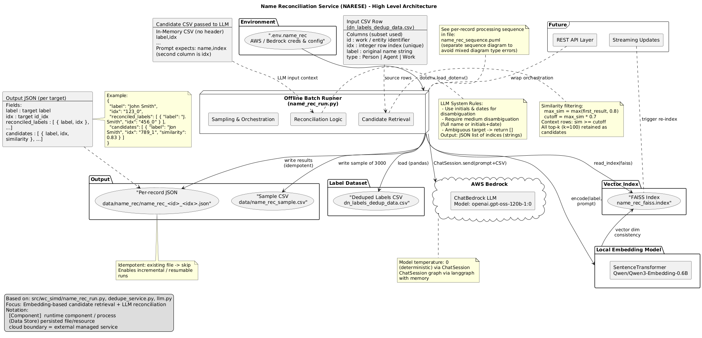
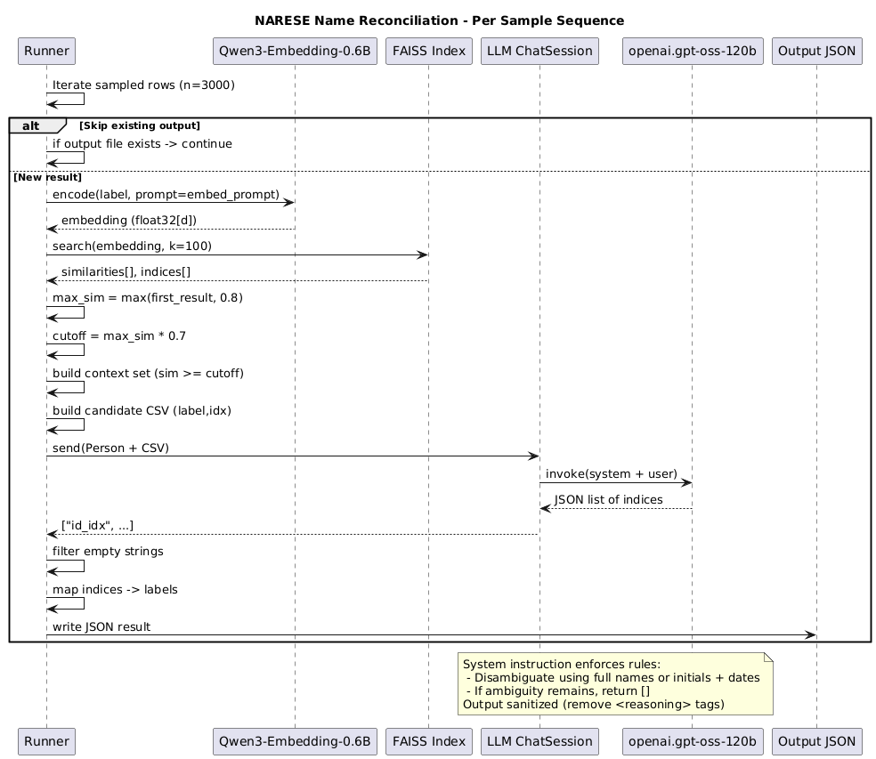
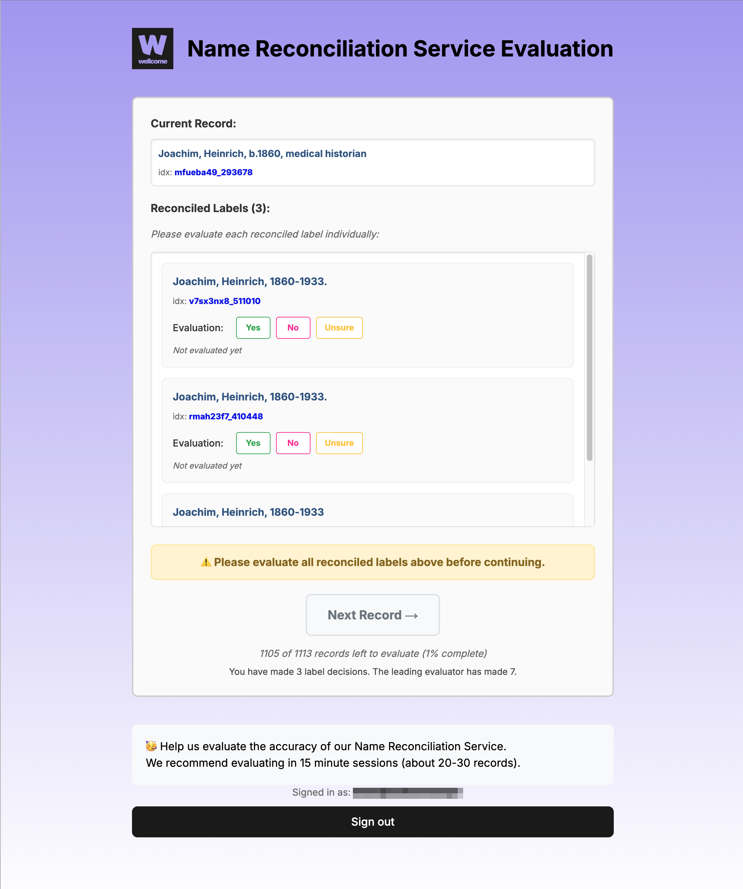
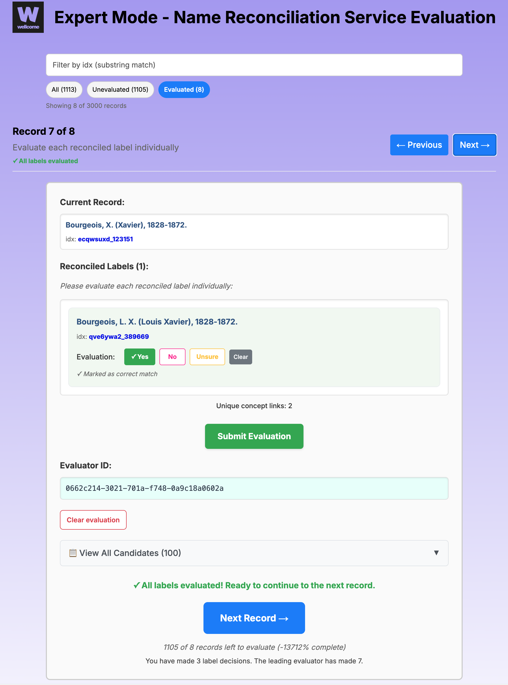
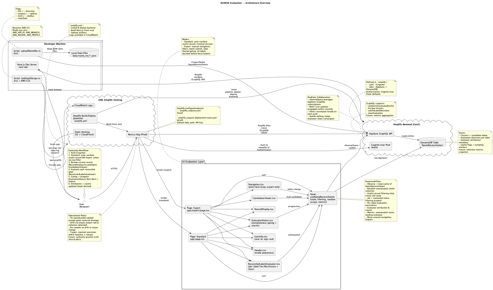

# RFC 078: Name Reconciliation Service (NARESE)

This RFC proposes NARESE, a batch-oriented Name Reconciliation Service that uses embedding-based vector similarity search combined with constrained Large Language Model reasoning to identify and cluster variant textual forms of person and agent names in our Works metadata. The service addresses fragmentation caused by different spellings, initials, and date formats (e.g., "John Smith", "J. Smith", "Smith, John (1870-1932)") by producing machine-generated reconciliation clusters with traceable provenance and confidence tiers, prioritizing precision over recall to maintain data quality trust while improving search relevance, faceting, and downstream enrichment capabilities.

**Last modified:**  2025-09-08T00:00:00Z

## Context

We have many slightly different textual versions of the same person / agent name in our Works metadata (e.g. `John Smith`, `J. Smith`, `Smith, John (1870-1932)`). This fragmentation:

* Lowers search relevance (relevant works are split across variants).
* Makes aggregation, analytics, and future enrichment harder.
* Increases manual effort for curators who need to judge if two labels refer to the same underlying individual.

Existing duplicate detection handles whole-record duplicates, not *name surface form reconciliation*.

### Why It Matters

Better reconciliation improves: user search experience (grouping all works by the same person), data quality (cleaner, more consistent metadata), and downstream enrichment (e.g. linking to authority files, building richer entity graphs). It also lays groundwork for reconciling other entity types later (organisations, places, subjects) using a repeatable pattern.

### Goals

* Produce machine-generated clusters of person/agent name variants with traceable reasoning (provenance + confidence tier).
* Optimise for **precision first** so we avoid incorrect merges that damage trust.
* Be lightweight & incrementally runnable: can resume, can process new data snapshots without redoing validated work.
* Provide a clear outward-facing API contract for future integration once promoted from PoC.

### Non-Goals (Initial Phase)

* Full canonical Person entity graph with persistent new IDs (that is a later, longer-term step).
* Real-time interactive service from day one (initial PoC is batch oriented).
* Reconciliation beyond Person / Agent types (other entity classes are future roadmap).
* Perfect recall; we prefer to miss some hard matches early rather than introduce false merges.

### Proposed Approach

1. For each name label we create an embedding: a numeric representation capturing semantic similarity.
2. We retrieve the top similar candidate labels using a fast local index (FAISS) and apply a simple similarity threshold.
3. A constrained Large Language Model (LLM) is given just those candidates plus concise rules and returns which ones really refer to the same person (or nothing if unsure).
4. We save a small JSON file per processed label containing the decision, candidates, and evidence elements (similarity scores).
5. Later, these JSON outputs are aggregated into clusters and exposed via an API with confidence tiers.

### Option Trade-offs

| Option | Why Not Selected (Primary) | Trade-off Accepted |
|--------|----------------------------|--------------------|
| Train & tune traditional fuzzy / rule system only | Struggles with initials, dates, transliteration nuance; brittle scaling | Slightly higher infra (embeddings + LLM) complexity |
| Cluster *all* names in one global pass (e.g. HDBSCAN) | Hard to tune thresholds globally; no contextual reasoning | Per-label LLM calls add cost but raise precision |
| Larger / hosted embedding model | Higher cost with marginal quality gain for short strings | Smaller model keeps latency & cost low |

### Value Realisation & Success Signals

* Early manual evaluation (“eyeball” review) shows high precision on the non-trivial reconciliation opportunities.
* Reduction in duplicate person facets / improved aggregation in search experiments.
* Stable or improving precision after iterative prompt / threshold changes (monitored with a reproducible sampled set).

### Risks & Mitigations (Plain Language)

| Risk | Impact | Mitigation |
|------|--------|------------|
| Incorrect merges (false positives) | Damaged trust; harder rollback | Precision-first rules, conservative threshold, manual sampled QA |
| Cost creep from many LLM calls | Budget pressure | Cache identical candidate sets, threshold pruning, potential lightweight heuristic pre-filter |
| Lack of ground truth delays quantitative metrics | Slower optimisation | Introduce authority file (VIAF) subset + curator-reviewed gold set |

### Glossary (Quick Read)

* Embedding: Numeric vector capturing similarity of text strings.
* FAISS: A fast library for approximate nearest neighbour search over embeddings.
* LLM: Large Language Model; here used in a tightly scoped, deterministic (temperature 0) judgement role.
* Reconciliation: Deciding multiple text labels refer to the same real-world entity (person/agent).
* Candidate Set: The shortlist of potentially matching names retrieved by similarity search before LLM filtering.

---

## Technical Details

Existing deduplication focuses on record-level duplicate detection but does not reconcile variant surface forms of the same underlying Person/Agent entity at scale. We need a lightweight, incrementally runnable pipeline to propose reconciled clusters of person names with explainable provenance, leveraging recent improvements in embedding retrieval + LLM reasoning, while minimising manual curation load.

### Proposal

Implement a batch-oriented NAme REconciliation SErvice (NARESE) that produces JSON reconciliation artifacts for candidate Person/Agent labels using an enchanced vector search and LLM workflow to make reconcilation judgements (adjudication).

### High-level Flow

1. Load label dataset derived from a snapshot of the Works Denormalised Index (`dn_labels_dedup_data.csv`).
2. Filter to `type in {Person, Agent}`.
3. For each target label:
   * Embed the label with instruction-tuned embedding model (`Qwen/Qwen3-Embedding-0.6B`) using a fixed prompt to stabilise retrieval semantics.
   * Perform vector similarity search (FAISS index `name_rec_faiss.index`, k=100).
   * Compute dynamic cutoff: `cutoff = max(sim0, 0.8) * 0.7`; rows above cutoff form the context set; all k results form the candidate set.
   * Construct a compact CSV (label,idx) passed to an LLM (`ChatBedrock` model `openai.gpt-oss-120b-1:0`) with a system instruction that encodes reconciliation rules.
   * Parse returned JSON list of reconciled indices, map back to labels.
   * Persist result to `data/name_rec/name_rec_<id>_<idx>.json` if not already present (idempotent incremental run behaviour).

> The cutoff multiplier of 0.7 was chosen from empirical observations during experiments to maximize recall while keeping most irrelevant names out.

#### NARESE Architecture Diagram



### Components

* Orchestrator: `name_rec_run.py` (batch driver / resumable loop).
* Embedding Model: SentenceTransformer wrapper (local inference, minimal latency, deterministic prompt).
* Vector Store: FAISS flat index file (pre-built separately; future: pipeline to rebuild on new data ingest).
* LLM Adjudicator: ChatSession abstraction over Bedrock ChatBedrock client (temperature=0) with LangGraph memory (currently unused beyond session scoping).
* Output Artifacts: Per-target JSON containing:

  ```json
  {
    "label": "<target label>",
    "idx": "<WellcomeId>_<FaissIndex>",
    "reconciled_labels": [ { "label": "<matched label>", "idx": "<WellcomeId>_<FaissIndex>" } ],
    "candidates": [ { "label": "<candidate label>", "idx": "<WellcomeId>_<FaissIndex>", "similarity": <float> } ]
  }
  ```

#### NARESE Per Sample Sequence Diagram



* Architecture Diagrams: `docs/name_rec_architecture.puml` (component & data), `docs/name_rec_sequence.puml` (per-record sequence).

### Current PoC vs Target Production

| Aspect | Current PoC | Target Production |
|--------|-------------|-------------------|
| Input Source | Static CSV extracted from *denormalised Elasticsearch works index* (snapshot taken July 2025) -> `dn_labels_dedup_data.csv` | Live incremental feed (stream or periodic export) from canonical Works & Entities stores |
| Execution Mode | Manual batch script (`name_rec_run.py`) sampling ~3000 rows for evaluation | On-demand API + scheduled full refresh job |
| Storage | Per-record JSON files on local filesystem | Durable object storage + backing relational / graph store for clusters |
| Index Refresh | Manual, ad-hoc FAISS build | Automated pipeline with dimension / checksum guard & blue/green swap |
| Reconciliation Engine | Embedding + Bedrock LLM per target | Same core flow with caching, possible lightweight rules model for high-confidence auto matches |
| Monitoring | None | Metrics (latency, success rate, empty cluster ratio) + structured logs + tracing |
| Governance | Developer-only | Product + Data curation review workflow (UI) |

The current PoC validates technical feasibility (semantic retrieval + LLM filtering) using a static July 2025 snapshot. This RFC defines the *production API* that will sit in front of an evolved pipeline able to serve real-time reconciliation queries and batch enrichment.

### Reconciliation Logic (LLM Rule Set)

System prompt enforces:

* Require medium disambiguation level: full name match OR initials + supporting date.
* Initial-based matches without date are low certainty and excluded unless promoted by additional context.
* Ambiguity => return empty list (preference for precision over recall initially).
* Output strict JSON list of `id_idx` strings.

Verbatim Prompts are included in the Appendix below.

### File / Data Contracts

| Artifact | Purpose | Frequency | Notes |
|----------|---------|-----------|-------|
| `dn_labels_dedup_data.csv` | Source label universe (name retains historical 'dedup' misnomer) | Input snapshot | Legacy naming from earlier Dedupe lib prep; NOT a strictly deduplicated set |
| `name_rec_faiss.index` | Embedding ANN search | Rebuilt on data refresh | Must align embedding dimension |
| `data/name_rec_sample.csv` | Quality sampling / manual audit | Each run | 3000-row deterministic sample (seed=420) |
| `data/name_rec/name_rec_*.json` | Reconciliation results | Incremental append | Skip-if-exists enables resumability |

> Samples of the above CSV and JSON are found in the Appendix below.

> The FAISS vector store file for 414,721 records is 1.6 GB in size.

### Quality / Evaluation Strategy

Initial evaluation via:

* Manual spot check of sampled outputs (precision focus).
* Cluster cohesion metric: average intra-cluster cosine similarity vs random baseline.
* False positive guard: monitor proportion of empty reconciliation outputs (too high => overly strict threshold; too low => likely drift).

* Future: Introduce ground truth subset from authority files (VIAF / LC) for sampled F1 (accuracy).

#### Human Eyeball Evaluation Rationale

The PoC and subsequent tuning phases use an *eyeball evaluation* via an Evaluation App.

Approximately 3,000 Person/Agent rows (drawn uniformly at random, seeded for reproducibility) before promoting material logic changes. This size is chosen to achieve an acceptable margin of error for estimating key performance proportions (e.g. proportion of correctly reconciled non-trivial cases) under the following assumptions:

* We treat the evaluation as estimating a binomial proportion (success = reconciliation judged correct & non-trivial, i.e. not an obvious full-text identical variant).
* A preliminary pilot (3000-row inspection) observed roughly 1000 non-trivial reconciliation opportunities (≈36%).

* We target a **95% confidence level** and an absolute **margin of error of ±3 percentage points** for the *non-trivial correctness rate* after filtering obvious cases.

Operational policy:

* Production (full run) is unsampled; sampling is *only* for manual QA / regression inspection.
* Any significant algorithmic change (embedding model swap, similarity cutoff adjustment, LLM prompt revision, introduction of heuristic pre-filters) triggers a fresh 3,000-row eyeball pass before acceptance.
* If observed precision in the *non-trivial* subset remains ≥ the prior accepted baseline within the target margin of error, the change is approved; otherwise iterate.

* A re-sample may also be initiated if monitoring shows drift (e.g. sharp change in proportion of empty reconciliations or candidate distribution shift).

We deliberately avoid larger ad‑hoc samples to reduce evaluator/curator fatigue; future automation (Improved Evaluation/Curator App + partial ground truth) will allow reducing or eliminating manual eyeball passes.

#### NARESE Evaluation App Screenshot



#### NARESE Evaluation App - Expert Mode - Screenshot



#### NARESE Evaluation App Architecture Diagram



### Operational Characteristics

* Pure batch; no service yet. Re-runnable; safe to interrupt (idempotent file emission).
* Deterministic sampling for reproducibility in reviews.
* No PII retention beyond transient in-memory embedding.
* Fails fast if FAISS index absent.

* Bedrock dependency isolated (one model id reference); swappable.

### Extensibility Roadmap

Short-term:

* Add full dataset (non-sampled) execution mode.
* Persist reconciliation confidence tiers (low/medium) instead of binary include/exclude.

* Add optional fuzzy lexical features (edit distance, Jaro-Winkler) pre-LLM to prune trivially unrelated candidates.

Mid-term:

* Build incremental indexer (append-only vector index update pipeline).
* Introduce authority file alignment (VIAF ingest) to seed / validate clusters.

* Provide REST/GraphQL endpoint for on-demand reconciliation resolution.

Long-term:

* Feedback loop with curator validation UI producing reinforcement signals.
* Transition reconciled groups into canonical Person entity graph (new ID space) powering search facet normalisation.

* Multi-lingual expansion (add language-aware transliteration heuristics).

### Production API Specification

This section specifies the external contract to be implemented once the PoC is accepted.

#### Guiding Principles

* Deterministic, idempotent responses for identical requests (modulo data version).
* Precision-first: service returns only medium+ confidence matches by default.
* Transparent confidence & provenance metadata.

* Backwards compatible evolution via versioned path: `/v1/`.

#### Endpoints

1. `GET /v1/health`

* Returns `{ status: "ok", indexVersion: "2025-07-<hash>", model: "Qwen/Qwen3-Embedding-0.6B", dataDate: "2025-07-xx" }`.

1. `GET /v1/reconcile`

* Query params:

  * `q` (required): raw name string.
  * `type` (optional, default `Person`): enum `[Person, Agent]`.
  * `limit` (optional, default 10, max 50): max reconciled labels.
  * `include` (optional): comma list of extra blocks `[candidates,context,debug]`.

* Response (200):

```json
{
  "query": "John Smith",
  "type": "Person",
  "reconciled": [
    {"label": "Smith, John (1870-1932)", "idx": "abcd1234_567", "confidence": "medium"}
  ],
  "candidates": [
    {"label": "J. Smith", "idx": "efgh5678_1234", "similarity": 0.84}
  ],
  "contextVersion": "2025-07-<hash>",
  "latencyMs": 42
}
```

* Errors:

  * 400: missing `q` / invalid param
  * 429: rate limit
  * 503: index loading / degraded mode

1. `POST /v1/reconcile/batch`

* Each item mirrors single response shape plus `position` field.

1. `GET /v1/cluster/{idx}`

* Returns the full reconciled cluster (all members & metadata) anchored at a canonical representative.
* Response adds: `canonicalLabel`, `members`, `evidence` (list citing similarity scores & LLM rationale if stored).

1. `GET /v1/meta/index`

* Operational metadata: `{ "dimension": 1536, "size": 1200341, "builtAt": "2025-07-29T12:00:00Z", "buildId": "abc123" }`.

#### Data Model (Production)

| Field | Description |
|-------|-------------|
| `idx` | Composite identifier `{WellcomeId}_{FaissIndex}` where `WellcomeId` is the underlying work/entity id from source data and `FaissIndex` is the integer position of its embedding in the loaded FAISS index (stable for a given index build) |
| `label` | Original surface form |
| `canonicalLabel` | Selected representative (cluster-level) |
| `confidence` | Confidence tier: `low`, `medium`, `high` |
| `similarity` | Raw vector similarity (float) |
| `version` | Index / data snapshot identifier |
| `evidence` | Optional structured rationale entries |

#### Confidence Derivation (Future)

* Start with rule mapping (e.g. medium if full name match OR initials+date, high if multiple orthographic & date matches, low otherwise but not returned unless explicitly requested via `include=low`).
* Potential addition of logistic calibration model trained on curated pairs.

#### Performance Targets (Initial SLOs)

* P50 < 100ms, P95 < 350ms for `/v1/reconcile` (excluding cold start) with index resident in memory.
* Availability target 99.5% (business hours) Phase 1.
* Error budget tracked on 5xx + malformed 4xx ratio.

#### Rate Limiting & Quotas

* Token bucket per API key (default 10 QPS burst 30).
* Batch endpoint counts each query individually toward quota.

#### Versioning Strategy

* Breaking changes -> new major path `/v2/`.
* Additive fields allowed silently; clients advised to ignore unknown keys.

#### Authentication / Authorization

* Phase 1: API key header `X-API-Key` validated against secrets store.
* Phase 2: Move to OAuth2 client credentials for internal services.

#### Observability

* Structured log per request: requestId, latency, candidateCount, reconciledCount, emptyResult flag, indexVersion.
* Metrics: histogram (latency), counter (errors by code), gauge (index size), ratio (empty / total).
* Trace spans: encode, search, llm_call, assemble_response.

#### Caching

* Memory LRU for recent queries (normalized label) keyed by `(q,type,indexVersion,include)`.
* CDN-friendly `Cache-Control: public, max-age=60` for non-empty responses without debug blocks.

#### Failure Modes

* LLM timeout: 503 with `retryAfter`.
* Index not loaded: 503 with `retryAfter`.

#### OpenAPI (Excerpt)

Illustrative subset (not exhaustive):

```yaml
paths:
  /v1/reconcile:
    get:
      parameters:
        - name: q
          in: query
          required: true
          schema: { type: string }
        - name: type
          in: query
          schema: { type: string, enum: [Person, Agent] }
        - name: limit
          in: query
          schema: { type: integer, minimum: 1, maximum: 50, default: 10 }
      responses:
        '200': { description: OK }
        '400': { description: Bad Request }
  '503': { description: Unavailable }

```

#### Migration Path from PoC

1. Add CLI to emit consolidated cluster file from JSON fragments.
2. Build index build job -> artifact store (S3) with manifest including dimension & checksum.
3. Wrap reconciliation logic in service (FastAPI / Flask) with warm index load.
4. Introduce persistence layer for cluster canonicalisation (optionally Postgres + JSONB for evidence).
5. Add rate limiting & API key gateway.
6. Backfill existing JSON outputs through new service for parity comparison.

## Alternatives considered

1. Python Dedupe library — Fast but brittle; poor recall on variant & transliterated forms. Requires trainng with poor training tools.
2. Direct clustering of all embeddings (HDBSCAN / Agglomerative) — Hard to tune globally; lacks contextual disambiguation (dates / initials) that LLM brings on small candidate sets.
3. Use larger hosted embedding model (e.g. Qwen3-Embedding-8B) — Higher cost, minimal marginal gain for short name strings in pilot phase.

## Impact

Benefits:

* Improves aggregation & relevance for person-based queries.
* Establishes a pattern for hybrid ANN retrieval + LLM constrained reconciliation.
* Produces auditable, human-readable artifacts for review.
* Provides cross-domain opportunity - requires little prompt engineering to reconcile other types of entities (e.g. Organisations, Places and Subjects/Concepts).
* Produces auditable, human-readable artifacts for review.
* Provides cross-domain opportunity - requires little prompt engineering to reconcile other types of entities (e.g. Organisations, Places and Subjects/Concepts).

Risks / Challenges:

* LLM hallucination risk (mitigated by narrow prompt + deterministic temp=0).
* Cutoff heuristic may under-cluster rare names; may need adaptive logic.
* Cost growth if scaled to full corpus frequently (LLM invocation per label).
* Absence of evaluation ground truth initially delays quantitative assurance.
* Cost growth if scaled to full corpus frequently (LLM invocation per label).
* Absence of evaluation ground truth initially delays quantitative assurance.

Mitigations:

* Tight JSON parsing (reject non-list outputs and retry with higher Temperature setting on the LLM).
* Add logging of similarity distributions for dynamic tuning.
* Introduce caching for unchanged candidate sets across runs.
* Add logging of similarity distributions for dynamic tuning.
* Introduce caching for unchanged candidate sets across runs.

## Next steps

1. Add evaluation metrics script to compute basic cluster cohesion metrics over sample.
2. Implement non-sampled full run mode with CLI args (e.g. `--full` / `--limit N`).
3. Add confidence tier annotation to output JSON structure.
4. Integrate authority file (VIAF) bootstrap for a subset and compare overlap.
5. Build FAISS (re)indexing utility & doc (dimension/version guard).
6. Add automated test for JSON schema of reconciliation outputs.
7. Consider architecture decision record (ADR) referencing this RFC once accepted.

## Appendix

### Prompts

```python
embed_prompt = "Instruct: Given a search query that contains a person's name, retrieve relevant passages that mention the same person.\nQuery: "

system_instruction = """# INSTRUCTIONS
You will be given a target name of a person and a CSV string with the following format:

name,index

## Goal
Identify all names in the CSV that can be reconciled to the target name and return their indices.

## Rules
- Take in account initials and dates to disambiguate.
- If there is a match for a full name but no date, we take it that is is disambiguated to a medium degree.
- If the match depends on initials it is disambiguated to a low degree unless there is a date match which makes it a medium degree.
- If the name cannot be disambiguated to a medium degree, do not return the index.
- If the target name is too ambiguous, do not return any indices.

## Output Format
Return a JSON list of indices with the following format:

["idx1", "idx2", ...]
}
"""
```

### Data Samples

#### `dn_labels_dedup_data.csv`

```csv
idx,label,id,type,source
9,"Nelson, Geoffrey B. (Geoffrey Brian)",a223f5a6,Person,contributor
10,"Wolff, G.",a2249bxm,Person,contributor
11,"Jones, John E",a224b9mp,Person,contributor
12,"Jones, John E.",a224b9mp,Person,contributor
13,"Hulverscheidt, Marion, 1970-",a224rx5x,Person,contributor
14,"Zimmermann, Wilhelm.",a224tns9,Person,contributor
```

#### `name_rec_sample.csv`

```csv
idx,label,id,type,source
179619,"Khoo, F. Y.",gdffqkj6,Person,contributor
141893,"Reid, T. Whitehead.",f2cn9e36,Person,contributor
639736,"Walsh, John.",zscc6auu,Person,contributor
444212,"Pulci, Luigi",stsup32k,Person,contributor
532593,"Swieten, Gottfried van",vyrg7p83,Person,contributor
394589,"Crooks, Robert, 1941-",r2wdmtrk,Person,contributor
```

#### `data/name_rec/name_rec_*.json`

```json
{
    "label": "Talbot, Marianne.",
    "idx": "zwfqyva2_643606",
    "reconciled_labels": [
        {
            "label": "Talbot, Marianne.",
            "idx": "zwfqyva2_643606"
        },
        {
            "label": "Talbot, Marianne",
            "idx": "zwfqyva2_643605"
        }
    ],
    "candidates": [
        {
            "label": "Talbot, Marianne.",
            "idx": "zwfqyva2_643606",
            "similarity": 0.8748117685317993
        },
        {
            "label": "Talbot, Mary Anne.",
            "idx": "rgz5xsey_407445",
            "similarity": 0.7381430864334106
        },
        {
            "label": "Talbot, Marianne",
            "idx": "zwfqyva2_643605",
            "similarity": 0.737197995185852
        },
        {
            "label": "Talbot, Catherine",
            "idx": "j9kz5ykj_231954",
            "similarity": 0.6984497904777527
        },
        {
            "label": "Talbot, T. G.",
            "idx": "gh8cx4xe_183128",
            "similarity": 0.691516637802124
        },
        {
            "label": "Talbot, Catherine, 1721-1770",
            "idx": "n3t6xc7s_310846",
            "similarity": 0.6896426677703857
        },
        {
            "label": "Talbot, I. T.",
            "idx": "w79jfb5b_538649",
            "similarity": 0.6891906261444092
        },
        {
            "label": "Talbot, Emma, 1969-",
            "idx": "ghkmv8ah_183424",
            "similarity": 0.6868633031845093
        },
        {
            "label": "Talbot, Sarah",
            "idx": "me48quwa_292144",
            "similarity": 0.6862633228302002
        },
        ...
    ]
}
```
