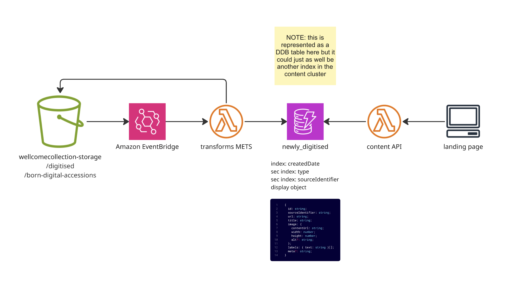

# Showcase recently digitised works on the Collections landing page

**Last modified:** 2025-10-15T10:50:00Z

## Context

> The online collection is continually evolving, primarily through ongoing digitisation efforts, as well as through cataloguing of born-digital works. Users could benefit from knowing what is newly available to view and download online.

See [Notion page](https://www.notion.so/wellcometrust/Showcase-recently-digitised-works-1e06687658a180439819e069fac2601f) for more details.

The [New online component](https://github.com/wellcomecollection/wellcomecollection.org/issues/12303) has been built and uses hard-coded data as a first step. See [Collections landing page](https://wellcomecollection.org/collections).

[`WorkItem`](https://github.com/wellcomecollection/wellcomecollection.org/blob/main/content/webapp/views/components/WorkCard/index.tsx) type expected by the component 

```typescript
type WorkItem = {
  url: string;
  title: string;
  image: {
    contentUrl: string;
    width: number;
    height: number;
    alt?: string;
  };
  labels: { text: string }[];
  partOf?: string;
  contributor?: string;
  date?: string;
};
```

This RFC aims to describe the steps that may be taken to deliver functionality quickly while developing a more robust, long-term and automated solution. 

The first stage is to add "Featured Work" as a content type in Prismic and content-pipeline/API.  
Colleagues required: 
- 1 BE developer (Experience or Platform)
- 1 FE developer (Experience)
- 1 editorial team staff (assuming they will create the Prismic docs)
- 1 content provider (to curate the featured works, eg. Collection Information, Digital Production)

The following stage is to integrate a digital item's `digitisedDate` and `digitisedVersion` into the catalogue-pipeline and API's Work model, as part of the item's [DigitalLocation](https://github.com/wellcomecollection/catalogue-pipeline/blob/53d04e063a75600236ac8ed41934b9c52b451624/common/internal_model/src/main/scala/weco/catalogue/internal_model/locations/Location.scala#L15C12-L15C27).  
Colleagues required:
- 1 BE developer (Platform)
- 1 FE developer (Experience)


## 1. New Prismic Custom Type ingested by the content pipeline and available through the content API

Create an additional [ETL pipeline](https://github.com/wellcomecollection/content-api/blob/6e9c4ba7285c7ea1b259038a0ccb7ce9f6219da1/pipeline/src/extractTransformLoad.ts#L31) in the content pipeline, to load the new Prismic type ("`featured-work`"?) into an index in the content cluster.

Potential `ElasticsearchFeaturedWork` type.  
No aggreagations or filters required

```typescript
type ElasticsearchFeaturedWork = {
  id: string; // work id 
  display: FeaturedWork;
  query: {
    createdDate: string;
    id: string
    type: string[];
    feature: string; // eg. "new-online", "trending"
  };
};

type FeaturedWork = {
  id: string; // work id 
  url: string;  
  title: string;
  image: {
    contentUrl: string;
    width: number; // can we make this optional?
    height: number; // can we make this optional?
    alt?: string;
  };
  type: string[];
  feature: string; // eg. "new-online", "trending"
  meta?: string;
}
```

On the API side the data is exposed on the `/featured/new-online` endpoint, with optional `to`, `from` and `type` query params.  
Absent query params return `FeaturedWork[]` with the most recent of each of 4 default `types`, with feature="new-online".  
Query params enable flexibility as to the date range and type of `ElasticsearchFeaturedWork` documents returned. 

Pros: 
- integrates into existing infrastructure
- the Prismic Custom Type can be made to fit our needs
- doesn't require code change and deployment to update the works
- control over the types/labels
- control over the cover image

Cons: 
- manually curated content risks getting stale 


## 2. Integrate the digitised date and version in the Work model and the catalogue pipeline.

Pros: 
- No need for manual intervention, the New online items on the landing page will reflect what's actually been recently digitised.
- `digitisedDate` in the Work model enables easier audit for Digital Production team.

Cons: 
- The digitisedDate will not always be strictly accurate: when a work is digitised again, the `CREATEDATE` is that of the latest digitisation. We can mitigate this by only returning documents where `digitisedVersion` is `v1`.
- What do we do for work with advisory? 
- Amending the Work model should not be done lightly 

### METS file - digitised or born-digital

The digitisation date is present in the METS's header, both in digitised and born-digital items.  

**NOTE**: there can be multiple versions of a digital item, each with their respective `CREATEDATE`. Since we extract and transform the most recent version, the `CREATEDATE` will not always be the one when the item was digitised for the first time. 

```xml
  <mets:metsHdr CREATEDATE="2018-04-28T10:33:56Z">
    <mets:agent OTHERTYPE="SOFTWARE" ROLE="CREATOR" TYPE="OTHER">
      <mets:name>Goobi - ugh-3.0-6d40b80 - 06−September−2017</mets:name>
      <mets:note>Goobi</mets:note>
    </mets:agent>
  </mets:metsHdr>
```

### Work model

[`WorkData`](https://github.com/wellcomecollection/catalogue-pipeline/blob/53d04e063a75600236ac8ed41934b9c52b451624/common/internal_model/src/main/scala/weco/catalogue/internal_model/work/Work.scala#L102) contains data common to all types of works that can exist at any stage of the pipeline, including a list of [`Item`](https://github.com/wellcomecollection/catalogue-pipeline/blob/53d04e063a75600236ac8ed41934b9c52b451624/common/internal_model/src/main/scala/weco/catalogue/internal_model/work/Item.scala#L6) and their (in this case, Digital) [`Location`](https://github.com/wellcomecollection/catalogue-pipeline/blob/53d04e063a75600236ac8ed41934b9c52b451624/common/internal_model/src/main/scala/weco/catalogue/internal_model/locations/Location.scala#L15)

`DigitalLocation` extends `Location` and is distinct from `PhysicalLocation`.

```scala
case class DigitalLocation(
  url: String,
  locationType: DigitalLocationType,
  license: Option[License] = None,
  credit: Option[String] = None,
  linkText: Option[String] = None,
  accessConditions: List[AccessCondition] = Nil,
  digitisedDate: Option[String] = None, 🆕
  digitisedVersion: Option[Int] = None 🆕
) extends Location
``` 
### Transformed `display.items`

```json
"items": [
  {
    "identifiers": [],
    "locations": [
      {
        "locationType": {
          "id": "iiif-presentation",
          "label": "IIIF Presentation API",
          "type": "LocationType"
        },
        "url": "https://iiif.wellcomecollection.org/presentation/v2/b30598977",
        "license": {
          "id": "inc",
          "label": "In copyright",
          "url": "http://rightsstatements.org/vocab/InC/1.0/",
          "type": "License"
        },
        "digitisation": {
          "date": "2025-08-19T18:10:40.041562Z",
          "version": 1
        },
        "accessConditions": [
          {
            "method": {
              "id": "view-online",
              "label": "View online",
              "type": "AccessMethod"
            },
            "status": {
              "id": "open",
              "label": "Open",
              "type": "AccessStatus"
            },
            "type": "AccessCondition"
          }
        ],
        "type": "DigitalLocation"
      }
    ],
    "type": "Item"
  }
]
```

### `works-indexed` mapping

```json
{
  "works-indexed-2025-08-14": {
    "mappings": {
      "dynamic": "strict",
      "properties": {
        "aggregatableValues": {},
        "debug": {},
        "display": {
          "type": "object",
          "enabled": false
        },
        "filterableValues": {},
        "query": {
          "properties": {
            "alternativeTitles": {},
            "collectionPath": {},
            "contributors": {},
            "description": {},
            "edition": {},
            "genres": {},
            "id": {},
            "identifiers": {},
            "images": {},
            "items": {
              "properties": {
                "id": {},
                "identifiers": {},
                "shelfmark": {},
                "digitisedDate": { 
                  "type": "date",
                  "format": "date_time" // ISO 8601 format
                },
                "digitisedVersion": {
                  "type": "integer"
                }
              }
            },
            // other existing query properties
          }
        },
        "redirectTarget": {
          "type": "object",
          "dynamic": "false"
        },
        "type": {
          "type": "keyword"
        }
      }
    }
  }
}
```

#### Improve digitisedDate accuracy

We can mitigate the multiple versions issue (see NOTE in METS file section) by extending [`MetsLocation`](https://github.com/wellcomecollection/catalogue-pipeline/blob/53d04e063a75600236ac8ed41934b9c52b451624/pipeline/transformer/transformer_mets/src/main/scala/weco/pipeline/transformer/mets/transformer/MetsData.scala#L71) to include the version.  
This would enable excluding any version > v1 from a "new online" query, and returning only the works that where recently digitised **for the first time**. 

#### Other works with a DigitalLocation

Ebsco and Miro works do not have a digitised date or version. Much like `linkText`, `digitisedDate` and `digitisedVersion` are Options and default to None if not present or applicable.


## Catalogue-api

Once the digitisedDate et digitisedVersion are part of the Work model, the catalogue-api exposes the data through a new path in the [SearchApi](https://github.com/wellcomecollection/catalogue-api/blob/main/search/src/main/scala/weco/api/search/SearchApi.scala).

The path 


## DISCARDED: Separate New digitised service

Newly digitised as another content type in the content API.  
The data is instead harvested from S3 and loaded into a data store (DDB or ES index) for the content API to then serve up in the same way as described above.



### ❓❓❓
Is the data that we need in the METS file?

```typescript
type WorkItem = {
  url: string; // work url, not available
  title: string; // yes, currently transformed in the pipeline
  image: {
    contentUrl: string; 
    // could be 
    // https://iiif.wellcomecollection.org/presentation/v2/{sourceIdentifier}
    // https://iiif.wellcomecollection.org/image/{sourceIdentifier}_0001.jp2/full/630,1024/0/default.jpg (1st image in the presentation)
    width: number;
    height: number;
    alt?: string;
  };
  labels: { text: string }[]; // yes, not currently transformed in the pipeline. May not match the values we want to display, eg. "monograph"
  meta?: string;
};
```

DISCARDED: because the work id is not available in the METS file, so the solution offers no onward journey
In order to include the work id, a request to the catalogue api would be necessary. 