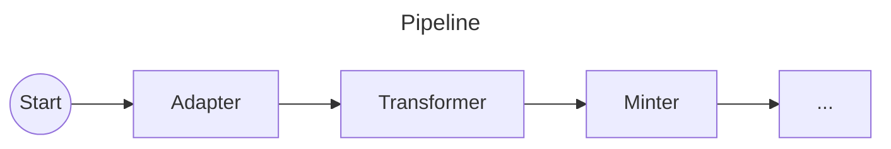
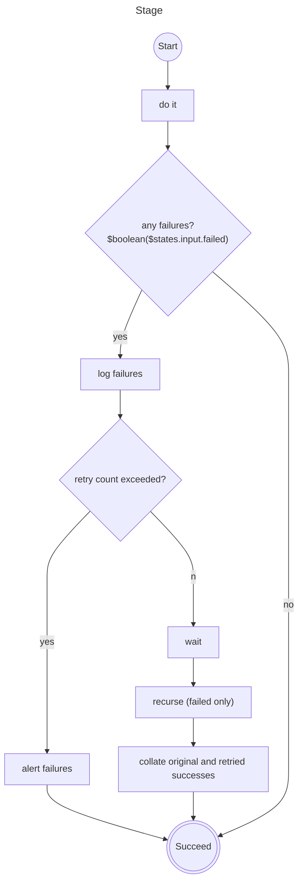
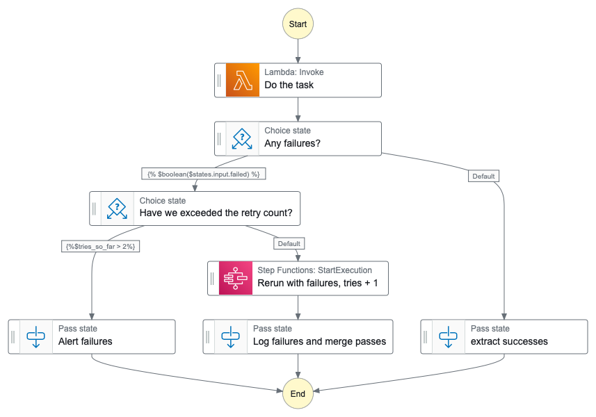

# RFC 079: Handling failures in Python Step Functions

## Summary

Pipeline steps may fail for certain inputs.  Those failures are caught, logged, and retried using
a templated recursive state machine defined for each step.  The overall pipeline is thereby kept clean of 
error handling and can simply describe the happy-path flow of data.

## Scope

This RFC was written to describe failure handling in the Adapter/Transformer section of the pipeline.  However, the approach
determined should be considered as we expand the use of Python/Lambda/Step Functions to the remainder of the pipeline.

## Context

Records are processed in batches (changesets), the size of a batch is not pertinent to this RFC. It may be determined by various
factors such as the size and complexity of the records, the manner in which records are made available from the source
system, and the capacity of the systems we use to process them.

For any given source system, a Step Function runs the Adapter to retrieve a batch of records from the source system, 
the records are stored, the transformer converts them into our common internal format.  The pipeline then continues
to enrich the records.

Transformations are idempotent.  Adapter retrieval should also be idempotent, but this may be subject to the whim of
the source systems.

### The current pipeline

The current pipeline communicates by publishing identifiers singly to SNS/SQS, storing the records in Elasticsearch 
between the steps.  Error handling and retrying is handled by SQS and a Dead Letter Queue. When the DLQ is non-empty
operators are alerted via a Lambda posting to Slack.

### The state of reimplementation

In the currently implemented EBSCO Adapter... ID Minter pipe:

Communication from Adapter to Transformer is by a changeset identifier which is used to find the records in a Parquet table

Communication from Transformer to ID Minter is by ndjson files stored in S3 and signposted in the input argument thus:

```json
{
  "job_id": "test-1",
  "successes": {
    "count": 183713,
    "batch_file_location": {
      "bucket": "wellcomecollection-platform-ebsco-adapter",
      "key": "prod/batches/test-1.ids.ndjson"
    }
  },
  "failures": {
    "count": 2,
    "error_file_location": {
      "bucket": "wellcomecollection-platform-ebsco-adapter",
      "key": "prod/batches/test-1.ids.failures.ndjson"
    }
  }
}
```

JSON Lines have this format

```json
{"sourceIdentifiers": ["Work[ebsco-alt-lookup/ebs28846803e]","Work[ebsco-alt-lookup/ebs28846804e]"],"jobId":"20220927T1800"}
```

## Problem

- Adapters/transformers may fail for transient (e.g. network errors) or permanent reasons (e.g. bad input)
- Failures need to be surfaced, retried if appropriate, and reported in an actionable fashion.
  - Transient errors should be logged and retried
  - Permanent errors should alert
- Records are processed in batches (changesets), a failure of one record should not block the processing of the rest of the batch

## Scenarios

### Success

This is the happy path, everything works first time.

### Total Failure (ephemeral)

An ephemeral total failure may occur if either of the source system or target storage are unavailable

#### Examples

* Given a source system that provides data in response to an HTTP request, the response to that request is a 5xx error.
* When storage being written to is temporarily unavailable or the application otherwise fails while preparing to write the whole batch
* A timeout occurs before the first record is written

### Total Failure (permanent)

A total failure may occur if the data provided by the source system is unreadable 

#### Examples

* Given a source system that provides data in response to an HTTP request, the response to that request is a 4xx error.
* The data provided by the source system is in an unexpected format - e.g. a request asking for xml gets a json response.

### Partial Failure (ephemeral)

Something goes awry when reading or writing an individual record, but other records in the batch are processed correctly.

#### Examples
* The batch takes longer than expected and times out after having written some of the records downstream.

### Partial Failure (permanent)

When an individual record cannot be read or transformed due to unexpected content.

##### Examples
* a record has a field containing an unknown country code.
* messages have been processed out of order, and a record has been deleted.

## General Principles

### Ephemeral failures should be logged but not alerted

Temporary environmental issues happen, and notifying humans whenever a problem occurs would 
be distracting and counterproductive.

However, it is important to know that these failures have occurred, in order to remediate them.
For example, if a service is consistently having to retry, it may indicate that it has been 
underresourced.

### Permanent Failures should be notified as early as possible

It is important that failures are not simply logged and left for someone to stumble upon.
If part of a batch is marked as a permanent failure (i.e. it has exceeded the maximum number of retries)m
then a human should look at it as soon as possible.  This reduces the disconnect between an information 
professional entering data, and that data being rejected.

### Failures should be isolated

If one record in a batch fails, this should  not prevent the others succeeding.  If even one record in a batch is
successful, then that record should be allowed to progress through the pipeline.

### Prefer warnings over failures

If one field in a record contains unexpected data, this should ideally not prevent the record succeeding.
Such problems should be logged within the application and escalated promptly.

This is a preference, not a rule. Errors that are necessarily fatal should still fail.

### Failure is the absence of success

Possible causes of a failure include that an application becomes overwhelmed, times out, or has been misconfigured.
In that scenario, it is possible that it has aborted without writing out a list of failures.

For this reason, we cannot rely on the same process as the writing out of successful records.

In order to produce the failure list, we need to compare the input and the success list.
This may be short-circuited if the success count matches the input count, or if the application
produces a failure list, and the sum of successes and failures matches the input.

### Failures should be recorded for replay

If a failure has been caused by an application error, then there may be significant time and change
between the failure and a fix being implemented.

The actual error may be upstream of where the failure manifests (e.g. a bad transformation means that a
later stage cannot interpret the record correctly).

We need to be able to post the failure list through the pipeline after a fix has been applied.

### Successes should be stored by the application

We cannot rely on passing success/failure lists directly through the payload in a state machine.
If a pipeline lambda raises an exception (e.g. timeout), it can be caught so that the pipeline can continue,
but the lack of return value in that scenario means that any records successfully processed
before the exception would not be known.

### Piping

Each stage in a pipeline only cares about successes from upstream, so there is no need to pass on failures.

Ideally, a stage in a pipeline also does not care where it is in the pipeline, only that the data it wants is available to it.

The pipeline is connected sequence of stages. 

A stage performs the task it is intended for (e.g. transform, merge etc.), and deals with its own error 
handling, retrying, and reporting.

A Pipeline connects those stages using synchronous [StartExecution](https://docs.aws.amazon.com/step-functions/latest/apireference/API_StartExecution.html)
steps.

### Options considered

* Batches are atomic - any failure is a failure of the batch
  * This does not isolate failures
* Use built in retry - any failure and the whole batch is retried
  * Need to track the retry count in order to succeed on the final attempt
  * If an error is caused by a timeout, or overwhelmed system, then it is likely to happen again
* Manual Retries only - Failures are recorded, and we push any failures back through the top
  * This may be a valid step towards an appropriate solution,
  * if failures are rare, this may be sufficient
* Directly calling the Lambda again within the pipeline
  * This adds significant complexity, particularly if multiple retries are required.
  * The same problem of tracking when to succeed in the face of failure as in the built-in retry
* Asynchronous recursion, trigger the step again, but continue anyway
  * This allows the successful works to pass through quickly, while retrying the broken ones.
  * This fragments the initial batch 
    * eventually successful records will be passed separately downstream
    * failures 
  * Extra complexity is required to plumb the recursive call back into the overall pipeline.
* Synchronous recursion, trigger the step again, waiting for completion, and merging results.
  * This could result in delays to successful records, while retrying broken ones
  * This keeps all the eventually successful records from a batch together downstream in the pipeline.
   
### State machine for a pipeline

The pipeline's state machine is only concerned with the orchestration of the pipeline stages.
It is not concerned with detecting, catching or retrying the errors.  It is made up of startExecution steps 
that invoke the state machines for each stage.

This simplifies the definition of that top level


### State machine for a stage

A templated recursive "Run Lambda with monitoring" state machine.

A pipeline step takes the following input:
- A list of things to do (or a key to resolve that list)
    - In the current pipeline, this may be a list of ids or paths. The exact nature of this input is outside the scope of this RFC  
- The number of attempts this batch has made (optional, defaults to zero)

In the case of a partial failure, it invokes itself with the failures and an incremented "try count".

Once the retry count is exceeded, the state machine alerts that some records have failed permanently.



A Sample AWS State Machine version of this flow:



## Further considerations
### Fail Faster
It may be appropriate to distinguish between failures we know 
will never succeed (input is readable but incorrect), and others that might be ephemeral
(a system did not respond as expected).

This would reduce the amount of futile retries, but may add some complexity
as now we would need three states, and application code that would detect the difference.

### Shortcut total failure
When "do it" returns only failures, it is likely that the problem is environmental
and should stop immediately, failing the pipeline.

In a recursive approach, however, the deepest recursion is quite likely to fail with 
some small amount of bad input.  This should not fail, as that would also bubble the 
failure to a level where there were successes.

Consider whether it is appropriate to abort at the top level (tries_so_far=0) 
if there are no successes.

The simplest option may be for a pipeline step to fail if given nothing to do, but 
that places the apparent failure one step downstream of where it happened.

### Determining failures in different stages

The application behind some steps will produce a different list of identifiers
from the input list - e.g. id minter, which produces new ids, or merger, which produces
a different number of outputs to inputs.  