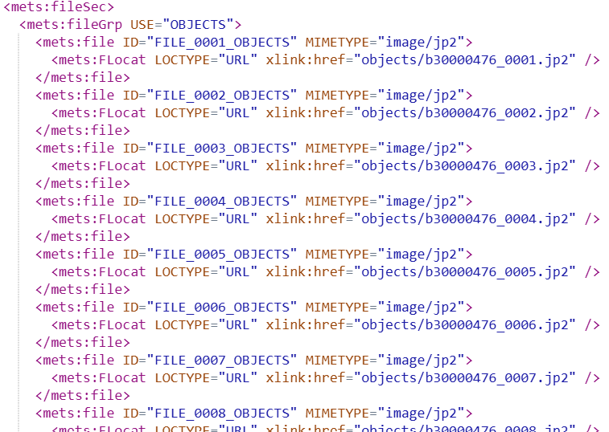

# RFC 085: Identifiers of and within IIIF resources after the migration

Wellcome's published IIIF resource make heavy use of b numbers to generate URIs of resources such as Manifests and Canvases within Manifests. This RFC discusses the implications of the migration to Folio and Axiell Collections; b numbers won't exist in future.
 
**Last modified:** 2026-02-27T17:00+00:00

## Context

Wellcome has until now published IIIF resources at URIs that use b numbers and CALM record IDs to form persistent identifiers for Manifests and Collections. Within Manifests, nested IIIF resources such as Canvases derive their URIs from elements in METS files which in turn derive their identities from filenames. These filenames are typically those of captured JP2s for digitised works, and original file names for born digital items. JP2 filenames until now use b numbers, e.g., the fourth page of a book is b12345678_0004.jp2. This RFC discusses how IIIF resources are handled when b numbers are no longer the bibliographic source identifier. We need to consider what happens to existing IIIF resources as well as new ones introduced after the change.


## Current behaviour

Example canonical IIIF Manifest and Collection URIs:

 - Single volume, b number: [https://iiif.wellcomecollection.org/presentation/b18035978](https://iiif.wellcomecollection.org/presentation/b18035978)
 - IIIF Collection, b number: [https://iiif.wellcomecollection.org/presentation/b30413114](https://iiif.wellcomecollection.org/presentation/b30413114)
 - IIIF Manifest within Collection, ID derived from METS Manifestation: [https://iiif.wellcomecollection.org/presentation/b30413114_0001](https://iiif.wellcomecollection.org/presentation/b30413114_0001)
 - IIIF Manifest, CALM Record ID: [https://iiif.wellcomecollection.org/presentation/SAFIH/B/2/7/9](https://iiif.wellcomecollection.org/presentation/SAFIH/B/2/7/9)

Consider _The Biocrats:_

[https://wellcomecollection.org/works/zjytxny8](https://wellcomecollection.org/works/zjytxny8)

- The catalogue API for this is [https://api.wellcomecollection.org/catalogue/v2/works/zjytxny8](https://api.wellcomecollection.org/catalogue/v2/works/zjytxny8).
- The IIIF Manifest for this is [https://iiif.wellcomecollection.org/presentation/b18035978](https://iiif.wellcomecollection.org/presentation/b18035978)

> _This work was one of the very first test resources the DDS processed, in prototypes all the way back to 2011. It has had a b-number-based URI since then and a b-number-based iiif.wellcomecollection.org URI for nearly a decade._ 

The b number is an artefact of a specific vendor system, in this case Sierra. Wellcome already abstract away this underlying identifier in the Catalogue API, giving everything a Work ID independent of any underlying system and therefore insulating the identity of works from their particular system of record at any one time. The IIIF implementation pre-dates the WorkID. This migration is a chance to align IIIF identity with Work identity.

The situation is different for CALM Record IDs, which represent the archival hierarchy and are intellectually significant in their own right; they would be expected to survive migration of underlying systems. However, they are not necessarily stable; things can be moved around as they are catalogued in more detail, or revisited.

Canonical URIs for _all_ IIIF Collection and Manifest resources **should use the work identifier** rather than the b number (or any other underlying system-specific identifier), so the IIIF Manifest for The Biocrats would be https://iiif.wellcomecollection.org/presentation/zjytxny8. This insulates the public persistent identity of the work from changes in source catalogue identifiers.

This work-id-based link actually works now, and will redirect to the currently-canonical b number. We can flip this around, so that in the new system the redirect is the other way - a link to [https://iiif.wellcomecollection.org/presentation/b18035978](https://iiif.wellcomecollection.org/presentation/b18035978) would now redirect to [https://api.wellcomecollection.org/catalogue/v2/works/zjytxny8](https://api.wellcomecollection.org/catalogue/v2/works/zjytxny8). We swap which one we consider canonical.

### The hard problem - sub-structure

> If a URI is "dereferenceable" we mean it will return a 2xx (or sometimes 3xx) response to an HTTP request. That is, there is something hosted on the web at the other end of it. All resource identifiders in IIIF are HTTPS URIs, for namespacing and linked data purposes. Any IIIF resource `id` _may_ be dereferenceable, but most identified resources within a IIIF Manifest are usually not. Manifests and Collections _MUST_ be (as they are the unit of distribution of IIIF). But Ranges and Canvases usually are not. See [id](https://iiif.io/api/presentation/3.0/#id) in the IIIF Presentation Specification.

If we are just dealing with discrete HTTP-level resources, then the redirect semantics of HTTP **301 Moved Permanently** handles the change of IDs as intended. But for IIIF Presentation resources, the situation is much more complicated. Manifests contain many, many child HTTPS URIs: the `id` values of resources like [Ranges](https://iiif.io/api/presentation/3.0/#54-range) and most importantly, of [Canvases](https://iiif.io/api/presentation/3.0/#53-canvas). These are not necessarily dereferenceable (and at Wellcome, you cannot load a Canvas on its own from its HTTPS URI `id`). Whether or not they are dereferenceable (and therefore redirectable) in any given implementation is irrelevant, however, because a IIIF Client application (a viewer or annotation tool) will use the identifiers in the JSON body of the resource: it _expects_ Manifests to contain their Canvases in their entirety. Even though they have https URIs, they are not _external_ resources (in IIIF terms).

While any IIIF resource might be the `target` of an Annotation, they are usually on Canvases. If someone has transcribed or commented or otherwise made any annotation, in any system, for whatever purpose, where the target is a Canvas within a Wellcome Manifest, that annotation's `target` property uses the published `id` of the Canvas within the Manifest. An example:

```json
{
    "id": "https://iiif.wellcomecollection.org/presentation/b21286437/canvases/b21286437_0145.jp2/classifying/i0",
    "type": "Annotation",
    "motivation": ["commenting"],
    "body": {
        "type": "TextualBody",
        "language": ["en"],
        "value": "This is a picture of a jellyfish"
    },
    "target": "https://iiif.wellcomecollection.org/presentation/b21286437/canvases/b21286437_0145.jp2#xywh=156,1336,1728,1430"
}
```

If this annotation is linked from the Manifest then the short form of the `target` is sufficent, because the client application already has the Canvas loaded. If this annotation were published standalone, an expanded form would be needed, so the client can find the Manifest that the Canvas lives in:

```jsonc
    // ...rest of annotation
    "target": {
        "id": "https://iiif.wellcomecollection.org/presentation/b21286437/canvases/b21286437_0145.jp2#xywh=156,1336,1728,1430",
        "type": "Canvas",
        "partOf": {
             "id": "https://iiif.wellcomecollection.org/presentation/b21286437",
             "type": "Manifest"
        }
    }
```

This chunk of JSON may be held external to Wellcome, out of our control. It targets part of Wellcome's published IIIF linked data. Given the expanded form, a client could load the Manifest and be redirected to the new Manifest URI, but it would still look for a Canvas with `"id": "https://iiif.wellcomecollection.org/presentation/b21286437/canvases/b21286437_0145.jp2"` within the received JSON payload. There's no opportunity for the server to intervene and "redirect" to a new Canvas identity.

The sources of these Canvas identities are filenames in METS:

```xml
<mets:file ID="FILE_0145_OBJECTS" MIMETYPE="image/jp2">
    <mets:FLocat LOCTYPE="URL" xlink:href="objects/b21286437_0145.jp2" />
</mets:file>
```

Simplifying somewhat, we generate a `StorageIdentifier` from the `xlink:href` attribute; this is a path-element safe version of the file path after `/objects` (in this case it's the same as that path, but isn't always). This `xlink:href` attribute also gives us the relative locaton of the file in the storage service, so we can load it into the DLCS from there. The `id` of the image asset in the DDS is derived from its storage location filename. In the IIIF, we generate a Canvas `id` by joining the METS manifestation identifier (a single work may have multiple manifestations) with this storage identifier. Here's the full Canvas from the Manifest, with added comments showing all the places such IDs form part of identifiers, both dereferenceable and non-dereferenceable.

```jsonc
{
    "id": "https://iiif.wellcomecollection.org/presentation/b21286437/canvases/b21286437_0145.jp2",
    "type": "Canvas", // IIIF Resource identifier           ^^^^^^^^^          ^^^^^^^^^^^^^^
    "label": { "none": ["127"] },
    "width": 2234,
    "height": 3410,
    "thumbnail": [
        {
            "id": "https://iiif.wellcomecollection.org/thumbs/b21286437_0145.jp2/full/66,100/0/default.jpg",
            "type": "Image", // DLCS URL (an image)           ^^^^^^^^^^^^^^^^^^
            "width": 66,
            "height": 100,
            "service": [
                {
                    "@id": "https://iiif.wellcomecollection.org/thumbs/b21286437_0145.jp2",
                            // DLCS URL (an image service)           ^^^^^^^^^^^^^^^^^^
                    "@type": "ImageService2",
                    "profile": "http://iiif.io/api/image/2/level0.json",
                    "width": 671,
                    "height": 1024,
                    "sizes": [
                        {"width":66,"height":100},
                        {"width":131,"height":200},
                        {"width":262,"height":400},
                        {"width":671,"height":1024}
                    ]
                }
            ]
        }
    ],
    "seeAlso": [
        {
            "id": "https://api.wellcomecollection.org/text/alto/b21286437/b21286437_0145.jp2",
            // Dereferenceable - ALTO file for this page        ^^^^^^^^^^^^^^^^^^^^^^^^^^^^
            "type": "Dataset",
            "profile": "http://www.loc.gov/standards/alto/v3/alto.xsd",
            "label": {"none":["METS-ALTO XML"]},
            "format": "text/xml"
        }
    ],
    "items": [
    {
        "id": "https://iiif.wellcomecollection.org/presentation/b21286437/canvases/b21286437_0145.jp2/painting",
        // DDS ID  (AnnotationPage URI for this page)           ^^^^^^^^^          ^^^^^^^^^^^^^^^^^^
        "type": "AnnotationPage",
        "items": [
            {
                "id": "https://iiif.wellcomecollection.org/presentation/b21286437/canvases/b21286437_0145.jp2/painting/anno",
                    // DDS ID  (Painting annotation)                    ^^^^^^^^^          ^^^^^^^^^^^^^^^^^^
                "type": "Annotation",
                "motivation": "painting",
                "body": {
                    "id": "https://iiif.wellcomecollection.org/image/b21286437_0145.jp2/full/671,1024/0/default.jpg",
                    "type": "Image", // DLCS URL (an image)          ^^^^^^^^^^^^^^^^^^
                    "width": 671,
                    "height": 1024,
                    "format": "image/jpeg",
                    "service": [
                        {
                            "@id": "https://iiif.wellcomecollection.org/image/b21286437_0145.jp2",
                                     // DLCS URL (an image service)           ^^^^^^^^^^^^^^^^^^
                            "@type": "ImageService2",
                            "profile": "http://iiif.io/api/image/2/level1.json",
                            "width": 2234,
                            "height": 3410
                        }
                    ]
                },
                "target": "https://iiif.wellcomecollection.org/presentation/b21286437/canvases/b21286437_0145.jp2"
                    // Canvas repeated as target                            ^^^^^^^^^          ^^^^^^^^^^^^^^
            }
        ]
    }
    ],
    "annotations": [
        {
            "id": "https://iiif.wellcomecollection.org/annotations/v3/b21286437/b21286437_0145.jp2/line",
                // Dereferenceable - full text annotations            ^^^^^^^^^ ^^^^^^^^^^^^^^^^^^
            "type": "AnnotationPage",
            "label": {"en":["Text of page 127"]}
        }
    ]
}
```

Canvases aren't the only IIIF resources to be identified with URIs derived from METS. Given a METS Logical structMap:

```xml
<mets:structMap TYPE="LOGICAL">
<mets:div ADMID="AMD" DMDID="DMDLOG_0000" ID="LOG_0000" LABEL="Elementary text-book of zoology" TYPE="Monograph">
    <mets:div ID="LOG_0001" TYPE="Cover" />
    <mets:div ID="LOG_0002" TYPE="TitlePage" />
    <mets:div ID="LOG_0003" TYPE="Preface" />
    <mets:div ID="LOG_0004" TYPE="TableOfContents" />
</mets:div>
</mets:structMap>
```

...we generate IIIF Ranges using these assigned `ID` attributes:

```json
{
    "structures": [
        {
            "id": "https://iiif.wellcomecollection.org/presentation/b21286437/ranges/LOG_0001",
            "type": "Range",
            "label": {"none":["Cover"]},
            "items": [
                {
                    "id": "https://iiif.wellcomecollection.org/presentation/b21286437/canvases/b21286437_0001.jp2",
                    "type": "Canvas"
                }
            ]
        },
        {
            "id": "https://iiif.wellcomecollection.org/presentation/b21286437/ranges/LOG_0002",
            "type": "Range",
            "label": {"none":["Title Page"]},
            "items": [
                {
                    "id": "https://iiif.wellcomecollection.org/presentation/b21286437/canvases/b21286437_0005.jp2",
                    "type": "Canvas"
                }
            ]
        },
        {
        "id": "https://iiif.wellcomecollection.org/presentation/b21286437/ranges/LOG_0003",
        "type": "Range",
        "label": {"none":["Preface"]},
        "items": [
            {
                "id": "https://iiif.wellcomecollection.org/presentation/b21286437/canvases/b21286437_0009.jp2",
                "type": "Canvas"
            }
        ]
        },
        {
            "id": "https://iiif.wellcomecollection.org/presentation/b21286437/ranges/LOG_0004",
            "type": "Range",
            "label": {"none":["Table of Contents"]},
            "items": [
                {
                    "id": "https://iiif.wellcomecollection.org/presentation/b21286437/canvases/b21286437_0011.jp2",
                    "type": "Canvas"
                }
            ]
        }
    ]
}
```

However, for Goobi at least, the Range identifiers are independent of the work identity. So for these, we are OK.

### Points to note

 - The 60m+ files in the storage service have b-number- or CALM RecordID-based IDs and therefore URIs.
 - There is a clear relationship between:
   - METS xlink:href attributes
   - Storage service locations
   - Canvas identifiers in IIIF resources (and annotations, annotation pages)
   - DLCS-hosted Content (AV, image etc) URIs for digitised and born digital material - image services, AV derivatives and other files. 
 - They all involve b numbers, or CALM Record IDs.


## Persistence of Canvas Identity

As the target of external annotations, Wellcome must endeavour to maintain the identify of Canvas IDs. They must be the same in the redirected Manifest. However, it is not true that Wellcome Canvas IDs are 100% persistent. A reordering, insertion or deletion of images within a digitised book will result in the image files being renamed. Consider these files: 



If we discover that we missed a page, and need to insert a new image in the sequence between b30000476_0003.jp2 and b30000476_0004.jp2, then the current b30000476_0004.jp2 will be renamed b30000476_0005.jp2 and so on to the end of the sequence. Regenerating the manifest will regenerate the Canvas IDs based on filenames, but those IDs for image 4 and beyond no longer correpsond to the same real world page of the digitised book that they did before. Existing annotations targeting those Canvases are no longer targeting the page their creator intended.

This is a definite flaw in the current approach. But it is rare - most images are assigned the correct filename in sequence at initial digitisation, and won't ever change. While there may be some external annotations that now point at the wrong canvas, the vast majority will still be correct and expect to remain correct.

## Proposal

A desirable outcome is that:

 - IIIF Manifests and Collections adopt a work-id-based URI as the canonical URI
 - Any existing published IIIF Manifest or Collection requested on a B-number or CALM recordID-based path will redirect to the work ID
 - Anything already published that uses b-number identifiers for Canvases will continue to use those identifiers, even if a differently-formed filename for the image appears in METS
 - Anything wholly new after some date to be decided, once the new source systems are up and running, can use a different strategy for minting Canvas IDs (discussed below)
 - IIIF Image IDs should still be based on the filename, because they are surfacing an actual stored file. While it's true that someone may have bookmarked a particular image service endpoint, the Canvas identity is much more important; there is no obligation for a publisher to maintain the same _images_ or Image Services for a Canvas (they might upgrade them to better quality versions, or might increase the number of formats available).

 This means we might end up, after further edits to a METS file, with something like:

 ```jsonc
 { 
    "id": "https://iiif.wellcomecollection.org/presentation/b21286437/canvases/b21286437_0145.jp2",
    "type": "Canvas",                     // This page was published with this canvas id ^^^^      
    // ....
    "thumbnail": [
        {
            "id": "https://iiif.wellcomecollection.org/thumbs/b21286437_0147.jp2/full/66,100/0/default.jpg",
            "type": "Image"         // But the actual image is now this ^^^^  
            //...
        }
    ]
 }
 ```

 Or, if this is reprocessed in the future:

  ```jsonc
 {                                                      //  |-b-num-|          |-b-num-|
    "id": "https://iiif.wellcomecollection.org/presentation/b21286437/canvases/b21286437_0145.jp2",
    "type": "Canvas",                     // This page was published with this canvas id ^^^^      
    // ....
    "thumbnail": [
        {                                                 //  |--new id--|
            "id": "https://iiif.wellcomecollection.org/thumbs/x123abcd9876_0147.jp2/full/66,100/0/default.jpg",
            "type": "Image"            // But the actual image is now this ^^^^  
            //...
        }
    ]
 }
 ```

However, we don't know yet what will happen to JP2 filenames for a re-processed digitised object coming through Goobi (see _Unknowns_ below).

 - For this to work we need to know, when updating a Manifest, that the image with digest d1 was at the third index position in the sequence, but is now at the fourth
 - The DDS need to start maintaining a map of canvas IDs to digests, so it can maintain the right canvas ID for the right image even if the image's filename changes.
 - The DDS can (perhaps) use the version history of the preserved package. Here is a rare example of an item whose files are made up of more than one version: [https://iiif.wellcomecollection.org/dash/StorageMap/b32843987](https://iiif.wellcomecollection.org/dash/StorageMap/b32843987).
 - The DLCS records one or more digests (checksums, hashes) of every asset. By default it will calculate and store a SHA-256 hash, but will generate hashes by other algorithms on demand. Some Wellcome METS files use SHA-1. This allows the DDS to know if b30000476_0004.jp2 is the same file as it was before.

When editing a Manifest:

- Query for all the images in the DLCS that it already has for that Manifest (based on the string1 metadata value of an asset)
- Match them by digest to the files in the METS file
- If the METS file uses a hashing algorithm that the stored asset does not have, ask the DLCS to generate those values (this is time-consuming but presumably rare)
- Use the stored map of canvas IDs to hashes (or the inmverse map) to allocate existing images in the DLCS to canvases

This will likely need a fairly extensive rewrite of the manifest generation code.


Other dereferenceable resources linked from Manifests:

 - ALTO files per Canvas
 - Line level annotations per Canvas
 - Full text per Manifest
 - Single Annotation Page identifying images, figures and tables, per Manifest
 
Unknowns:

 - What will a Goobi METS file look like for a completely new work that never had a b number?
 - What will a Goobi METS file look like when a workflow is re-run (i.e., an existing METS file is updated)?
 - What happens to existing files in the storage service when a workflow is re-run?
 - 
 - 

## The new strategy for minting Canvas IDs

## Wellcome identity service

The DDS (iiif-builder) currently maintains some information in its database about each METS Manifestation it builds:

[Manifestation.cs](https://github.com/wellcomecollection/iiif-builder/blob/main/src/Wellcome.Dds/Wellcome.Dds/Manifestation.cs)

It is this that currently enables the redirect from WorkId to B Number; it stores both. It obtains the WorkId for a b number by querying the catalogue API using the `identifiers` query string parameter.

It also (from [RFC 081](../081-identifiers-in-iiif-builder/README.md)) now has a [DdsIdentity](https://github.com/wellcomecollection/iiif-builder/blob/identity-service-with-db/src/Wellcome.Dds/Wellcome.Dds.Common/DdsIdentity.cs) table which removes assumptions about METS formats and storage locations based on the identifier format.

Neither are these are quite sufficient, especially for work IDs, because this database is not authoritative. 

If WorkIds are to be minted earlier in the process than they are now, _so that they can be used by Goobi and Archivematica_ in place of b numbers, or folio identifiers, then DDS may need them earlier too.

This identity service can only really be at the WorkID level, because although we mint IDs for IIIF Manifests within Multiple Manifestations, the DDS is creating these from Goobi identifiers.

The Identity Service can be queried such that given a string identity, it will return all known current and previous identifiers that match that identity.

```
GET ?q=b18035978
GET ?q=zjytxny8
GET ?q=x123456789abc
```

This payload is not a suggestion for what the API looks like. It might use the same identifier object as the Catalogue API as below, adding the work-identifier itself. This returned list is the same regardless of the query value, so will always include that query value somewhere.

Perhaps the `Identifier` class could have an additional property indicating whether an identifier is obsolete.

```json
[
    {
      "value": "zjytxny8",
      "type": "Identifier",
      "identifierType": {
        "id": "work-identifier",
        "type": "IdentifierType",
        "label": "Work Identifier"
      }
    },
    {
      "value": "x123456789abc",
      "type": "Identifier",
      "identifierType": {
        "id": "folio-identifier",
        "type": "IdentifierType",
        "label": "Folio Identifier"
      }
    },
    {
      "value": "b1653606x",
      "type": "Identifier",
      "identifierType": {
        "id": "sierra-system-number",
        "type": "IdentifierType",
        "label": "Sierra system number"
      }
    },
    {
      "value": "1653606",
      "type": "Identifier",
      "identifierType": {
        "id": "sierra-identifier",
        "type": "IdentifierType",
        "label": "Sierra identifier"
      }
    },
    {
      "value": "0224618156",
      "type": "Identifier",
      "identifierType": {
        "id": "isbn",
        "type": "IdentifierType",
        "label": "International Standard Book Number"
      }
    },
    {
      "value": "b18035978",
      "type": "Identifier",
      "identifierType": {
        "id": "sierra-system-number",
        "type": "IdentifierType",
        "label": "Sierra system number"
      }
    },
    {
      "value": "1803597",
      "type": "Identifier",
      "identifierType": {
        "id": "sierra-identifier",
        "type": "IdentifierType",
        "label": "Sierra identifier"
      }
    }
  ]
```

_A detailed description of the proposed solution, including any relevant technical details, diagrams, or examples._

## Alternatives considered

Allow Canvas IDs to change over time

A discussion of any alternative solutions that were considered, and why they were not chosen.

## Impact

A description of the impact of the proposed solution, including any potential risks or challenges.

## Next steps

A list of next steps for implementing the proposed solution, including any dependencies or prerequisites.


Description

See https://digirati.slack.com/archives/CBT40CMKQ/p1764251298635379Connect your Slack account  for a starting point.

What will the DDS be doing with new works in the future when the sources of truth are Folio and Axiell Collections?

What will it be doing with reprocessed works that exist today?

What does a canonical IIIF resource URI look like in future?

What redirects happen?

How will Canvas IDs and other resources internal to a manifest be persistent?

What might we need from a Wellcome identity service?

What will METS files look like from Goobi and Archivematica in the new world?

how are files named in the storage service?

 

From Jonathan:

 

We agreed that the Work ID becomes the canonical ID in IIIF manifests, this is for all works whether they are bibliographic or archival records.

There will be an identity service (essentially an extension of the ID minter database)  with an API so that the existing manifests (anywhere which use B Numbers) will continue to work

When something was created before the Sierra/Folio cut-over (i.e. if it is likely to have a manifest with a b number) the ID service will be needed to use the previous identity if it is being reprocessed for whatever reason

Tom/Digirati to write an RFC on the above [which I will assume will inform the basis of a work package]
We will write an RFC on the approach to the identity service i.e. what we need to do to expose that DB so that it can be consumed by DLCS

----


Redirect "problem" for IIIF resources.


---

[11:51 AM]Integration tests that verify CanvasIds are the same for pre-cutoff manifests as they were before, even if the manifest id is now the workid
[11:51 AM]workid becomes canonical form for all IIIF (loses the hierarchical CALM version although will still work)
tomcrane  [12:05 PM]
Is it a cutoff date or is it something learned from the id service - whether to use workid or bnumber in canvas generation
(only use legacy canvas ids for b nums and not calm refs)