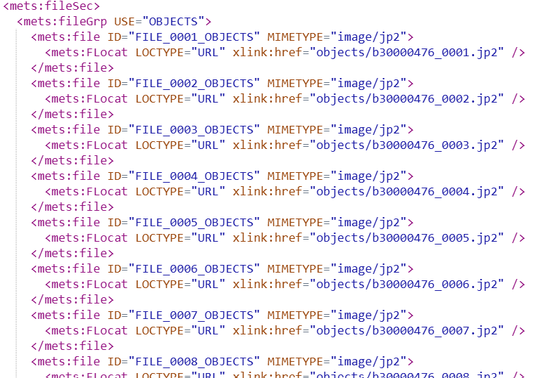

# RFC 085: Identifiers of and within IIIF resources after the migration

Wellcome's published IIIF resources use a combination of system identifiers and the names of preserved files to generate URIs of resources such as Manifests and Canvases within Manifests. For digitised works, the names of stored files are themselves usually determined during digitisation workflow by the system identifier and an ascending sequence, e.g., b18035978_0037.jp2. This RFC discusses the implications of the migration to Folio and Axiell Collections: b numbers won't exist in future.

**Last modified:** 2026-03-02T17:00+00:00

## Context

Wellcome has until now published IIIF resources at URIs that use b numbers and CALM record IDs to form persistent identifiers for Manifests and Collections. Within Manifests, nested IIIF resources such as Canvases derive their URIs from elements in METS files which in turn derive their identities from filenames. These filenames are typically those of captured JP2s for digitised works, and original file names for born digital items. IIIF-Builder (aka the DDS) first encounters asset filenames when it reads METS files produced by Goobi and Archivematica, and it learns about those METS files by receiving messages that include either a Sierra B Number or a CALM Ref No - the _source_ system identifier of a work. JP2 filenames produced during digitisation until now use b numbers, e.g., the fourth page of a book is b12345678_0004.jp2. This RFC discusses how IIIF resources are handled when b numbers are no longer the source identifier. We need to consider what happens to existing IIIF resources as well as new ones created for the first time after the change.

Related: [RFC 083 Stable Identifiers](../083-stable_identifiers/README.md) discusses the relationship between Wellcome canonical IDs (Work ID or Catalogue ID) and how this will work with new _canonical_ source systems.


## Current behaviour

Example canonical IIIF Manifest and Collection URIs:

 - Single volume, b number: [https://iiif.wellcomecollection.org/presentation/b18035978](https://iiif.wellcomecollection.org/presentation/b18035978)
 - IIIF Collection, b number: [https://iiif.wellcomecollection.org/presentation/b30413114](https://iiif.wellcomecollection.org/presentation/b30413114)
 - IIIF Manifest within Collection, ID derived from METS Manifestation: [https://iiif.wellcomecollection.org/presentation/b30413114_0001](https://iiif.wellcomecollection.org/presentation/b30413114_0001)
 - IIIF Manifest, CALM Ref No: [https://iiif.wellcomecollection.org/presentation/SAFIH/B/2/7/9](https://iiif.wellcomecollection.org/presentation/SAFIH/B/2/7/9)

Consider _The Biocrats:_

- The work page is [https://wellcomecollection.org/works/zjytxny8](https://wellcomecollection.org/works/zjytxny8)
- The catalogue API for this is [https://api.wellcomecollection.org/catalogue/v2/works/zjytxny8](https://api.wellcomecollection.org/catalogue/v2/works/zjytxny8).
- The IIIF Manifest for this is [https://iiif.wellcomecollection.org/presentation/b18035978](https://iiif.wellcomecollection.org/presentation/b18035978)

> _This work was one of the very first test resources the DDS processed, in prototypes all the way back to 2011. It has had a b-number-based URI since then and a b-number-based iiif.wellcomecollection.org URI for nearly a decade._ 

The b number is an artefact of a specific vendor system, in this case Sierra. Wellcome already abstracts away this underlying identifier in the Catalogue API, giving everything a Work ID independent of any underlying system and therefore insulating the identity of works from their particular system of record at any one time. The IIIF implementation pre-dates the Work ID. **This move to new systems is a chance to align IIIF identity with Work identity.**

The situation is different for CALM Ref Nos, which represent the archival hierarchy and are intellectually significant in their own right; they would be expected to survive migration of underlying systems. However, they are not necessarily stable; things can be moved around as they are catalogued in more detail, or revisited.

### Use the Work ID

Canonical URIs for _all_ IIIF Collection and Manifest resources **should use the work identifier** rather than the b number, the archival Ref No, the Folio identifier, the Axiell Collections identitifer, or any other future system-specific source identifier. The IIIF Manifest URI for _The Biocrats_ would be https://iiif.wellcomecollection.org/presentation/zjytxny8. This insulates the public persistent identity of the work from changes in source catalogue identifiers. This is only true if the work ID for _The Biocrats_ remains `zjytxny8` after the move to new systems, but this is the proposed behaviour in [RFC 083 Stable Identifiers](../083-stable_identifiers/README.md).

The catalogue-id-based link actually works now, and will redirect to the currently-canonical b number. We will flip this around, so that in the new system the redirect is the other way - a link to [https://iiif.wellcomecollection.org/presentation/b18035978](https://iiif.wellcomecollection.org/presentation/b18035978) would now redirect to [https://iiif.wellcomecollection.org/presentation/zjytxny8](https://iiif.wellcomecollection.org/presentation/zjytxny8). We swap which one we consider canonical.

### The hard problem: Canvas IDs and other internal structure

> If a URI is "dereferenceable" we mean it will return a 2xx (or sometimes 3xx) response to an HTTP request. That is, there is something hosted on the web at the other end of it. All resource identifiers in IIIF are HTTPS URIs, for namespacing and linked data purposes. Any IIIF resource `id` _may_ be dereferenceable, but most identified resources within a IIIF Manifest usually are not. Manifests and Collection URIs _MUST_ be dereferenceable (as they are the unit of distribution of IIIF). But Ranges and Canvases usually are not. See [id](https://iiif.io/api/presentation/3.0/#id) in the IIIF Presentation Specification.

If we are just dealing with discrete HTTP-level resources, then the redirect semantics of HTTP **301 Moved Permanently** handles the change of IDs in the new system as intended. But for IIIF Presentation resources, the situation is much more complicated. Manifests contain many, many child HTTPS URIs: the `id` values of resources like [Ranges](https://iiif.io/api/presentation/3.0/#54-range) and most importantly, of [Canvases](https://iiif.io/api/presentation/3.0/#53-canvas). These are not necessarily dereferenceable (and at Wellcome, you cannot load a Canvas on its own from its HTTPS URI `id`). Whether or not they are dereferenceable (and therefore redirectable) in any given implementation is irrelevant, however, because a IIIF Client application (a viewer or annotation tool) will use the identifiers in the JSON body of the resource: it _expects_ Manifests to contain their Canvases in their entirety. Even though they have https URIs, they are not references to _external_ resources (in IIIF terms).

### Annotation targets 

While any IIIF resource might be the `target` of an [Annotation](https://iiif.io/api/presentation/3.0/#56-annotation), they usually point at Canvases. If someone has transcribed or commented or otherwise made any annotation, in any system, for whatever purpose, where the target is a Canvas within a Wellcome Manifest, that annotation's `target` property uses the published `id` of the Canvas within the Manifest. An example:

```json
{
    "id": "https://example.org/some-other-server/annotations/1234",
    "type": "Annotation",
    "motivation": ["commenting"],
    "body": {
        "type": "TextualBody",
        "language": ["en"],
        "value": "This is a picture of a jellyfish"
    },
    "target": "https://iiif.wellcomecollection.org/presentation/b21286437/canvases/b21286437_0145.jp2#xywh=156,1336,1728,1430"
}
```

If this annotation is linked from the Manifest then the short form of the `target` is sufficient, because the client application already has the Canvas loaded, in scope; it is aware of the manifest in which the Canvas target lives. If this annotation were published standalone, an expanded form is needed, so the client can find the Manifest that the Canvas lives in:

```jsonc
    // ...rest of annotation as above
    "target": {
        "id": "https://iiif.wellcomecollection.org/presentation/b21286437/canvases/b21286437_0145.jp2#xywh=156,1336,1728,1430",
        "type": "Canvas",
        "partOf": {
             "id": "https://iiif.wellcomecollection.org/presentation/b21286437",
             "type": "Manifest"
        }
    }
```

This chunk of JSON may be held external to Wellcome, out of our control. It targets part of Wellcome's published IIIF linked data. Given the expanded form, a client could load the Manifest and be redirected to the new Manifest URI, but it would still look for a Canvas with `"id": "https://iiif.wellcomecollection.org/presentation/b21286437/canvases/b21286437_0145.jp2"` within the received JSON payload. There's no opportunity for the server (the DDS) to intervene and "redirect" to a new Canvas identity. Although they are URIs, a client is just looking for a matching `id` string; there are no HTTP operations happening in the client's traversal of the Manifest.

The sources of these Canvas `id` values are ultimately filenames in METS:

```xml
<mets:file ID="FILE_0145_OBJECTS" MIMETYPE="image/jp2">
    <mets:FLocat LOCTYPE="URL" xlink:href="objects/b21286437_0145.jp2" />
</mets:file>
```

Simplifying somewhat, iiif-builder (aka the DDS) generates a `StorageIdentifier` from the `xlink:href` attribute; this is a path-element safe version of the file path after `objects/` (in this case it's the same as that path, but isn't always). This `xlink:href` attribute also gives us the relative location of the file in the storage service, so we can load it into the DLCS from there. That is, given the location of the stored METS file in S3, we can then find a particular file. The `id` of the image asset in the DDS is derived from its storage location filename. In the IIIF, we generate a Canvas `id` by joining the METS manifestation identifier (a single work may have multiple manifestations) with this storage identifier. Here's a full, **single** Canvas from the Manifest, with added comments showing all the places such IDs form part of identifiers, both dereferenceable and non-dereferenceable.

```jsonc
{
    "id": "https://iiif.wellcomecollection.org/presentation/b21286437/canvases/b21286437_0145.jp2",
    "type": "Canvas", // Canvas id (not deref'able)         ^^^^^^^^^          ^^^^^^^^^^^^^^
    "label": { "none": ["127"] },                       //  METS-level           file-level            
    "width": 2234,
    "height": 3410,
    "thumbnail": [
        {
            "id": "https://iiif.wellcomecollection.org/thumbs/b21286437_0145.jp2/full/66,100/0/default.jpg",
            "type": "Image", // DLCS URL (image deref'able)   ^^^^^^^^^^^^^^^^^^
            "width": 66,
            "height": 100,
            "service": [
                {
                    "@id": "https://iiif.wellcomecollection.org/thumbs/b21286437_0145.jp2",
                            // DLCS URL (image service deref'able)     ^^^^^^^^^^^^^^^^^^
                    "@type": "ImageService2",
                    "profile": "http://iiif.io/api/image/2/level0.json",
                    "width": 671,
                    "height": 1024,
                    "sizes": [
                        {"width":66,"height":100},
                        {"width":131,"height":200},
                        {"width":262,"height":400},
                        {"width":671,"height":1024}
                    ]
                }
            ]
        }
    ],
    "seeAlso": [
        {
            "id": "https://api.wellcomecollection.org/text/alto/b21286437/b21286437_0145.jp2",
            // Dereferenceable - ALTO file for this page        ^^^^^^^^^^^^^^^^^^^^^^^^^^^^
            "type": "Dataset",
            "profile": "http://www.loc.gov/standards/alto/v3/alto.xsd",
            "label": {"none":["METS-ALTO XML"]},
            "format": "text/xml"
        }
    ],
    "items": [
    {
        "id": "https://iiif.wellcomecollection.org/presentation/b21286437/canvases/b21286437_0145.jp2/painting",
        // AnnotationPage URI for this page, not deref'able     ^^^^^^^^^          ^^^^^^^^^^^^^^^^^^
        "type": "AnnotationPage",
        "items": [
            {
                "id": "https://iiif.wellcomecollection.org/presentation/b21286437/canvases/b21286437_0145.jp2/painting/anno",
                    // Painting annotation id, not deref'able           ^^^^^^^^^          ^^^^^^^^^^^^^^^^^^
                "type": "Annotation",
                "motivation": "painting",
                "body": {
                    "id": "https://iiif.wellcomecollection.org/image/b21286437_0145.jp2/full/671,1024/0/default.jpg",
                    "type": "Image", // DLCS URL (image, deref'able) ^^^^^^^^^^^^^^^^^^
                    "width": 671,
                    "height": 1024,
                    "format": "image/jpeg",
                    "service": [
                        {
                            "@id": "https://iiif.wellcomecollection.org/image/b21286437_0145.jp2",
                                     // DLCS (image service, deref'able)      ^^^^^^^^^^^^^^^^^^
                            "@type": "ImageService2",
                            "profile": "http://iiif.io/api/image/2/level1.json",
                            "width": 2234,
                            "height": 3410
                        }
                    ]
                },
                "target": "https://iiif.wellcomecollection.org/presentation/b21286437/canvases/b21286437_0145.jp2"
                    // Canvas repeated as target                            ^^^^^^^^^          ^^^^^^^^^^^^^^
            }
        ]
    }
    ],
    "annotations": [
        {
            "id": "https://iiif.wellcomecollection.org/annotations/v3/b21286437/b21286437_0145.jp2/line",
                // Dereferenceable - full text annotations            ^^^^^^^^^ ^^^^^^^^^^^^^^^^^^
            "type": "AnnotationPage",
            "label": {"en":["Text of page 127"]}
        }
    ]
}
```

### Range IDs are OK

Canvases aren't the only IIIF resources to be identified with URIs derived from METS. Given a METS Logical structMap:

```xml
<mets:structMap TYPE="LOGICAL">
    <mets:div ADMID="AMD" DMDID="DMDLOG_0000" ID="LOG_0000" LABEL="Elementary text-book of zoology" TYPE="Monograph">
        <mets:div ID="LOG_0001" TYPE="Cover" />
        <mets:div ID="LOG_0002" TYPE="TitlePage" />
        <mets:div ID="LOG_0003" TYPE="Preface" />
        <mets:div ID="LOG_0004" TYPE="TableOfContents" />
    </mets:div>
</mets:structMap>
```

...we generate IIIF Ranges using these assigned `ID` attributes:

```json
{
    "structures": [
        {
            "id": "https://iiif.wellcomecollection.org/presentation/b21286437/ranges/LOG_0001",
            "type": "Range",
            "label": {"none":["Cover"]},
            "items": [
                {
                    "id": "https://iiif.wellcomecollection.org/presentation/b21286437/canvases/b21286437_0001.jp2",
                    "type": "Canvas"
                }
            ]
        },
        {
            "id": "https://iiif.wellcomecollection.org/presentation/b21286437/ranges/LOG_0002",
            "type": "Range",
            "label": {"none":["Title Page"]},
            "items": [
                {
                    "id": "https://iiif.wellcomecollection.org/presentation/b21286437/canvases/b21286437_0005.jp2",
                    "type": "Canvas"
                }
            ]
        },
        {
        "id": "https://iiif.wellcomecollection.org/presentation/b21286437/ranges/LOG_0003",
        "type": "Range",
        "label": {"none":["Preface"]},
        "items": [
            {
                "id": "https://iiif.wellcomecollection.org/presentation/b21286437/canvases/b21286437_0009.jp2",
                "type": "Canvas"
            }
        ]
        },
        {
            "id": "https://iiif.wellcomecollection.org/presentation/b21286437/ranges/LOG_0004",
            "type": "Range",
            "label": {"none":["Table of Contents"]},
            "items": [
                {
                    "id": "https://iiif.wellcomecollection.org/presentation/b21286437/canvases/b21286437_0011.jp2",
                    "type": "Canvas"
                }
            ]
        }
    ]
}
```

However, for Goobi at least, the Range identifiers are independent of the work identity. So for these, we are OK.

### Points to note

 - Most of the 60m+ JP2 files in the storage service have b-number-based IDs, and therefore b-number-based DLCS URIs.
 - There is a clear relationship between:
   - METS xlink:href attributes
   - Storage service locations
   - Canvas identifiers in IIIF resources (and annotations, annotation pages)
   - DLCS-hosted Content (AV, image etc) URIs for digitised and born digital material - image services, AV derivatives and other files. 
 - They all involve b numbers, or CALM Refs.


## Persistence of Canvas Identity

As the target of external annotations, Wellcome must endeavour to maintain the identity of Canvas IDs. They must be the same in the redirected Manifest. However, it is not true today that Wellcome Canvas IDs are 100% persistent. A reordering, insertion or deletion of images within a digitised book will result in the image files being renamed. Consider these files: 



If we discover that we missed a page, and need to insert a new image in the sequence between b30000476_0003.jp2 and b30000476_0004.jp2, then the current b30000476_0004.jp2 will be renamed b30000476_0005.jp2 and so on to the end of the sequence. Regenerating the manifest will regenerate the Canvas IDs based on filenames, but those IDs for image 4 and beyond no longer correspond to the same real world page of the digitised book that they did before. Existing annotations targeting those Canvases are no longer targeting the page their creator intended.

This is a definite flaw in the current approach. But it is rare - most images are assigned the correct filename in sequence at initial digitisation, and won't ever change. While there may be some external annotations that now point at the wrong canvas, the vast majority will still be correct and expect to remain correct.

## Proposal

A desirable outcome is that:

 - IIIF Manifests and Collections adopt a work-id-based URI as the canonical URI
 - Any existing published IIIF Manifest or Collection requested on a B-number or CALM recordID-based path will **redirect** to the work ID
 - Anything already published that uses b-number identifiers for Canvases will **continue to use those identifiers**, even if a differently-formed filename for the image appears in METS
 - Anything wholly new after some date to be decided, once the new source systems are up and running, can use a different strategy for minting Canvas IDs (discussed below)
 - IIIF Image IDs should still be based on the filename, because they are surfacing an actual stored file. While it's true that someone may have bookmarked a particular image service endpoint, the Canvas identity is much more important; there is no obligation for a publisher to maintain the same _images_ or IIIF Image Services for a Canvas (they might upgrade them to better quality versions, or might increase the number of formats available).

 This means we might end up, after further edits to a METS file, with something like:

 ```jsonc
 { 
    "id": "https://iiif.wellcomecollection.org/presentation/b21286437/canvases/b21286437_0145.jp2",
    "type": "Canvas",                     // This page was published with this canvas id ^^^^      
    // ....
    "thumbnail": [
        {
            "id": "https://iiif.wellcomecollection.org/thumbs/b21286437_0147.jp2/full/66,100/0/default.jpg",
            "type": "Image"         // But the actual image is now this ^^^^  
            //...
        }
    ]
 }
 ```

 Or, if this is reprocessed in the future:

  ```jsonc
 {                                                      //  |-b-num-|          |-b-num-|
    "id": "https://iiif.wellcomecollection.org/presentation/b21286437/canvases/b21286437_0145.jp2",
    "type": "Canvas",                     // This page was published with this canvas id ^^^^      
    // ....
    "thumbnail": [
        {                                                 //  |--new id--|
            "id": "https://iiif.wellcomecollection.org/thumbs/x123abcd9876_0147.jp2/full/66,100/0/default.jpg",
            "type": "Image"            // But the actual image is now this ^^^^  
            //...
        }
    ]
 }
 ```

However, we don't know yet what will happen to JP2 filenames for a re-processed digitised object coming through Goobi (see _Unknowns_ below).

 - For this to work we need to know, when updating a Manifest, that the image with digest d1 was at the third index position in the sequence, but is now at the fourth
 - The DDS needs to start maintaining a map of canvas IDs to digests, so it can maintain the right canvas ID for the right image even if the image's filename changes.
 - The DDS can (perhaps) use the version history of the preserved package. Here is a rare example of an item whose files are made up of more than one version: [https://iiif.wellcomecollection.org/dash/StorageMap/b32843987](https://iiif.wellcomecollection.org/dash/StorageMap/b32843987).
 - The DLCS needs to start recording one or more digests (checksums, hashes) of every asset. By default it should calculate and store a SHA-256 hash, but will generate hashes by other algorithms on demand (some older Wellcome METS files use SHA-1). This allows the DDS to know if b30000476_0004.jp2 is the same file as it was before, or match files that have moved Canvases.

When editing a Manifest:

- Query for all the images in the DLCS that it already has for that Manifest (based on the [string1](https://dlcs.github.io/public-docs/api-doc/asset/#string1) metadata value of an asset)
- Match them by digest to the files in the METS file
- If the METS file uses a hashing algorithm that the stored asset does not have, ask the DLCS to generate those values (this is time-consuming but presumably rare)
- Use the stored map of canvas IDs to hashes (or the inverse map) to allocate existing images in the DLCS to canvases

This will likely need a fairly extensive rewrite of the manifest generation code in the DDS, and the addition of the origin hash feature to the DLCS.

## Other generated files

IIIF Manifests and Collections are not the only dereferenceable resources the DDS generates. It also generates the following, linked from IIIF Manifests on similarly identifer-based URLs. All of them have internal IDs and also reference the Canvas IDs of the Manifests they are linked from:

 _(all from [b19880212](https://iiif.wellcomecollection.org/presentation/b19880212))_

Per Canvas:

 - ALTO files per Canvas: [https://api.wellcomecollection.org/text/alto/b19880212/b19880212_0089.jp2](https://api.wellcomecollection.org/text/alto/b19880212/b19880212_0089.jp2)
 - Line level annotations per Canvas: [https://iiif.wellcomecollection.org/annotations/v3/b19880212/b19880212_0089.jp2/line](https://iiif.wellcomecollection.org/annotations/v3/b19880212/b19880212_0089.jp2/line)

Per Manifest:

 - Single Annotation Page identifying images, figures and tables, per Manifest: [https://iiif.wellcomecollection.org/annotations/v3/b19880212/images](https://iiif.wellcomecollection.org/annotations/v3/b19880212/images)
 - IIIF Search Service which returns hits targeting Canvases: [https://iiif.wellcomecollection.org/search/v1/b19880212?q=three%20kennels](https://iiif.wellcomecollection.org/search/v1/b19880212?q=three%20kennels)
 
Rendering properties (these have no _internal_ references to worry about, just their URLs)

 - Full text per Manifest: [https://api.wellcomecollection.org/text/v1/b19880212](https://api.wellcomecollection.org/text/v1/b19880212)
 - PDF of Manifest: [https://iiif.wellcomecollection.org/pdf/b19880212](https://iiif.wellcomecollection.org/pdf/b19880212)

## The new strategy for minting Canvas IDs

This should still use the filename as before.
Where the Canvas has _already been published_ it needs to continue using the same Canvas.

This means we need to populate all the hashes of existing assets - which is a good thing anyway. We don't need to calculate the SHA-256 hashes of the origin because the storage service already has this information.

We should write something that can run on spot price instances to churn through the population of this data in the DLCS. 

This gives us a baseline.

However, the strategy is dependent on what a METS file looks like after the change so remains to be decided.

## Wellcome identity service

The DDS (iiif-builder) currently maintains some information in its database about each METS Manifestation it builds:

[Manifestation.cs](https://github.com/wellcomecollection/iiif-builder/blob/main/src/Wellcome.Dds/Wellcome.Dds/Manifestation.cs)

It is this that currently enables the redirect from WorkId to B Number; it stores both. It obtains the WorkId for a b number by querying the catalogue API using the `identifiers` query string parameter.

It also (from [RFC 081](../081-identifiers-in-iiif-builder/README.md)) now has a [DdsIdentity](https://github.com/wellcomecollection/iiif-builder/blob/identity-service-with-db/src/Wellcome.Dds/Wellcome.Dds.Common/DdsIdentity.cs) table which removes assumptions about METS formats and storage locations based on the identifier format.

Neither of these are quite sufficient, especially for work IDs, because this database is **not authoritative** - it keeps track of what it sees but is only populated "in passing".

If WorkIds are to be minted earlier in the process than they are now, _so that they can be used by Goobi and Archivematica_ in place of b numbers, or folio identifiers, then DDS may need them earlier too.

This identity service can only really be at the WorkID level, because although we mint IDs for IIIF Manifests within Multiple Manifestations, the DDS is creating these from Goobi identifiers. There are identifiers unknown to the identity service for _parts of works_ - internal structure, manifestations (volumes), individual files (pages, documents). The identity service is about the identity of semantic information about works - catalogue records - whereas Goobi/Archivematica/DDS need to identify the constituent parts of these digitised or born digital items, below the level of the catalogue record.

The Identity Service can be queried such that given a string identity, it will return all known current and previous identifiers that match that identity.

This corresponds to a query on the _new_ [identifiers table](../083-stable_identifiers/README.md#proposed-schema).

It could have an optional `sourceSystem` qualifier but it would be useful to not always have to know this:

```
GET ?q=b18035978
GET ?q=b18035978&sourceSystem=sierra-system-number  (returns same result)
GET ?q=b18035978&sourceSystem=calm-record-id        (returns no result)
GET ?q=zjytxny8
GET ?q=1234&sourceSystem=axiell-collections-id
```

This payload is not a suggestion for what the API looks like. It might use the same identifier object as the Catalogue API as below, adding the work-identifier itself. This returned list is the same regardless of the query value, so will always include that query value somewhere.

Perhaps the `Identifier` class could have an additional property indicating whether an identifier is obsolete. Or alternatively the caller should know that `sierra-system-number` is obsolete.

```jsonc
[
    {
      "value": "zjytxny8",
      "type": "Identifier",
      "identifierType": {
        "id": "work-identifier", // TODO: what actually is this id?
        "type": "IdentifierType",
        "label": "Work Identifier"
      }
    },
    {
      "value": "f123",
      "type": "Identifier",
      "identifierType": {
        "id": "folio-identifier", // TBC obviously
        "type": "IdentifierType",
        "label": "Folio Identifier"
      }
    },
    {
      "value": "b1653606x",
      "type": "Identifier",
      "identifierType": {
        "id": "sierra-system-number",
        "type": "IdentifierType",
        "label": "Sierra system number"
      }
    },
    {
      "value": "1653606",
      "type": "Identifier",
      "identifierType": {
        "id": "sierra-identifier",
        "type": "IdentifierType",
        "label": "Sierra identifier"
      }
    },
    {
      "value": "0224618156",
      "type": "Identifier",
      "identifierType": {
        "id": "isbn",
        "type": "IdentifierType",
        "label": "International Standard Book Number"
      }
    },
    {
      "value": "b18035978",
      "type": "Identifier",
      "identifierType": {
        "id": "sierra-system-number",
        "type": "IdentifierType",
        "label": "Sierra system number"
      }
    },
    {
      "value": "1803597",
      "type": "Identifier",
      "identifierType": {
        "id": "sierra-identifier",
        "type": "IdentifierType",
        "label": "Sierra identifier"
      }
    }
  ]
```

For items whose authoritative description is currently CALM, the response would be similar except that we'd see `calm-ref-no`, `calm-altref-no` and `calm-record-id` as the values of `identifierType.id`.

> QUESTION: The above response is adapted from the `identifiers` property of a Work in the Catalogue API - which knows about all merged identifiers. Possibly the identity service doesn't know all this.

> QUESTION: What is different about this new identity service? Isn't it the same as [/catalogue/v2/works?identifiers=b18035978&include=identifiers](https://api.wellcomecollection.org/catalogue/v2/works?identifiers=b18035978&include=identifiers)? Perhaps the difference is that it can be called before a Work record is "ready"? This might be the case if identifiers are made available earlier in the workflow.


## Unknowns

 - What will the names of preserved files look like in Goobi-produced METS files? `<mets:file xlink:href="objects/???"></mets:file>`
   1. for revisited existing workflows where no new files are introduced
   2. for revisited existing workflows where at least one new file is introduced
   3. for new workflows (e.g., a book digitised for the first time after the new systems are in place)

 - What will a Goobi METS file look like _in general_ for a completely new work that never had a b number?
 - What will a Goobi METS file look like _in general_ when a workflow is re-run (i.e., an existing METS file is updated)?
 - What do Goobi multiple Manifestations look like? Names of Anchor files and Manifestation files
 - What happens to existing b-number-named files in the storage service when a workflow is re-run?
 - What will Archivematica do?
 - What form of message will be sent by both Goobi and Archivematica to notify the DDS?

This is currently broadcast via SNS and looks like this:

[WorkflowMessage.cs](https://github.com/wellcomecollection/iiif-builder/blob/main/src/Wellcome.Dds/Wellcome.Dds.Common/WorkflowMessage.cs)

```json
{
    "identifier": "b18035978",
    "space": "digitised",
    "origin": "Goobi",
    "timeSent": "2026-03-02T10:26:33.817Z"
}
```

In future `identifier` should probably be the Canonical Work ID, and both Archivematica and Goobi should use it - but do they know it at this point? They would conceivably have to acquire it a lot earlier in their workflows. It would in fact be useful if they recorded it in the METS file, e.g.,

```xml
<mods:recordInfo>

    <!-- currently present in Goobi METS -->
    <mods:recordIdentifier source="gbv-ppn">b22011328</mods:recordIdentifier> 

    <!-- new -->
    <mods:recordIdentifier source="wellcome-canonical">n5vbrxpd</mods:recordIdentifier> 

    <!-- others? -->
</mods:recordInfo>
```

The answers to these questions determine some of the approach we take.

Having the DDS build a map per manifest of canvas ID to the hash of the file on that canvas gives a baseline after which Canvas identity is preserved even if file names change. This is useful even without the move to new systems, although were that move not happening it probably wouldn't be worth doing. With the move, it becomes more important, and in fact becomes crucial if the filenames of **existing** images change to use Folio identifiers. This depends on what Goobi does.

For example if today we have:

```xml
<mets:file ID="FILE_0145_OBJECTS" MIMETYPE="image/jp2">
    <mets:FLocat LOCTYPE="URL" xlink:href="objects/b21286437_0145.jp2" />
</mets:file>
```

and tomorrow this becomes:

```xml
<mets:file ID="FILE_0145_OBJECTS" MIMETYPE="image/jp2">
    <mets:FLocat LOCTYPE="URL" xlink:href="objects/x1234abcd9876_0145.jp2" />
</mets:file>
```

...but they are in fact the same file, then we know what the old canvas was. It would be useful to know what the answers to the three questions at the head of this section are.


## Things we can do without answers

(i.e., without examples of future METS files)

 - Start using a Wellcome Identity Service as the source of truth for identifier relationships
 - Make work ID the canonical form of dereferenceable IIIF resources and have b-number and CALM Ref No forms redirect to canonical (depends on Wellcome Identity Service)
 - Add digest capabilities to DLCS - store multiple digests for assets in an agreed set of hashing algorithms; design the API for CRUD operations
 - Add a "populate on demand" capability to the DDS - if we see that a DLCS asset does not have a digest recorded, then
   - populate the DLCS SHA-256 from the information in the storage service (implies that caller can supply a digest in a special "trust me" mode)
   - Additionally populate alternate digests from METS if the METS does not use SHA-256
 - Add canvas.id => file digest map capability to IIIF-Builder. We would store these in S3 as JSON objects.
 - A new version of Manifest Builder that will preserve the `id` of a Canvas for as long as its corresponding file hash doesn't change
 - Implement a configurable "stability period" - we don't attempt to preserve Canvas identity if the Manifest is less than x days old.
 - Implement a flow initiated by Work ID in the message from Goobi or Archivematica (depends on identity service to find existing resource)
 - Wite integration tests that verify CanvasIds are the same for pre-cutoff manifests as they were before, even if the manifest id is now the Work ID

It's possible that there doesn't need to be a cutoff date after which a new Canvas `id` minting strategy is adopted, and it can be entirely driven by filenames and digests, and it will "just work" when the file names in METS start appearing with Folio identifiers. But we really need to agree on what METS will look like so we know what we will be dealing with.

What might throw a spanner in this is if the Goobi flow renames all the files to use the new ID form, but the image file doesn't change (desirable, we have 60m of them) - but the hash changes because of a minor tag or EXIF metadata change in the JP2.

## Risks

Problem scenario - for the same physical book page:

 - State 1: File is b12345678_0003.jp2, canvas is ...b12345678_0003.jp2
 - Notice a page is missing
 - State 2: File is b12345678_0004.jp2, canvas is ...b12345678_0003.jp2 (because PIDs)
 - Move to Folio
 - Notice another page is missing for which we have no Canvas
 - State 3: File is f987_0004.jp2, canvas is ...f987_0004.jp2 (because file name convention)
 - We end up with b12345678_0004.jp2 and f987_0004.jp2 (i.e., two 0004's)

This is not necessarily a problem but we should do more work on identifying all the things that could happen here, once we know what the METS will look like for the mentioned scenarios, to see if there are any possible Canvas ID collisions, or images ending up on the wrong Canvas. What if a Canvas `id` is not is use in one iteration of a Manifest but is then reintroduced?

What happens when it's not an insertion or deletion but a re-shoot? E.g., b12345678_0001.jp2 was upside down and has been rotated to fix it, but is still b12345678_0001.jp2. This is a different SHA256 hash but it is the same file name, and the same `canvas.id`. 

Are there combinations of insertions, deletions and renamings that lead us into a situation where it's impossible to have the right image (by digest) on the right canvas?


## Alternatives considered

### Allow Canvas IDs to change over time

 - no, want to retain persistent identifiers

### Adopt digest-based naming for Canvases going forwards:

E.g., instead of:

```json
{
    "id": "https://iiif.wellcomecollection.org/presentation/b21286437/canvases/b21286437_0145.jp2",
    "type": "Canvas"
}
```

We have something like:

```json
{
    "id": "https://iiif.wellcomecollection.org/presentation/b21286437/canvases/cb884abeff409fc33fa1c19ebf18453859be129e1adc50bef0b8263c8c8062ad",
    "type": "Canvas"
}
```

- no, would lose clear association with source file - but also tie the canvas identity too closely to the source file.

_A discussion of any alternative solutions that were considered, and why they were not chosen._

## Impact

A description of the impact of the proposed solution, including any potential risks or challenges.

## Next steps

A list of next steps for implementing the proposed solution, including any dependencies or prerequisites.


