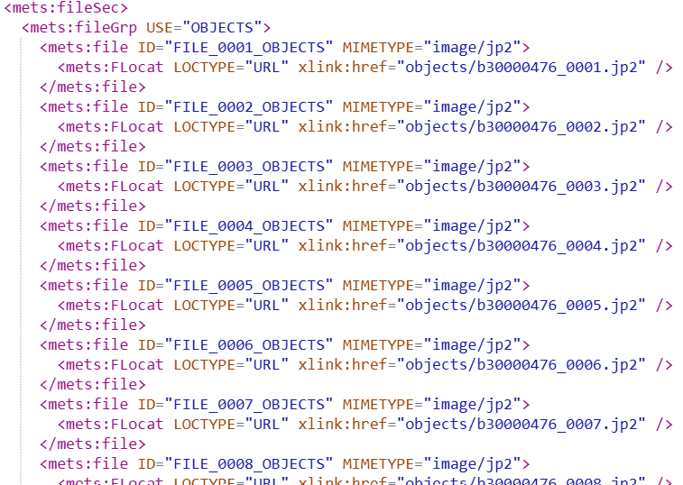

# RFC 085: Identifiers of and within IIIF resources after the migration

Wellcome's published IIIF resources use a combination of system identifiers and the names of preserved files to generate URIs of resources such as Manifests and Canvases within Manifests. For digitised works, the names of stored files are themselves usually determined during digitisation workflow by the system identifier and an ascending sequence, e.g., b18035978_0037.jp2. This RFC discusses the implications of the migration to Folio and Axiell Collections: b numbers won't exist in future.

> **Status note.** An earlier version of this RFC proposed that the catalogue Work ID become the canonical URI for IIIF Manifests and Collections, with b-number and CALM forms redirecting to it. The review discussion on [RFC 091 (PR #159)](https://github.com/wellcomecollection/docs/pull/159) reversed that position: **the preservation identifier stays the canonical IIIF URI, for old and new content alike**, and the Work ID only ever appears as a redirect source. Much of the analysis in the earlier version of this document, in particular the analysis of Canvas IDs and annotation targets, turned out to be the argument *for* that reversal, so it is retained here as the rationale. This version records the agreed direction; amending this RFC is a named deliverable of RFC 091.

**Last modified:** 2026-08-07T14:11:33+00:00

**Related RFCs:**

- [RFC 091: Preservation identifiers across the LMS migration](https://github.com/wellcomecollection/docs/pull/159) (open PR): names the **preservation identifier** concept, records the decision this RFC now aligns with, and sets out the cross-migration and post-migration ingest paths. Where this RFC and RFC 091 cover the same ground, RFC 091 is the decision record for the ingest and pipeline layers; this RFC covers the IIIF and DDS consequences.
- [RFC 089: Identifiers API](../089-identifiers-api/README.md) (merged; [amendment in PR #163](https://github.com/wellcomecollection/docs/pull/163)): the read-only identifier translation service this RFC's earlier version sketched as a "Wellcome identity service". It now exists, with a concrete contract.
- [RFC 083: Stable identifiers](../083-stable_identifiers/README.md) (merged): the predecessor mechanism that keeps an old source identifier resolving to the same canonical Work ID across the migration.
- [RFC 081: Identifiers in iiif-builder](../081-identifiers-in-iiif-builder/README.md) (merged): the DDS's own identity service, which owns digital-object and sub-package identity. Implemented (with a database) in [iiif-builder PR #286](https://github.com/wellcomecollection/iiif-builder/pull/286).

## Purpose

To record the agreed approach to IIIF resource identity across the LMS migration: preservation identifiers remain the canonical URIs for IIIF Manifests and Collections, for old and new content alike, with Work IDs acting only as redirect sources. The RFC retains the analysis that led to this decision — chiefly the behaviour of Canvas IDs and annotation targets — and sets out the consequences for the DDS: the redirect contract, the constraints on the form of new preservation identifiers, sub-package identity, and the persistence of Canvas identity.

## Context

Wellcome has until now published IIIF resources at URIs that use b numbers and CALM record IDs to form persistent identifiers for Manifests and Collections. Within Manifests, nested IIIF resources such as Canvases derive their URIs from elements in METS files which in turn derive their identities from filenames. These filenames are typically those of captured JP2s for digitised works, and original file names for born-digital items. IIIF-Builder (aka the DDS) first encounters asset filenames when it reads METS files produced by Goobi and Archivematica, and it learns about those METS files by receiving messages that include either a Sierra b number or a CALM Ref No — the _source_ system identifier of a work. JP2 filenames produced during digitisation until now use b numbers, e.g., the fourth page of a book is b12345678_0004.jp2. This RFC discusses how IIIF resources are handled when b numbers are no longer the source identifier. We need to consider what happens to existing IIIF resources as well as new ones created for the first time after the change.

RFC 091 gives this identifier role a name: the **preservation identifier**. It is the identifier that Goobi, Archivematica and the storage service share for a digital object. It names the ingest package, the METS file and every sub-asset file (by Goobi in digitised flows); it is the string those systems emit when a workflow finishes; and it is used to form the canonical IIIF Manifest URI. Today it is the b number for digitised content coming through Goobi and the CALM Ref No for born-digital content coming through Archivematica. The role is the same in both cases even though the form differs.

## Current behaviour

Example canonical IIIF Manifest and Collection URIs:

- Single volume, b number: [https://iiif.wellcomecollection.org/presentation/b18035978](https://iiif.wellcomecollection.org/presentation/b18035978)
- IIIF Collection, b number: [https://iiif.wellcomecollection.org/presentation/b30413114](https://iiif.wellcomecollection.org/presentation/b30413114)
- IIIF Manifest within Collection, ID derived from METS Manifestation: [https://iiif.wellcomecollection.org/presentation/b30413114_0001](https://iiif.wellcomecollection.org/presentation/b30413114_0001)
- IIIF Manifest, CALM Ref No: [https://iiif.wellcomecollection.org/presentation/SAFIH/B/2/7/9](https://iiif.wellcomecollection.org/presentation/SAFIH/B/2/7/9)

Consider _The Biocrats:_

- The work page is [https://wellcomecollection.org/works/zjytxny8](https://wellcomecollection.org/works/zjytxny8)
- The catalogue API for this is [https://api.wellcomecollection.org/catalogue/v2/works/zjytxny8](https://api.wellcomecollection.org/catalogue/v2/works/zjytxny8).
- The IIIF Manifest for this is [https://iiif.wellcomecollection.org/presentation/b18035978](https://iiif.wellcomecollection.org/presentation/b18035978)

> _This work was one of the very first test resources the DDS processed, in prototypes all the way back to 2011. It has had a b-number-based URI since then and a b-number-based iiif.wellcomecollection.org URI for nearly a decade._

The b number is an artefact of a specific vendor system, in this case Sierra. Wellcome already abstracts away this underlying identifier in the Catalogue API, giving everything a Work ID independent of any underlying system and therefore insulating the identity of works from their particular system of record at any one time. The IIIF implementation pre-dates the Work ID. This move to new systems looked like a chance to align IIIF identity with Work identity, and that is what this RFC originally proposed. The analysis below explains why we are not going to do that.

The situation is different for CALM Ref Nos, which represent the archival hierarchy and are intellectually significant in their own right; they would be expected to survive migration of underlying systems. However, they are not necessarily stable; things can be moved around as they are catalogued in more detail, or revisited.

### The original proposal: use the Work ID

The earlier version of this RFC proposed that canonical URIs for _all_ IIIF Collection and Manifest resources should use the work identifier rather than the b number, the archival Ref No, the Folio identifier, the Axiell Collections identifier, or any other future system-specific source identifier. The IIIF Manifest URI for _The Biocrats_ would have been https://iiif.wellcomecollection.org/presentation/zjytxny8, and we would have flipped the existing redirect around: a link to [https://iiif.wellcomecollection.org/presentation/b18035978](https://iiif.wellcomecollection.org/presentation/b18035978) would redirect to [https://iiif.wellcomecollection.org/presentation/zjytxny8](https://iiif.wellcomecollection.org/presentation/zjytxny8), swapping which one we consider canonical.

The discussion on [PR #159](https://github.com/wellcomecollection/docs/pull/159) undid this proposal, for three reasons:

1. **The pipeline constraint.** The METS-sourced work in the catalogue pipeline can never be given the public work's canonical id, because the merge that links a digital object to its public work is computed downstream, at merge time, from mutable metadata; its outcome can change when merge rules or the metadata change. Baking a merge-derived id into immutable artefacts — S3 keys, METS filenames, JP2 names — would make permanent object names depend on a mutable join.
2. **Works and digital objects are not _entirely_ 1:1.** A merged work can aggregate multiple storage objects, so Manifest-to-Work was never guaranteed one-to-one. Keeping the id schemes visibly distinct avoids false expectations when merge rules change.
3. **URI consistency.** Canvas IDs, image URIs and annotation targets derive from METS filenames and can never be redirected, because IIIF clients string-match ids inside the JSON rather than dereferencing them. Moving the Manifest URI to the Work ID would rename only the outer URI while everything inside every document keeps the preservation identifier: permanent internal inconsistency, for old and new content alike.

The sections that follow are the "hard problem" analysis from the original version of this RFC, retained because it is reason 3, and because it still governs everything the DDS must do about Canvas identity.

### The hard problem: Canvas IDs and other internal structure

> By "dereferenceable" we mean a URI will return a 2xx (or sometimes 3xx) response to an HTTP request. That is, there is something hosted on the web at the other end of it. All resource identifiers in IIIF are HTTPS URIs, for namespacing and linked data purposes. Any IIIF resource `id` _may_ be dereferenceable, but most identified resources within a IIIF Manifest usually are not. Manifest and Collection URIs _MUST_ be dereferenceable (as they are the unit of distribution of IIIF). But Ranges and Canvases usually are not. See [id](https://iiif.io/api/presentation/3.0/#id) in the IIIF Presentation Specification.

If we are just dealing with discrete HTTP-level resources, then the redirect semantics of HTTP **301 Moved Permanently** handle a change of IDs as intended. But for IIIF Presentation resources, the situation is much more complicated. Manifests contain many, many child HTTPS URIs: the `id` values of resources like [Ranges](https://iiif.io/api/presentation/3.0/#54-range) and most importantly, of [Canvases](https://iiif.io/api/presentation/3.0/#53-canvas). These are not necessarily dereferenceable (and at Wellcome, you cannot load a Canvas on its own from its HTTPS URI `id`). Whether or not they are dereferenceable (and therefore redirectable) in any given implementation is irrelevant, however, because a IIIF Client application (a viewer or annotation tool) will use the identifiers in the JSON body of the resource: it _expects_ Manifests to contain their Canvases in their entirety. Even though they have https URIs, they are not references to _external_ resources (in IIIF terms).

### Annotation targets

While any IIIF resource might be the `target` of an [Annotation](https://iiif.io/api/presentation/3.0/#56-annotation), they usually point at Canvases. If someone has transcribed or commented or otherwise made any annotation, in any system, for whatever purpose, where the target is a Canvas within a Wellcome Manifest, that annotation's `target` property uses the published `id` of the Canvas within the Manifest. An example:

```json
{
    "id": "https://example.org/some-other-server/annotations/1234",
    "type": "Annotation",
    "motivation": ["commenting"],
    "body": {
        "type": "TextualBody",
        "language": ["en"],
        "value": "This is a picture of a jellyfish"
    },
    "target": "https://iiif.wellcomecollection.org/presentation/b21286437/canvases/b21286437_0145.jp2#xywh=156,1336,1728,1430"
}
```

If this annotation is linked from the Manifest then the short form of the `target` is sufficient, because the client application already has the Canvas loaded, in scope; it is aware of the Manifest in which the Canvas target lives. If this annotation were published standalone, an expanded form is needed, so the client can find the Manifest that the Canvas lives in:

```jsonc
    // ...rest of annotation as above
    "target": {
        "id": "https://iiif.wellcomecollection.org/presentation/b21286437/canvases/b21286437_0145.jp2#xywh=156,1336,1728,1430",
        "type": "Canvas",
        "partOf": {
             "id": "https://iiif.wellcomecollection.org/presentation/b21286437",
             "type": "Manifest"
        }
    }
```

This chunk of JSON may be held external to Wellcome, out of our control. It targets part of Wellcome's published IIIF linked data. Given the expanded form, a client could load the Manifest and be redirected to a new Manifest URI, but it would still look for a Canvas with `"id": "https://iiif.wellcomecollection.org/presentation/b21286437/canvases/b21286437_0145.jp2"` within the received JSON payload. There's no opportunity for the server (the DDS) to intervene and "redirect" to a new Canvas identity. Although they are URIs, a client is just looking for a matching `id` string; there are no HTTP operations happening in the client's traversal of the Manifest.

The sources of these Canvas `id` values are ultimately filenames in METS:

```xml
<mets:file ID="FILE_0145_OBJECTS" MIMETYPE="image/jp2">
    <mets:FLocat LOCTYPE="URL" xlink:href="objects/b21286437_0145.jp2" />
</mets:file>
```

Simplifying somewhat, iiif-builder (aka the DDS) generates a `StorageIdentifier` from the `xlink:href` attribute; this is a path-element safe version of the file path after `objects/` (in this case it's the same as that path, but isn't always). This `xlink:href` attribute also gives us the relative location of the file in the storage service, so we can load it into the DLCS from there. That is, given the location of the stored METS file in S3, we can then find a particular file. The `id` of the image asset in the DDS is derived from its storage location filename. In the IIIF, we generate a Canvas `id` by joining the METS manifestation identifier (a single work may have multiple manifestations) with this storage identifier. Here's a full, **single** Canvas from the Manifest, with added comments showing all the places such IDs form part of identifiers, both dereferenceable and non-dereferenceable.

```jsonc
{
    "id": "https://iiif.wellcomecollection.org/presentation/b21286437/canvases/b21286437_0145.jp2",
    "type": "Canvas", // Canvas id (not deref'able)         ^^^^^^^^^          ^^^^^^^^^^^^^^
    "label": { "none": ["127"] },                       //  METS-level           file-level
    "width": 2234,
    "height": 3410,
    "thumbnail": [
        {
            "id": "https://iiif.wellcomecollection.org/thumbs/b21286437_0145.jp2/full/66,100/0/default.jpg",
            "type": "Image", // DLCS URL (image deref'able)   ^^^^^^^^^^^^^^^^^^
            "width": 66,
            "height": 100,
            "service": [
                {
                    "@id": "https://iiif.wellcomecollection.org/thumbs/b21286437_0145.jp2",
                            // DLCS URL (image service deref'able)     ^^^^^^^^^^^^^^^^^^
                    "@type": "ImageService2",
                    "profile": "http://iiif.io/api/image/2/level0.json",
                    "width": 671,
                    "height": 1024,
                    "sizes": [
                        {"width":66,"height":100},
                        {"width":131,"height":200},
                        {"width":262,"height":400},
                        {"width":671,"height":1024}
                    ]
                }
            ]
        }
    ],
    "seeAlso": [
        {
            "id": "https://api.wellcomecollection.org/text/alto/b21286437/b21286437_0145.jp2",
            // Dereferenceable - ALTO file for this page        ^^^^^^^^^^^^^^^^^^^^^^^^^^^^
            "type": "Dataset",
            "profile": "http://www.loc.gov/standards/alto/v3/alto.xsd",
            "label": {"none":["METS-ALTO XML"]},
            "format": "text/xml"
        }
    ],
    "items": [
    {
        "id": "https://iiif.wellcomecollection.org/presentation/b21286437/canvases/b21286437_0145.jp2/painting",
        // AnnotationPage URI for this page, not deref'able     ^^^^^^^^^          ^^^^^^^^^^^^^^^^^^
        "type": "AnnotationPage",
        "items": [
            {
                "id": "https://iiif.wellcomecollection.org/presentation/b21286437/canvases/b21286437_0145.jp2/painting/anno",
                    // Painting annotation id, not deref'able           ^^^^^^^^^          ^^^^^^^^^^^^^^^^^^
                "type": "Annotation",
                "motivation": "painting",
                "body": {
                    "id": "https://iiif.wellcomecollection.org/image/b21286437_0145.jp2/full/671,1024/0/default.jpg",
                    "type": "Image", // DLCS URL (image, deref'able) ^^^^^^^^^^^^^^^^^^
                    "width": 671,
                    "height": 1024,
                    "format": "image/jpeg",
                    "service": [
                        {
                            "@id": "https://iiif.wellcomecollection.org/image/b21286437_0145.jp2",
                                     // DLCS (image service, deref'able)      ^^^^^^^^^^^^^^^^^^
                            "@type": "ImageService2",
                            "profile": "http://iiif.io/api/image/2/level1.json",
                            "width": 2234,
                            "height": 3410
                        }
                    ]
                },
                "target": "https://iiif.wellcomecollection.org/presentation/b21286437/canvases/b21286437_0145.jp2"
                    // Canvas repeated as target                            ^^^^^^^^^          ^^^^^^^^^^^^^^
            }
        ]
    }
    ],
    "annotations": [
        {
            "id": "https://iiif.wellcomecollection.org/annotations/v3/b21286437/b21286437_0145.jp2/line",
                // Dereferenceable - full text annotations            ^^^^^^^^^ ^^^^^^^^^^^^^^^^^^
            "type": "AnnotationPage",
            "label": {"en":["Text of page 127"]}
        }
    ]
}
```

### Range IDs are OK

Canvases aren't the only IIIF resources to be identified with URIs derived from METS. Given a METS Logical structMap:

```xml
<mets:structMap TYPE="LOGICAL">
    <mets:div ADMID="AMD" DMDID="DMDLOG_0000" ID="LOG_0000" LABEL="Elementary text-book of zoology" TYPE="Monograph">
        <mets:div ID="LOG_0001" TYPE="Cover" />
        <mets:div ID="LOG_0002" TYPE="TitlePage" />
        <mets:div ID="LOG_0003" TYPE="Preface" />
        <mets:div ID="LOG_0004" TYPE="TableOfContents" />
    </mets:div>
</mets:structMap>
```

...we generate IIIF Ranges using these assigned `ID` attributes (`.../ranges/LOG_0001` etc.). For Goobi at least, the Range identifiers are independent of the work identity. So for these, we are OK.

### Points to note

- Most of the 60m+ JP2 files in the storage service have b-number-based IDs, and therefore b-number-based DLCS URIs.
- There is a clear relationship between:
  - METS xlink:href attributes
  - Storage service locations
  - Canvas identifiers in IIIF resources (and annotations, annotation pages)
  - DLCS-hosted content (AV, image, etc.) URIs for digitised and _some_ born-digital material — image services, AV derivatives and other files.
- They all involve b numbers, or CALM Refs.

## The decision: preservation identifiers stay canonical

The only arrangement that makes all these URIs consistent with each other is if the preservation identifier _continues to be used_ as the public canonical digital object identifier (the IIIF Manifest URI): as today, **not** the Work ID. In this scenario:

- https://iiif.wellcomecollection.org/presentation/b28855541 **stays canonical**, and is full of links to images like `b28855541_0001.jp2`;
- a new post-migration item preserved under identifier `P` is served at `https://iiif.wellcomecollection.org/presentation/P`, and is full of links to images like `P_0001.jp2`;
- neither old nor new digital objects use the Work ID (`k6y5ykqz` for the old item, `abcd3456` for the new) in their canonical IIIF Manifest URI — but we redirect *from* those Work IDs, as we do now.

Renaming only the outer Manifest URI to the Work ID would have given us a matching URL tail with the work page, at the cost of permanent internal inconsistency in every document, old and new alike. The preservation-id-canonical arrangement is the only one where a Manifest and its contents agree. It is also, by a wide margin, the smallest system: nothing is minted at ingest, the catalogue pipeline mints canonical ids downstream exactly as it does today, the Identifiers API (RFC 089) stays read-only, and Goobi and Archivematica never need to know a Work ID at all — they keep emitting the preservation identifier in their workflow messages, which is the identifier the DDS already keys everything by.

**The work page (`/works/{workId}`) and the IIIF Manifest presenting that work's digital object permanently stop sharing a URL tail.** We are trading URL elegance and hackability for internal consistency and a much smaller system. These things have _some_ value, and this is a real loss, but nothing breaks: the Work ID form redirects, and the catalogue API's digital locations carry the real Manifest URI, so links are followed rather than constructed.

For existing content this decision is maximally conservative. Every published `presentation/{b-number}` URL and every born-digital Ref URL stays canonical rather than becoming a redirect; the old `wellcomelibrary.org` 301s keep resolving unchanged; and external annotations whose targets embed b-number Canvas IDs remain consistent with the Manifests that contain them.

### The redirect contract

The DDS continues its redirect function:

> Given a Work ID, `https://iiif.wellcomecollection.org/presentation/{workId}` redirects to `https://iiif.wellcomecollection.org/presentation/{preservationId}`.

For digitised content this is the current behaviour (`/presentation/zjytxny8` → `/presentation/b18035978`). It also already works for born-digital content where the DDS holds the mapping — [https://iiif.wellcomecollection.org/presentation/br2z6pzk](https://iiif.wellcomecollection.org/presentation/br2z6pzk) redirects to [https://iiif.wellcomecollection.org/presentation/SAIPA/E/6/7](https://iiif.wellcomecollection.org/presentation/SAIPA/E/6/7) today.

The catalogue API is the authoritative source for redirects from workIds to preservation identifiers at runtime, and the DDS holds the _current_ answer in the DDS's internal identity service's stored `CatalogueId`, which is populated from the catalogue API and **refreshed every time a package is reprocessed** (known-generator messages always re-take the write path, so a catalogue merge cannot silently let the redirect go stale). The Identifiers API complements this binding with source-id ↔ canonical-id translation, but does not replace it.

## New content

### The form of the new preservation identifier

For wholly new items after the migration (no Sierra ancestry, no b number) something has to be assigned as the preservation identifier as per RFC 091. This RFC contributes the constraints that come from the IIIF end, because these strings become public, permanent, cited URLs, S3 keys, METS filenames, JP2 filenames and DLCS string references, and can never be renamed or reused:

- **Path-element safe:** it is used for S3 keys, METS filenames, IIIF URIs and DLCS string references.
- **Case-stable, defined lowercase:** The one accepted risk in the DDS identity service today is CALM Ref case-collision on a lowercased key; a new scheme should never inherit that problem.
- **Visibly distinct by shape** from the Work ID scheme, from the b-number regex, and from CALM Refs including their underscore-written forms — see [Sub-package identity](#sub-package-identity) below for why.
- **A defined multi-volume suffix convention**, decided alongside the id form, not left implicit — Goobi will stamp it into METS filenames and JP2 names on day one.

> [!NOTE]  
> RFC 091's recommendation, which this RFC supports, is the **Folio instance HRID**, e.g. `in00012345`. It is human-legible, provenance-visible, lowercase, path-safe, and distinct by shape from Work IDs, b numbers and CALM Refs. The apparent objection — that embedding an LMS id repeats the b-number problem — does not hold: the b-number pain was identity coupling to a *live* system, whereas a preservation identifier is frozen at ingest and inherited by any future system via the RFC 083 predecessor mechanism, exactly as Folio is inheriting b numbers now. The id is a permanent name whose origin happens to be legible, not a live foreign key.

For archival material the Axiell Ref plays the preservation identifier role, as the CALM Ref already does for born-digital today. Note that born-digital files themselves **retain their original filenames** as far as possible (e.g. `crick-notes-draft-3.doc`) rather than having new filenames minted by Archivematica; the sequence-suffix naming pattern is a digitisation (Goobi) phenomenon only.

At the time of writing the HRID choice is RFC 091's open question 1. Nothing else in this RFC depends on which scheme wins, but the shape-distinctness and suffix-convention requirements apply to any candidate.

### Worked examples at the IIIF layer

**1. Digitised, cross-migration.** _The Biocrats_, catalogued in Sierra as `b18035978`, record now migrated to Folio with a predecessor relationship. The b number is reused as the preservation identifier whether or not the item was digitised before the migration.

| Layer | Identifier |
| --- | --- |
| Preservation identifier | `b18035978` (reused) |
| Canonical Manifest | `/presentation/b18035978` — unchanged |
| Canvas | `/presentation/b18035978/canvases/b18035978_0037.jp2` — unchanged |
| Image service | `/image/b18035978_0037.jp2` — unchanged |
| ALTO / text / annotations | `/text/alto/b18035978/b18035978_0037.jp2` etc. — unchanged |
| Work page | `/works/zjytxny8` (canonical id inherited via predecessor, per RFC 083) |
| Redirect | `/presentation/zjytxny8` → `/presentation/b18035978` — unchanged |

The migration is **invisible at the IIIF layer** for this whole class. Every URI, internal and external, is exactly what it was. This is the payoff of the decision.

**2. Digitised, post-migration, Folio-catalogued.** A new printed book, catalogued only in Folio as `in00012345`, digitised through Goobi.

| Layer | Identifier |
| --- | --- |
| Preservation identifier | `in00012345` (recommended scheme) |
| Canonical Manifest | `/presentation/in00012345` |
| Canvas | `/presentation/in00012345/canvases/in00012345_0001.jp2` |
| Image service | `/image/in00012345_0001.jp2` |
| ALTO / text / annotations | `/text/alto/in00012345/in00012345_0001.jp2` etc. |
| Work page | `/works/abcd3456` (newly minted downstream, as today) |
| Redirect | `/presentation/abcd3456` → `/presentation/in00012345` |

The Manifest and its contents agree, just as they do for b-number content — which the Work-ID scheme could never have achieved.

**3. Digitised, post-migration, Axiell-catalogued.** An archival item digitised through Goobi. Before the migration this item would have been given a b number (see below); now the Ref plays the preservation identifier role.

> This needs confirmation as it feels like more of a change. Goobi's use of this identifier needs to "path-safe" it in a way Goobi doesn't need to do with b numbers today.

| Layer | Identifier |
| --- | --- |
| Preservation identifier | `PPCRI/D/4/2` |
| Canonical Manifest | `/presentation/PPCRI/D/4/2` |
| Canvas | `/presentation/PPCRI/D/4/2/canvases/PPCRI_D_4_2_0001.jp2` (path-safe `StorageIdentifier` form) |
| Image service | `/image/PPCRI_D_4_2_0001.jp2` |
| Work page | `/works/mkt6dqe2` (newly minted downstream) |
| Redirect | `/presentation/mkt6dqe2` → `/presentation/PPCRI/D/4/2` |

There is a historical overlap worth remembering here: archival items digitised through Goobi in the past were given Sierra b numbers, so an item catalogued in CALM as `SB/1/1/298` is preserved at `digitised/b19995271` and served at [/presentation/b19995271](https://iiif.wellcomecollection.org/presentation/b19995271) (its Ref form redirects to the b number). Those items keep their b numbers forever, exactly like any other digitised item.

**4. Born-digital, cross-migration.** An archive item catalogued in CALM as `PP/CRI/A/B/1`, processed through Archivematica with an Archivematica-generated METS; the record will be migrated to Axiell Collections carrying the same Ref. Following born-digital practice, its files retain their original filenames — nothing at any layer generates filenames from the identifier.

| Layer | Identifier |
| --- | --- |
| Preservation identifier | `PP/CRI/A/B/1` — the Ref, the same string before and after the record moves to Axiell |
| Canonical Manifest | `/presentation/PP/CRI/A/B/1` — unchanged |
| Canvas / file | derived from the **original filenames** of the born-digital files (e.g. `crick-notes-draft-3.doc`), not from the identifier — unchanged |
| DLCS-served file | URI retains the original file name at the tail (subject to path-safety mutations) — unchanged |
| Work page | `/works/uv8xk4qd` (illustrative) — unchanged, provided the Axiell record inherits the CALM record's canonical id |
| Redirect | `/presentation/uv8xk4qd` → `/presentation/PP/CRI/A/B/1` |

As with permutation 1, the migration is invisible at the IIIF layer — more so, in fact, because there is no generated-filename layer at all; the identifier appears only as the package name and the Manifest URI. This holds whether the deposit happened before the migration or is a first deposit of CALM-catalogued material after it. But the whole permutation rests on the Ref surviving the CALM → Axiell move identically, which is RFC 091's open question 3: if Refs can be restructured in Axiell, this class needs the same predecessor mechanism as b numbers, and that mechanism is currently only specified for Sierra → Folio. Whether the merge candidate stays `calm-ref-no` or becomes an Axiell identifier type is part of the same open question.

**5. Born-digital, Axiell-catalogued.** Through Archivematica. This covers both the existing born-digital estate (the example below is a real item, catalogued in CALM) and wholly new deposits catalogued in Axiell after the migration; the behaviour is identical in both cases, and unchanged from today, except that the Work ID redirect becomes guaranteed.

| Layer | Identifier |
| --- | --- |
| Preservation identifier | `SABTS/A/2/10` |
| Canonical Manifest | `/presentation/SABTS/A/2/10` — unchanged |
| Canvas / file | derived from the **original filenames** of the born-digital files, as today |
| DLCS-served file | URI retains the original file name at the tail (subject to path-safety mutations) |
| Work page | `/works/h3jc4wga` |
| Redirect | `/presentation/h3jc4wga` → `/presentation/SABTS/A/2/10` (works today; becomes a stated guarantee) |

A sixth permutation — born-digital material catalogued in Folio — is expected eventually; it was the original driver for the DDS identity service in RFC 081 ("ingest born-digital items through Archivematica under b numbers from Sierra", generalised). It takes the same shape as permutation 2 with the `born-digital` storage space and Archivematica as the generator, and needs no new mechanics.

## Sub-package identity

The Identifiers API's canonical-first principle explicitly stops at the work level: it does not extend to sub-work IIIF structure. Below the level of the catalogue record — manifestations (volumes), internal structure, individual files (pages, documents) — identity is owned by the DDS (iiif-builder): structural questions come up _before_ any registry lookup can be made.

Consider `in00012345_0002` — volume two of a new multi-volume item, following today's `b30413114_0001` pattern for Manifests within a Collection. Before anything can be resolved, this string must be split into package id + volume suffix; the registry will never answer suffix questions. Under a poorly chosen id scheme this splitting is genuinely ambiguous: a hypothetical opaque id `wxyz9876_0002` is shape-identical to a CALM Ref written with underscores (`PPCRI_A_1`), whose normalisation is underscores→slashes, not suffix-splitting. (The DDS dashboard uses the underscore path-safe form of Refs in URIs to avoid controller routing issues; the public IIIF API never does.) This is one of the strongest arguments for a shape-distinct id form, and part of why the Folio HRID recommendation holds up: `in00012345_0002` splits unambiguously.

Two consequences:

- **The multi-volume suffix convention must be defined alongside the id form** — `<P>_0002` for the second volume's Manifest, `<P>_0002_0001.jp2` for its first image, or whatever is agreed — because Goobi stamps it into METS filenames and JP2 names on day one, upstream of any service. It cannot be left implicit.
- **The DDS should resolve identifiers by lookup, not trust their shape.** Shape tells the DDS what an identifier form is likely to be but it is not necessarily authoritative. On first sight of `in00012345_0002` the DDS can try the full string against its own identities table and the Identifiers API, then candidate stems (`in00012345` — if that is a known identifier, then `in00012345_0002` must be a sub-part identifier rather than a complete one). The resolved answer is persisted in the DDS's own identities table, so the probing cost is paid once. Shape-based _inference_ shrinks to shape-based _candidate generation_.

If it is useful for other Wellcome processes or workflows to know about sub-package identity, then the DDS should expose it as API; no other service is in a position to be authoritative about it.

## The two identity services

The earlier version of this RFC sketched a "Wellcome identity service" — given a string identity, return all known current and previous identifiers that match it — and asked what would distinguish it from the catalogue API's `identifiers` query. That service now exists: the [Identifiers API of RFC 089](../089-identifiers-api/README.md), a read-only projection over the catalogue ID Registry (the store the RFC 083 ID Minter writes to). Its contract supersedes the sketch:

- `GET /v1/identifiers/{canonicalId}` returns the full set of source identifiers for a canonical id;
- `GET /v1/identifiers/by-source/{sourceSystem}/{value}?include=siblings` resolves a source identifier to its canonical id and labelled siblings (`sierra-system-number`, `calm-ref-no`, `folio-instance`, ...).

The questions the sketch left open are now answered. Lookups are **qualified** by source system rather than the sketched bare `?q=` — a bare-value lookup was considered and rejected, because the registry could enumerate ambiguous matches but not rank them (every digitised b number sits under both `sierra-system-number` and `mets` with different canonical ids, and which is public is merger knowledge the registry does not hold), so the DDS keeps a thin precedence rule and queries qualified. Obsolescence is expressed as **`isAlias`** on each row (the original, earliest-created identifier is `isAlias: false`; inherited predecessors are `true`) rather than the `obsolete` flag this RFC floated. And the difference from the catalogue API is that the registry answers from the minting record, independent of whether a work has flowed through the pipeline and become visible — but by the same token it holds only what the Minter minted, not the catalogue API's full merged `identifiers` view (ISBNs and the like), and it **cannot hold the result of redirection from merge** (see [The redirect contract](#the-redirect-contract)).

You could say there should be one identity service to rule them all, the authoritative means of resolving an identity and learning about its aliases. But the division of labour is real:

- The **Identifiers API (RFC 089)** is about the Catalogue: semantic records for works. Work-level identity, predecessors, source-id ↔ canonical-id translation.
- The **DDS identity service (RFC 081, [iiif-builder PR #286](https://github.com/wellcomecollection/iiif-builder/pull/286))** is about digital objects _and their sub-structure_. Inner structure of a digital object has no Catalogue description, so the platform service isn't concerned with it, and it's the DDS's job to be authoritative.

The DDS identity service stores identities in its own database ([`DdsIdentity`](https://github.com/wellcomecollection/iiif-builder/blob/identity-service-with-db/src/Wellcome.Dds/Wellcome.Dds.Common/DdsIdentity.cs)) and **currently** still uses string-parsing to make its initial classification (b-number shape → Sierra, Goobi, `digitised` space; otherwise → CALM, Archivematica, `born-digital`), validating its conclusions against the storage service. Post-migration, shape alone is not enough — a new id form breaks the inference, and even a Ref-shaped identifier is ambiguous on its own, because an Axiell-catalogued item digitised through Goobi lands in `digitised` while its born-digital sibling lands in `born-digital`. But every fact the parser currently guesses has an authoritative source at hand: the workflow message origin supplies the generator at ingest, a storage-service probe validates the space, and the Identifiers API resolves any known source identifier to its canonical id and labelled siblings. The `PersistedIdentityService` implementation is extended to make those calls, persisting the results so the round-trips are paid once per identifier. This is a bounded DDS change, not the full RFC 081 programme, and it is not a gate on RFC 091's ingest paths.

The earlier version of this RFC said the DDS database is "not authoritative - it keeps track of what it sees but is only populated in passing". That is no longer the right framing. For the Work-ID-to-preservation-identifier redirect binding, the DDS's stored record _is_ the serving authority (with the catalogue API as its upstream source, and refresh-on-reprocess keeping it current); and for sub-package identity it is the only authority there is.

## Persistence of Canvas identity

As the target of external annotations, Wellcome must endeavour to maintain the identity of Canvas IDs. However, it is not true today that Wellcome Canvas IDs are 100% persistent. A reordering, insertion or deletion of images within a digitised book will result in the image files being renamed. Consider these files:



If we discover that we missed a page, and need to insert a new image in the sequence between b30000476_0003.jp2 and b30000476_0004.jp2, then the current b30000476_0004.jp2 will be renamed b30000476_0005.jp2 and so on to the end of the sequence. Regenerating the Manifest will regenerate the Canvas IDs based on filenames, but those IDs for image 4 and beyond no longer correspond to the same real world page of the digitised book that they did before. Existing annotations targeting those Canvases are no longer targeting the page their creator intended.

This is a definite flaw in the current approach. But it is rare — most images are assigned the correct filename in sequence at initial digitisation, and won't ever change.

### The migration no longer threatens Canvas identity

The earlier version of this RFC treated this flaw as something the migration could turn from rare to universal: if re-processed packages acquired Folio-form filenames (`b21286437_0145.jp2` becoming `x1234abcd9876_0145.jp2` for the same file), every revisited Manifest would need digest-matching to preserve its Canvas IDs, and a large apparatus was proposed — DLCS-stored SHA-256 digests for every asset, a per-Manifest map of Canvas IDs to file hashes, spot-instance backfill of 60m+ assets, a configurable stability period.

Under the RFC 091 decision that threat is gone. Cross-migration packages keep their b numbers as preservation identifiers forever: a revisited workflow continues under the same package id, its storage version history continues, and a newly inserted page in a b-number package gets a b-number filename. There is no mass rename scenario, no mixed-scheme package (the two-0004s risk — `b12345678_0004.jp2` and `f987_0004.jp2` in one package — can no longer arise), and the "spanner" case (files renamed to a new id form while their content is unchanged) is off the table.

What remains is the pre-existing, rare flaw described above: insertions, deletions and re-shoots within a package, under its unchanged naming scheme. The digest-based machinery is still the right answer — match files by hash across METS versions, keep a Canvas's published `id` for as long as its file's digest survives, use the storage service's existing SHA-256 manifests rather than recomputing — and the DLCS recording asset digests is worth having anyway. But it is now an **optional robustness improvement, decoupled from the migration**, to be weighed on its own merits (the earlier version of this RFC itself judged that absent the migration "it probably wouldn't be worth doing"). It may become a separate, smaller RFC. Note its known limits either way: a re-shoot (same filename, new image, e.g. a rotated page) changes the digest but _should_ keep the Canvas ID, so digest-matching must be a tool for detecting renames, not the definition of Canvas identity.

## Other generated files

IIIF Manifests and Collections are not the only dereferenceable resources the DDS generates. It also generates the following, linked from IIIF Manifests on similarly identifier-based URLs. All of them have internal IDs and also reference the Canvas IDs of the Manifests they are linked from:

 _(all from [b19880212](https://iiif.wellcomecollection.org/presentation/b19880212))_

Per Canvas:

- ALTO files per Canvas: [https://api.wellcomecollection.org/text/alto/b19880212/b19880212_0089.jp2](https://api.wellcomecollection.org/text/alto/b19880212/b19880212_0089.jp2)
- Line level annotations per Canvas: [https://iiif.wellcomecollection.org/annotations/v3/b19880212/b19880212_0089.jp2/line](https://iiif.wellcomecollection.org/annotations/v3/b19880212/b19880212_0089.jp2/line)

Per Manifest:

- Single Annotation Page identifying images, figures and tables, per Manifest: [https://iiif.wellcomecollection.org/annotations/v3/b19880212/images](https://iiif.wellcomecollection.org/annotations/v3/b19880212/images)
- IIIF Search Service which returns hits targeting Canvases: [https://iiif.wellcomecollection.org/search/v1/b19880212?q=three%20kennels](https://iiif.wellcomecollection.org/search/v1/b19880212?q=three%20kennels)

Rendering properties (these have no _internal_ references to worry about, just their URLs)

- Full text per Manifest: [https://api.wellcomecollection.org/text/v1/b19880212](https://api.wellcomecollection.org/text/v1/b19880212)
- PDF of Manifest: [https://iiif.wellcomecollection.org/pdf/b19880212](https://iiif.wellcomecollection.org/pdf/b19880212)

Under the decision, all of these simply follow the preservation identifier, for old and new content alike; none of them ever needed a Work ID form and none will get one.

## The workflow message

The message broadcast via SNS when a Goobi or Archivematica workflow finishes ([WorkflowMessage.cs](https://github.com/wellcomecollection/iiif-builder/blob/main/src/Wellcome.Dds/Wellcome.Dds.Common/WorkflowMessage.cs)) is unchanged by any of this:

```json
{
    "identifier": "b18035978",
    "space": "digitised",
    "origin": "Goobi",
    "timeSent": "2026-03-02T10:26:33.817Z"
}
```

The `identifier` is, and remains, the preservation identifier. The earlier version of this RFC speculated that it "should probably be the Canonical Work ID" in future, which would have required Goobi and Archivematica to acquire Work IDs early in their workflows and record them in METS. None of that is needed now: the generators keep emitting the identifier they have always emitted, which is the identifier the DDS keys everything by. (The `origin` field does new work, though — it is the authoritative source for the generator when the DDS registers a new identity, replacing one of the shape-based guesses.)

## Unknowns

Most of the unknowns in the earlier version of this RFC now have answers:

- **What will preserved filenames look like in Goobi METS?** For revisited existing workflows, unchanged: the package keeps its b number, and new or renamed files within it keep b-number naming. For new workflows, `<P>_0001.jp2` etc., where `P` is the new preservation identifier (recommended: the Folio HRID).
- **What will a Goobi METS file look like for a completely new work?** Named by `P`, with the Folio id as the METS record identifier (the same string, under the recommended scheme).
- **What happens to existing b-number-named files when a workflow is re-run?** Nothing changes; the preservation identifier is frozen and the storage version history continues.
- **What will Archivematica do?** Nothing new; Refs continue as preservation identifiers and born-digital files keep their original filenames.
- **What form of message will be sent?** Unchanged; see above.

Still genuinely open:

- **The multi-volume suffix convention** for new items — anchor file naming, Manifestation naming (today's `b30413114_0001` pattern), and image naming within volumes (`<P>_0002_0001.jp2`?). Must be agreed alongside the id form itself (RFC 091 open question 1), because Goobi stamps it into filenames upstream of any service.
- **Axiell Ref stability across the CALM migration** (RFC 091 open question 3). The born-digital story above assumes archival Refs survive the move to Axiell Collections identically, in which case born-digital content needs no change. If Refs can be restructured in Axiell, born-digital content needs the same predecessor mechanism as b numbers — and that mechanism is currently only specified for Sierra → Folio. Given that Refs are not necessarily stable even within one system (see [Context](#context)), this deserves an answer rather than an assumption.
- **Confirmation of the HRID choice** for `P` (RFC 091 open question 1), including whether DLCS and iiif-builder tolerate the storage `externalIdentifier` differing from the METS record identifier — a question the HRID choice makes moot, but any other scheme must answer.

## What we can do now (or soon)

- Extend the DDS identity service (`PersistedIdentityService`) to consume the Identifiers API: qualified lookups, shape as candidate generation, results persisted once per identifier. This replaces the "start using a Wellcome Identity Service" item from the earlier version.
- Commit to and audit the redirect contract: `presentation/{workId}` → `presentation/{preservationId}` for all content, verifying it holds uniformly across the born-digital estate.
- Agree the multi-volume suffix convention with digital production / Intranda, as part of confirming the preservation identifier scheme.
- Write integration tests that verify Canvas IDs and Manifest URIs are byte-identical across the migration boundary for cross-migration content — the "migration is invisible at the IIIF layer" property of permutation 1 is testable now.
- Optionally, and on its own merits: the digest work (DLCS digest storage, Canvas-to-hash maps, populate-on-demand from storage service manifests) as a robustness improvement for the insertion/re-shoot flaw. No longer migration-critical.

## Alternatives considered

### Use the Work ID as the canonical IIIF URI

The original proposal of this RFC, rejected for the three reasons given in [The original proposal](#the-original-proposal-use-the-work-id): the merge that binds a digital object to its public work is mutable and computed downstream, so its outcome cannot be baked into immutable artefacts; works and digital objects are not reliably 1:1; and Canvas IDs, image URIs and annotation targets can never be redirected, so the flip would buy a matching URL tail at the cost of permanent internal inconsistency in every document.

### Allow Canvas IDs to change over time

Rejected: Canvas IDs are the targets of external annotations, and must remain persistent identifiers.

### Adopt digest-based naming for Canvases going forwards

E.g., instead of:

```json
{
    "id": "https://iiif.wellcomecollection.org/presentation/b21286437/canvases/b21286437_0145.jp2",
    "type": "Canvas"
}
```

We have something like:

```json
{
    "id": "https://iiif.wellcomecollection.org/presentation/b21286437/canvases/cb884abeff409fc33fa1c19ebf18453859be129e1adc50bef0b8263c8c8062ad",
    "type": "Canvas"
}
```

Rejected: it would lose the human-readable association with the source filename, while at the same time tying Canvas identity too closely to the file's _content_ — a re-shoot of the same page would change the digest, but should not change the Canvas ID.

## Impact

For existing published IIIF resources, the impact of this direction is **no change, guaranteed**: every Manifest, Collection, Canvas, image service, text, annotation and search URI stays exactly as published, and the permanence of those URIs is strengthened from an accident of history into a stated commitment. External annotations keep working. The `wellcomelibrary.org` redirects keep working.

The changes are additive and bounded:

- The DDS learns to recognise and resolve the new preservation identifier form (lookup-based, via the Identifiers API and its own persisted identities), coordinated with Digirati.
- The Work ID redirect extends from an informal behaviour to a guaranteed contract covering born-digital content.
- The work page and the Manifest permanently stop sharing a URL tail for new content — the recorded cost of the decision.

The risks of the earlier version — Canvas ID collisions from mixed naming schemes within a package, mass renames breaking annotation targets, a hard dependency on new identity infrastructure before any post-migration item could be ingested — are all removed by the decision this RFC now records. The remaining risk is the pre-existing rare one: insertions and re-shoots within a package can still mis-target Canvas-anchored annotations, exactly as they can today, with the digest work available as a future mitigation.

## Next steps

1. Track RFC 091 to a merged conclusion, including confirmation of the preservation identifier scheme and its suffix convention (RFC 091 open questions 1 and 3 both land partly on DDS territory).
2. Scope the DDS recognition and resolution changes with Digirati: shape-distinct classification, Identifiers API consumption, the extended redirect contract, and the sub-package resolution strategy described above.
3. Audit the born-digital redirect coverage.
4. Add the cross-migration invariance integration tests.
5. Decide separately, and without migration pressure, whether the digest/Canvas-persistence work is worth doing for its own sake.
