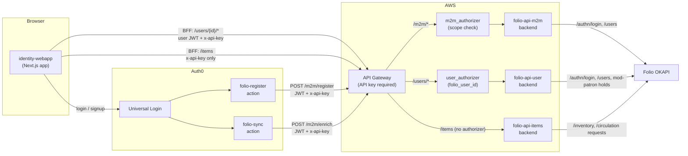
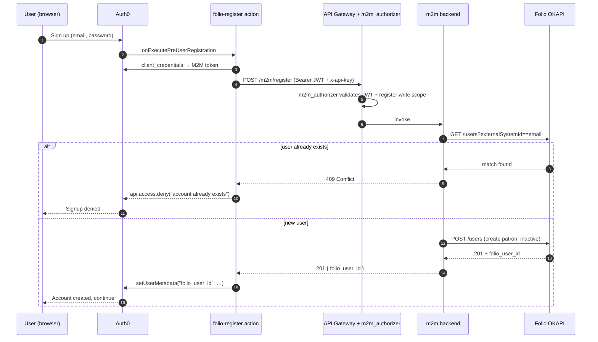
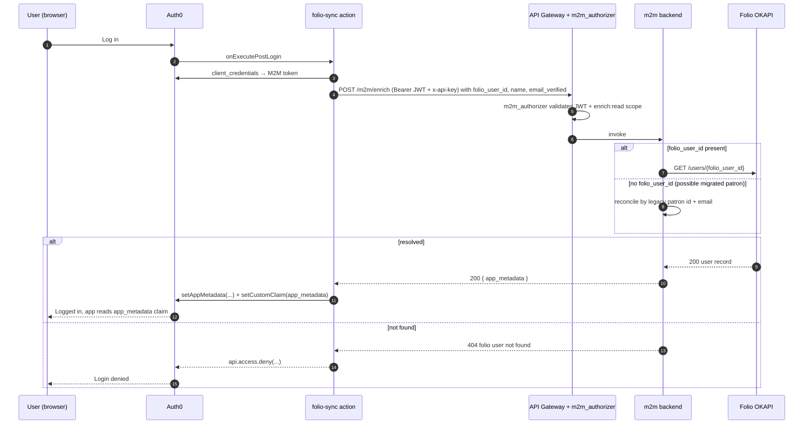
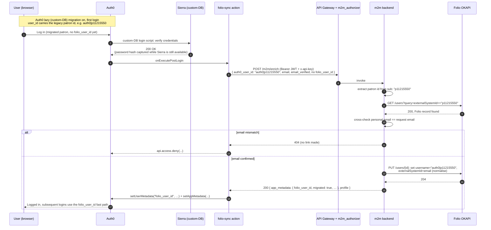
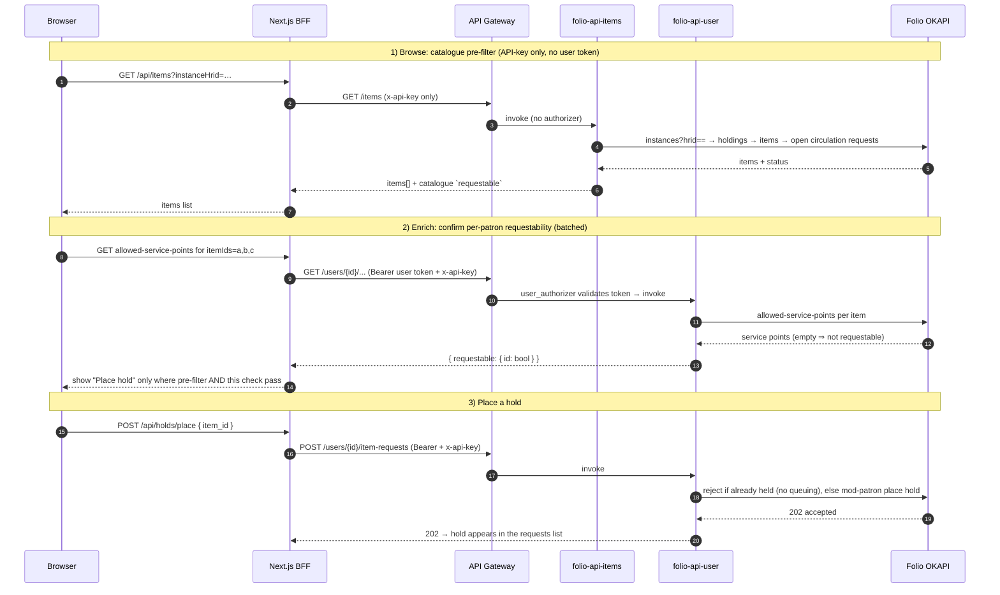

# RFC 088: Migrating identity, requesting and items APIs from Sierra to FOLIO

## Purpose

This RFC describes how we move the identity, requesting and item-availability APIs that power
`wellcomecollection.org` from our current Library Management System (LMS), **Sierra**, to its
replacement, **FOLIO**. It sets out the proposed architecture (a parallel, FOLIO-backed **v2**
identity API fronted by Auth0), the embedded API contract, the migration plan (a per-request
website toggle plus lazy patron migration, culminating in a single coordinated cutover), and the
questions still open before cutover.

**Last modified:** 2026-06-26T00:00:00+00:00

**Related RFCs:**

- [RFC 039: Requesting API design](../039-requesting-api-design/README.md) and
  [RFC 042: Requesting model](../042-requesting-model/README.md): the v1 requesting contract this
  work must preserve.
- [RFC 044: Tracking Patron Deletions](../044-patron-deletions/README.md): the Sierra-based
  deletion tracker whose successor is an open question here.
- [RFC 074: Offsite requesting](../074-offsite-item-requesting/README.md): requesting behaviours
  layered on top of the API.
- [RFC 083: Stable identifiers following mass record migration](../083-stable_identifiers/README.md):
  the wider CALM/Sierra to Axiell/FOLIO migration, of which this is the identity and requesting part.

> **A note on sources.** A substantial body of planning and prototyping has been done in an
> internal discovery repository: a working v2 identity API (Auth0 ↔ FOLIO) that implements the
> complete v1-compatible surface, is contract-tested against the OpenAPI specification reproduced
> below, and is deployed to a development environment. This RFC is written to stand on its own: the
> architecture, contract, migration plan and open questions are reproduced here in full so that the
> plan is openly accessible without depending on that closed repository.

## Table of contents

- [Context](#context)
- [Proposed architecture](#proposed-architecture)
- [API surface: v1 → v2](#api-surface-v1--v2)
- [API contract (OpenAPI)](#api-contract-openapi)
- [Migration plan](#migration-plan)
- [Risks](#risks)
- [Open questions](#open-questions)
- [Out of scope](#out-of-scope)
- [Next steps](#next-steps)

---

## Context

Wellcome Collection is replacing Sierra with FOLIO as its LMS. Three platform capabilities are
currently Sierra-backed and must move:

- **Identity:** the v1 identity API (`v1-api.account.wellcomecollection.org`, the
  `wellcomecollection/identity` repo) sits in front of Auth0 and Sierra patron records. It serves
  account profile, email change, password change, registration and account-deletion requests.
- **Requesting:** placing and listing holds. In v1 this is served by a separate requests service
  (in the catalogue-api repo) that resolves catalogue item ids to Sierra item numbers and places
  Sierra holds.
- **Item availability:** whether an item can be requested, derived from item status.

The successor is named **v2** because the predecessor is v1 (`v2-api.account.wellcomecollection.org`).
That it happens to match the catalogue API's current version is coincidental.

A feasibility review of the `wellcomecollection/identity` and `wellcomecollection.org` repositories
established the facts that shape the design:

- **One consumer, one integration point.** All website identity traffic flows through the identity
  webapp's Backend-for-Frontend (BFF) proxy, plus one machine-to-machine registration route. The
  API base URL is a single environment variable sourced from SSM.
- **A versioning seam already exists.** v1 is versioned by hostname, so v2 can be stood up alongside
  it without modifying v1.
- **There is toggle precedent.** The site already selects an API base URL and key per request,
  server side, behind a feature toggle, with cookie overrides and no redeploy. This is the
  mechanism v2 needs to switch traffic.
- **The Auth0 audience constrains the design.** Access tokens carry
  `aud: https://v1-api.account.wellcomecollection.org`. A toggle cannot change the audience of an
  already-issued token, so v2 accepts the v1 audience: the same tenant and resource server, with
  additional scopes defined on it.
- **The identity webapp stays separate.** Its separation from the content webapp is an intentional
  security boundary. One webapp with two API clients, selected by the toggle, preserves that. A
  parallel webapp would force the old/new split up to path-based routing, which cannot switch per
  user.

The guiding principle throughout is to **change one variable at a time**: the *implementation*
changes (Sierra → FOLIO), the *contract* does not. Contract simplifications wait until after the
cutover has been proven.

---

## Proposed architecture

The v2 identity API links **Auth0** (the identity provider) to **FOLIO** (the LMS, reached via its
OKAPI gateway) so that every Auth0 user is backed by a FOLIO patron. It is a set of Python Lambdas
behind API Gateway, with two Lambda authorizers validating Auth0 JWTs at the gateway. The website's
identity webapp BFF is the only production consumer.



### Authentication layers

Authorization happens **at the gateway** before any backend runs. Most calls carry three
credentials; the exception is the `/items` catalogue route, which is API-key only.

1. **API key** (`x-api-key`): enforced at API Gateway on every route. Outer gate and rate-limit.
2. **Auth0 JWT** (`Authorization: Bearer`): RS256, validated against the tenant JWKS by the
   authorizer attached to the route. Proves the request originated from our Auth0 tenant; an
   invalid/expired/wrong-issuer token is rejected `401` at the gateway.
3. **Per-route authorization:**
   - `/m2m/*` is guarded by the **m2m authorizer**: the JWT must be a machine token (`sub` ends
     `@clients`) carrying `register:write` or `enrich:read`, granted in Auth0 only to the Actions'
     M2M app.
   - `/users/{userId}/*` is guarded by the **user authorizer**: the JWT must carry a `folio_user_id`
     claim, which the authorizer passes to the backend as request context. The backend enforces that
     the `{userId}` in the path matches the caller's identity (`isSelf`, with a `me` alias), so a
     user can only act on their own record. Per-route scope checks happen in the handlers.
   - `/items` has **no** authorizer: it returns only catalogue/availability data (no user data), so
     the API key alone gates it.

The backends authenticate to **FOLIO OKAPI** with a service-account login (cached across warm
invocations, refreshed on 401). End users never authenticate to FOLIO. Service-account credentials
are read at runtime from an SSM SecureString, never stored in the Lambda environment.

### Identity model and patron conventions

No user identifiers change in the migration. The public `userId` of the v2 contract is the **bare
Auth0 user_id** (the token subject minus its `auth0|` prefix): `p{digits}` for patrons migrated
from Sierra (their legacy patron number), and an Auth0-generated 24-character hex id for newer
signups. On the FOLIO record:

- `username` carries the Auth0 user_id;
- `externalSystemId` carries the email (or, for a not-yet-linked migrated patron, the legacy patron
  id);
- the FOLIO user **UUID** is the internal join key (surfaced to the app as the
  `folio_user_id` claim) and never appears in the public contract.

> What `externalSystemId` carries is **not yet firmly decided**. It is the field the lazy-migration
> enrichment matches on (email, or the legacy patron id before linking), so its value and normalisation
> matter for migration. Whether that field is the right place for it, rather than a dedicated
> identifier, may still change before cutover.

A patron's FOLIO `active` flag mirrors **identity completeness**: a patron is active only once they
have a real name *and* a verified email. New patrons are created **inactive**, carrying v1's literal
placeholder names (`Auth0_Registration_tempFirstName` / `…tempLastName`) until registration
completes; activation is reconciled on every login.

### Registration

The pre-user-registration trigger is synchronous and can block signup, so a FOLIO failure prevents
the Auth0 account from being created (fail-closed). The FOLIO UUID is written to the new user's Auth0
metadata for fast lookups on subsequent logins.



### Login and enrichment

On every login a post-login Auth0 action (folio-sync) calls `/m2m/enrich`, which resolves the FOLIO
user, mirrors the Auth0 identity onto the FOLIO record, reconciles account activation, and returns
the `app_metadata` for Auth0 to persist and surface to the app. FOLIO is the source of truth for the
name: a name changed in FOLIO propagates to Auth0 on the next login. Enrichment failures fail closed
(login is denied rather than letting a user through in an inconsistent state).

Enrichment also mints the patron's library-card barcode. If the resolved FOLIO record has no
barcode, `/m2m/enrich` allocates a numeric card number from the patron-barcode sequence (see [open
question 4](#open-questions)) and writes it to the record. This is allocate-once (a migrated patron
already carries a barcode, so it only fires for new signups) and best-effort: a sequence failure is
logged and retried on the next login rather than blocking the current one.



### Lazy patron migration

Patrons that already exist in FOLIO from the back-end (bulk) migration are linked to Auth0
transparently on first login, rather than through registration. With Auth0 lazy (custom-database)
migration enabled, such a user arrives with their **legacy patron id as the Auth0 `user_id`** (e.g.
`auth0|p11215550`) and no `folio_user_id`. The enrichment call matches the FOLIO record by
`externalSystemId`, confirms the email, sets the FOLIO `username` to the Auth0 user_id, normalises
`externalSystemId` to the email, and writes the FOLIO UUID back to Auth0 metadata so later logins
take the fast path. No FOLIO custom fields are involved.

Because FOLIO cannot verify passwords, **Auth0 captures the password hash at login while Sierra is
still available** (the custom-database connection's login script). This is why the public cutover
opens a credential-capture window (see the migration plan).



### Browsing and requesting items

Requestability is decided in **two stages** because no single source has the whole answer:

1. **Catalogue pre-filter (cheap, API-key only).** `/items` returns an instance's items with a
   `requestable` flag computed from catalogue data alone: the item has **no open request** (we never
   queue holds, so any existing page/hold/recall makes it unavailable), is **not suppressed**, and
   has a **circulating status**. This needs no user identity.
2. **Per-patron confirmation (FOLIO is authoritative).** Whether *this* patron may actually request a
   given item depends on FOLIO's request policy, which the catalogue can't express. The webapp
   confirms it per item against FOLIO's mod-patron **allowed-service-points** (a non-empty list means
   requestable). The UI offers **Place hold** only when both stages agree, so it never offers a hold
   FOLIO would reject.

> The `requestable` flag is **additive**, not a replacement: the works page keeps using the location's
> access status and access method to decide whether to show the request button, and this flag adds to
> that. The two-stage scheme above is a **prototype affordance**, not a final design. How
> requestability is ultimately determined, and where that decision lives, is still open; see
> [open question 2](#open-questions).



The per-patron allowed-service-points check and hold cancellation will be added to the
v1-compatible `/users/{userId}` surface before cutover (see [API surface](#api-surface-v1--v2));
they are not yet in the contract above.

---

## API surface: v1 → v2

v2 serves the v1 contract verbatim, including its quirks (304 responses, the `me` alias, the
catalogue error shape on item-requests). Each v1 operation has one of these dispositions:

- **keep-compat:** serve the v1 shape verbatim;
- **reimplement-on-FOLIO:** same contract, FOLIO-backed implementation;
- **Auth0-backed:** v2 talks to the Auth0 Management API, as v1 does;
- **new-in-v2:** no v1 equivalent.

| v1 operation | Disposition | Notes |
|---|---|---|
| `GET /users/{userId}` | keep-compat (Auth0 + FOLIO hybrid) | Assembles the v1 `User` from the Auth0 profile (email, validation, lock, dates, logins) plus FOLIO (name, barcode). `userId` becomes a **string**: a deliberate, unconsumed divergence from v1's number (the website derives its own userId from the session sub and never reads this field). |
| `PUT /users/{userId}` (email change) | keep-compat (Auth0 + FOLIO) | Re-validates the current password, updates Auth0 email + FOLIO, deactivates the patron until the new address is verified, then re-sends verification. 304 when unchanged; 409 when the email is already in use. |
| `PUT /users/{userId}/password` | keep-compat (Auth0-backed) | Validate old password, set new via Auth0 Management. No FOLIO involvement. |
| `POST /users/{userId}/validate` | keep-compat (Auth0-backed) | Standalone credential check. Kept for v1 parity even though the website has no current call site (parity-first). |
| `PUT /users/{userId}/deletion-request` | keep-compat (Auth0-backed + email), extended | Re-validates password, emails admin + user (before recording, per v1), **deactivates the FOLIO patron and tags it `delete-requested`** (a v2 extension so the library-side record reflects the pending deletion immediately), then blocks the Auth0 account. Actual account removal is [open question 3](#open-questions). |
| `POST /users/{userId}/send-verification-email` | keep-compat (Auth0-backed) | Moved into v2 so the website BFF calls one API and the Management-API credential stays server-side in one place. |
| `PUT /users/{userId}/registration` (M2M) | keep-compat (reimplement-on-FOLIO) | Writes the name to FOLIO, guarded by v1's placeholder-name semantics: new signups carry the `Auth0_Registration_temp*` names until this route replaces them; the name may only be completed, never changed. |
| `GET /users/{userId}/item-requests` | keep-compat (reimplement-on-FOLIO) | Translates mod-patron holds into the website's `RequestsList`. Requires reverse identifier translation (FOLIO item UUIDs → canonical item ids, `workId`); see [open question 1](#open-questions). |
| `POST /users/{userId}/item-requests` | keep-compat (reimplement-on-FOLIO) | Accepts `{workId, itemId, pickupDate, type}` where `itemId` is the canonical catalogue id; forward-translates to the FOLIO item UUID, places the hold, returns 202, maps FOLIO errors to `WellcomeApiError`. Business rules: see [open question 2](#open-questions). |

**New in v2 (not website-facing, or new capability):**

| Route | Disposition | Notes |
|---|---|---|
| `POST /m2m/register`, `POST /m2m/enrich` | new-in-v2 | Called by the Auth0 actions; central to registration and lazy migration. |
| `POST /m2m/sequences/{name}/next` | new-in-v2 | Mints the next value from a named sequence (a DynamoDB atomic counter), returned as a barcode. Used in-process by `/m2m/enrich` to assign a new patron's card number, and exposed for standalone allocation; M2M `enrich:read` scope. An unprovisioned sequence returns 404. See [open question 4](#open-questions). |
| `GET /items` | new-in-v2 | Catalogue availability; API-key only. Overlaps the existing v2 catalogue API items endpoint; how the two run in parallel is [open question 5](#open-questions). |
| Per-patron requestability (allowed-service-points) and hold cancellation | new-in-v2 (planned) | No v1 analogue: v1 never shipped cancel, and per-patron requestability is new. Both will be added to the `/users/{userId}` surface before cutover (cancellation as `DELETE /users/{userId}/item-requests/{requestId}`); not yet in the contract above. |

### Sierra → FOLIO mapping (reference)

The implementation maps each Sierra REST call to a FOLIO module/endpoint:

| Capability | Sierra | FOLIO | Module |
|---|---|---|---|
| Item status / availability | `GET /v5/items/{itemNumber}` | `GET /inventory/items/{itemId}` (`status.name`) | mod-inventory |
| Place hold | `POST /v5/patrons/{n}/holds/requests` | `POST /patron/account/{id}/item/{itemId}/hold` | mod-patron |
| List holds | `GET /v5/patrons/{n}/holds` | `GET /patron/account/{id}?includeHolds=true` | mod-patron |
| Cancel hold | `DELETE /v5/patrons/{n}/holds/requests/{holdId}` | `POST /patron/account/{id}/hold/{holdId}/cancel` | mod-patron |
| Get patron | `GET /v5/patrons/{patronNumber}` | `GET /users/{userId}` | mod-users |

| FOLIO module | Purpose | Replaces |
|---|---|---|
| **mod-users** | User/patron record management | Sierra patron records |
| **mod-patron** / **edge-patron** | Patron-facing account operations (holds) | Sierra patron API |
| **mod-inventory** | Item/holdings/instance management | Sierra item lookup |
| **mod-circulation** | Loans, requests, check-in/out | Sierra holds system (used indirectly, for the open-requests check) |
| **mod-patron-blocks** | Patron block checking | Sierra patron blocks (not yet adopted; see [open question 2](#open-questions)) |

Authentication changes from Sierra's OAuth client-credentials + `X-Wellcome-Caller-ID` to OKAPI's
tenant + token headers; this is handled entirely inside the v2 backends via the service-account
login, so the website never sees FOLIO authentication. FOLIO error formats are likewise mapped to
the v1 contract at the API boundary (`{message}` JSON; `WellcomeApiError` for the item-requests
pair), so the website never sees FOLIO error shapes.

---

## API contract (OpenAPI)

The intended v2 contract lives alongside this RFC as a machine-readable spec:

- **[`openapi.yaml`](openapi.yaml):** the OpenAPI 3.1 specification (the source of truth).
- **[`openapi.md`](openapi.md):** a human-readable rendering of the same spec, generated from it.

It reproduces the prototype's OpenAPI specification restricted to the **intended** routes: the
v1-compatible `users` surface, the v2-native `m2m` machine endpoints, and the `items` availability
lookup. The prototype's transitional `/user/{user_id}/*` holds routes are omitted: they are
scaffolding to be replaced by the v1-compat successors noted above before cutover.

The rendered `openapi.md` is generated by a small self-contained `uv` project in this directory,
which also validates the spec. After editing `openapi.yaml`, regenerate the docs with:

```bash
cd rfcs/088-folio-identity-requesting-migration
uv run python render_docs.py
```

---

## Migration plan

**Strategy.** Stand up the v2 API in parallel at `v2-api.account.wellcomecollection.org`, serving
the v1 contract verbatim, and switch `wellcomecollection.org` onto it **per request** behind the
site's existing toggle system. The toggle is used to test in production with a small set of test
users; the public cutover is a **single coordinated change window** in which identity and requesting
move together (the toggle default, the Auth0 `import_mode` flip, and the LMS operational cutover).
Sierra and the v1 API are decommissioned afterwards.

Patrons are migrated **lazily** within the existing Auth0 tenant: Auth0 captures password hashes at
login while Sierra is still available (FOLIO cannot verify passwords). The same tenant is used
throughout and no user identifiers change.

**Why identity and requesting move together.** A hold must be placed in whichever LMS the
reading-room workflow actually runs on. So requesting, the LMS operational move and the identity
flip all happen in the single cutover window. During the testing phase, test users on v2 place holds
in FOLIO while staff still operate Sierra, so those holds are unfulfillable test data, cleared
together with the test patrons.

### Sequencing

| # | Phase | Status |
|---|---|---|
| 1 | Resolve the Auth0 `import_mode` lazy-migration blocker | ✓ verified by spike |
| 2 | Build v2: OpenAPI contract as source of truth; the complete v1-compatible surface plus `/m2m/*` and `/items`; contract tests; a prototype webapp exercising every flow; both Auth0 action gates implemented | ✓ deployed to a development environment |
| 3 | Stage parity: v2 at `v2-api.stage.account…`, accepting the v1 audience; port the v1 smoke tests; rehearse the `import_mode` flip on the stage tenant | pending |
| 4 | Deploy both Auth0 actions, **gated off**, to stage and production. Test users opt in and begin testing the full v2 lifecycle in production | gates implemented in the prototype |
| 5a | Website prerequisite: upgrade the production identity webapp's Auth0 SDK (a substantial, separate, earlier change: the auth routes move to middleware) | in review |
| 5b | Website wiring: the `identityApiV2` toggle; a request-scoped dual client in the BFF proxy and the registration route; the v2 path guarded by the session carrying `folio_user_id`, otherwise v1; the first authenticated end-to-end tests | pending |
| 6 | Production testing via the toggle: test users opt in by cookie and exercise the full v2 lifecycle. Authenticated end-to-end tests pass | pending |
| 7 | **The cutover window**: one coordinated change, wrapped in `disableRequesting`. Toggle `defaultValue=on`, sync/register defaults `on`, `import_mode=true`, together with the LMS operational cutover (reading-room workflows move to FOLIO; open Sierra holds are migrated). v2 then serves everyone and the credential-capture window begins | pending |
| 8 | Decommission: the v1 API, the Sierra custom-database scripts, then Sierra itself, once the capture window has run its course and at least the maximum session lifetime has passed since the cutover | pending |

### Rollout controls

Every stage is driven by configuration; no code is deployed after phase 5.

| Control | Location | Testing → cutover | Purpose |
|---|---|---|---|
| `identityApiV2` toggle | website toggles + `toggle_*` cookie | test-user cookie opt-in → `defaultValue` flip at cutover | Selects which API serves a request. Includes a safety condition: v2 is used only when the session carries `folio_user_id`, otherwise v1, which protects sessions issued before the cutover |
| `app_metadata.folio_sync` | Auth0 user record | `on` for test users; `off` is a per-user opt-out | Per-user sync override |
| `FOLIO_SYNC_DEFAULT` | folio-sync action secret | `off` → `on` (cutover) | Sync for users with no flag. While `off`, unsynced logins return early: no enrichment call, no added risk |
| `FOLIO_REGISTER_EMAIL_PATTERN` | folio-register action secret | staff domain + test plus-addressing | Signup opt-in for the test cohort: a signup whose email matches the pattern (e.g. `firstname.lastname+foliotest@wellcomecollection.org`) creates a FOLIO patron. The pattern only *widens* registration (it ORs with `FOLIO_REGISTER_DEFAULT`), and a malformed pattern matches nothing. A rollout control, not a security boundary |
| `FOLIO_REGISTER_DEFAULT` | folio-register action secret | `off` → `on` (cutover) | Registration for signups that do *not* match the pattern. The two combine as an OR: a signup registers if it matches the pattern **or** this default is `on`. While `off` (testing) only pattern-matching signups register; flipping to `on` at cutover registers every signup and makes the pattern moot. No fail-open mode: when registration runs, a FOLIO failure denies the signup, which can be retried |
| `disableRequesting` | website toggle (runbook) | wraps the cutover window | Turns requesting off site-wide while open holds move from Sierra to FOLIO and operations switch |

### The cutover window

Registration-by-default and the `import_mode` flip **must coincide**. With `import_mode=false` a
signup runs the connection's `create` script and the patron is created in Sierra; with
`import_mode=true` Auth0 creates the user natively and folio-register creates the patron in FOLIO.
Defaulting registration on while still in proxy mode would dual-create every new patron (duplicates
for the bulk Sierra→FOLIO migration); flipping without registration on would create patrons with no
LMS record. So both flip together, alongside the toggle default, inside one `disableRequesting`
window. No code is deployed in the window: everything running has already been exercised in
production under the gates and the test toggle.

Sessions issued before the cutover (up to the maximum session lifetime) fall back to v1 via the
toggle's `folio_user_id` guard until those users next log in, which links them.

---

## Risks

1. **The `import_mode` flip.** Resolved by a spike that proved the in-place flip and subsequent
   lazy capture; it should be rehearsed on stage before production.
2. **The custom-database login scripts.** These are the entry point for every login during the
   capture window; the Sierra-backed `login` and `change_password` scripts must keep working until
   decommission.
3. **The cutover window concentrates risk.** Several configuration flips plus the LMS operational
   move (the least reversible element) inside one `disableRequesting` window. Mitigation: a full
   rehearsal on the stage tenant and stack, and a runbook with a rollback step for each change. The
   identity configuration flips can each be reverted individually while Sierra is still available.
4. **No authenticated end-to-end coverage in `wellcomecollection.org` today.** Built in phase 5b
   and must pass before the cutover.
5. **Capture-window length.** Credential capture runs from the public cutover to Sierra
   decommission; patrons who never log in during the window are issued password-reset tickets. If
   the decommission date is fixed and the testing phase runs long, the window shrinks; prefer moving
   the decommission date to rushing the cutover.
6. **Consumer audit.** The effective production consumer is the webapp BFF alone (it holds the only
   production API key), but a pre-cutover audit of the production Auth0 tenant's clients and grants
   for the identity API audience should confirm no dashboard-created consumers exist, and account
   for the CI smoke-test client.

The production email provider is decided: **SES, as in v1** (the SMTP credentials in SSM and the
tenant email provider switch from the development sandbox to SES per environment; no code change).

---

## Open questions

These remain to be resolved before cutover. Each has a prototype direction but an unsettled
integration point.

1. **Identifier translation for requesting.** The requesting routes must translate canonical
   catalogue item ids to and from FOLIO item UUIDs and derive `workId`. The decision
   is to look these up in our **identifiers database** (the platform id-minter store), rather than
   the catalogue API the current requests service queries, applying the multi-bib rule the current
   service documents (an item on several works resolves to the work with the lowest alphabetical
   source identifier). *Open:* the access mechanism (direct read, a service, or a sync), and the
   dependency on the catalogue pipeline ingesting FOLIO items. The prototype uses a hard-coded table
   and accepts raw FOLIO UUIDs in the meantime.

2. **Requesting business rules.** The current requests service enforces rules in the application
   layer that Sierra would not (a hold limit of 15, refusal of `SelfRegistered` users, and a Sierra
   error-code → user-message table). FOLIO enforces request policies natively through circulation
   rules per patron group and the allowed-service-points check the prototype already uses, so v2's
   share probably reduces to mapping FOLIO refusals to user-facing `WellcomeApiError` messages.
   FOLIO automated patron blocks (mod-patron-blocks) are also not yet checked before placing a hold.
   *Open:* confirm the FOLIO circulation-rule configuration (and patron-block checking) with the LMS
   workstream before cutover.

3. **Auth0 account removal after a FOLIO-side deletion.** A deletion request only flags and blocks
   the Auth0 account (and, in v2, deactivates and tags the FOLIO patron); the account is actually
   removed in v1 by a patron-deletion tracker that polls Sierra's deleted-records feed nightly (see
   [RFC 044](../044-patron-deletions/README.md)). FOLIO has no analogue: there is no deleted-records
   endpoint or tombstone, and patron-deletion events are platform-internal on the hosted tenant. The
   candidate direction is Auth0-side existence reconciliation, designed to fail towards doing
   nothing. *Open:* confirm event-integration options with the LMS vendor, and decide the mechanism
   before cutover (this is GDPR-relevant).

4. **Barcode and role.** New users are minted a numeric, sequential card number by a barcode
   **sequence service** (a DynamoDB atomic counter: a configurable prefix plus the counter
   zero-padded to a fixed width, no check digit), allocated at first login by `/m2m/enrich` and
   seeded above the maximum Sierra patron number so a minted number never collides with a migrated
   patron's physical card. Migrated users keep their existing card number. `role` is the FOLIO
   patron-group name mapped to the legacy vocabulary by a table the API owns (unmapped groups fall
   back to `Reader` with a warning). Keeping the value numeric, rather than the bare Auth0 id, leaves
   the printed and scanned card representation unchanged by the migration. *Open:* agree the concrete
   seed, prefix and width with the LMS migration and the card supplier, and confirm the reading-room
   scanners and self-issue kiosks accept the chosen format and range; and confirm the
   patron-group-to-role assignment for the currently-unmapped groups with the LMS workstream.

5. **Running the new items API alongside the existing catalogue API.** The new `GET /items` route
   serves item availability and requestability from FOLIO and will be built as part of this project.
   But it is not greenfield: the existing **v2 catalogue API** already exposes an items endpoint (the
   [`items` subproject](https://github.com/wellcomecollection/catalogue-api/tree/main/items) in
   `wellcomecollection/catalogue-api`) serving the same kind of availability data, Sierra-backed
   today. How the two run **in parallel** during the migration has not been worked out: which service
   the website calls for availability and when, and how that switch is coordinated (the identity side
   uses the website toggle described above; the catalogue API has its own hostname-versioning seam,
   separate from the identity toggle). A concrete candidate direction is to stand up a **v3 catalogue
   API** that serves only the new FOLIO-backed items endpoint, leaving the existing v2 catalogue API
   in place and cutting over in step with the rest of the migration. This also bears on where the new
   items API ultimately *lives*: in this project's API surface (as specified today) or under a v3
   catalogue API. *Open:* decide the home for the new items API and the parallel-run/cutover mechanism
   with the catalogue-API workstream before cutover. (Related: identifier translation in open question
   1, which already depends on catalogue/identifier data, and the RTAC note under
   [Out of scope](#out-of-scope).)

---

## Out of scope

- **No changes to the website's data models, response shapes or Auth0 claims** as part of the
  switch. v2 serves the v1 contract, including its quirks. Contract simplifications (e.g. removing
  the unused `/validate` route, or delegating password change to Auth0's reset flow) are candidates
  for **after** the cutover.
- **No new Auth0 tenant, no user migration between connections, and no bulk imports** as part of the
  switch (the back-end bulk patron migration is a separate LMS-workstream activity that this plan
  links to via lazy migration).
- **No merging of the identity and content webapps, and no parallel webapp.**
- **Staff item-location / movement flows** (e.g. updating an item's location in FOLIO): these are
  staff-side LMS operations, not part of the website-facing identity/requesting/items APIs.
- **Real-time availability at scale (RTAC).** The `/items` route uses per-instance inventory lookups,
  not FOLIO's RTAC modules; revisit if availability needs to scale beyond per-instance lookups.

---

## Next steps

1. **Stage parity** (phase 3): deploy v2 to stage accepting the v1 audience, port the v1 smoke
   tests, and rehearse the `import_mode` flip on the stage tenant.
2. **Gated action deploy** (phase 4): deploy folio-sync and folio-register to stage and production,
   gated off, and begin the production test-cohort lifecycle.
3. **Website wiring** (phases 5a to 5b): land the identity webapp SDK upgrade, then add the
   `identityApiV2` toggle, the request-scoped dual client, the `folio_user_id` guard, and
   authenticated end-to-end tests.
4. **Resolve the open questions** above with the relevant workstreams, in particular identifier
   translation (for requesting to work end to end) and the FOLIO circulation-rule configuration.
5. **Cutover** (phase 7): rehearse and run the single coordinated window behind `disableRequesting`,
   with a per-change rollback runbook.
6. **Decommission** (phase 8): retire the v1 API and the Sierra custom-database scripts, then Sierra,
   once the capture window has elapsed.
