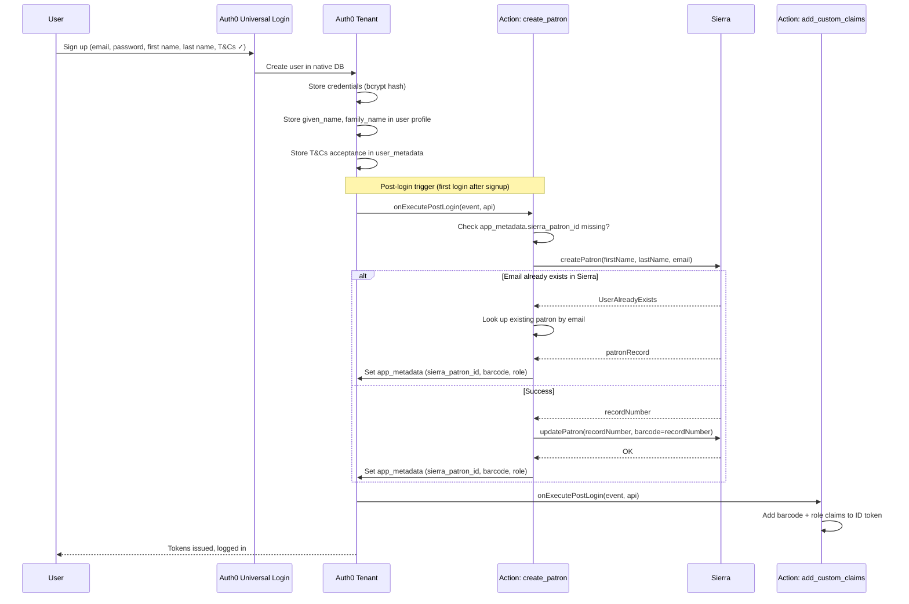
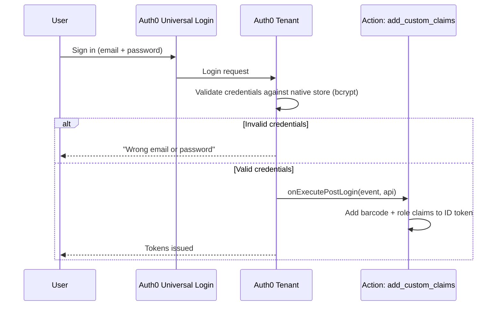
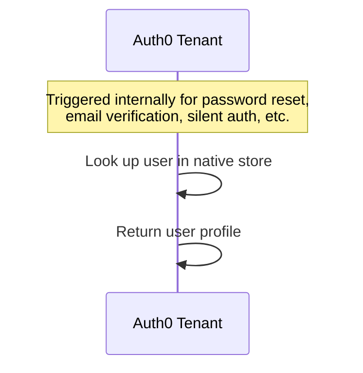
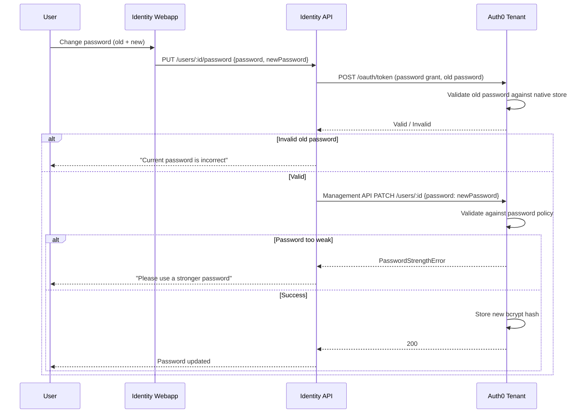
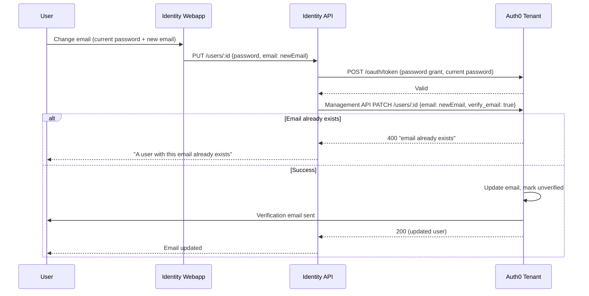
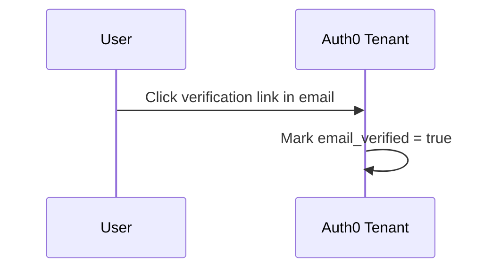
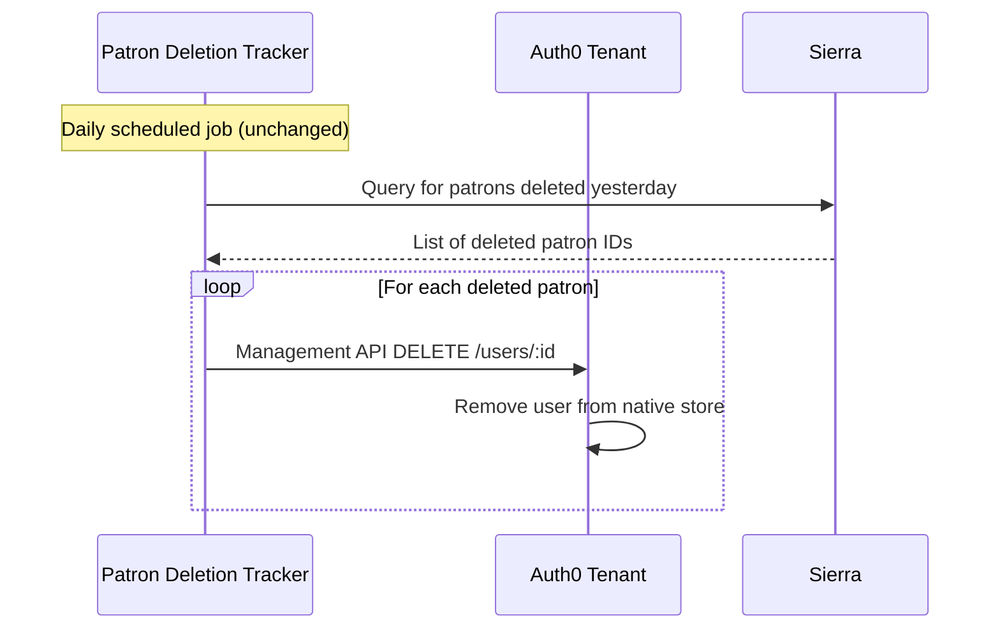
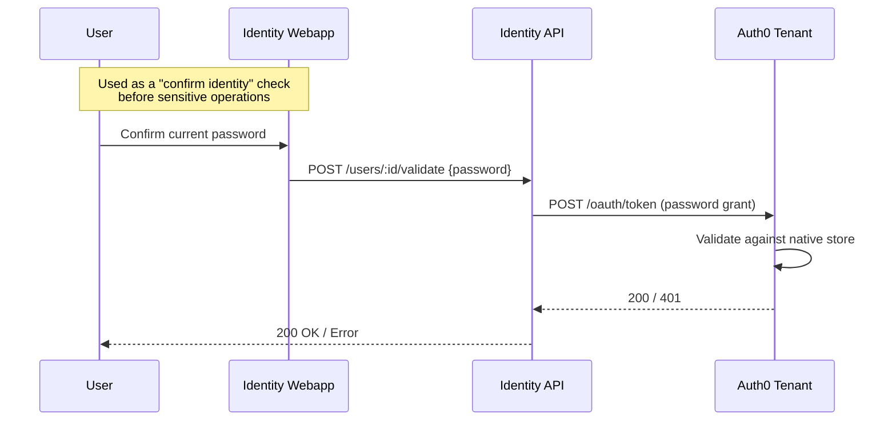

# User Flows — After Custom DB Script Removal (Auth0 Native DB)

These diagrams show the same user flows as `user_flows.md`, but with Auth0 as the native credential store. No Custom DB scripts are involved. Sierra is still used for patron profile/hold data during the transition period (until Folio replaces it).

## Registration

**Key differences from today:**
- Single form: all data collected upfront (no redirect to separate registration page)
- No temp names — patron created with real data
- No `create` DB script — Auth0 stores credentials natively
- No orphaned patrons from abandoned signups (Sierra patron only created after Auth0 user exists)
- No forced logout to refresh name (Auth0 native DB allows direct profile updates)
- Sierra patron creation is idempotent: check `app_metadata.sierra_patron_id` before creating

**Note:** The `create_patron` action replaces both the old `create` DB script and the `redirect_to_full_registration` action. If the 20s action timeout is a concern, patron creation could alternatively happen via the Identity API called from a post-login redirect — but the action approach is simpler.

## Login

**Key differences from today:**
- No `login` DB script — Auth0 validates against its own store
- No Sierra calls at all during login
- No implicit email verification logic for pre-2022 patrons (handled during migration)
- Significantly faster login (no external API calls)

## Get User

**Key differences from today:**
- No `get_user` DB script — Auth0 reads from its own store
- No Sierra dependency for user lookups
- No risk of "duplicate users" error (Auth0 enforces unique email natively)

## Change Password

**Key differences from today:**
- No `change_password` DB script — Auth0 updates its own store
- No Sierra PIN update (Sierra credentials are stale/irrelevant)
- Password policy enforced by Auth0 config only (min 8 chars, no personal info, dictionary check) — no Sierra PIN rules (trivial, too long)
- No 30-character PIN truncation
- Identity API code is unchanged

## Change Email

**Key differences from today:**
- No `change_email` DB script — Auth0 updates its own store
- No Sierra email update (Sierra is no longer the source of truth for email)
- Duplicate email detection handled natively by Auth0
- Identity API code is unchanged

## Verify Email

**Key differences from today:**
- No `verify` DB script — Auth0 handles verification natively
- No Sierra call to mark patron email verified
- Single atomic operation

## Delete

**Key differences from today:**
- No `delete` DB script (was already a no-op)
- Patron Deletion Tracker continues to run unchanged
- Direction remains Sierra → Auth0 during transition (reverses to Auth0/Folio → Sierra once Sierra is being retired)

## Validate Password (via Identity API)

**Key differences from today:**
- No `login` DB script triggered — Auth0 validates natively
- No Sierra call
- Identity API code is unchanged

---

## Summary of changes

| Flow | Before (Custom DB) | After (Native DB) | Code changes needed |
|------|-------------------|-------------------|-------------------|
| Registration | `create` script → Sierra, then redirect to form | Single form, post-login action → Sierra | New action, remove `redirect_to_full_registration`, remove `/registration` endpoint |
| Login | `login` script → Sierra | Auth0 native validation | None |
| Get user | `get_user` script → Sierra | Auth0 native lookup | None |
| Change password | `change_password` script → Sierra | Auth0 native update | None (Identity API unchanged) |
| Change email | `change_email` script → Sierra | Auth0 native update | None (Identity API unchanged) |
| Verify email | `verify` script → Sierra | Auth0 native verification | None |
| Delete | `delete` script (no-op) | No script needed | None (Deletion Tracker unchanged) |
| Validate password | `login` script → Sierra | Auth0 native validation | None (Identity API unchanged) |