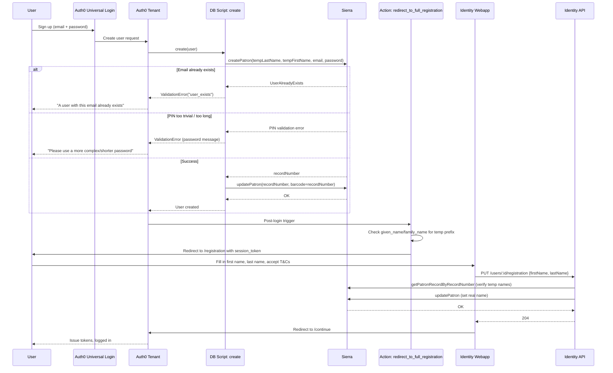
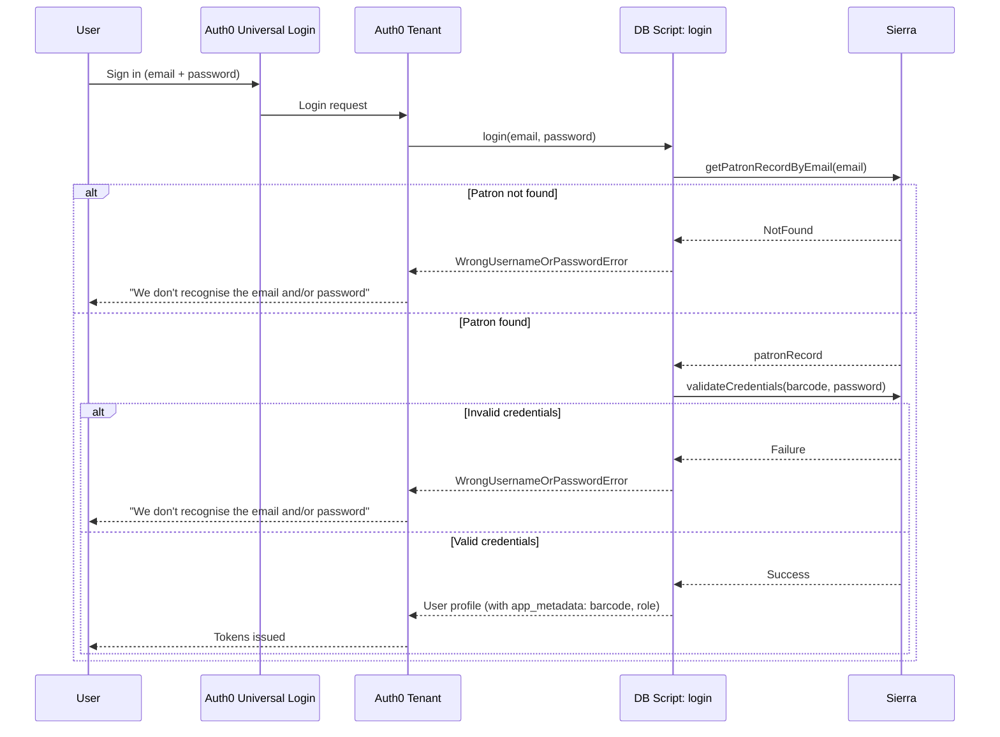
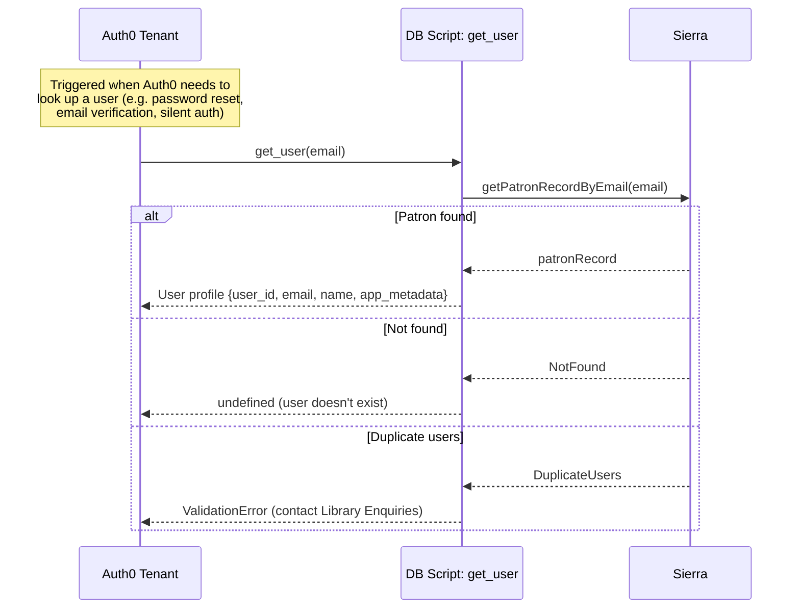
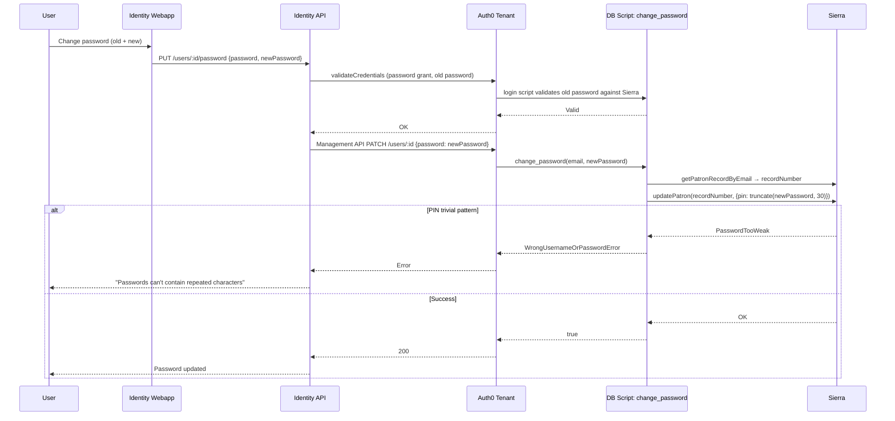
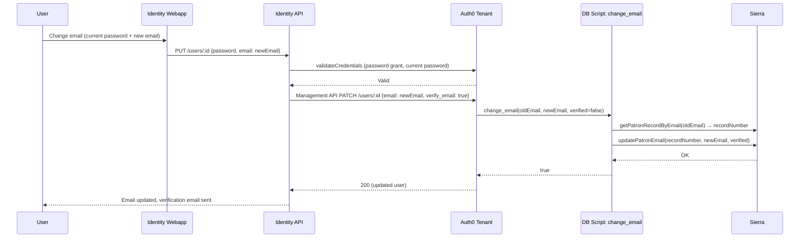
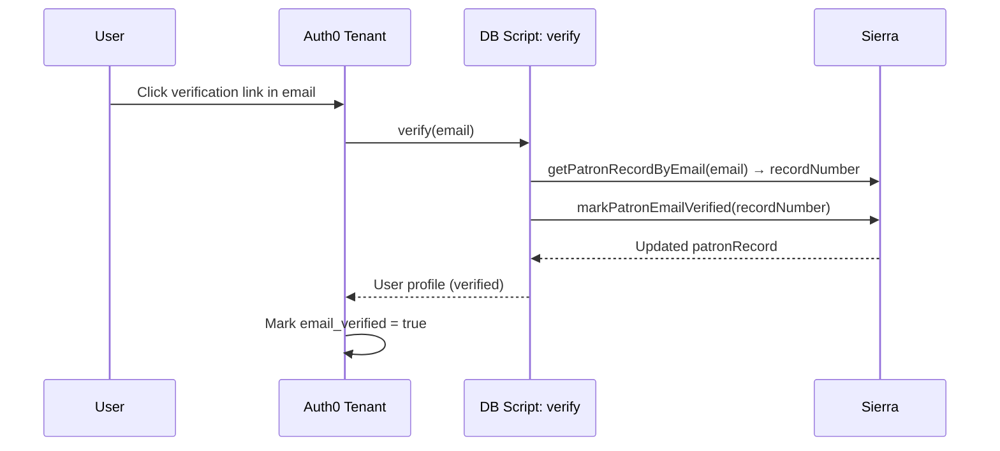
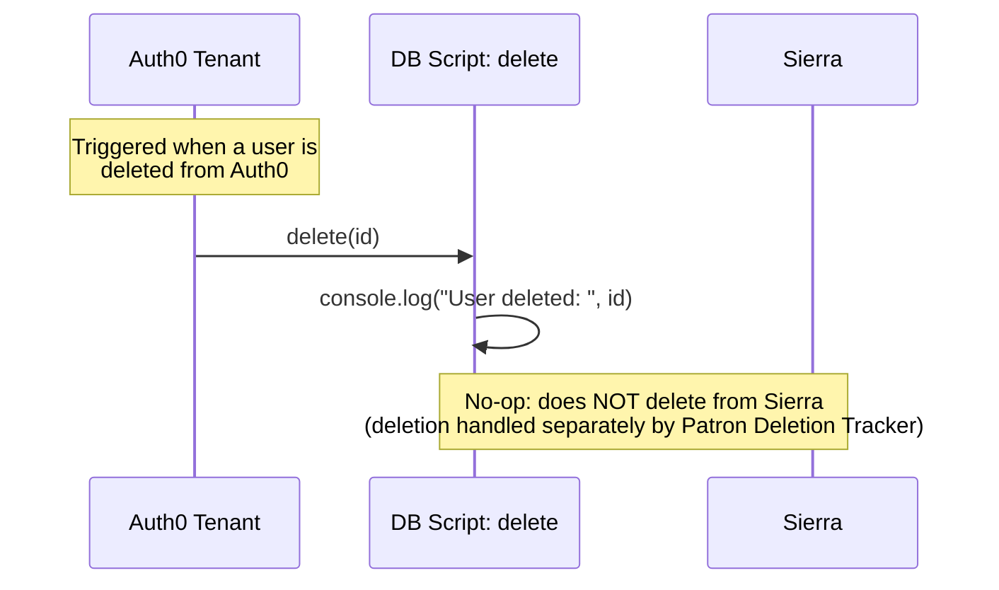
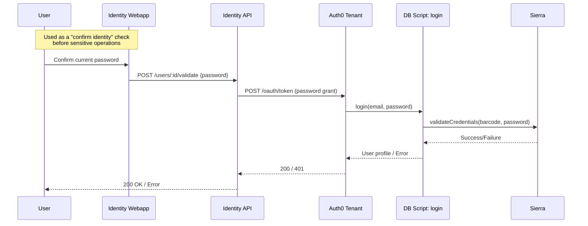

## Identity & Requesting discovery

#### Problem outline

As part of a Systems Transformation Program, Sierra is being replaced by Folio (they're both Library Management Sytems/LMS)
Currently Sierra holds patrons' (library users) data such name, email address, whether they are allowed to place holds on library items, any holds they have placed on library items (among other things? TBC). Crucially Sierra also keeps the patron's login credentials, ie. email and account password.
Folio, OTOH, does all of this but does not authenticate patrons; it doesn't hold patron credentials and offers no mechanism to validate them in order to authenticate or authorise patron requests.
In the middle of this we use Auth0 to generate and sign auth tokens, then validate these tokens on subsequent patron requests. 
See README.md for overview of the Identity services, including identity API, authorizer lambda, and Auth0 DB scripts/integration

#### Discussion points

- Folio can and most likely will store and manage hold data, eg. GET what items a patron has requested, POST a new hold request. What are Auth0 capabilities in terms of user/patron profile data storage and management? Can we migrate the authentication layer out of the LMS and into Auth0? 
- If we can, what would be a sensible way to migrate credentials and authentication out of the LMS and into Auth0?

---

# User Flows — Custom DB Script Usage

## Registration (create)

## Login (login)

## Get User (get_user)

## Change Password (change_password)

## Change Email (change_email)

## Verify Email (verify)

## Delete (delete)

## Validate Password (via Identity API)

