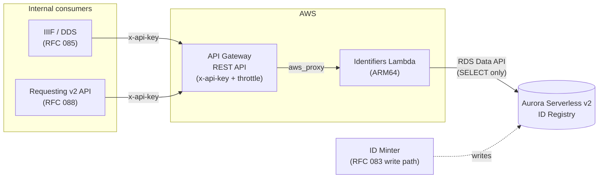

# RFC 089: Identifiers API

## Purpose

This RFC proposes a small, read-only **Identifiers API** that resolves a **canonical** catalogue
identifier to its **source** identifier(s) and back, served from the catalogue ID Registry (the
same store the ID Minter writes to, per [RFC 083](../083-stable_identifiers/README.md)). It provides
that translation in one place, between the canonical ids the public surface uses and the source ids
(Sierra numbers, FOLIO UUIDs, CALM/Axiell refs) that the underlying systems require across the
Sierra/CALM → FOLIO/Axiell migration. It sets out the contract, the AWS architecture, the
authentication and cost model, the caching strategy, and what a working prototype has already
established.

**Last modified:** 2026-06-18T16:00:00+00:00

**Related RFCs:**

- [RFC 083: Stable identifiers following mass record migration](../083-stable_identifiers/README.md):
  the ID Registry this API reads, its two-table schema, and the predecessor-alias model that makes
  the mapping one-to-many. This API is a read-only projection over that registry; all writes belong
  to the ID Minter described there.
- [RFC 085: IIIF identities](https://github.com/wellcomecollection/docs/pull/143) (open PR): the
  DDS / IIIF consumer. It wants the canonical Work id to be the IIIF Manifest/Collection URI and to
  redirect old b-number / CALM forms to it, which maps onto this API's reverse lookup plus sibling
  set.
- [RFC 088: Migrating identity, requesting and items APIs from Sierra to FOLIO](https://github.com/wellcomecollection/docs/pull/153)
  (open PR): the requesting consumer. Its open question 1 (identifier translation for requesting)
  names "a service" as one candidate access mechanism; this API is that candidate.

> **A note on sources.** A working prototype of this API has been built in an internal discovery
> repository: a framework- and storage-agnostic core with two backends (a seeded SQLite store and a
> read-only Aurora backend over the RDS Data API), contract-tested against the OpenAPI specification
> reproduced below, and run against the real development ID Registry. This RFC is written to stand
> on its own: the contract, architecture, data-model findings and open questions are reproduced here
> in full, and the machine-readable spec is carried alongside it, so the proposal is openly
> accessible without depending on that closed repository.

## Table of contents

- [Context](#context)
- [API Contract](#api-contract)
- [OpenAPI specification](#openapi-specification)
- [Proposed architecture](#proposed-architecture)
- [Data model](#data-model)
- [Authentication and cost](#authentication-and-cost)
- [Caching](#caching)
- [What the prototype demonstrates](#what-the-prototype-demonstrates)
- [Alternatives considered](#alternatives-considered)
- [Open questions](#open-questions)
- [Out of scope](#out-of-scope)
- [Next steps](#next-steps)

---

## Context

Wellcome Collection mints a stable **canonical** identifier for every catalogue entity (works,
images, items) and keeps a registry mapping each canonical id to the source identifiers it was
derived from. [RFC 083](../083-stable_identifiers/README.md) makes those canonical ids survive the
mass migration of records from Sierra and CALM into FOLIO and Axiell Collections: when a record
moves between source systems, the new source identifier is added to the **same** canonical id as a
**predecessor alias**, rather than minting a new canonical id. The mapping is therefore
**one-to-many**: a single canonical id can carry an original source identifier plus one or more
inherited aliases. This shapes much of the contract.

**The canonical-first principle.** Canonical identifiers are the currency everywhere public. Source
identifiers appear only at the two unavoidable edges: **ingest** (the catalogue pipeline, which
reads source records) and the **FOLIO boundary** (holds are placed on FOLIO item UUIDs). Everything
between speaks canonical, for both works and items. The problem this API solves is that the two
internal consumers at those edges each need to round-trip between a canonical id and the source ids
the underlying systems use. Without a shared service, each consumer re-derives the mapping or
queries the catalogue by source id, which the canonical-first principle is meant to avoid. This API
provides that translation in one place at those edges.

The principle covers catalogue-level entities (works, items). It does **not** extend to sub-work
IIIF structure (canvases, manifestations, files), which RFC 085 keeps at the Work-id level and
filename/digest-derived below that.

**The two consumers.** Both are internal server-side services, not anonymous public browsers, and
both exercise *both* lookup directions, which is what justifies keeping forward and reverse as
distinct operations:

- **IIIF / the DDS ([RFC 085](https://github.com/wellcomecollection/docs/pull/143)).** The DDS wants
  the Work id to be the canonical IIIF Manifest/Collection URI (e.g. `/presentation/zjytxny8` rather
  than `/presentation/b18035978`) and to 301-redirect old b-number / CALM forms to it. RFC 085
  describes a service that, given a string identity, returns all known current and previous
  identifiers matching it: the reverse lookup (source → canonical) plus the sibling set
  (canonical → all sources).
- **Requesting ([RFC 088](https://github.com/wellcomecollection/docs/pull/153), open question 1).**
  The v2 requesting routes translate the canonical catalogue item id ↔ the FOLIO item UUID in both
  directions: `POST …/item-requests` forward-translates the canonical `itemId` to a FOLIO item UUID
  to place the hold; `GET …/item-requests` reverse-translates FOLIO item UUIDs back to canonical
  item ids. `workId` / `workTitle` are **not** this API's job; only the holds-list needs them, and
  they come from the catalogue API queried in canonical. RFC 088 lists the access mechanism for the
  translation as open (direct read, a service, or a sync); this API is the proposed *service*
  answer.

---

## API Contract

Two endpoints. The machine-readable contract is the OpenAPI spec carried alongside this RFC (see
[OpenAPI specification](#openapi-specification)); this is the summary.

| Endpoint | Returns |
|---|---|
| `GET /v1/identifiers/{canonicalId}` | The full `IdentifierSet` (always; there is no aliases toggle), ordered by `createdAt` so the original is first. |
| `GET /v1/identifiers/by-source/{sourceSystem}/{value}?type=Work` | A bare `{ "canonicalId": "..." }` (`CanonicalIdRef`). |
| `GET /v1/identifiers/by-source/{sourceSystem}/{value}?type=Work&include=siblings` | The same full `IdentifierSet`. |

The element shape (`SourceIdentifier`) is identical across both endpoints, so one schema and one
parser serve every response:

```json
{
  "canonicalId": "a2345bcd",
  "sourceIdentifiers": [
    { "type": "Work", "sourceSystem": "sierra-system-number", "value": "b1161044x", "isAlias": false, "createdAt": "2019-03-04T10:14:22Z" },
    { "type": "Work", "sourceSystem": "axiell-collections-id", "value": "12345", "isAlias": true, "createdAt": "2026-02-10T12:00:00Z" }
  ]
}
```

- **`type`** is `Work` | `Image` | `Item`, defaults to `Work`, and is a real key component: a
  canonical id can carry rows of differing types (cross-type predecessors are allowed).
- **`isAlias`** is `false` for the earliest-`createdAt` row (the original) and `true` for later,
  inherited rows. The API derives it so consumers do not have to.
- **`sourceSystem`** is an open set, not enum-constrained, so a system the gateway has not been told
  about resolves to `404` rather than a spurious `400`.

**Status codes:** `200` found; `304` conditional GET (matched `ETag`); `400` malformed `canonicalId`
or an unsupported `type` enum value (rejected at the gateway); `404` no mapping: an unknown id, an unknown
source tuple, or a canonical id that is pre-generated but not yet assigned, all opaque to the
consumer as "no public identifier".

---

## OpenAPI specification

The contract lives alongside this RFC as a machine-readable spec:

- **[`openapi.yaml`](openapi.yaml):** the OpenAPI 3.0 specification (the source of truth).
- **[`openapi.md`](openapi.md):** a human-readable rendering of the same spec, generated from it.

The spec is deliberately a fragment: it carries the two lookup operations, their schemas, the
`ApiKeyAuth` security scheme with `x-amazon-apigateway-api-key-source: HEADER` (so API Gateway
enforces keys), and `aws_proxy` integration stubs pointing at the Lambda. It does **not** carry the
API keys, the per-consumer throttle, or their stage bindings; those are separate API
Gateway resources configured in Terraform, so importing or re-importing this definition does not
disturb them.

The rendered `openapi.md` is produced by a small self-contained `uv` project in this directory,
which also validates the spec. After editing `openapi.yaml`, regenerate the docs with:

```bash
cd rfcs/089-identifiers-api
uv run python render_docs.py
```

---

## Proposed architecture

A serverless read path: API Gateway in front of a single Lambda that reads the Aurora ID Registry
over the RDS Data API. The ID Minter ([RFC 083](../083-stable_identifiers/README.md)) is the only
writer; this API never writes.



| Area | Decision | Why |
|---|---|---|
| Compute | API Gateway → Lambda | Serverless, scales to near-zero, matches a sparse cacheable lookup. |
| Lambda arch | ARM64 (Graviton) | ~20% cheaper for identical work; the handler is trivially portable. |
| Gateway type | **REST API (v1)**, not HTTP API | API keys and per-consumer throttling are native REST features; HTTP API would need a Lambda authorizer (more moving parts). |
| Auth | API key in `x-api-key`, validated by the gateway | Identifies each consumer for cost attribution; no custom authorizer code. |
| Throttling | Per-consumer throttle bound to the stage | Safety valve capping cache-miss load on the database; not a billing quota. |
| Datastore | Aurora Serverless v2, kept (not DynamoDB) | One store, simpler infra; the same registry the ID Minter writes to. |
| DB access | RDS Data API | HTTP-based, no persistent connections to exhaust under Lambda concurrency; lower ops than RDS Proxy. |

**Service boundary.** A read-only projection over the Aurora ID Registry. All writes belong to the
ID Minter. This API never mints, never invalidates on write, and its only freshness concern is alias
growth during the migration window. In the prototype the read-only contract is enforced in the
Aurora backend by a guard that refuses any non-`SELECT` statement.

---

## Data model

From [RFC 083](../083-stable_identifiers/README.md), two tables:

- `canonical_ids`: the uniqueness registry. PK on `CanonicalId`. Supports pre-generation
  (`Status` free/assigned).
- `identifiers`: the mappings. PK on `(OntologyType, SourceSystem, SourceId)`, FK to `canonical_ids`,
  secondary index `idx_canonical` on `CanonicalId`.

Consequences for the two lookups:

- **Forward** (canonical → sources) reads `idx_canonical` and returns N rows: cheap, but not a
  point read.
- **Reverse** (source → canonical) is a point read on the three-part PK tuple. The reverse key is
  `(type, sourceSystem, value)`, not a bare string.
- **Original vs alias** is derived from `CreatedAt` (earliest = original) and surfaced as the
  explicit `isAlias` flag so clients do not re-derive it.

**Schema finding (verified against the live development cluster).** The tables are snake_case
(`canonical_ids`, `identifiers`) but the **columns are PascalCase** (`CanonicalId`, `OntologyType`,
`SourceSystem`, `SourceId`, `CreatedAt`, `Status`). `CreatedAt` is a timezone-naive MySQL `DATETIME`;
the API normalises it to ISO-8601 UTC. The table is large enough that a full `COUNT(*)` times out, so
the service issues only the two indexed lookups above.

---

## Authentication and cost

Both consumers are known internal services. The concern is the **cost of database queries** (how
often a request reaches Aurora), not policing a per-consumer billing quota, and not an anonymous
public path. So the model is known callers identified by key, with a throttle protecting the
database:

- **API key in the `x-api-key` header, validated by API Gateway** before the request reaches the
  Lambda (`x-amazon-apigateway-api-key-source: HEADER`; the `ApiKeyAuth` security scheme in the
  spec). The gateway enforces keys with no custom authorizer code, and the key identifies the
  consumer so database cost can be attributed per consumer.
- **A per-consumer throttle bound to the stage** is a safety valve that caps how many cache-misses
  one consumer can drive into the database (rate-limiting to protect the backend, not a quota that
  bills usage). The keys, the throttle, and their stage binding are **not** in the OpenAPI body;
  they are separate API Gateway resources in Terraform, so re-importing the definition does not
  disturb them.
- A **gateway-level regex** on `canonicalId` (`^[a-hjkmnp-z][a-hjkmnp-z2-9]{7}$`) rejects malformed
  ids with a `400` before they reach the Lambda: cheap defence-in-depth, and the basis for WAF
  rate-based rules if the read path is ever exposed more widely.

---

## Caching

The data is highly cacheable and the service should be as low-cost as possible. The cost being
protected is **database (Aurora) query volume** (how often a request reaches the store), not a
per-consumer quota. So the strategy is to cache as far out and as aggressively as correctness allows,
bounded only by how mutable each response is during the migration window. The topology is flagged
here and the unresolved parts are tracked under [Open questions](#open-questions).

**Push the cache to the edge.** Because the goal is to keep requests away from the database, the
cache should sit as far in front of it as possible. An **edge cache (CloudFront)** in front of API
Gateway is the candidate primary cache: a hit is served at the edge and never reaches the gateway,
the Lambda, or Aurora, which saves the most. (An earlier framing rejected the edge cache because a
hit never reaches the gateway and so would not be counted for per-consumer metering; with database
cost as the concern and no billing quota, an uncounted hit that never touches the database is what we
want.) The API Gateway **stage cache** remains available as a secondary layer, but it sits behind the
gateway, so it saves less than an edge hit. This is a candidate, not a decision.

**Freshness is direction- and time-dependent.**

| Response | Freshness | Treatment |
|---|---|---|
| Reverse, bare (`source → canonicalId`) | Immutable once minted | Long TTL, even mid-migration. |
| Forward (`canonicalId → sources`) | Alias set can grow during migration | Bounded TTL + ETag. |
| Reverse, `include=siblings` | Carries the canonical → sources set | Same as forward. |

The `ETag` is a weak validator derived from `(row_count, max(createdAt))`: cheap to compute, and it
changes exactly when an alias is added, so revalidation is a cheap `304` until the set actually
grows. TTL is bounded during the migration window and relaxed after source-system switchover, when
the alias set is effectively frozen.

---

## What the prototype demonstrates

A working build to this contract has been completed, with the `core` lookup logic kept independent
of both the web framework and the datastore, so the production Lambda + RDS Data API is just a
second backend implementation:

- **Both backends.** A seeded SQLite store (default, for tests and the demo) and a **read-only**
  Aurora backend over the RDS Data API against the real development cluster. The backend is selected
  by configuration; nothing in `core` changes between them, which is the concrete evidence that the
  serverless Lambda + Data API target is viable.
- **Contract-tested.** The full status-code / `isAlias` / ordering / ETag / `If-None-Match` → `304`
  behaviour is validated against the spec with `openapi-core`, and the running app passes
  schemathesis response/status/content-type conformance (151 cases). Auth checks are out of scope in
  the prototype (no keys; that is a deployment concern enforced by the gateway).

The prototype has also been run read-only against the live development registry to confirm the data
model and surface findings that bear on the open questions below (the schema's column casing, the
presence of `folio-instance` Work aliases, the current absence of `folio-item-id`, and ontology types
beyond `Work` / `Image` / `Item`).

---

## Alternatives considered

- **DynamoDB instead of Aurora.** A key-value store would suit the point lookups, but it would mean
  a second copy of the registry to keep in sync with the Aurora store the ID Minter already writes
  to. Keeping one store is simpler and removes a synchronisation failure mode; the read shapes are
  served by the existing primary key and `idx_canonical`.
- **HTTP API instead of REST API.** The HTTP API is cheaper per request, but API keys and
  per-consumer throttling are native REST API features; on the HTTP API they require a custom Lambda
  authorizer. Keeping keys (for cost attribution) and the throttle (the database safety valve) native
  makes REST the lower-moving-parts choice. Once a cache sits in front, only misses reach the
  gateway, so the per-request cost gap largely closes.
- **A direct database read, or a sync, instead of a service** (the RFC 088 open-question 1 framing).
  A direct read couples each consumer to the registry's schema and connection management; a sync
  introduces a second store and a staleness window. A thin read-only service keeps the schema behind
  a stable contract, centralises the `isAlias` / ordering / freshness rules, and is the single unit
  the cache, the keys and the throttle attach to. This RFC proposes the service; the decision is
  RFC 088's to ratify.
- **The API Gateway stage cache as the primary cache.** Workable, but it sits behind the gateway, so
  every hit still incurs a gateway request and saves less than an edge hit. An edge (CloudFront)
  cache keeps the most traffic furthest from the database, so it is preferred; the stage cache is
  kept only as a possible secondary layer (see [Caching](#caching)).

---

## Open questions

Each has a prototype direction but an unsettled integration point.

1. **Caching and cost.** The cache placement (edge/CloudFront as primary vs the API Gateway stage
   cache) is load-bearing for cost, because it sets how often a request reaches the database, and is
   not yet decided; the edge is the candidate. Sub-questions: the cache **hit ratio vs consumer
   access patterns** (the saving depends on how repetitive requests are: immutable bare-reverse
   lookups cache well, but if consumers mostly fetch unique ids once the saving is low and the
   throttle carries more weight; the two expected clients differ here, with digitisation metadata
   ingestion fetching mostly unique ids and the Items API more likely to repeat requests); the
   concrete `max-age` values for the bounded (migration) and
   relaxed (post-switchover) phases; whether the `ETag` should stay a weak validator from
   `(row_count, max(createdAt))` or move to a content hash; concrete **per-consumer throttle limits**
   (the database safety valve); and the **cost-attribution mechanism** (edge/access logs keyed by API
   key, or CloudWatch). The prototype emits `Cache-Control` (`max-age=300` forward / `include=siblings`,
   `max-age=86400` on the immutable bare reverse lookup) and a weak `ETag`, and honours
   `If-None-Match` with a `304`, as **prototype defaults, not contract decisions**, and as response
   headers only (no real edge or stage cache).

2. **The FOLIO-item ingestion dependency (RFC 088).** The requesting translation (canonical item id
   ↔ FOLIO item UUID) has no data in the registry yet: `folio-item-id` identifiers are absent. This
   API cannot serve that translation until the catalogue pipeline ingests FOLIO items and the ID
   Minter records `folio-item-id` rows. Confirm the pipeline change with the catalogue-pipeline
   workstream.

3. **Item canonical-id stability through the FOLIO migration.** Items are minted canonically today,
   but the canonical id must survive Sierra → FOLIO via RFC 083 predecessor inheritance at item
   level (a Sierra item number added as a predecessor of the FOLIO item UUID). RFC 083's transformer
   changes are described at bib/work level; item-level predecessor emission needs confirming with the
   pipeline workstream.

4. **Bare-value reverse lookup (RFC 085).** The DDS wants to query by bare value without a
   `sourceSystem` (`?q=b18035978`). The reverse path makes `sourceSystem` a required key component
   (it is part of the primary key), so a bare-value lookup cannot use the primary-key prefix and
   would need a secondary index on `SourceId`. Decide whether to support it, and at what cost. Not
   part of the committed contract.

5. **`isAlias` vs `obsolete` (RFC 085).** RFC 085 wants identifiers tagged by type and possibly an
   `obsolete` flag (source system retired). That is adjacent to `isAlias` (inherited predecessor) but
   not identical. Reconcile the two so one representation serves both consumers.

6. **The `type` enum vs reality.** The live registry holds types beyond `Work` / `Image` / `Item`
   (e.g. `Concept`). The contract scopes `SourceIdentifier.type` to the three types the API needs
   today and extends the enum on demand as further types are required, rather than modelling the full
   registry up front.

7. **Top-level `type`.** `type` is currently per-row only (a canonical id can carry rows of differing
   types). Decide whether to also hoist a convenience top-level `type`, accepting that it could
   diverge from the per-row values.

---

## Out of scope

- **Writes of any kind.** All minting and all writes belong to the ID Minter
  ([RFC 083](../083-stable_identifiers/README.md)); this API is read-only and the prototype enforces
  that with a `SELECT`-only guard.
- **`workId` / `workTitle` resolution.** Only the requesting holds-list needs them, and they come
  from the catalogue API queried in canonical, not from this API.
- **Sub-work IIIF structure** (canvases, manifestations, files): out of the canonical-first scope,
  per RFC 085.
- **An aliases toggle on the forward lookup.** The forward lookup always returns the full set; the
  one-to-many model makes a partial-set toggle pointless.
- **API keys, throttling and cost attribution in the prototype.** These are deployment concerns
  enforced by the gateway and configured in Terraform, not in the Lambda or the OpenAPI body.

---

## Next steps

1. **Ratify the service answer with RFC 088** as the access mechanism for identifier translation
   (open question 1 there), and with RFC 085 as the identity lookup it describes.
2. **Resolve the caching topology** (open question 1): decide the edge cache vs the stage cache,
   pick concrete TTLs for the migration and post-switchover phases, pick per-consumer throttle
   limits, and choose the cost-attribution mechanism.
3. **Unblock requesting** (open questions 2 and 3): confirm with the catalogue-pipeline workstream
   that FOLIO items are ingested and `folio-item-id` predecessors are emitted at item level, so the
   requesting translation has data.
4. **Settle the contract edges with RFC 085** (open questions 4 to 7): the bare-value lookup, the
   `isAlias`/`obsolete` reconciliation, the `type` enum, and whether to hoist a top-level `type`.
5. **Productionise**: the Terraform for the REST API, the Lambda (ARM64), the API keys and
   per-consumer throttle, and the chosen (edge) cache, deployed to a development environment first.
