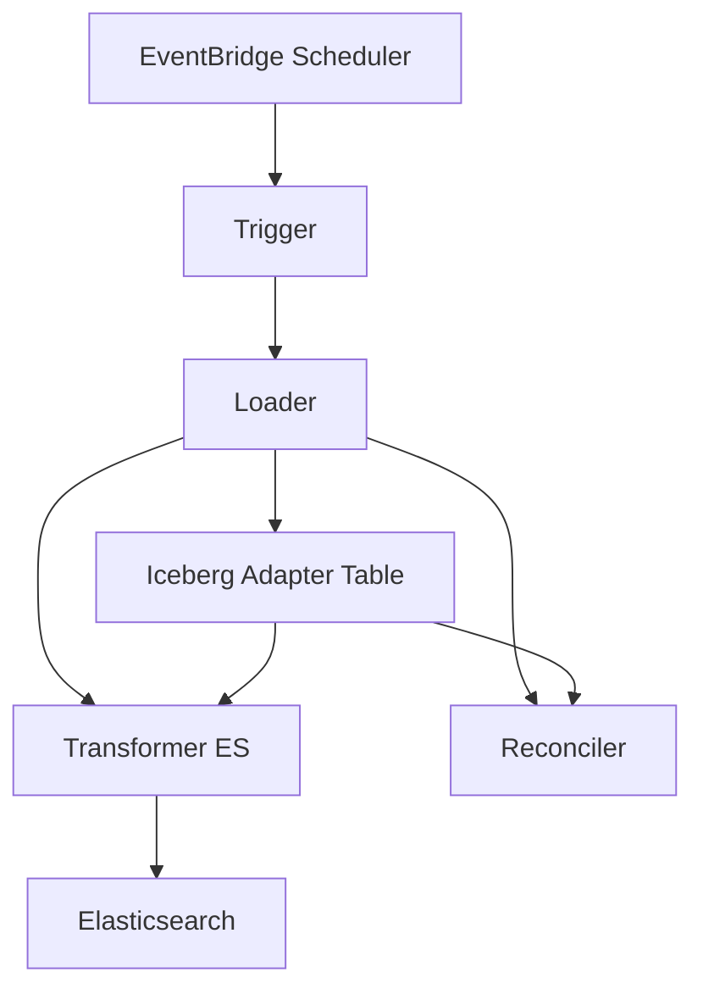
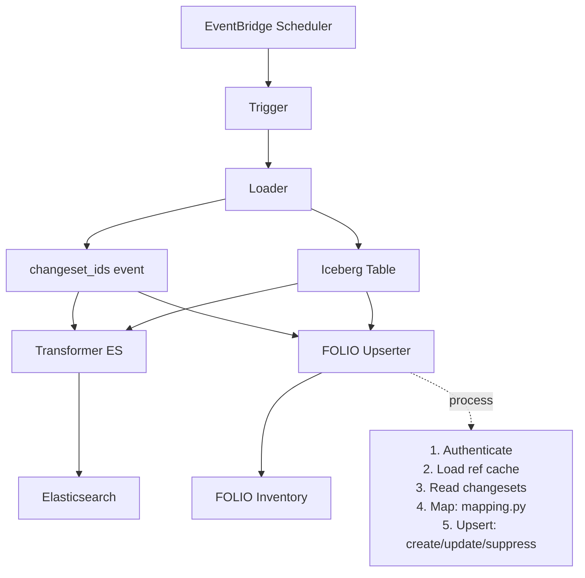
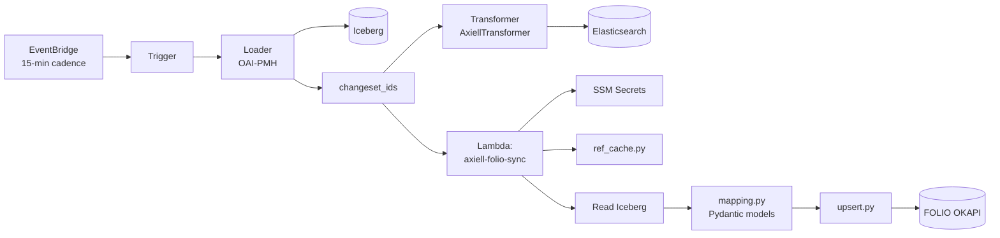
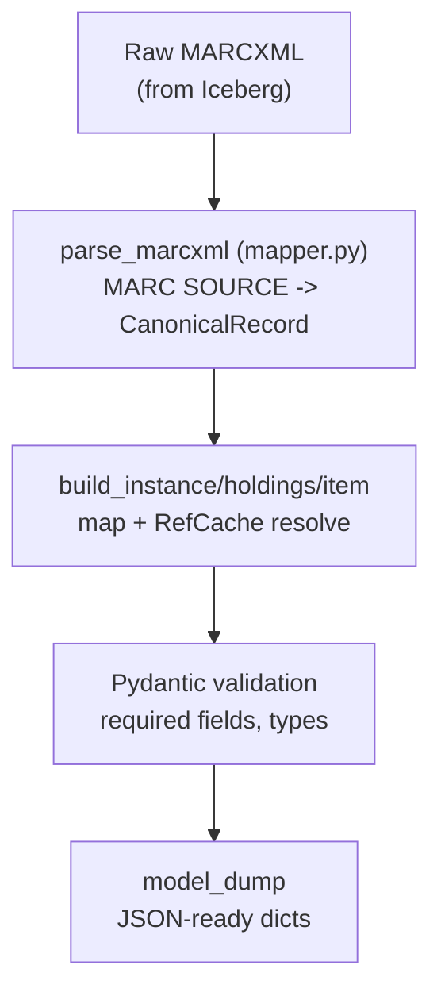
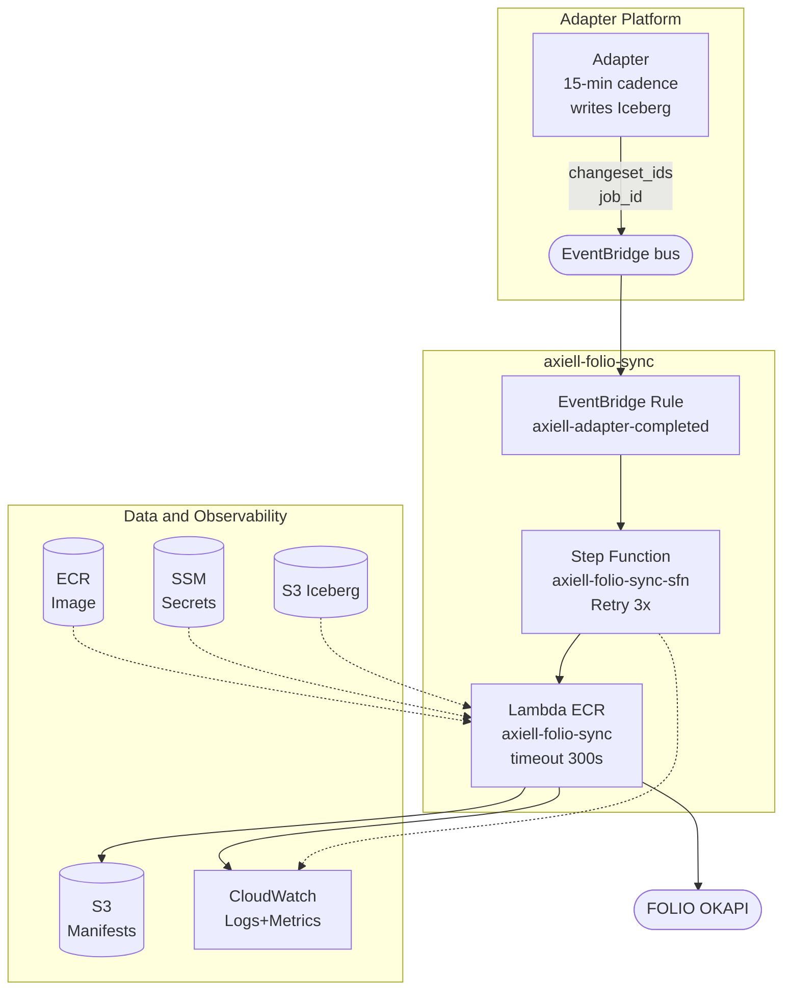
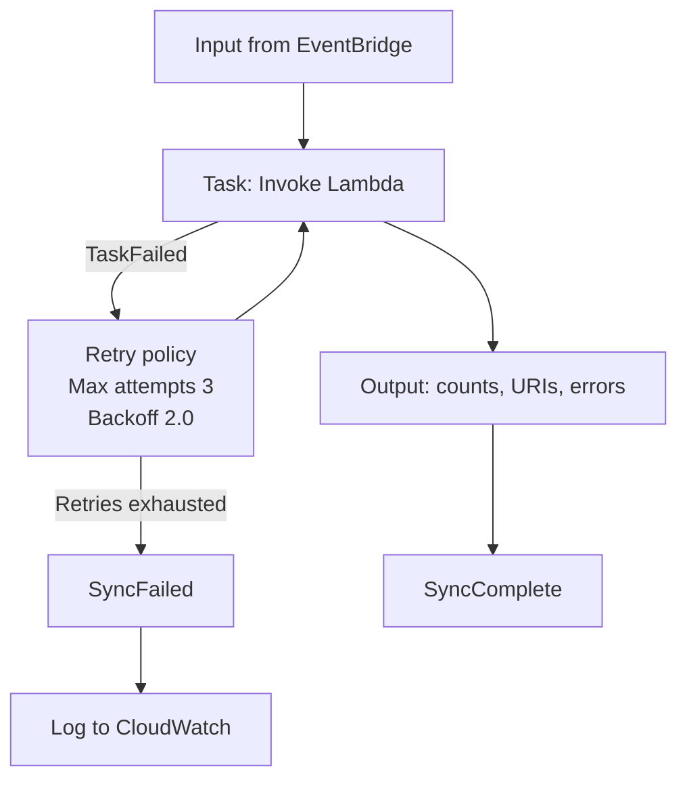

# RFC 090: CMS to LMS Sync

## Purpose

This RFC proposes an automated pipeline to synchronize data from **Axiell Collections (AxC)**, the new Content Management System (CMS), into **FOLIO**, the new Library Management System (LMS). The records from Axiell Collections need to exist in FOLIO so they can be requested and circulated in the LMS. It is designed for **idempotency** (safe to replay without duplication), **auditability** (every create / update / suppress is recorded), and **graceful error isolation** (one bad record never halts the batch).

**Last modified:** 2026-06-30T00:00:00+00:00

## Table of Contents

- [Purpose](#purpose)
- [Background](#background)
- [System Architecture](#system-architecture)
  - [Current Data Feeds for AxC and Folio Data](#current-data-feeds-for-axc-and-folio-data)
- [Proposed Change: FOLIO Item Upsert on Every Adapter Run](#proposed-change-folio-item-upsert-on-every-adapter-run)
  - [Fan-out Mechanism](#fan-out-mechanism)
  - [Target Upsert/Mapping Architecture](#target-upsertmapping-architecture)
- [Transformation Design](#transformation-design)
  - [Approach](#approach)
  - [Transformation Pipeline](#transformation-pipeline)
  - [Pydantic Mapping](#pydantic-mapping-mappingpy)
  - [Reference Data Cache](#reference-data-cache-ref_cachepy)
  - [RefCache Resolution](#refcache-resolution)
  - [Sample Field Mapping](#sample-field-mapping)
  - [FOLIO Field Mapping Reference](#folio-field-mapping-reference)
- [Change Detection Mechanism](#change-detection-mechanism)
  - [How It Works](#how-it-works)
  - [Record selection: only harvest-flagged records](#record-selection-only-harvest-flagged-records)
  - [Change Detection Signals](#change-detection-signals)
  - [Every Record in a Changeset Is Either](#every-record-in-a-changeset-is-either)
  - [Delete detection: the reconciler, not OAI tombstones](#delete-detection-the-reconciler-not-oai-tombstones)
- [Proposed AWS Architecture](#proposed-aws-architecture)
  - [Key Design Considerations](#key-design-considerations)
  - [System Diagram](#system-diagram)
  - [1. EventBridge Trigger](#1-eventbridge-trigger)
  - [2. Step Function State Machine](#2-step-function-state-machine)
  - [3. Lambda Function: axiell-folio-sync](#3-lambda-function-axiell-folio-sync)
  - [Upsert Key Strategy (Idempotency)](#upsert-key-strategy-idempotency)
  - [4. S3 Manifest Storage](#4-s3-manifest-storage)
- [Design Rationale: Why These Choices?](#design-rationale-why-these-choices)
  - [Mapping: Pydantic Models vs. YAML Mapper](#mapping-pydantic-models-vs-yaml-mapper)
  - [Orchestration: Step Functions vs. Alternatives](#orchestration-step-functions-vs-alternatives)
  - [Caching Strategy: Reference Data Scaling Options](#caching-strategy-reference-data-scaling-options)
  - [Storage: S3 NDJSON vs. Alternatives](#storage-s3-ndjson-vs-alternatives)
  - [Invocation Pattern: EventBridge Trigger & Ordering](#invocation-pattern-eventbridge-trigger--ordering)
  - [Error Handling: Per-Record Isolation](#error-handling-per-record-isolation)
- [SRS-backed Instances and the Update Path](#srs-backed-instances-and-the-update-path)
- [FOLIO API Client](#folio-api-client)
- [Cost Analysis](#cost-analysis)
  - [Current Volume: ~1,000 records/day](#current-volume-1000-recordsday)
- [Open Questions](#open-questions)
  - [Field Mapping from Axc to Folio Instance, Holdings and Items needs to be defined](#field-mapping-from-axc-to-folio-instance-holdings-and-items-needs-to-be-defined)
  - [Delete semantics: what should reconciler-detected deletes do in FOLIO?](#delete-semantics-what-should-reconciler-detected-deletes-do-in-folio)
  - [Watermark storage: where does the source timestamp live?](#watermark-storage-where-does-the-source-timestamp-live)
  - [Reference-data caching: when and how to cache across Lambda runs](#reference-data-caching-when-and-how-to-cache-across-lambda-runs)
  - [Manifest query mechanism: S3 Select is not an established org pattern](#manifest-query-mechanism-s3-select-is-not-an-established-org-pattern)
  - [Item creation should likely be gated on record `Level`](#item-creation-should-likely-be-gated-on-record-level)
  - [Item notes not visible on the FOLIO OAI-PMH feed](#item-notes-not-visible-on-the-folio-oai-pmh-feed)
- [Next Steps](#next-steps)
- [References](#references)


---

## Background

The Wellcome Collection library systems are undergoing migration. They currently operate as distinct layers: **CALM** (Collections Management), the Content Management System (CMS), serves as the 
collection metadata source of truth, while **Sierra**, the Library Management System (LMS), manages patron management, circulation, holds, and requesting. The CALM-to-Sierra harvester is the integration mechanism that synchronizes bibliographic metadata from CALM into Sierra for discovery and requesting workflows.

The library systems migration is replacing both layers. **CALM** is being migrated to **Axiell Collections**, and **Sierra** is being migrated to **FOLIO**. The current CALM-to-Sierra harvester will be superseded by an Axiell Collections-to-FOLIO integration pipeline. The data must be synchronized between the CMS and LMS so that the circulation of items and patron management can be carried out.

CALM-sourced data in Sierra is not being migrated to FOLIO. Therefore, AxC data must be synced to FOLIO to enable requesting and circulation workflows for items that were not included in the initial FOLIO migration. Library staff rely on FOLIO for real-time item availability and location data. Axiell-to-FOLIO sync is a core data pipeline for the new catalogue system and must be reliable, auditable, and manually recoverable.

## System Architecture

### Current Data Feeds for AxC and Folio Data

**Axiell Collections (AxC)** is the source: the Axiell Adapter Platform harvests AxC over
OAI-PMH every 15 minutes and writes each record as raw MARCXML into a single Apache
Iceberg table on S3, emitting on every run a *changeset*, the records created,
modified, or deleted in that window, identified by `changeset_id`. **FOLIO** is the
new system of record for library management (instances, holdings, items, patrons)
and also exposes its own OAI-PMH feed every 15 minutes.

**Volume:** 10–500 records per changeset, ~1,000 records/day across ~80 syncs.

#### Adapter pipeline



| Stage | Role |
|-------|------|
| Trigger | Compute the next harvest window from WindowStore history |
| Loader | Harvest OAI-PMH records in the window, write raw MARCXML to Iceberg, emit `changeset_ids` |
| Transformer | Read changesets from Iceberg, parse MARCXML (pymarc) into a SourceWork, index to Elasticsearch |
| Reconciler | Track GUID→ID mapping changes; emit DeletedSourceWork for superseded identifiers |

#### Key characteristics

The Axiell adapter harvests over OAI-PMH using the `oai_marcxml` metadata prefix and the `collect` OAI set, authenticating with a custom `Token` header rather than the standard `Authorization` header. Record identity comes from the `axiell-guid` extracted from MARC `001`, while visibility is controlled by the `InvisibleSourceWork` flag (MimsyWorksAreNotVisible). Harvesting runs in 15-minute windows with a 7-day lookback and a 360-minute maximum lag. All records land in a single Iceberg table per adapter, whose schema is `namespace`, `id`, `content`, `changeset`, `last_modified`, and `deleted`.

---

## Proposed Change: FOLIO Item Upsert on Every Adapter Run

### Fan-out Mechanism



The FOLIO upserter is best understood as a **new type of transformer** in the existing catalogue pipeline architecture. The architecture already has the concept of a transformer: a step that consumes a changeset from Iceberg and writes the records into a downstream sink. The current `AxiellTransformer` transforms MARCXML into a `SourceWork` and indexes it into **Elasticsearch** (the discovery sink).

The FOLIO upserter follows the same pattern but targets a different sink, the **LMS (FOLIO)**, instead of Elasticsearch, and its write operation is an **idempotent upsert of item data** (instance → holdings → item) over the FOLIO OKAPI Inventory APIs rather than an index write. In other words: same input (`changeset_ids` over the same Iceberg table), new transformer, new destination.

So after the loader emits `changeset_ids`, the event fans out to **two** independent transformers: the existing ES transformer (`AxiellTransformer`, unchanged) writing to Elasticsearch for discovery, and the new FOLIO upserter writing to FOLIO Inventory for circulation and requesting in the LMS. Both consume the same `changeset_ids` independently, and either path can fail and retry without affecting the other, so adding the LMS sink does not put the existing discovery feed at risk.

---
### Target Upsert/Mapping Architecture




## Transformation Design

### Approach

The upserter converts raw MARCXML from the AxC adapter into FOLIO payloads using **typed Python with Pydantic models** (`mapping.py`). The three payloads (Instance, Holdings, and Item) are Pydantic models with `extra="forbid"`, so the field-mapping rules are ordinary, reviewable Python and the payloads are typed contracts: a malformed payload (missing/ill-typed required field, typo'd key) **fails at build time, before any OKAPI call**, instead of surfacing as a FOLIO 422 mid-batch.

This replaces an earlier YAML-driven mapper (`mapping.yaml` + `YamlMapper`); see [Mapping: Pydantic Models vs. YAML Mapper](#mapping-pydantic-models-vs-yaml-mapper) for the trade-off.

### Transformation Pipeline



### Pydantic Mapping (`mapping.py`)

`mapping.py` is the single home for everything that decides *what an Axiell record becomes in FOLIO*: the MARC source table, normalization tables, defaults, the hrid scheme, the typed payload contracts, and the field-by-field builders.

The flow runs in three steps. `parse_marcxml()` (in `mapper.py`) first extracts MARC fields via the `MARC_SOURCE` table (e.g. `title: 245$a`, `location_code: 852$b`, `barcode: 949$a`) into a typed `CanonicalRecord`, where MARC `001` is the Axiell GUID and the basis for every hrid. `build_instance/holdings/item()` then map that record into the `Instance`, `Holdings`, and `Item` Pydantic models, resolving reference data (location, material type, loan type, holdings source, instance type) through **RefCache** and applying defaults. Finally, Pydantic validates on construction (`extra="forbid"` rejects unknown keys) and `build_payloads()` returns `{"instance", "holdings", "item", "meta"}` as JSON-ready dicts, with `meta` carrying `source_id`, the three hrids, and `mapping_version`.

This buys several things. Invalid payloads raise `MappingError`/`ValidationError` at build time, before any FOLIO write, so there are no round-trip 422s; the payload shape is an enforced typed contract (`extra="forbid"`), so a typo'd key is a build error rather than a silently dropped field; the rules, defaults, and contracts live in one reviewable Python module with full language expressiveness for normalization and conditionals; and every payload is stamped with `mapping_version` for traceability.

**hrid scheme** (the idempotency key for every upsert): `AxC-instance-{guid}`, `AxC-holding-{guid}`, `AxC-item-{guid}`. `Instance.source = "FOLIO"`. The sync creates no linked SRS MARC record, so the instance is FOLIO-native and its bibliographic fields stay editable via mod-inventory.

---

### Reference Data Cache (`ref_cache.py`)

The reference cache maintains in-memory lookups for static FOLIO configuration data that rarely changes. `RefCache.load()` fetches and indexes **six** reference sets:
- **Locations**: indexed by both code *and* name → UUID
- **Material types**: by name → UUID (e.g., "Books", "video recording")
- **Loan types**: by name → UUID (e.g., "Can Circulate", "Reference")
- **Holdings sources**: by name → UUID (e.g., "MARC")
- **Item note types**: by name → UUID (resolves the "Axiell location" note's `itemNoteTypeId`)
- **Instance types**: the resolved default type id (e.g., "text"), applied to every instance

(It also retains the full record list per set, but those are used only by the `summary()` / introspection helpers, not by the mapping.)

FOLIO APIs require UUIDs/IDs rather than human-readable names, but Axiell supplies names, so `ref_cache` translates names to FOLIO IDs; caching them avoids repeated API calls during a sync run, which helps both performance and resilience.

**Workflow:** on Lambda startup, `ref_cache.load()` fetches from the FOLIO reference endpoints; the mapper then resolves names against the cache (e.g. `location_uuid = ref_cache.location["Wellcome Science"]`); and if a name isn't found, the error is logged and the record is marked for manual review.

**Cache persistence & freshness:** `RefCache.load()` runs once at the start of each
invocation and is **not** carried across invocations.  Reloading every run
mostly re-fetches identical data; the point is simply that doing so is trivially
cheap (about six reference-endpoint GETs, a few hundred KB, ~1–3 s on a job that runs
every ~15 minutes, ~80 syncs/day), negligible next to the per-record OKAPI upserts,
and needs no extra infrastructure: no DynamoDB/ElastiCache/S3 layer, no TTL, no
cache-invalidation logic. Reading fresh each run also means that on the rare occasion
a new code does appear it is picked up on the very next sync instead of failing as a
`MappingError`, but that is a bonus rather than the reason.

The trigger to revisit is reference-load latency genuinely dominating runtime (much
higher frequency or far larger reference sets); even then the order is
**warm-singleton + reload-on-miss** first (the pattern the FOLIO token already uses),
and an external cross-run cache only beyond that.

---

### RefCache Resolution

All reference lookups (location, material type, loan type, holdings source, item note type, and the default instance type) are resolved at sync time via **RefCache**, which caches that FOLIO reference data.

**Resolution process:** on Lambda startup RefCache initializes by querying the FOLIO reference APIs once per invocation; for each record the mapper looks codes up against the cached values (an in-memory, O(1) lookup); if a code isn't found the upsert fails with `MappingError` and the record is skipped; and the resolved UUIDs are embedded directly in the payload.

**Current normalisations:** material types map from AxC `Object_category` to a FOLIO material-type name (e.g. `"archives"` → `"unspecified"`, audio → `"sound recording"`); locations map from an AxC hierarchical location code (e.g. `"215;B11;MR;84;3;7"`) to a FOLIO location UUID; loan types map from AxC `OrderingCodes` (e.g. `"Archives - Requestable"`) to a FOLIO loan type UUID; and the instance type is typically `"text"` or a domain-specific type.


---

Stamping each payload with `mapping_version` supports audit (comparing records created with different mapper versions), rollback (identifying the records affected by a mapping change by version), and metadata tracking (a historical record of the mapping logic used for each record).

###  Sample Field Mapping 

`CanonicalRecord` field = the attribute parsed from MARC via the `MARC_SOURCE`
table in `mapping.py`; the hrids are derived from the GUID (MARC `001`).

| MARC Source (Axiell) | `CanonicalRecord` field | FOLIO Target | Example |
|---------------------|------------------|--------------|----------|
| 001 (GUID) | `source_id` → `instance_hrid` | Instance `hrid` | `AxC-instance-4d8f1208-9812-4bb5-84ef-da436b22d9e2` |
| 001 (GUID) | `source_id` → `holdings_hrid` | Holdings `hrid` | `AxC-holding-4d8f1208-9812-4bb5-84ef-da436b22d9e2` |
| 001 (GUID) | `source_id` → `item_hrid` | Item `hrid` | `AxC-item-4d8f1208-9812-4bb5-84ef-da436b22d9e2` |
| 245$a | `title` | Instance `title` | Daniel Morley, an English Philosopher... |
| 852$b | `location_code` | Holdings `permanentLocationId` | resolved FOLIO location UUID |
| 852$c | `call_number_prefix` | Holdings `callNumberPrefix` | `Arch`, `Ref` |
| 852$h | `call_number` | Holdings `callNumber` | (optional) |
| 852$j | `shelving_order` | Holdings `shelvingOrder` | (optional) |
| 949$a | `barcode` | Item `barcode` | (optional) |
| 949$c | `material_type_code` | Item `materialType.id` | `Archives - Non-digital` |
| 949$l | `loan_type_code` | Item `permanentLoanType.id` | `Archives - Requestable` |
| 876$p | `copy_number` | Item `copyNumber` | `copy 1`, `copy 2` |
| 876$t | `volume` | Item `volume` | `v.1`, `disc 1 of 2` |
| 856$u | `electronic_access_uri` | Item `electronicAccess[].uri` | (optional) |
| 852$b | `location_code` | Item `notes[]`, type `Axiell location` | raw AxC location code: `215;B11;MR;84;3;7` |

The AxC location code is therefore written to FOLIO in two different fields: the Holdings `permanentLocationId` is set to the resolved FOLIO location UUID (for shelving/discovery and circulation), while the raw AxC location code is preserved as an item **note of type `Axiell location`** (for audit trail and historical reference). On update, the note is refreshed from the incoming `852$b`, so the FOLIO item always carries the latest AxC location code. (The note type name resolves to `itemNoteTypeId` via RefCache before the write; note that this note is not currently surfaced on the OAI-PMH feed, see [Item notes not visible on the FOLIO OAI-PMH feed](#item-notes-not-visible-on-the-folio-oai-pmh-feed).)

---

### FOLIO Field Mapping Reference

For a comprehensive and detailed mapping of all Axiell Collections fields to FOLIO Inventory API fields, see **[folio-axc-fields-mapping.md](folio-axc-fields-mapping.md)**.

That document provides the complete field-by-field mapping for Instance, Holdings, and Item entities, the transformation rules and MARC source information, the required-versus-optional fields for FOLIO, the reference-data requirements (locations, material types, loan types), and the field validation rules and edge cases.

---

## Change Detection Mechanism

The FOLIO upsert step leverages the existing Axiell adapter's OAI-PMH change detection to determine which records to sync.

### How It Works

OAI-PMH datestamp windows drive the harvest: the Axiell adapter only returns records whose `last_modified` falls within `[window_start, window_end)`. Each harvest window produces a unique `changeset_id`, and the records written to Iceberg in that window are tagged with it. Those Iceberg rows carry `namespace` (record type, e.g. "location", "item"), `id` (external identifier), `content` (the raw MARCXML payload), `changeset` (the changeset ID from the adapter), `last_modified` (the OAI datestamp), and `deleted` (`true` when OAI returns a tombstone). The FOLIO upserter then receives the `changeset_ids` and reads only those rows:

```python
changed_records = adapter_store.read_changed(changeset_ids)
```

### Record selection: only harvest-flagged records

Only AxC MARC records that have the **harvest flag set in MARC field `980 $a`** are synced to FOLIO. Before mapping, the upserter filters each changeset row on `980 $a`, and records without the flag are skipped entirely (never created, updated, or suppressed in FOLIO). The flag is the source-side switch by which Collection Information controls which Axiell records flow into the LMS, so the sync covers a curated subset rather than the whole changeset. (This selection step is not yet in the prototype, which currently processes every changeset row; it is required behaviour.)

### Change Detection Signals

| Signal | Source | Meaning |
|--------|--------|----------|
| Harvest flag (`980 $a`) | AxC MARC record | Record is opted in for FOLIO sync; absent means skip |
| Record in changeset | OAI-PMH datestamp window | Record was created or modified in source |
| `deleted=true` | OAI tombstone | Unreliable; best-effort only, not the authoritative delete signal |
| Payload hash mismatch | XSL output comparison (optional) | FOLIO-relevant fields actually changed |
| Reconciler GUID remap | Axiell reconciler step | Authoritative delete: old GUID superseded; suppress its FOLIO records |

### Every Record in a Changeset Is Either

Each record in a loader changeset is treated as **new** (the first time this `id` appears in Iceberg), in which case it is created in FOLIO, or **updated** (an existing `id` with a newer `last_modified`), in which case it is updated in FOLIO. Deletions are handled on the reconciler path (see [Delete detection](#delete-detection-the-reconciler-not-oai-tombstones) below), not by directly suppressing on the loader's `deleted=true` flag. The exact delete action in FOLIO (suppress vs remove, and cascade scope) remains an open policy question (see [Delete semantics](#delete-semantics-what-should-reconciler-detected-deletes-do-in-folio)).

### Delete detection: the reconciler, not OAI tombstones

Axiell's OAI tombstones (`deleted=true`) are unreliable, which is the very reason the adapter has a separate **reconciler** step. The reconciler tracks the `collectId → guid` mapping in its own Iceberg store and, when a `collectId` is remapped to a different work, emits a `DeletedSourceWork` for the superseded GUID.

This has two consequences for the FOLIO upserter. First, the upserter consumes the **loader's changeset**, so it does not see reconciler-detected deletes, which are produced by a separate, later transformer step. Second, a reconciler delete is keyed by the **old (superseded) GUID**, not by the changeset row being processed.

Suggested approach: have the **reconciler** step fan out a FOLIO suppression path that mirrors the loader's fan-out to the upsert path, reusing the existing reconciler rather than building a parallel `collectId → guid` mapping store. On a reconciler delete, suppress the FOLIO records for the old GUID (`AxC-instance-{old-guid}`) and cascade to its holdings and item, in line with the [Delete semantics](#delete-semantics-what-should-reconciler-detected-deletes-do-in-folio) question raised earlier. The loader-changeset `deleted=true` can remain a best-effort secondary signal, but the reconciler fan-out is the authoritative delete path.

---

## Proposed AWS Architecture

### Key Design Considerations

We propose a **Step Functions + Lambda + S3 architecture** with event-driven (asynchronous) invocation, per-record error isolation, and 90-day audit retention. This approach balances **operational visibility**, **fault resilience**, and **simplicity**.

| Aspect | Choice | Primary Benefit |
|--------|--------|-----------------|
| **Mapping** | Typed Pydantic models (`mapping.py`) | Build-time validation; fail fast before OKAPI, not as a FOLIO 422 |
| **Orchestration** | AWS Step Functions | Configurable retries + rich execution history for audit |
| **Compute** | Lambda (ECR container) | Stateless, scales to 0, integrates with Step Functions |
| **Data Storage** | S3 NDJSON manifests (90-day TTL) | Cost-efficient batch writes + queryable (download + `jq`, or optionally S3 Select) |
| **Trigger** | EventBridge on adapter completion | Event-driven (not polling); decoupled from adapter |
| **Invocation** | Async event → Step Function (`StartExecution`); Lambda runs synchronously within it | Decoupled from adapter; ordering via source-timestamp watermark + concurrency=1 |
| **Error Handling** | Per-record isolation | Batch completes even if individual records fail |

**Expected outcomes:** replay is safe without data corruption (idempotent upserts via FOLIO HRIDs); there is a complete audit trail, with every decision (create/update/suppress/skip) logged in S3 and CloudWatch; operational overhead stays low at ~$3–5/month for typical volume; and the mental model remains clear, with no eventual-consistency puzzles and ordered execution.

---

### System Diagram



### 1. EventBridge Trigger

**Rule**: `axiell-folio-sync-axiell-adapter-completed`

**Event Pattern**:
```json
{
  "source": ["axiell.adapter"],
  "detail-type": ["axiell.adapter.completed"],
  "detail": {
    "transformer_type": ["axiell"]
  }
}
```

**Event Payload** (emitted by Axiell adapter):
```json
{
  "changeset_ids": ["axiell-cs-20260622-001", "axiell-cs-20260622-002"],
  "job_id": "adapter-job-xyz-12345",
  "transformer_type": "axiell",
  "dry_run": false,
  "sample_limit": null
}
```

`dry_run` (default `false`) makes the Lambda resolve and **log** every planned create/update/suppress action and still write the manifests, but issue **no** FOLIO writes. It is the safe way to validate a changeset (or the initial backfill) before going live. `sample_limit` caps the number of records processed, for smoke-testing against dev FOLIO.

**IAM Permissions**: `states:StartExecution` on Step Function ARN

---

### 2. Step Function State Machine

**Name**: `axiell-folio-sync-sfn`  
**Type**: STANDARD

**Flow**:


**Execution History**: Stored in CloudWatch Logs (`/aws/states/axiell-folio-sync-sfn`, 30-day retention)

**IAM Role Permissions**:
- `lambda:InvokeFunction` on sync Lambda ARN
- `logs:CreateLogGroup`, `logs:CreateLogStream`, `logs:PutLogEvents` for CloudWatch

---

### 3. Lambda Function: axiell-folio-sync

**Docker Image**: ECR (`uk.ac.wellcome/axiell-folio-sync:TAG`)

**IAM & secrets (least privilege):** the Lambda's execution role needs `ssm:GetParameter` (+ KMS decrypt) for the OKAPI credential SecureString, read access to the Iceberg/S3 Tables data, `s3:PutObject` to the manifests bucket, `cloudwatch:PutMetricData`, and CloudWatch Logs write. FOLIO credentials live only in SSM as a SecureString and are never baked into the image or environment.

**Execution Steps**:

#### Step 1: Authenticate with FOLIO

Auth is delegated to the shared `folio-client` (see [FOLIO API Client](#folio-api-client)): a `FolioClient` is built with a credentials provider that reads SSM, and it logs in lazily on first use.
```
SSM Parameter Store (SecureString)
  Path: /axiell-folio-sync/okapi-creds
  Value: {"username": "service_account", "password": "..."}

FolioClient → POST /authn/login   (lazy, on first request)
  x-okapi-tenant: wellcome
  Body: credentials
  Response: x-okapi-token (valid 24h)
  → Cached for the invocation; auto re-auth once on a 401
```

#### Step 2: Scan Iceberg Changesets
```
Query S3 Tables Iceberg catalog
  Bucket: {S3_TABLE_BUCKET_ARN}
  Table: {ICEBERG_TABLE_NAME} (e.g., default.axiell_changesets)
  
SELECT [namespace, id, content, changeset, last_modified, deleted]
WHERE changeset IN ({changeset_ids from event})

Schema:
  namespace        string    e.g., "location", "item"
  id               string    external identifier from Axiell
  content          string    raw MARCXML payload from OAI-PMH
  changeset        string    changeset ID from adapter
  last_modified    timestamp when record changed
  deleted          boolean   true if marked deleted
```

#### Step 3: Map & Validate
```python
from axiell_folio_sync.mapping import build_payloads, MappingError
from axiell_folio_sync.ref_cache import RefCache

# Load tenant reference data once per run (locations, material/loan types, etc.).
ref_cache = RefCache(folio_get).load()

for row in iceberg_records:
    # Record selection: only records flagged for harvest (MARC 980 $a) are synced.
    # Unflagged records are skipped before mapping: no create/update/suppress.
    if not has_harvest_flag(row["content"]):   # 980 $a present
        continue
    try:
        # build_payloads() parses the MARCXML (mapper.parse_marcxml → CanonicalRecord),
        # builds the typed Pydantic Instance/Holdings/Item models with RefCache
        # resolution + defaults, and returns JSON-ready dicts. Pydantic validates on
        # construction (extra="forbid"), so a malformed record fails here, before
        # any OKAPI call, rather than as a FOLIO 422.
        mapped = build_payloads(row["content"], ref_cache, deleted=bool(row["deleted"]))
        # → {"instance": {...}, "holdings": {...}, "item": {...}, "meta": {...}}
        #   meta carries source_id, the three hrids, and mapping_version.
        payloads.append(mapped)
    except MappingError as e:
        # Capture error, continue to next record
        errors.append({
            "source_id": row['id'],
            "type": "mapping",
            "detail": str(e)
        })
        continue
```

#### Step 4: Upsert to FOLIO (Per Record)

Every entity is matched by its **hrid** (from `meta`) and created or updated (no
blind creates), which is what makes replay idempotent. On an existing record the
update is additionally gated by the **stale-write guard**: it applies only if the
incoming Axiell `last_modified` is strictly newer than the watermark on the FOLIO
record, otherwise the record is skipped (see [Invocation Pattern](#invocation-pattern-eventbridge-trigger--ordering)).

```
For each mapped record:
  Execute in order: Instance → Holdings → Item (each references the prior id)

  Instance:
    Resolve by hrid: GET /inventory/instances?query=(hrid=={instance_hrid})
      If exists: PUT /inventory/instances/{id}   → "update"
      Else:      POST /inventory/instances        → "create"
                 (some POSTs return 201 with an empty body → re-resolve id by hrid)

  Holdings (linked to the Instance id):
    Resolve by hrid in /holdings-storage/holdings → PUT (update) or POST (create)

  Item (linked to the Holdings id):
    Resolve by hrid in /inventory/items → PUT (update) or POST (create)
    (note types are resolved to itemNoteTypeId before the write)

  Loader tombstones (`deleted=true`) are treated as advisory only:
    • record and metric the signal for audit/debug
    • do not perform suppress/remove from this path
    • apply delete actions only from reconciler-generated delete events

Per-record error handling:
  • HTTP 4xx/5xx → captured, batch continues
  • All errors logged to CloudWatch AND accumulated in the S3 failures manifest
```

### Upsert Key Strategy (Idempotency)

**Matching**: All entities are matched against existing FOLIO records by `hrid`:

- Instance: `GET /inventory/instances?query=(hrid==AxC-instance-{guid})`
- Holdings: `GET /holdings-storage/holdings?query=(hrid==AxC-holding-{guid})`
- Item: `GET /inventory/items?query=(hrid==AxC-item-{guid})`

The `hrid` is derived from the Axiell GUID (MARC 001), not the `collectId` (object number). Axiell reuses `collectId`s; keying on GUID prevents a reused id from overwriting the wrong FOLIO record. The reconciler emits `DeletedSourceWork` events when a GUID is superseded, so old FOLIO records are cleaned up automatically.

**Behavior:** when a record is found, its mutable fields are updated while FOLIO-internal metadata is preserved; when it isn't found, a new record is created; and when required fields are missing, the record is skipped with a structured error logged. An update applies only if it passes the stale-write guard (incoming Axiell `last_modified` strictly newer than the watermark on the existing FOLIO record), so out-of-order or replayed changesets never overwrite newer state (see [Invocation Pattern](#invocation-pattern-eventbridge-trigger--ordering)).

**Replay safety:** upserts are idempotent by `hrid`, so processing the same changeset twice produces the same outcome, and manifest deduplication checks whether a changeset was already processed successfully before running it again.

#### Step 5: Batch & Write Manifests
```python
# Success NDJSON (one record per line, 5K records per batch)
for i in range(0, len(success_results), 5000):
    batch = success_results[i:i+5000]
    ndjson_lines = [json.dumps(r) for r in batch]
    s3.put_object(
        Bucket=MANIFEST_S3_BUCKET,
        Key=f"manifests/{job_id}.ids.ndjson",
        Body="\n".join(ndjson_lines)
    )

# Error NDJSON (one error per line)
if errors:
    error_lines = [json.dumps(e) for e in errors]
    s3.put_object(
        Bucket=MANIFEST_S3_BUCKET,
        Key=f"manifests/{job_id}.ids.failures.ndjson",
        Body="\n".join(error_lines)
    )

# Metadata summary
metadata = {
    "job_id": job_id,
    "start_time": "2026-06-22T10:15:03Z",
    "end_time": "2026-06-22T10:15:45Z",
    "status": "SUCCESS|PARTIAL|FAILED",
    "counts": {
        "total": 247,
        "created": 10,
        "updated": 200,
        "suppressed": 25,
        "skipped": 12,
        "failed": 0
    },
    "success_manifest_uri": f"s3://{bucket}/manifests/{job_id}.ids.ndjson",
    "error_manifest_uri": f"s3://{bucket}/manifests/{job_id}.ids.failures.ndjson"
}
s3.put_object(
    Bucket=MANIFEST_S3_BUCKET,
    Key=f"manifests/{job_id}.manifest.json",
    Body=json.dumps(metadata, indent=2)
)

# CloudWatch Metrics
cloudwatch.put_metric_data(
    Namespace="AxiellFolioSync",
    MetricData=[
        {"MetricName": "RecordsCreated", "Value": metadata['counts']['created']},
        {"MetricName": "RecordsUpdated", "Value": metadata['counts']['updated']},
        {"MetricName": "RecordsSuppressed", "Value": metadata['counts']['suppressed']},
        {"MetricName": "RecordsSkipped", "Value": metadata['counts']['skipped']},
        {"MetricName": "RecordsFailed", "Value": metadata['counts']['failed']},
    ]
)

return metadata
```

---

### 4. S3 Manifest Storage

The NDJSON-manifest output is **the existing catalogue-pipeline pattern**: the adapter platform already writes per-job NDJSON id manifests to S3, and this step deliberately reuses that convention (one record per line, an `.ids.ndjson` success file plus a `.ids.failures.ndjson` error file and a `.manifest.json` summary per job). Adopting it keeps downstream tooling, backup/recovery, and operational query patterns consistent with the rest of the pipeline.

**Bucket**: `axiell-folio-sync-manifests-{account-id}-{region}`

**File Structure**:
```
manifests/
  - adapter-job-xyz-20260622-10-15.ids.ndjson
  - adapter-job-xyz-20260622-10-15.ids.failures.ndjson
  - adapter-job-xyz-20260622-10-15.manifest.json
  - adapter-job-xyz-20260622-10-30.ids.ndjson
  - ...
```

**Sample Success Record** (NDJSON):
```json
{
  "source_id": "location_item_123",
  "instance": {
    "action": "update",
    "id": "inst-abc-def",
    "hrid": "HRID-LOC-123"
  },
  "holdings": {
    "action": "createupdate",
    "id": "hold-xyz-uvw"
  },
  "item": {
    "action": "create",
    "id": "item-001-002"
  },
  "errors": []
}
```

**Sample Error Record** (NDJSON):
```json
{
  "source_id": "location_item_456",
  "error": "Mapping error: missing 245$a (title)",
  "detail": "Pydantic build raised MappingError before any OKAPI call",
  "type": "mapping"
}
```

**Lifecycle Policy**: 90-day expiration (auto-delete old manifests)

---

## Design Rationale: Why These Choices?

### Mapping: Pydantic Models vs. YAML Mapper

| Approach | Pros | Cons |
|----------|------|------|
| **A: YAML mapper** (`mapping.yaml` + `YamlMapper`) | Mapping config separated from code; in principle non-programmers can read/adjust rules; changes are config-only | Errors surface only at runtime (often as a FOLIO 422); no type safety, so a typo'd key or wrong shape passes silently; a second engine (YAML schema + interpreter) to build, test, and document; awkward for normalization tables, per-field defaults, and composite hrids |
| **B: Typed Pydantic models** (`mapping.py`, chosen) | Validation at build time before any OKAPI call; payload shape is a typed contract (`extra="forbid"`); rules, defaults, and contracts in one reviewable module; full Python for normalization/conditionals; payloads stamped with `mapping_version` | Mapping changes need a Python edit + redeploy, not a config tweak; reading the rules assumes Python familiarity |

We chose the typed Pydantic models (B). The decisive factor is *when* errors surface: with typed models a missing or ill-typed required field (or an unknown key, since the models are `extra="forbid"`) raises `MappingError`/`ValidationError` during the build step, before any OKAPI call, whereas the YAML approach deferred the same failures to a FOLIO 422 mid-batch that is far harder to trace. Making the payload a typed contract also means a typo'd key is a build error rather than a silently dropped field, so the mapping and the FOLIO contract cannot drift apart unnoticed. Beyond correctness, it collapses two engines into one: ordinary Python replaces a bespoke YAML schema and its interpreter, so there is less to build, test, and document, and the normalization tables, defaults, and hrid scheme live beside the models. Every payload is also stamped with `mapping_version`, so any record in FOLIO or a manifest traces back to the exact rules that produced it.

The YAML mapper's headline appeal, letting non-programmers edit mappings as config, every rule change still went through review, tests, and a deploy, so config-versus-code made little practical difference, while the absence of type safety let malformed output reach FOLIO and fail there. As the rules grew (normalization tables, per-field defaults, composite GUID-based hrids) they simply read more clearly as Python than as declarative YAML.

> The YAML mapper (`mapping.yaml` + `YamlMapper`) was the original prototype design and has been **superseded** by the Pydantic approach. Remaining `mapping.yaml` references elsewhere in this RFC are historical.

---

### Orchestration: Step Functions vs. Alternatives

| Approach | Pros | Cons | Cost/mo |
|----------|------|------|---------|
| **A: Direct Lambda** (EventBridge → Lambda, fire-and-forget) | Fewer services, lower overhead, fastest time-to-invocation | No built-in retry logic, no execution history, hard to extend, silent failures possible | ~$2 |
| **B: Step Functions + Lambda** (chosen) | Explicit retry policy + audit trail, easy to parallelize later, clear visibility into success/failure | Extra service, marginal latency added | ~$3–5 |
| **C: Async Queue** (EventBridge → SQS → Lambda workers) | Decouples producer/consumer, handles bursts, resilient to adapter restarts | Complex ordering semantics, harder to reason about, no clear success/failure signal, monitoring overhead | ~$10–15 |

We chose Step Functions + Lambda (B): it buys an explicit retry policy and a full execution history. Every state transition is logged to CloudWatch, so a sync that fails partway is diagnosable from the execution history rather than by reconstructing state from Lambda logs, and max attempts and backoff are declarative, so operations can tune retries in the state-machine definition without code changes. The adapter triggers the sync asynchronously (`StartExecution`) and does not block; ordering safety comes from source-timestamp watermarking plus a Step Functions concurrency limit of 1 (see [Invocation Pattern](#invocation-pattern-eventbridge-trigger--ordering)), not from backpressure. The design also leaves a clean extension point for scale: when volume outgrows a single invocation we swap in a Step Functions `Map` state to fan out per changeset, with no change to the manifest format. The cost is immaterial: pennies a month in state transitions at ~80 syncs/day (~2,400/month).

A direct EventBridge→Lambda trigger (A) was rejected because it gives no failure signal, no automatic retry, and no execution history, so debugging would mean parsing Lambda logs. An async SQS queue (C) is cheaper per invocation but doesn't guarantee processing order within a batch, needs workers to coordinate which changeset they own, and carries monitoring overhead (error tracking, retries, dead-letter management) that isn't justified at current volume.

### Caching Strategy: Reference Data Scaling Options

Reload-per-run assumes the reference set is small enough to bulk-load into Lambda memory cheaply (see [Reference Data Cache](#reference-data-cache-ref_cachepy)). If we ever need **much more** reference data (many more types, or large per-record lookups), the choice of caching architecture matters. Options, cheapest first:

| Option | What it is | Best when | Cost / overhead | Freshness control |
|--------|-----------|-----------|-----------------|-------------------|
| **Warm singleton + reload-on-miss** | Module-global cache reused across warm invocations; fetch-and-memoize a code on a cache miss | Set still fits in memory; modest growth | None (in-process) | Self-healing on miss; lost on cold start |
| **S3 snapshot + scheduled refresher** | A cron (EventBridge) Lambda rebuilds a serialized snapshot (JSON/Parquet) from FOLIO every N hours; the sync Lambda reads it at startup (one GET) instead of N FOLIO calls | Whole set scanned each run; want to decouple sync from FOLIO availability | ~pennies/mo + one extra scheduled Lambda | Snapshot age = refresh cadence; pair with reload-on-miss |
| **DynamoDB lookup table** | Refresher populates `(type, code) → uuid`; sync Lambda `BatchGetItem`s only the codes a changeset needs | Set too big for memory, or only a subset is needed per run | On-demand $/read; native TTL | TTL / refresher cadence; pair with reload-on-miss |
| **ElastiCache (Redis)** | Shared in-memory cache across all invocations | Very large + hot lookups at high concurrency | Always-on (~$12+/mo), **requires VPC** (ENI cold-start + NAT to reach FOLIO/AWS APIs) | TTL |

**Recommended progression:** stay on reload-per-run → **S3 snapshot + scheduled refresher** (cheap, no VPC, scales via columnar formats, decouples from FOLIO reference endpoints) → **DynamoDB** only once the set outgrows Lambda memory or you genuinely need selective point lookups → **ElastiCache** only for high-concurrency hot-lookup workloads that justify always-on infra and the VPC tax. In every tier, keep a **reload-on-miss fallback to FOLIO** so a newly-added code resolves on first sight rather than failing the record.

---

### Storage: S3 NDJSON vs. Alternatives

| Approach | Pros | Cons | Cost/mo (90-day) |
|----------|------|------|------------------|
| **A: DynamoDB** (per-record writes, TTL) | Query-friendly, real-time dashboards possible, strong consistency | O(n) write cost, schema evolution painful, expensive for batches, not auditable | ~$20–50 |
| **B: S3 NDJSON** (chosen) | Batched writes (low cost), queryable (download + `jq`; Athena or S3 Select optional), matches the pipeline's NDJSON-manifest pattern, audit via versioning, easy to compress/archive | Requires S3 Select for queries (not real-time), not ideal for high-cardinality point lookups | ~$1–2 |
| **C: Streaming** (Kinesis/Firehose → Parquet) | High throughput, good for ML pipelines, efficient compression | Overkill for current volume, adds infrastructure complexity, higher cost | ~$5–15 |

We chose S3 NDJSON (B), and write-scaling is the main driver: per-record DynamoDB writes scale O(n) with record count, whereas the upserter batches its manifest writes into one S3 PUT per run (up to 5,000 records per object). At the current ~1,000 records/day across ~80 syncs that is about one object per run, so the batched model stays flat as volume grows rather than scaling per record. It is also explicitly the existing pipeline pattern rather than a new one: the adapter platform already emits per-job **NDJSON manifests** to S3, so reusing that format (and S3 generally) keeps backup, recovery, query, and downstream tooling consistent across the pipeline. And it stays queryable after the fact without any ETL. **S3 Select** is one convenient option (e.g. `SELECT * FROM s3://bucket/manifest.ndjson WHERE errors > 0`, ~500 ms on a 100 KB file), but note S3 Select is **not currently used elsewhere in the org**, so we don't depend on it: because the manifests are plain NDJSON, a failed-record list is equally available by just downloading the object and piping it through `jq`/`grep`, or by pointing Athena at the prefix if ad-hoc SQL is ever wanted. S3 Select is a nicety, not a load-bearing part of the design; whether to adopt it is an open question (below). S3 versioning provides an audit trail (every write is a recoverable object version, with the metadata JSON tracking historical jobs), and after 90 days manifests archive cheaply to Glacier, something DynamoDB has no low-cost equivalent for.

DynamoDB (A) was rejected on fit rather than headline cost (at ~1,000 writes/day either store is cheap), because its per-record write model scales O(n), schema changes require a scan-and-rewrite, and there's no clean way to answer audit questions like "what was deleted last week?". Streaming via Kinesis/Firehose (C) is built for thousands of records per second (overkill for 10–500-record changesets) and adds buffer/flush operational complexity we don't need.

---

### Invocation Pattern: EventBridge Trigger & Ordering

EventBridge publishes changeset events to Step Functions via `StartExecution` (asynchronous, fire-and-forget); the adapter does not block waiting for the sync to complete. Step Functions provides the execution visibility and retry policy, and all invocations (initial or retry) are decoupled from the adapter.

However, concurrent or retried executions create an **ordering risk**: if two changesets arrive within ~45 s of each other, or if a failed changeset is retried while a newer one is in flight, a naive last-write-wins upsert could apply an older state after a newer one, corrupting the FOLIO record. Similarly, idempotent replays (re-running failed changesets after a fix) must be no-ops if a newer changeset has already updated the same record.

**Solution: Source-Timestamp Watermarking.** The upsert layer compares each incoming record's Axiell `last_modified` timestamp (from the source data) against a watermark stored on the FOLIO record. The write proceeds only if the incoming timestamp is strictly newer; otherwise the record is skipped, leaving the FOLIO state intact. Where exactly that watermark lives in FOLIO (an administrative note, a custom property, or a version field) is itself an open question; see [Watermark storage](#watermark-storage-where-does-the-source-timestamp-live). This ensures:
- Out-of-order concurrent executions apply updates in source-timestamp order, not invocation order.
- Replays (re-running failed changesets) are idempotent: an older changeset re-run after a newer one succeeds does not overwrite the newer state.
- No coupling between adapter and sync (the adapter remains fire-and-forget).

**Concurrency control:** A Step Functions concurrency limit of 1 (via the state machine definition) is a secondary guard, preventing the GET–PUT gap between a query and an upsert; with a limit of 1, only one execution can be in the `Lambda` state at a time, so even if two changesets arrive within milliseconds, the second waits for the first to commit. This is loose (the adapter cadence is 15 minutes, so concurrency is naturally rare) but provides an extra safeguard against read-skew during retries.

Combined, these two mechanisms ensure ordering safety without blocking the adapter or introducing a queue.

---

### Error Handling: Per-Record Isolation

The guiding policy is that one bad record must never halt the batch.

Per-record errors are non-blocking. A mapping error (Pydantic validation, a missing required field, or an unresolved reference) is captured as `{"source_id": "...", "type": "mapping", "detail": "..."}` and an API error (FOLIO returns 4xx/5xx) as `{"source_id": "...", "type": "api", "detail": "..."}`; in either case the record is written to the S3 error manifest and processing moves on to the next record. Batch-level errors, by contrast, are blocking: an OKAPI auth failure, an Iceberg connection failure, or an S3 write failure raises an exception that the Step Function retries up to `max_retries`, and if those are exhausted the execution ends in the terminal `SyncFailed` state and raises an alert (see the alert path below).

Failures are observable across four channels: CloudWatch Logs (`/aws/lambda/axiell-folio-sync`) for detailed per-record execution, the S3 `.ids.failures.ndjson` manifest for a queryable error list (via a plain download + `jq`, or optionally S3 Select; see the storage note), CloudWatch Metrics (`RecordsFailed`, `RecordsCreated`, and the like) for alerting on a high failure rate, and the Step Function history (`/aws/states/axiell-folio-sync-sfn`) for state transitions and retry events.

**Skipped records are also accounted for, not dropped silently.** Records skipped before a write (no `980 $a` harvest flag, `Level` gating, or the stale-write guard) are counted in a `RecordsSkipped` metric and recorded in the run's metadata manifest, so "why didn't record X appear in FOLIO?" is answerable after the fact rather than being an invisible no-op.

**Alert path:** alerting follows the existing pipeline pattern: a **CloudWatch metric alarm** (on `RecordsFailed`/the failure rate, and on `SyncFailed` Step Function executions) fires into the team's **Slack** channel via **Amazon Q Developer in chat applications**. No new notification mechanism is introduced; the alarms are wired to the same SNS-topic → Amazon Q → Slack route already used elsewhere in the catalogue pipeline.

---

## SRS-backed Instances and the Update Path

A consideration worth making explicit for the update path. Some FOLIO instances are backed by **Source Record Storage (SRS)** as MARC, for example anything migrated or loaded as MARC. For those records the bibliographic fields are controlled by the underlying SRS MARC record and **cannot be updated through the mod-inventory instance API**; only administrative data is editable there. MARC edits go through **quickMARC**, which writes to SRS and syncs the Inventory record. A `PUT` to mod-inventory may therefore fail or be silently ignored for an SRS-backed instance, whereas the current update logic assumes the PUT takes effect.

**which storage do we create records in, **Inventory-native** (FOLIO source) or **MARC/SRS**?**
Records created the two ways behave differently on update, so a mixed estate is harder to reason about and maintain. This sync currently creates Inventory-native instances (`Instance.source = "FOLIO"`, with no linked SRS record), which keeps the bibliographic fields editable through mod-inventory and keeps the PUT-based update path valid.

**Catalogue-pipeline impact:** the catalogue pipeline harvests FOLIO over OAI-PMH using the `marc21_withholdings` prefix (see `catalogue_graph/src/adapters/extractors/oai_pmh/folio/config.py`). Under that prefix the instance bib comes from SRS when an SRS record is present, or is generated on the fly from Inventory depending on the **mod-oai-pmh record-source** setting, while holdings and items come from Inventory. So whether the records this sync creates appear in that feed, and in what form, depends on the storage type we choose together with the mod-oai-pmh configuration. This has now been confirmed via the prototype for Inventory-native records: a `source = "FOLIO"` instance created here is updatable through mod-inventory and is received on the FOLIO adapter in the catalogue pipeline. One gap remains under investigation, the item notes not appearing on the OAI-PMH feed; see [Item notes not visible on the FOLIO OAI-PMH feed](#item-notes-not-visible-on-the-folio-oai-pmh-feed).

---

## FOLIO API Client

OKAPI traffic goes through the shared **`folio-client`** package (`prototypes/folio-client/`), the same dependency-free OKAPI client used by the folio-api Lambda and the CLI scripts. It is pure standard library (`urllib` + `ssl`), so it adds no third-party dependency to the bundle, and the build vendors its source into the image. The Lambda declares it as a path dependency (`[tool.uv.sources]` in `axiell-folio-sync/pyproject.toml`) and wires it up in `axiell_folio_sync.py`: a `FolioClient` is constructed with a `credentials_provider` (the SSM lookup) and `ssl_context_from_env()`, then a thin adapter (`_make_folio_callables`) wraps it into the `folio_get` / `folio_post` / `folio_put` callables that `ref_cache.py` and `upsert.py` consume.

**Responsibilities:** the client authenticates to FOLIO via OKAPI (`/authn/login`) and refreshes the token automatically on a 401; the upsert layer (`upsert.py`) resolves existing records by CQL query (a GET before each write) and creates (POST), updates (PUT), or suppresses deleted records per entity.

**Token management:** `FolioClient` logs in lazily on the first request using credentials from SSM, caches the resulting token (valid 24 hours, comfortably longer than the 5-minute Lambda execution) for the whole invocation (and across warm invocations on the same instance), and re-authenticates once automatically on a 401, so there is no per-call refresh overhead.

---


## Cost Analysis

### Current Volume: ~1,000 records/day

At ~80 syncs/day the pipeline runs ~2,400 times/month, so the monthly quantities below derive from that:

| Service | Operation | Qty/mo | Rate | Cost/mo |
|---------|-----------|--------|------|---------|
| Lambda | ~2,400 invocations × ~60s × 512 MB | ~2,400 invocations | $0.0000167/GB-s | ~$1.20 |
| Step Functions | ~2,400 state transitions | ~2,400 transitions | $0.000025/transition | ~$0.06 |
| EventBridge | ~2,400 events | ~2,400 events | $1/M events | ~$0.00 |
| S3 (manifests) | ~2,400 objects written, 90-day retention | ~2,400 objects + storage | $0.005/K PUTs + $0.023/GB/mo | ~$1.50 |
| CloudWatch Logs | ~2,400 × 5 KB ≈ 12 MB/month | 12 MB ingested | $0.50/GB ingested | ~$0.20 |
| **Total** | | | | **~$3–5** |


---
## Open Questions

### Field Mapping from Axc to Folio Instance, Holdings and Items needs to be defined

The field mapping still needs to be finalised with Collection Information; the sample file **[folio-axc-fields-mapping.md](folio-axc-fields-mapping.md)** has been shared with them for feedback. A minimum stub record also needs to be defined, and the source of data (MARC vs FOLIO) for inventory types remains open and should be tested with both options.

### Delete semantics: what should reconciler-detected deletes do in FOLIO?

Raised here for an answer, not settled. In FOLIO there are different operations: *suppress* (`discoverySuppress=true`, optionally `staffSuppress=true`) hides the record while preserving it and its links, so it is reversible and audit-friendly; *remove* (a hard `DELETE`) deletes it outright, which is irreversible, and FOLIO refuses to delete a parent that still has dependents. As a starting point we'd **suggest `discoverySuppress=true`** (preserve-and-hide), but that is a recommendation to confirm with Collection Information, not a decision. A second part of the question is whether the action **cascades** from instance → holdings → item or acts on the item only; this interacts with the [1:1-vs-multi-item question](#item-creation-should-likely-be-gated-on-record-level), since an instance shared by other items must not be suppressed or removed when one item is deleted.

Specific points to resolve with Collection Information: whether suppressed items should remain queryable by staff (i.e. whether to also set `staffSuppress`); how an item-level deletion behaves when its holdings or instance still have other dependents; whether deletion should propagate in either direction (item → holdings → instance, or the reverse); and the retention policy for suppressed records in the audit log.

### Watermark storage: where does the source timestamp live?

The stale-write guard (see [Invocation Pattern](#invocation-pattern-eventbridge-trigger--ordering)) needs the Axiell `last_modified` of the last applied change stored **on the FOLIO record** so the next write can compare against it. FOLIO does not offer an obvious home for this: `_version` is mod-inventory's optimistic-locking counter (not a source timestamp), and `discoverySuppress` is a boolean. Candidates are an **administrative note**, a **custom property**, or a dedicated field, each with trade-offs for visibility, OAI-PMH leakage, and whether it survives a quickMARC/SRS round-trip. The storage location needs to be decided (and confirmed not to pollute the catalogue feed) before the guard can be implemented.

### Reference-data caching: when and how to cache across Lambda runs

Today `RefCache` reloads all six reference sets on every invocation, which is the right trade-off at current volume (see [Reference Data Cache](#reference-data-cache-ref_cachepy)). The open question is what happens if the reference set grows substantially. We would need to decide the size or load-latency threshold at which caching across runs is worth the added complexity. Staleness is unlikely to be the blocker: the reference data changes rarely, so a long TTL would seldom be stale, and a reload-on-miss fallback would keep a newly-added code from failing as a `MappingError`. So the question is mostly about whether the saved reload justifies the extra infrastructure. We would also need to pick a tier when we get there: the progression runs from a warm-singleton with reload-on-miss, to an S3 snapshot rebuilt by a scheduled refresher, to DynamoDB, and only then to ElastiCache (see [Caching Strategy: Reference Data Scaling Options](#caching-strategy-reference-data-scaling-options) for the trade-offs).

### Manifest query mechanism: S3 Select is not an established org pattern

The design mentions **S3 Select** as a convenient way to query the NDJSON manifests (e.g. list failed records), but S3 Select is **not used anywhere else in the org today**, so adopting it would be a new pattern to learn, permission, and maintain. The design deliberately does not depend on it: the manifests are plain NDJSON, so the same questions can be answered by downloading the object and using `jq`/`grep`, or by pointing Athena at the manifests prefix. Open question: do we standardise on a query mechanism (plain download + local tooling, S3 Select, or Athena/Glue), and is it worth introducing S3 Select solely for this pipeline? Until decided, treat S3 Select as optional and lead with download + `jq` for operational investigation.

### Item creation should likely be gated on record `Level`

The legacy CALM→Sierra transform (`docs/discovery/CalmInnopac.xsl`) only attaches an item (its MARC `949`) when the record's `Level` is "Item"; higher levels (Collection, Series, File, …) get a bib record with no item. The current prototype instead builds an instance, holdings, **and** item for every record, regardless of level. We need to confirm with Collection Information whether the AxC → FOLIO mapping should branch the same way (item only for Item-level records, instance/holdings-only above that) and, if so, how `Level` arrives in the harvested MARCXML so the mapper can read it. This also backs the **1:1 instance-to-item** assumption: `CalmInnopac.xsl` produces at most one item per record (no `for-each` over copies/locations, and a multi-location attempt was left disabled), so multiple items per record is not established behaviour and would be a deliberate future extension rather than something to match on day one.

### Item notes not visible on the FOLIO OAI-PMH feed

Confirmed via the prototype: FOLIO-native instances (`source = "FOLIO"`) created by this sync **can** be updated through mod-inventory, and the records **are** received on the FOLIO adapter in the catalogue pipeline (so the storage-type and catalogue-feed concerns are largely settled for Inventory-native records). One issue remains open: the item **notes list does not appear on the OAI-PMH feed** (`marc21_withholdings`). The records otherwise come through, but the notes we set (for example the `Axiell location` note) are missing from the harvested output. This needs further investigation, likely into how mod-oai-pmh renders Inventory item notes in the MARC output and whether a note type, `staffOnly`, or suppression setting hides them.

---

## Next Steps

- **Initial backfill / cutover (to be worked out).** The design above handles the ongoing 15-minute changeset flow, but the first task is populating FOLIO with the **entire existing harvest-flagged (`980 $a`) corpus**, not a single window. We need to work out how the one-off initial load runs (replay all historical changesets, or a full Iceberg scan filtered on the harvest flag), how it is validated against FOLIO, how it is throttled so it does not overwhelm OKAPI, and how it sequences with the switch-over to the steady-state event-driven sync.

---

## References

- **Axiell Adapter Platform**: Emits changesets to Iceberg; documentation in location-movement-control-docs
- **FOLIO API**: https://api-wellcome.folio.ebsco.com (OKAPI auth required)
- **AWS S3 Tables**: Iceberg catalog on S3; managed via Terraform
- **Mapping rules**: `mapping.py`, the typed Pydantic Instance/Holdings/Item models + builders (bundled in the Lambda image)
