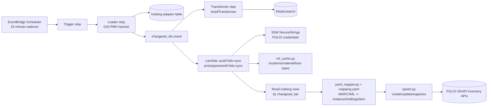
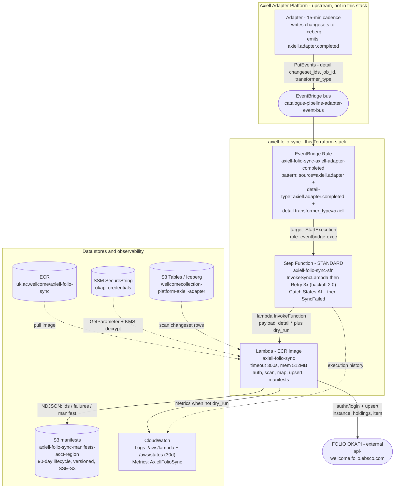

# RFC 090: CMS to LMS Sync

## Purpose

This is proposal to synchronize library location and item holdings from Axiell Collections(Content Management System) into FOLIO (Library Management system) with strict requirements for idempotency, auditability, and graceful error isolation.

**Last modified:** 2026-06-23T00:00:00+00:00

## Table of Contents

- [Purpose](#purpose)
- [Background](#background)
  - [Current CMS and LMS systems](#current-cms-and-lms-systems)
  - [Migration Context](#migration-context)
  - [Why This Matters](#why-this-matters)
- [System Architecture](#system-architecture)
  - [Current Data Feeds for AxC and Folio Data](#current-data-feeds-for-axc-and-folio-data)
  - [Key Characteristics](#key-characteristics)
- [Proposed Change: FOLIO Item Upsert on Every Adapter Run](#proposed-change-folio-item-upsert-on-every-adapter-run)
  - [Fan-out Mechanism](#fan-out-mechanism)
  - [Target Upsert/Mapping Architecture](#target-upsertemapping-architecture)
- [Transformation Design](#transformation-design)
  - [Approach](#approach)
  - [Transformation Pipeline](#transformation-pipeline)
  - [YAML Mapper](#yaml-mapper-mappingyaml--yamlmapper)
  - [Reference Data Cache](#reference-data-cache-ref_cachepy)
- [Proposed AWS Architecture](#proposed-aws-architecture)
  - [Key Design Considerations](#key-design-considerations)
  - [System Diagram](#system-diagram)
  - [1. EventBridge Trigger](#1-eventbridge-trigger)
  - [2. Step Function State Machine](#2-step-function-state-machine)
  - [RefCache Resolution](#refcache-resolution)
  - [Sample Field Mapping](#sample-field-mapping)
  - [FOLIO Field Mapping Reference](#folio-field-mapping-reference)
  - [Change Detection Mechanism](#change-detection-mechanism)
  - [3. Lambda Function: axiell-folio-sync](#3-lambda-function-axiell-folio-sync)
  - [Upsert Key Strategy (Idempotency)](#upsert-key-strategy-idempotency)
  - [4. S3 Manifest Storage](#4-s3-manifest-storage)
- [Design Rationale: Why These Choices?](#design-rationale-why-these-choices)
  - [Orchestration: Step Functions vs. Alternatives](#orchestration-step-functions-vs-alternatives)
  - [Storage: S3 NDJSON vs. Alternatives](#storage-s3-ndjson-vs-alternatives)
  - [Invocation Pattern: Synchronous vs. Asynchronous](#invocation-pattern-synchronous-vs-asynchronous)
  - [Error Handling: Per-Record Isolation](#error-handling-per-record-isolation)
- [FOLIO API Client](#folio-api-client)
- [Cost Analysis](#cost-analysis)
- [Assumptions & Constraints](#assumptions--constraints)
- [Open Questions](#open-questions)
- [Next Steps](#next-steps)
- [References](#references)


---

## Background

## Current CMS and LMS systems
The Wellcome Collection library systems currently operate as:
- **CALM** (Collections Management): Content Management System (CMS) — bibliographic and collection metadata source of truth
- **Sierra**: Library Management System (LMS) — patron management, circulation, holds, and requesting

The CALM-to-Sierra harvester is the integration mechanism that synchronizes bibliographic metadata from CALM into Sierra for discovery and requesting workflows.

## Migration Context
 The library systems migration is replacing these systems:
- **CALM → Axiell Collections**: Data from Calm is being migrated to Axiell Collections
- **Sierra → FOLIO**: Patron management, circulation, and requesting migrating to FOLIO

The current CALM-to-Sierra harvester will be superseded by an Axiell Collections-to-FOLIO integration pipeline. This document captures the existing harvester behavior for reference during the migration period. The data needs to be synched between the CMS and LMS so that the circulation of items and patron managment can be carried out.

### Why This Matters
- Library staff rely on FOLIO for real-time item availability and location data
- Axiell-to-FOLIO sync is a core data pipeline for the new catalogue system
- Sync must be reliable, auditable, and manually recoverable

## System Architecture 

### Current Data Feeds for AxC and Folio Data
- **Axiell Adapter Platform**: Runs on a 15-minute cadence, emitting changesets with new/modified/deleted records
- **FOLIO**: The new system of record for library management (items, holdings and patron data)
- **Integration Gap**: Changesets are written to Apache Iceberg tables on S3, but FOLIO is not automatically updated
- **Volume**: ~10–500 records per changeset (15-minute window); typical day: ~1,000 records across 80 syncs


```
EventBridge Scheduler
    │
    ▼
┌──────────┐    ┌──────────┐    ┌────────────────────┐    ┌─────────────────┐
│  Trigger │───▶│  Loader  │───▶│  Transformer (ES)  │───▶│  Elasticsearch  │
└──────────┘    └──────────┘    └────────────────────┘    └─────────────────┘
                     │
                     ▼
              Iceberg Adapter Table
```


| Stage | File | Role |
|-------|------|------|
| Trigger | `src/adapters/steps/oai_pmh/trigger.py` | Compute next harvest window from WindowStore history |
| Loader | `src/adapters/steps/oai_pmh/loader.py` | Harvest OAI-PMH records in window, write raw MARCXML to Iceberg, emit `changeset_ids` |
| Transformer | `src/adapters/steps/transformer.py` + `src/adapters/transformers/axiell_transformer.py` | Read changesets from Iceberg, parse MARCXML with pymarc, produce SourceWork, index to ES |
| Reconciler | `src/adapters/transformers/axiell_reconciler.py` | Track GUID→ID mapping changes, emit DeletedSourceWork for superseded identifiers |

#### Key Characteristics

- **Metadata prefix**: `oai_marcxml`
- **OAI set**: `collect`
- **Auth**: Custom `Token` header (not standard `Authorization`)
- **Identity**: `axiell-guid` from MARC 001
- **Visibility**: `InvisibleSourceWork` (MimsyWorksAreNotVisible)
- **Window cadence**: 15 min windows, 7 day lookback, 360 min max lag
- **FOLIO OAI-PMH feed**: FOLIO exposes an OAI-PMH feed that is available every 15 minutes as well
- **Storage**: Single Iceberg table schema (`namespace`, `id`, `content`, `changeset`, `last_modified`, `deleted`)

---

## Proposed Change: FOLIO Item Upsert on Every Adapter Run

### Fan-out Mechanism

```
EventBridge Scheduler
    │
    ▼
┌──────────┐    ┌──────────┐         ┌────────────────────┐    ┌─────────────────┐
│  Trigger │───▶│  Loader  │────┬───▶│  Transformer (ES)  │───▶│  Elasticsearch  │
└──────────┘    └──────────┘    │    └────────────────────┘    └─────────────────┘
                     │          │
                     ▼          │    ┌──────────────────────────────────────────────┐
              Iceberg Table     └───▶│  FOLIO Upserter (new step)                   │
                                     │  1. Authenticate to FOLIO                    │
                                     │  2. Load reference data cache                │
                                     │  3. Read changeset rows from Iceberg         │
                                     │  4. YAML mapper → instance/holdings/item     │
                                     │  5. Upsert: create · update · suppress       │
                                     └──────────────────────────────────────────────┘
                                                     │
                                                     ▼
                                              ┌──────────────┐
                                              │  FOLIO       │
                                              │  Inventory   │
                                              └──────────────┘
```

After the loader emits `changeset_ids`, the event is routed to **two** downstream targets:
1. Existing Axiell ES transformer (unchanged).
2. New **FOLIO upserter step**.

Both consume the same `changeset_ids` independently. Either path can fail and retry without affecting the other.

---
### Target Upsert/Mapping Architecture




## Transformation Design

### Approach

The upserter uses a **YAML-driven mapper** (`mapping.yaml` + `YamlMapper`) to convert raw MARCXML from AxC apaptor into FOLIO payloads. This separates all field mapping configuration from Python application code — the mapping file can be reviewed and adjusted independently.

### Transformation Pipeline

Raw MARCXML (from Iceberg)
    │
    ▼
┌────────────────────────────────────────┐
│  YAML Mapper                           │
│  Input: raw MARCXML record             │
│  Output: FOLIO item-level JSON         │
└────────────────────────────────────────┘
    │
    ▼
┌────────────────────────────────────────┐
│  Schema Validation                     │
│  Validate required fields present      │
│  Check identifiers well-formed         │
└────────────────────────────────────────┘
    │
    ▼
┌────────────────────────────────────────┐
│  FOLIO API Payload Builder             │
│  Map validated output to FOLIO         │
│  Inventory API request shape           │
└────────────────────────────────────────┘

### YAML Mapper (`mapping.yaml` + `YamlMapper`)

The YAML mapper is the core transformation engine. It uses to declaratively map MARCXML fields to FOLIO instance/holdings/item JSON payloads.

**Design benefits:**
- **Separation of concerns**: Mapping logic lives in `mapping.yaml`, not Python code
- **Non-programmer-friendly**: Library staff and metadata experts can review/adjust mappings without code review
- **Version control**: Changes to mapping are tracked in git history
- **Testability**: Mapping rules can be tested independently of the Python runtime

**Example workflow:**
1. Input: Raw MARCXML record from Iceberg (e.g., `<record><datafield tag="650">...</datafield></record>`)
2. Mapper applies rules: Extract subjects from `datafield[@tag='650']` → produces structured data
3. Output: JSON structure matching FOLIO Inventory API schema (e.g., `{"instanceTypeId": "...", "subjects": [...]}`)

**Key files:**
- `mapping.yaml`: Declarative mapping rules for instance, holdings, item transformation
- `YamlMapper` class: Loads YAML, applies transformation rules, executes transformation on each record

---

### Reference Data Cache (`ref_cache.py`)

The reference cache maintains in-memory lookups for static FOLIO configuration data that rarely changes:
- **Locations**: location UUIDs and codes
- **Material types**: material type IDs (e.g., "Book", "Microfilm")
- **Loan types**: loan type IDs (e.g., "Can Circulate", "Reference")

**Why needed:**
- FOLIO APIs require UUIDs/IDs, not human-readable names
- Axiell provides names; ref_cache translates to FOLIO IDs
- Caching avoids repeated API calls during a sync run (performance + resilience)

**Workflow:**
1. Lambda startup → `ref_cache.load()` fetches from FOLIO reference endpoints
2. Mapper uses cache: `location_uuid = ref_cache.location["Wellcome Science"]`
3. If location name not found → error logged, record marked for manual review

**Cache persistence:** Reloaded fresh on every Lambda invocation; no cross-invocation caching.

---

## Proposed AWS Architecture

### Key Design Considerations

We propose a **Step Functions + Lambda + S3 architecture** with synchronous invocation, per-record error isolation, and 90-day audit retention. This approach balances **operational visibility**, **fault resilience**, and **simplicity**.

| Aspect | Choice | Primary Benefit |
|--------|--------|-----------------|
| **Orchestration** | AWS Step Functions | Configurable retries + rich execution history for audit |
| **Compute** | Lambda (ECR container) | Stateless, scales to 0, integrates with Step Functions |
| **Data Storage** | S3 NDJSON manifests (90-day TTL) | Cost-efficient batch writes + queryable via S3 Select |
| **Trigger** | EventBridge on adapter completion | Event-driven (not polling); decoupled from adapter |
| **Invocation** | Synchronous Lambda (via Step Function) | Natural backpressure; clear visibility on success/failure |
| **Error Handling** | Per-record isolation | Batch completes even if individual records fail |

**Expected outcomes:**
- Safe replay without data corruption (idempotent upserts via FOLIO HRIDs)
- Complete audit trail: every decision (create/update/suppress/skip) logged in S3 + CloudWatch
- Low operational overhead: ~$3–5/month for typical volume
- Clear mental model: no eventual consistency puzzles, ordered execution

---

### System Diagram



### 1. EventBridge Trigger

**Rule**: `axiell-folio-sync-axiell-adapter-completed`

**Event Pattern**:
```json
{
  "source": ["axiell.adapter"],
  "detail-type": ["axiell.adapter.completed"],
  "detail": {
    "transformer_type": ["axiell"]
  }
}
```

**Event Payload** (emitted by Axiell adapter):
```json
{
  "changeset_ids": ["axiell-cs-20260622-001", "axiell-cs-20260622-002"],
  "job_id": "adapter-job-xyz-12345",
  "transformer_type": "axiell",
  "dry_run": false,
  "sample_limit": null
}
```

**IAM Permissions**: `states:StartExecution` on Step Function ARN

---

### 2. Step Function State Machine

**Name**: `axiell-folio-sync-sfn`  
**Type**: STANDARD

**Flow**:
```
Input (from EventBridge)
  ↓
[Task] Invoke Lambda (pass event detail)
  ├─ Input path: $.detail
  ├─ Output: result JSON with counts, manifest URIs, errors
  │
  ├─ [Retry]
  │  • MaxAttempts: 3 (configurable)
  │  • BackoffRate: 2.0
  │  • IntervalSeconds: 2
  │
  └─ [Catch]
     • States.TaskFailed → SyncFailed (terminal)
     • Log to CloudWatch
  ↓
Output (Success) → SyncComplete
```

**Execution History**: Stored in CloudWatch Logs (`/aws/states/axiell-folio-sync-sfn`, 30-day retention)

**IAM Role Permissions**:
- `lambda:InvokeFunction` on sync Lambda ARN
- `logs:CreateLogGroup`, `logs:CreateLogStream`, `logs:PutLogEvents` for CloudWatch

---

### RefCache Resolution

All reference fields (`permanentLocationId`, `instanceTypeId`, `materialTypeId`, `permanentLoanTypeId`) are resolved at sync time via **RefCache**, which caches FOLIO reference data (locations, material types, loan types, instance types).

**Resolution Process**:
1. On Lambda startup, RefCache initializes by querying FOLIO reference APIs (one-time call per invocation)
2. For each record, mapper looks up codes against cached values (in-memory, O(1) lookup)
3. If code not found: upsert fails with `MappingError` and record is skipped
4. Resolved UUIDs are embedded in payload

**Current Normalisations**:
- **Material type**: AxC `Object_category` → FOLIO material type (e.g., `"Archives - Non-digital"` → `"unspecified"`; audio → `"sound recording"`)
- **Location**: AxC hierarchical location code (e.g., `"215;B11;MR;84;3;7"`) → FOLIO location UUID
- **Loan type**: AxC `OrderingCodes` (e.g., `"Archives - Requestable"`) → FOLIO loan type UUID
- **Instance type**: Typically mapped to `"text"` or domain-specific type

**Implementation**: Can be checked in the prototype

---`

Benefits:
- **A/B audit**: Compare records created with different mapper versions
- **Rollback**: If a mapping change introduces errors, identify affected records by version
- **Metadata tracking**: Historical record of mapping logic used for each record

###  Sample Field Mapping 

| MARC Source (Axiell) | mapping.yaml key | FOLIO Target | Example |
|---------------------|------------------|--------------|----------|
| 001 (GUID) | `external_id` | Instance/Item `hrid` | `axiell:PP/CJS/B.3/9` |
| 245$a | `title` | Instance title | Daniel Morley, an English Philosopher... |
| 852$b | `location_code` | Holdings permanent location | `215;B11;MR;84;3;7` |
| 852$c | `shelving_location` | Holdings shelving location | `Arch`, `Ref` |
| 852$h | `call_number` | Holdings call number | — |
| 949$a | `barcode` | Item barcode | — |
| 949$c | `item_type` | Item material type | `Archives - Non-digital` |
| 949$l | `loan_type` | Item loan type | `Archives - Requestable` |
| 876$p | `copy_number` | Item copy number | `copy 1`, `copy 2` |
| 876$t | `volume` | Item volume designation | `v.1`, `disc 1 of 2` |
| 856$u | `electronic_access_uri` | Electronic access URL | — |

---

## FOLIO Field Mapping Reference

For a comprehensive and detailed mapping of all Axiell Collections fields to FOLIO Inventory API fields, see **[folio-axc-fields-mapping.md](folio-axc-fields-mapping.md)**.

This document provides:
- Complete field-by-field mapping for Instance, Holdings, and Item entities
- Transformation rules and MARC source information
- Required vs. optional fields for FOLIO
- Reference data requirements (locations, material types, loan types)
- Field validation rules and edge cases

---

## Change Detection Mechanism

The FOLIO upsert step leverages the existing Axiell adapter's OAI-PMH change detection to determine which records to sync.

### How It Works

1. **OAI-PMH Datestamp Windows**: Axiell adapter harvests records modified within a time window. Only records with `last_modified` within `[window_start, window_end)` are returned from OAI-PMH.

2. **Changeset IDs**: Each harvest window produces a unique `changeset_id`. Records written to Iceberg in that window are tagged with it.

3. **Iceberg Columns**: Records stored with:
   - `namespace` — record type (e.g., "location", "item")
   - `id` — external identifier
   - `content` — JSON-serialized record
   - `changeset` — changeset ID from adapter
   - `last_modified` — timestamp from OAI datestamp header
   - `deleted` — `true` if OAI returned a tombstone

4. **FOLIO Upsert Input**: Lambda receives `changeset_ids` and reads only those rows:
   ```python
   changed_records = adapter_store.read_changed(changeset_ids)
   ```

### Change Detection Signals

| Signal | Source | Meaning |
|--------|--------|----------|
| Record in changeset | OAI-PMH datestamp window | Record was created or modified in source |
| `deleted=true` | OAI tombstone | Record was removed from source |
| Payload hash mismatch | XSL output comparison (optional) | FOLIO-relevant fields actually changed |
| Reconciler GUID remap | Axiell reconciler step | Old identity superseded, emit delete for old |

### Every Record in Changeset Is Either:

- **New** (first time this `id` appears in Iceberg) → create in FOLIO
- **Updated** (existing `id`, newer `last_modified`) → update in FOLIO
- **Deleted** (`deleted=true`) → suppress/remove in FOLIO

---

### 3. Lambda Function: axiell-folio-sync

**Docker Image**: ECR (`uk.ac.wellcome/axiell-folio-sync:TAG`)

**Execution Steps**:

#### Step 1: Authenticate with FOLIO
```
SSM Parameter Store (SecureString)
  Path: /axiell-folio-sync/okapi-creds
  Value: {"username": "service_account", "password": "..."}

POST /authn/login
  x-okapi-tenant: wellcome
  Body: credentials
  Response: x-okapi-token (valid 24h)
  → Reused for all subsequent API calls in this invocation
```

#### Step 2: Scan Iceberg Changesets
```
Query S3 Tables Iceberg catalog
  Bucket: {S3_TABLE_BUCKET_ARN}
  Table: {ICEBERG_TABLE_NAME} (e.g., default.axiell_changesets)
  
SELECT [namespace, id, content, changeset, last_modified, deleted]
WHERE changeset IN ({changeset_ids from event})

Schema:
  namespace        string    — e.g., "location", "item"
  id               string    — external identifier from Axiell
  content          string    — JSON-serialized record
  changeset        string    — changeset ID from adapter
  last_modified    timestamp — when record changed
  deleted          boolean   — true if marked deleted
```

#### Step 3: Map & Validate
```python
# Load YAML mapping rules (from mapping.yaml)
mapper = YamlMapper("mapping.yaml")

for row in iceberg_records:
    try:
        record = json.loads(row['content'])
        
        # Build Instance, Holdings, Item payloads
        instance_payload = mapper.build_instance_payload(record)
        holdings_payload = mapper.build_holdings_payload(record)
        item_payload = mapper.build_item_payload(record)
        
        # Validate required fields per FOLIO schema
        payloads.append({...})
    except MappingError as e:
        # Capture error, continue to next record
        errors.append({
            "source_id": row['id'],
            "type": "mapping",
            "detail": str(e)
        })
        continue
```

#### Step 4: Upsert to FOLIO (Per Record)

```
For each record:
  Execute: Instance → Holdings → Item (dependencies)
  
  Instance:
    If deleted=true:
      GET /inventory/instances/{instance_id}
      PUT with discoverySuppress=true
      Action: "suppress"
    Else:
      GET /inventory/instances?query=(hrid=={hrid})
      If exists: PUT (update)
      Else: POST (create)
      Action: "create" or "update"
  
  Holdings (if Instance succeeded):
    POST /holdings-storage/holdings (create linked to Instance)
    Action: "create"
  
  Item (if Holdings succeeded):
    POST /item-storage/items (create linked to Holdings)
    Action: "create"

Per-record error handling:
  • HTTP 4xx/5xx → captured, batch continues
  • All errors logged to CloudWatch AND accumulated
```

### Upsert Key Strategy (Idempotency)

**Priority order for matching existing records**:

1. **External source identifier**: Axiell GUID from MARC 001 (most stable)
2. **Barcode**: From transformed record (949$a)
3. **Composite fallback**: `axiell:{record_id}`

**Behavior**:
- **Found**: Update mutable fields, preserve FOLIO-internal metadata
- **Not found**: Create new item, link to holding/instance via location
- **Missing required fields**: Skip with structured error logged

**Replay Safety**:
- Upserts are idempotent by external identifier
- Same changeset processed twice produces same outcome
- Manifest deduplication: check if changeset already processed successfully before running

#### Step 5: Batch & Write Manifests
```python
# Success NDJSON (one record per line, 5K records per batch)
for i in range(0, len(success_results), 5000):
    batch = success_results[i:i+5000]
    ndjson_lines = [json.dumps(r) for r in batch]
    s3.put_object(
        Bucket=MANIFEST_S3_BUCKET,
        Key=f"manifests/{job_id}.ids.ndjson",
        Body="\n".join(ndjson_lines)
    )

# Error NDJSON (one error per line)
if errors:
    error_lines = [json.dumps(e) for e in errors]
    s3.put_object(
        Bucket=MANIFEST_S3_BUCKET,
        Key=f"manifests/{job_id}.ids.failures.ndjson",
        Body="\n".join(error_lines)
    )

# Metadata summary
metadata = {
    "job_id": job_id,
    "start_time": "2026-06-22T10:15:03Z",
    "end_time": "2026-06-22T10:15:45Z",
    "status": "SUCCESS|PARTIAL|FAILED",
    "counts": {
        "total": 247,
        "created": 10,
        "updated": 200,
        "suppressed": 25,
        "skipped": 12,
        "failed": 0
    },
    "success_manifest_uri": f"s3://{bucket}/manifests/{job_id}.ids.ndjson",
    "error_manifest_uri": f"s3://{bucket}/manifests/{job_id}.ids.failures.ndjson"
}
s3.put_object(
    Bucket=MANIFEST_S3_BUCKET,
    Key=f"manifests/{job_id}.manifest.json",
    Body=json.dumps(metadata, indent=2)
)

# CloudWatch Metrics
cloudwatch.put_metric_data(
    Namespace="AxiellFolioSync",
    MetricData=[
        {"MetricName": "RecordsCreated", "Value": metadata['counts']['created']},
        {"MetricName": "RecordsUpdated", "Value": metadata['counts']['updated']},
        {"MetricName": "RecordsSuppressed", "Value": metadata['counts']['suppressed']},
        {"MetricName": "RecordsFailed", "Value": metadata['counts']['failed']},
    ]
)

return metadata
```

---

### 4. S3 Manifest Storage

**Bucket**: `axiell-folio-sync-manifests-{account-id}-{region}`

**File Structure**:
```
manifests/
  ├─ adapter-job-xyz-20260622-10-15.ids.ndjson
  ├─ adapter-job-xyz-20260622-10-15.ids.failures.ndjson
  ├─ adapter-job-xyz-20260622-10-15.manifest.json
  ├─ adapter-job-xyz-20260622-10-30.ids.ndjson
  └─ ...
```

**Sample Success Record** (NDJSON):
```json
{
  "source_id": "location_item_123",
  "instance": {
    "action": "update",
    "id": "inst-abc-def",
    "hrid": "HRID-LOC-123"
  },
  "holdings": {
    "action": "create",
    "id": "hold-xyz-uvw"
  },
  "item": {
    "action": "create",
    "id": "item-001-002"
  },
  "errors": []
}
```

**Sample Error Record** (NDJSON):
```json
{
  "source_id": "location_item_456",
  "error": "Mapping error: required field 'barcode' missing",
  "detail": "YAML rule for barcode returned null",
  "type": "mapping"
}
```

**Lifecycle Policy**: 90-day expiration (auto-delete old manifests)

---

## Design Rationale: Why These Choices?

### Orchestration: Step Functions vs. Alternatives

| Approach | Pros | Cons | Cost/mo |
|----------|------|------|---------|
| **A: Direct Lambda** (EventBridge → Lambda, fire-and-forget) | Fewer services, lower overhead, fastest time-to-invocation | No built-in retry logic, no execution history, hard to extend, silent failures possible | ~$2 |
| **B: Step Functions + Lambda** ⭐ **CHOSEN** | Explicit retry policy + audit trail, easy to parallelize later, clear visibility into success/failure | Extra service, marginal latency added | ~$3–5 |
| **C: Async Queue** (EventBridge → SQS → Lambda workers) | Decouples producer/consumer, handles bursts, resilient to adapter restarts | Complex ordering semantics, harder to reason about, no clear success/failure signal, monitoring overhead | ~$10–15 |

**Why we chose B (Step Functions + Lambda):**

1. **Extension point for scale**: When volume grows beyond 500 records/event, we swap the Lambda invocation for a Step Function Map state (fan-out per changeset). Same manifest format, no breaking changes.

2. **Execution history = audit trail**: Every state transition is logged to CloudWatch. If a sync fails partway through, we know exactly where and why. No need to rebuild state from Lambda logs.

3. **Explicit retry policy**: Max attempts and backoff are declarative. Operations can tweak `max_retries` without code changes (configure in Step Function definition).

4. **Synchronous invocation provides backpressure**: Adapter waits for sync to complete → prevents queue buildup if FOLIO is slow. If sync times out, adapter knows to retry.

5. **Cost remains minimal**: At 1K records/day (~80 invocations), we're talking $0.50/month for Step Function state transitions. Not a material driver.

**Why not A (Direct Lambda)?**
- Silent failures: EventBridge doesn't tell us if the invocation succeeded or failed.
- No retry: If Lambda times out, there's no automatic retry. We'd have to implement our own (add complexity).
- No execution history: Debugging a failed sync means parsing Lambda logs. Step Function history is cleaner.

**Why not C (Async Queue)?**
- Ordering: SQS doesn't guarantee processing order within a batch. We'd need to handle out-of-order upserts or add logic to sort before processing.
- Complexity: Workers need to coordinate (who's processing which changeset?). Adds operational burden.
- Cost: For current volume, async queue is cheaper per invocation, but the monitoring overhead (error tracking, retry logic, dead-letter queue management) makes it not worth it.

---

### Storage: S3 NDJSON vs. Alternatives

| Approach | Pros | Cons | Cost/mo (90-day) |
|----------|------|------|------------------|
| **A: DynamoDB** (per-record writes, TTL) | Query-friendly, real-time dashboards possible, strong consistency | O(n) write cost, schema evolution painful, expensive for batches, not auditable | ~$20–50 |
| **B: S3 NDJSON** ⭐ **CHOSEN** | Batched writes (low cost), queryable (S3 Select), matches org patterns, audit via versioning, easy to compress/archive | Requires S3 Select for queries (not real-time), not ideal for high-cardinality point lookups | ~$1–2 |
| **C: Streaming** (Kinesis/Firehose → Parquet) | High throughput, good for ML pipelines, efficient compression | Overkill for current volume, adds infrastructure complexity, higher cost | ~$5–15 |

**Why we chose B (S3 NDJSON):**

1. **Cost scales with volume**: Per-record writes scale O(n). At 5K records/day, you'd pay for 5K DynamoDB writes. With S3 NDJSON, we batch-write every 5K records → 1 PUT per 5K records. Cost dominance flips at ~100 records/day (already exceeded).

2. **Matches existing patterns**: Axiell adapter platform already uses S3 for changesets. This keeps the operational model consistent (known backup, recovery, and query patterns).

3. **Queryable post-hoc**: S3 Select allows SQL-like queries without ETL:
   ```sql
   SELECT * FROM s3://bucket/manifest.ndjson WHERE errors > 0
   ```
   Takes ~500ms on 100 KB file. Good enough for operational investigation.

4. **Audit trail via versioning**: S3 versioning enabled → every write creates a new object version. If someone accidentally deletes a manifest, we can recover it. Metadata JSON tracks all historical jobs.

5. **Easy to compress/archive**: After 90 days, we can archive NDJSON to Glacier for long-term audit retention (pennies/month). DynamoDB has no cheap archive option.

**Why not A (DynamoDB)?**
- Per-record cost: 5K records/day = 5K write units (on-demand) = ~$2.50/day = ~$75/month. S3 is ~$0.05/month for the same data.
- Schema evolution: If we add a new field to the record (e.g., `retry_count`), DynamoDB requires a scan-and-rewrite. S3 NDJSON: just add the field to new records.
- Not suitable for audit: While DynamoDB TTL works, there's no clean way to query "what was deleted from this table last week?"

**Why not C (Streaming)?**
- Overkill: Typical changeset is 10–500 records. Kinesis + Firehose is designed for high-throughput (1000s records/sec). We'd be paying for infrastructure we don't use.
- Operational complexity: Firehose auto-flushes based on buffer size or timeout. Extra operational knowledge needed.

---

### Invocation Pattern: Synchronous vs. Asynchronous

| Approach | Pros | Cons |
|----------|------|------|
| **A: Async** (EventBridge → Lambda, fire-and-forget) | Decoupled, adapter doesn't wait, low latency | No backpressure; if adapter emits 10 events in quick succession, Lambda might queue up (can overwhelm FOLIO); no failure signal |
| **B: Synchronous** ⭐ **CHOSEN** | Backpressure (adapter waits), clear success/failure, enables replay on failure | Adapter must wait ~45 sec for sync to complete before next event; if FOLIO is slow, adapter is blocked |

**Why we chose B (Synchronous):**

1. **Natural backpressure**: If FOLIO is slow or unavailable, Step Function times out → adapter pauses before emitting next event. No need for queue management.

2. **Failure visibility**: If sync fails, EventBridge knows → can retry the same changeset. No silent failures.

3. **Replay support**: If sync fails partway (e.g., 100 of 200 records succeeded before timeout), we can:
   - Query S3 manifest to see which records failed
   - Fix the issue (e.g., restart FOLIO, fix mapping rule)
   - Re-trigger sync with same changeset_ids
   - Idempotent upserts (via FOLIO HRID lookup) prevent duplication

4. **Adapter is designed for it**: Axiell adapter runs on 15-min cycles. Waiting 45 sec for sync fits within the cadence.

**Why not A (Async)?**
- Queue buildup: If adapter emits 10 changesets in quick succession, and each sync takes 45 sec, we'd have a 7-minute backlog. Async doesn't naturally handle this (we'd need manual queue monitoring).
- Failure not visible: If a sync fails, the adapter doesn't know. No built-in retry or alerting.

---

### Error Handling: Per-Record Isolation

**Policy**: One bad record must not halt the entire batch.

**Error Levels**:

1. **Per-record errors** (non-blocking):
   - Mapping error (YAML validation fails): `{"source_id": "...", "type": "mapping", "detail": "..."}`
   - API error (FOLIO returns 4xx/5xx): `{"source_id": "...", "type": "api", "detail": "..."}`
   - Action: Log to S3 error manifest, continue to next record

2. **Batch-level errors** (blocking):
   - Auth failure (OKAPI login fails): Exception raised → Step Function retries up to `max_retries`
   - Iceberg connection failure: Exception raised → Step Function retries
   - S3 write failure: Exception raised → Step Function retries
   - Action: If retries exhausted → SyncFailed (terminal state), alert operations

**Observable via**:
- **CloudWatch Logs**: `/aws/lambda/axiell-folio-sync` (detailed per-record execution)
- **S3 Manifests**: `.ids.failures.ndjson` (queryable error list via S3 Select)
- **CloudWatch Metrics**: `RecordsFailed`, `RecordsCreated`, etc. (can alert on high failure rate)
- **Step Function History**: `/aws/states/axiell-folio-sync-sfn` (state transitions, retry events)

---

## FOLIO API Client

**Location**: `prototypes/axiell-folio-sync/axiell_folio_sync/upsert.py`

**Responsibilities**:
- Authenticate to FOLIO via OKAPI (`/authn/login`), token refreshed automatically on 401
- Resolve existing records by CQL query (GET before PUT)
- Create (POST), update (PUT), or suppress deleted records per entity
- Handle rate limiting and retries

**Token Management**:
- Initial auth: `POST /authn/login` with credentials from SSM
- Token lifetime: 24 hours (sufficient for 5-min Lambda execution)
- Reused across all API calls in single invocation (no refresh overhead)

---


## Cost Analysis

### Current Volume: ~1,000 records/day

| Service | Operation | Qty/mo | Rate | Cost/mo |
|---------|-----------|--------|------|---------|
| Lambda | 80 invocations × 300s × 1 GB | 80 invocations | $0.0000167/GB-s | ~$1.20 |
| Step Functions | 80 state transitions | 80 transitions | $0.000025/transition | ~$0.02 |
| EventBridge | 80 events | 80 events | $1/M events | ~$0.00 |
| S3 (manifests) | ~80 objects written, 90-day retention | 80 objects + storage | $0.023/K objects + $0.023/GB/mo | ~$1.50 |
| CloudWatch Logs | ~80 × 5 KB = 400 KB/month | 400 KB ingested | $0.50/GB ingested | ~$0.20 |
| **Total** | | | | **~$3–5** |


## Assumptions & Constraints

- **FOLIO HRID requirement**: Records must have a stable, unique HRID per type (Instance, Holdings, Item) for idempotent upserts. Axiell must provide this in mapping.yaml.
- **No real-time requirements**: 15-minute cadence is acceptable. If sub-minute sync becomes required, architecture must change (streaming Kinesis, real-time database).
- **FOLIO API stability**: Assumes FOLIO API is available and stable. If FOLIO is down for hours, sync manifests will accumulate (90-day retention allows manual replay after recovery).
- **Axiell stability**: Assumes Axiell adapter completes consistently. If adapter fails, no changeset is emitted → no sync triggered (not our problem, but should monitor).

---
## Open Questions

### Field Mapping from Axc to Folio Instance, Holdings and Items needs to be defined

- Sample file **[folio-axc-fields-mapping.md](folio-axc-fields-mapping.md)**, File shared with Collection Information for feedback
- Minimum Stub Record needs to be defined. 
- Source of data Marc/Folio for inventory types. Test with both the options


## Next Steps

- Prototype adding another lambda in the step function for moving the read of data from iceberg and write of data to Folio in separare lambdas and check on the approach

---

## References

- **Axiell Adapter Platform**: Emits changesets to Iceberg; documentation in location-movement-control-docs
- **FOLIO API**: https://api-wellcome.folio.ebsco.com (OKAPI auth required)
- **AWS S3 Tables**: Iceberg catalog on S3; managed via Terraform
- **YAML Mapping Rules**: mapping.yaml (stored in Lambda container or S3)
