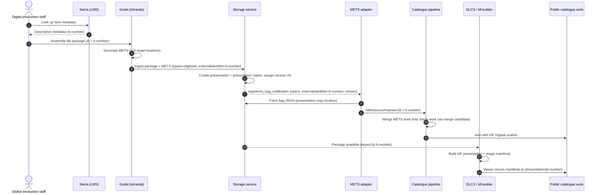
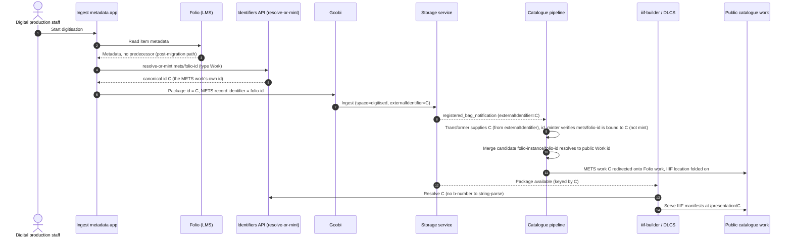

# RFC 091: Digitisation ingest identifiers during the Sierra to Folio migration

## Purpose

Wellcome Collection is migrating its library management system from Sierra to Folio. The b-number (the Sierra system number) is embedded in storage locations, METS records, IIIF manifest URIs, and the join key that merges digitised content onto the public catalogue work. This RFC sets out why the b-number cannot simply be swapped for a Folio id, and proposes minting catalogue-style identifiers at ingest via a secured endpoint on the Identifiers API (RFC 089), with separate cross-migration and post-migration ingest paths.

**Last modified:** 2026-06-29T12:00:00+00:00

**Related RFCs:**

- [RFC 089: Identifiers API](../089-identifiers-api/README.md): the read-only Identifiers API this RFC extends with a secured mint endpoint (open in [PR #156](https://github.com/wellcomecollection/docs/pull/156)).
- [RFC 083: Stable identifiers following mass record migration](../083-stable_identifiers/README.md): the predecessor / many-to-one minting that keeps an old b-number resolving to the same canonical id.
- [RFC 081: Identifiers in iiif-builder: beyond the B number](../081-identifiers-in-iiif-builder/README.md): the `IIdentityService`, a blocking prerequisite for the post-migration path.
- [RFC 085: Identifiers of and within IIIF resources after the migration](../085-IIIF-Identities-and-Migration/README.md): canonical IIIF URIs move to the Work id (open in [PR #143](https://github.com/wellcomecollection/docs/pull/143)); reinforces the iiif-builder prerequisite and the requirement to keep b-number IIIF URLs resolving.
- [RFC 088: Migrating identity, requesting and items APIs from Sierra to FOLIO](../088-folio-identity-requesting-migration/README.md): the wider identity and requesting half of the same Sierra to Folio migration.
- [RFC 090: CMS to LMS Sync](../090-axiell-folio-sync/README.md): the adjacent CMS to LMS synchronisation work (open in [PR #157](https://github.com/wellcomecollection/docs/pull/157)).
- RFC 002: Archival storage, <https://docs.wellcomecollection.org/developers/rfcs/002-archival_storage>.

## Table of contents

- [Context](#context)
  - [Current digitisation ingest](#current-digitisation-ingest)
  - [How components are keyed on the b-number](#how-components-are-keyed-on-the-b-number)
  - [The problem after migration](#the-problem-after-migration)
  - [Two kinds of digitisation](#two-kinds-of-digitisation)
  - [Predecessor identifiers (RFC 083)](#predecessor-identifiers-rfc-083)
  - [Merge behaviour after migration](#merge-behaviour-after-migration)
- [Proposal](#proposal)
  - [Where minting lives](#where-minting-lives)
  - [Two ingest paths](#two-ingest-paths)
  - [iiif-builder prerequisite](#iiif-builder-prerequisite)
  - [Post-migration merge candidate](#post-migration-merge-candidate)
  - [METS works keep their own id](#mets-works-keep-their-own-id)
  - [Where each identifier lives after migration](#where-each-identifier-lives-after-migration)
- [Alternatives considered](#alternatives-considered)
- [Impact](#impact)
  - [Risks](#risks)
  - [Backwards compatibility](#backwards-compatibility)
  - [Dependencies for each path](#dependencies-for-each-path)
  - [Open questions](#open-questions)
- [Next steps](#next-steps)

---

## Context

### Current digitisation ingest

Digital production staff drive digitisation by hand. They pull descriptive metadata from Sierra (the LMS) and use Goobi (intranda) to assemble the file package for an item. Goobi uses the Sierra b-number as the ingest package identifier. It generates the METS files (which record the locations of the sub-assets within the package) and hands the package plus METS to the storage service for preservation. The storage service creates preservation and presentation copies.

From there, two consumers pick the package up:

- The **METS adapter** in the catalogue pipeline reacts to the storage registration and feeds the METS-sourced work into the catalogue pipeline. The pipeline merges that METS work onto the Sierra-sourced work, so the presentation fields (the IIIF location) appear on a single public-facing catalogue work.
- **DLCS / iiif-builder** reads the same package to generate the IIIF presentation and image manifests that the viewer serves.

A package can have several versions. Goobi updates the package, the storage service increments the version, and the latest version is what IIIF and the public catalogue use. The b-number is shared across all of these steps.

### How components are keyed on the b-number

The b-number threads through four components, each keying on it in a different way:

| Component | How it keys on the b-number | Reference |
| --- | --- | --- |
| **Storage service** | A bag is the pair `(space, externalIdentifier)` with an auto-incremented version; the S3 path is `space/externalIdentifier/vN/...` (e.g. `digitised/b31497652/v2`). For digitised content the `externalIdentifier` **is** the b-number. On a successful store it publishes `{space, externalIdentifier, version, type}` to the `*_registered_bag_notifications` SNS topic. | `BagId.scala`; [RFC 002](https://docs.wellcomecollection.org/developers/rfcs/002-archival_storage) |
| **METS adapter** | Consumes the storage notification, filters to `space ∈ {digitised, born-digital}`, fetches the bag JSON, stores `MetsSourceData` in a DynamoDB VHS keyed by `Version(externalIdentifier, version)`, and publishes a `MetsSourcePayload` whose `id` is the `externalIdentifier`, the b-number. | `MetsAdapterWorkerService.scala` |
| **METS transformer** | The METS work's own identity is `mets/<b-number>` (`IdentifierType.METS`, lowercased), created as a `Work.Invisible` with `invisibilityReason` `MetsWorksAreNotVisible`. It exists only to merge onto the Sierra work, never to be seen on its own. | `MetsData.scala` |
| **IIIF / iiif-builder** | The manifest URI is keyed on the b-number and is self-identifying (e.g. `https://iiif.wellcomecollection.org/presentation/b28047345`, live, HTTP 200, not redirected to a Work id). The DLCS asset id is `{b-number}_{seq}` (e.g. `b28047345_0032`). iiif-builder loads the package by b-number. Legacy `wellcomelibrary.org/iiif/b…/manifest` URLs 301-redirect to the b-number URLs, so they are treated as permanent and must keep resolving. | n/a |

### The problem after migration

The b-number is embedded in several parts of the system. It appears in:

- the storage location (`digitised/<b-number>/vN`),
- the METS record identity and the merge candidate it emits,
- the IIIF manifest URI and the DLCS asset ids.

After the migration, library records live in Folio with new identifiers. The relationship between the old Sierra b-number and the new Folio identifier has to be carried explicitly, otherwise the digitised content (which still speaks b-number) loses its link to the public-facing record (which now speaks Folio).

### Two kinds of digitisation

Two kinds of digitisation matter here, and they need different handling:

- **Cross-migration digitisation.** The item already existed in Sierra and has an old b-number. The Folio record carries a predecessor pointer back to that b-number.
- **Post-migration digitisation.** The item is new. It has no Sierra ancestry and no predecessor pointer.

The presence or absence of a predecessor ID in the Folio output is the signal we use to tell these two apart.

### Predecessor identifiers (RFC 083)

[RFC 083](../083-stable_identifiers/README.md) addresses the general migration problem: migrated records get new source identifiers, so a naive minter would mint a brand new public catalogue id for every migrated record and break every bookmark, citation, and link.

The fix is to make the minter many-to-one. A Folio or Axiell record that carries a predecessor pointer to its old Sierra b-number or CALM id inherits the existing canonical id instead of minting a new one. Multiple source identifiers share a canonical id only through explicit predecessor relationships. RFC 083 is explicit that "systems such as METS will continue to refer to old Sierra/CALM identifiers indefinitely."

The id_minter has been rewritten as a Python Lambda for this. It uses two tables: `canonical_ids(CanonicalId PK, Status ENUM('free','assigned'))` and `identifiers((OntologyType, SourceSystem, SourceId) PK, CanonicalId FK)`. It mints by claiming free ids from a pool with `SELECT ... FOR UPDATE SKIP LOCKED` and uses idempotent race detection.

The predecessor mechanism is what makes cross-migration digitisation tractable: the old b-number keeps resolving to the same canonical id, so anything still keyed on the b-number stays correctly attached.

### Merge behaviour after migration

The merge that puts digitised content onto the public work runs through a merge candidate that resolves to the target work's canonical id:

1. The METS transformer decides the merge candidate by looking at the record identifier. If it matches the Sierra system-number regex it emits a merge candidate `sierra-system-number/<b-number>`, otherwise it falls back to `calm-ref-no` for born-digital (`MetsMergeCandidate.scala`).
2. The Sierra work's own `SourceIdentifier` is also `sierra-system-number/<b-number>`.
3. The id_minter mints both of those to the **same** canonical id. A canonical id is 8 characters from `[2-9a-z]` minus `o,i,l,1` with a letter first.
4. The matcher graphs works by shared canonical id.
5. The merger folds the METS digital item's `DigitalLocation` (the IIIF location) onto the Sierra item. A standalone METS work is never selected as a merge target; the Sierra work is always the target. The link is one-way, METS to Sierra; the Sierra work does not reference the METS work.

After the catalogue pipeline migrates to Folio there will be no Sierra-sourced works, and the records digitisations attach to will be Folio-sourced. Two considerations apply here, and they point in different directions.

**Canonical id continuity.** The canonical id does not change. The predecessor work in the id_minter (RFC 083) means a Folio work carrying a predecessor pointer to its old b-number inherits the *same* canonical id that the b-number had. The METS work still emits `sierra-system-number/<b-number>`, the id_minter still resolves that b-number to that canonical id, and the matcher still graphs by shared canonical id. So the METS work and the Folio work land in the same graph component, and the canonical id that works are redirected to is unchanged. Bookmarks and IIIF URIs keyed on the old id keep resolving.

**Required merger rule changes.** Target selection is coupled to Sierra. The merger picks a target from a fixed precedence list, and every entry in it is a non-Folio predicate: `ebscoWork`, `teiWork`, `singlePhysicalItemCalmWork`, `sierraDigitisedAv`, `physicalSierra`, `sierraWork` (`TargetPrecedence.scala`). Those predicates are defined by identifier type, for example `sierraWork = identifierTypeId(IdentifierType.SierraSystemNumber)` (`WorkPredicates.scala`). The rule that folds the METS digital location onto the target is likewise gated on Sierra: `mergeMetsIntoSierraTarget.isDefinedForTarget = sierraWork` (`ItemsRule.scala`). A Folio work would not satisfy any of these, so as the rules stand today it would not be selected as a target and the METS location would not be folded onto it.

The identifier type already exists: `IdentifierType.FolioInstance` (`id = "folio-instance"`) is defined in `IdentifierType.scala`. What is missing is a Folio predicate in `WorkPredicates`, an entry in `TargetPrecedence`, and a Folio target on the METS fold rule (the fold itself, `appendLocationsFrom`, is generic and does not care about source type). This is merger-rule work, not an id_minter or canonical-id change.

## Proposal

Build a small application for digital production staff that creates the ingest package metadata from the Folio LMS while accommodating the predecessor ID.

The central choice is not to use the Folio LMS id as the package identifier. Using the Folio id would repeat the same problem at the *next* LMS migration. Instead, mint an identifier in the public catalogue style at ingest time, using a minting capability added to the Identifiers API ([RFC 089](../089-identifiers-api/README.md)).

Behaviour splits on the predecessor signal:

- **Cross-migration digitisation** (predecessor ID present): reuse the old b-number.
- **Post-migration digitisation** (no predecessor): mint a fresh catalogue-style id.

The post-migration flow below reflects the mechanics set out in [Post-migration merge candidate](#post-migration-merge-candidate) and [METS works keep their own id](#mets-works-keep-their-own-id): the id is minted from the Folio id, the Folio id rides in the METS so the transformer can emit the merge candidate, and the minted id becomes the package handle.

The proposal rests on five decisions, set out below: where the minting happens, how the two ingest paths are told apart, what has to be in place in iiif-builder first, what merge candidate the post-migration path emits, and how the METS work's own id is minted.

### Where minting lives

[RFC 089](../089-identifiers-api/README.md) as written ([PR #156](https://github.com/wellcomecollection/docs/pull/156), open) is a read-only service: given a canonical id it returns the source id(s), and given a source id it returns the canonical id. It never mints and never invalidates. It is served from the catalogue ID Registry, the same store the id_minter writes to per RFC 083, with the architecture API Gateway to Lambda to Aurora Serverless v2, x-api-key auth, and CloudFront caching. Its planned consumers are IIIF/DDS (which wants the Work id to be the canonical IIIF manifest URI) and Requesting (canonical item id to Folio item UUID).

We will **extend RFC 089 with a secured write/mint endpoint**. That endpoint shares the catalogue id_minter's registry and its pool and concurrency logic (the `SELECT ... FOR UPDATE SKIP LOCKED` pool claim from RFC 083). Digital production will **not** write to the id_minter database directly.

The rationale: it keeps a single minting authority and a single pool, so there is no second writer competing with the catalogue id_minter against the same registry. The secured endpoint gives digital production a controlled way to mint without handing out database credentials, and it sits alongside the read endpoints that IIIF and Requesting already need.

### Two ingest paths

We treat these as two separate paths, with the presence of a predecessor ID in the Folio output as the signal.

For **cross-migration digitisation** we:

- Reuse the old b-number as the storage `externalIdentifier`, and
- Keep emitting `sierra-system-number/<old-b-number>` as the METS merge candidate.

That means **this path needs no change to the METS transformer** (`MetsMergeCandidate.scala`): a reused b-number still matches the Sierra system-number regex and emits `sierra-system-number/<b-number>` exactly as today. Because the predecessor relationship (RFC 083) keeps the old b-number resolving to the existing canonical id, the merge join key still lands on the right work. The storage version history is preserved because the bag identifier is unchanged. The post-migration path does add a `folio-instance` branch to the transformer (see [Post-migration merge candidate](#post-migration-merge-candidate)), but that branch is gated on the record identifier, so a cross-migration item carrying a b-number never reaches it; routing cross-migration through it instead would change the merge logic that governs whether digitised content reaches the public work, for no benefit over reusing the b-number.

This holds even though the target becomes a Folio work after migration. The METS work keeps emitting `sierra-system-number/<b-number>`, the id_minter keeps resolving that b-number to the existing canonical id through the predecessor link, and the matcher keeps graphing by shared canonical id. The one piece that does need updating is the merger's target selection, which is currently coupled to Sierra predicates (`TargetPrecedence.scala`, `WorkPredicates.scala`, `ItemsRule.scala`); it needs a `FolioInstance` predicate added so a Folio work can be picked as a target and the METS location folded onto it. See [Merge behaviour after migration](#merge-behaviour-after-migration).

For **post-migration digitisation** there is no predecessor. We mint a catalogue-style id for the storage handle and emit a Folio merge candidate instead of reusing a b-number; the next two sections set out the mechanics.

### iiif-builder prerequisite

iiif-builder currently infers the storage space and processing route by string-parsing the b-number. [RFC 081](../081-identifiers-in-iiif-builder/README.md), "Identifiers in iiif-builder: beyond the B number", states that "we cannot know METS formats, storage locations or anything else just by looking at the string" once b-numbers go away. The plan is to replace the string-parsed `DdsIdentifier` with a `DdsIdentity` obtained from an `IIdentityService`. That plan is not yet implemented.

A non-b-number identifier therefore cannot flow through iiif-builder today. The post-migration minted-id path is blocked until RFC 081's `IIdentityService` is implemented. Cross-migration does not hit this, because it reuses the b-number; post-migration does, because the minted id has no b-number for iiif-builder to parse.

The Identifiers API (RFC 089) is intended to help satisfy this prerequisite: it gives iiif-builder a service to resolve identifiers instead of string-parsing b-numbers. So the same API that gains the mint endpoint in [Where minting lives](#where-minting-lives) is also what lets iiif-builder stop inferring everything from the b-number. This dovetails with [RFC 085](../085-IIIF-Identities-and-Migration/README.md), which proposes that canonical IIIF URIs use the Work id rather than the b-number.

### Post-migration merge candidate

For post-migration digitisation the target is a Folio work and there is no b-number to match on, so the METS work must emit a `folio-instance/<folio-id>` merge candidate. We carry the Folio id in the METS record identifier, the same dual role the b-number plays today: it drives both the METS work's own identity (`mets/<folio-id>`) and the merge candidate (`folio-instance/<folio-id>`). No extra METS field is needed.

This needs a transformer change. `MetsMergeCandidate` today emits `sierra-system-number` for a b-number and otherwise falls back to `calm-ref-no`; it gains a `folio-instance` branch. `MetsData` builds the `mets/<folio-id>` own-identity as it builds `mets/<b-number>` today. This is the `folio-instance` branch we deliberately keep out of the cross-migration path: cross-migration reuses the b-number and stays on `sierra-system-number`, and post-migration is the case that genuinely needs the new branch.

The merge runs through the merge candidate, not by the two works sharing a canonical id. The METS work has its own canonical id (see next section); its `folio-instance/<folio-id>` candidate resolves to the Folio work's own canonical id, which is the public Work id; the matcher connects them through that resolved id; the merger redirects the METS work onto the Folio work. The Folio-target merger changes in [Merge behaviour after migration](#merge-behaviour-after-migration) are what let the merger select the Folio work and fold the IIIF location on.

### METS works keep their own id

The METS-sourced work keeps its own canonical id, distinct from the public Work id, exactly as today, where `mets/<b-number>` already mints a canonical id distinct from the Sierra work's. We do not collapse the handle onto the public Work id.

The id is minted ahead of ingest. The app calls the secured resolve-or-mint endpoint for the METS work's source identifier `mets/<folio-id>`, receives the canonical id C, and passes C to Goobi as the package id and storage `externalIdentifier`. C therefore travels with the package: the storage notification, and so the `MetsSourcePayload`, carry it as the `externalIdentifier`.

When the METS work later flows through the pipeline the transformer has both halves it needs: the record identifier `folio-id` from inside the METS XML (which gives the source identifier `mets/<folio-id>`) and the canonical id C from the payload's `externalIdentifier`. It emits a full identifier block carrying both. The id_minter then **verifies** the binding (that `mets/<folio-id>` is already bound to C) rather than assigning a fresh canonical id. The canonical id is not minted a second time, and it is not embedded inside the METS XML; it is the storage handle the package already travels under.

A fail-loud guard backs this: if `mets/<folio-id>` is not already bound to C, the id_minter raises rather than minting a fresh, divergent id. This matches RFC 083's stance of failing immediately on a missing predecessor instead of silently masking a data-quality problem. A plain resolve-or-mint would instead mint a new id on a miss, silently diverging the work's canonical id from the storage handle it was ingested under, which is the failure this guard exists to prevent.

After the merge the METS work (C) is redirected onto the Folio work, so C resolves to the public Work id. The handle is therefore a resolvable catalogue identifier that redirects to the public work, rather than a string bound to no record.

### Where each identifier lives after migration

Post-migration:

| Identifier | What it is | Used for |
| --- | --- | --- |
| `folio-id` | The Folio instance id, carried in the METS record identifier | Drives the METS own-identity and the merge candidate, the dual role the b-number plays today |
| `mets/<folio-id>` | The METS work's source identity | Resolves to C |
| `folio-instance/<folio-id>` | The Folio work's source identity, and the METS merge candidate | Resolves to the public Work id; this is the merge join |
| C | The METS work's own canonical id, catalogue-style | Package handle: storage `externalIdentifier`, METS object naming, DLCS/IIIF key `/presentation/C`; redirects to the public Work id |
| Public Work id | The Folio work's own canonical id, catalogue-style | The public-facing catalogue work; kept stable across future migrations by RFC 083 |

For cross-migration the same shape holds with the b-number in place of both `folio-id` and C, and `sierra-system-number` in place of `folio-instance`, with no minting and no transformer change.

## Alternatives considered

**Feed the Folio id into Goobi as the package id.** The simplest option is to keep the existing flow and use the Folio id where the b-number is used today. This breaks two independent mechanisms.

The first is storage versioning. The `externalIdentifier` is effectively immutable; there is no rename operation. Whether the storage service creates a new bag or updates an existing one is decided purely by whether the `(space, externalIdentifier)` pair already exists. Changing the identifier produces a different bag whose version counter starts again at v1, and the version history that IIIF and the catalogue rely on does not carry across. (A catalogue-style id is itself a valid `externalIdentifier`: an 8-character id such as `a1b2c3d4` passes the validation rules, so the problem is the version reset and the merge break, not validation.)

The second, and more serious because it is silent, is the merge join key. If the package identifier moved off the b-number, `MetsMergeCandidate` would emit a non-matching candidate, the id_minter would mint a *different* canonical id, the matcher would leave the two works in separate graph components, and the digitised content would never reach the public work. The METS work stays invisible (`MetsWorksAreNotVisible`), so nothing is surfaced and no error is raised. The digitisation would be missing from the public record with no error and no obvious signal. This is why changing the package id is not a safe option.

**Write directly to the id_minter database.** Digital production could mint by writing to the catalogue ID Registry directly. Rejected: it puts a second writer in a race with the catalogue id_minter against the same pool, and it requires handing out database credentials. The secured mint endpoint on RFC 089 keeps a single minting authority. See [Where minting lives](#where-minting-lives).

**Collapse the METS handle onto the public Work id.** We could make the METS work's canonical id the same as the public Work id. Rejected: it departs from how METS works behave today (`mets/<b-number>` already mints a canonical id distinct from the Sierra work's), and the merge mechanism does not require it, because the merge runs through the merge candidate, not through a shared canonical id. See [METS works keep their own id](#mets-works-keep-their-own-id).

**Rely on plain resolve-or-mint with no verification.** The pre-minting (the app mints `mets/<folio-id>` to C before ingest) could be left to stand on its own, trusting the pipeline id_minter to look the source id up and find the same C. Rejected: a resolve-or-mint that misses, for a METS work whose source identifier was never pre-minted or was minted to a different id, would mint a fresh canonical id and silently diverge the work's id from the storage handle C it was ingested under, which is the silent failure mode this design is trying to avoid. The proposal instead has the transformer supply C (read from the storage `externalIdentifier`, not embedded in the METS XML) and the id_minter verify the binding of `mets/<folio-id>` to C, raising on a mismatch. See [METS works keep their own id](#mets-works-keep-their-own-id).

**Embed the canonical id inside the METS XML.** C could instead be written into the METS itself for the transformer to read. Rejected: C is already the storage `externalIdentifier`, so it travels with the package in the `MetsSourcePayload` and the transformer can read it from there; writing it into the METS as well would duplicate the handle and add a third identifier to the XML alongside the `folio-id` record identifier, for no gain.

## Impact

### Risks

The principal risk is the silent merge break described under [Alternatives considered](#alternatives-considered): a mis-handled package identifier leaves digitised content invisible on the public record with no error. The proposal mitigates this by (a) reusing the b-number on the cross-migration path so the join key is untouched, and (b) a fail-loud guard on the post-migration path that raises rather than minting a divergent id when a METS source identifier is not already bound to its storage handle.

### Backwards compatibility

Existing `https://iiif.wellcomecollection.org/presentation/{b-number}` URLs and the `wellcomelibrary.org` redirects must keep resolving whatever the new identifier scheme. The cross-migration path reuses the b-number, so its IIIF URIs are unchanged; the post-migration path mints new handles only for genuinely new items, which have no pre-existing URLs to preserve.

### Dependencies for each path

After the catalogue pipeline migrates to Folio, **both** paths need the Folio-target merger rules: a predicate in `WorkPredicates`, an entry in `TargetPrecedence`, and a Folio target on the METS fold rule in `ItemsRule`. In both cases the work a digitisation attaches to is now a Folio work.

The **post-migration path additionally** depends on:

1. the secured resolve-or-mint endpoint on the Identifiers API ([Where minting lives](#where-minting-lives)),
2. the `folio-instance` branch in the METS transformer (`MetsMergeCandidate` and `MetsData`), plus the transformer carrying the pre-minted canonical id C from the storage `externalIdentifier` into the work's identifier block ([Post-migration merge candidate](#post-migration-merge-candidate), [METS works keep their own id](#mets-works-keep-their-own-id)),
3. the id_minter verifying the binding of `mets/<folio-id>` to C and failing loudly rather than minting ([METS works keep their own id](#mets-works-keep-their-own-id)), and
4. RFC 081's `IIdentityService` in iiif-builder, so a non-b-number identifier resolves rather than being string-parsed ([iiif-builder prerequisite](#iiif-builder-prerequisite)).

Cross-migration needs none of these: it reuses the b-number, keeps the transformer on `sierra-system-number`, and gives iiif-builder a b-number to parse.

### Open questions

1. **Storage identifier and record identifier diverge.** Post-migration the storage `externalIdentifier` (C) is no longer the same string as the METS record identifier (`folio-id`). Today both are the b-number, and parts of the estate may rely on that. The split is mechanically sound for the catalogue pipeline: the METS adapter keys on the `externalIdentifier`, and the transformer reads the record identifier from inside the METS XML. What is not yet confirmed is whether iiif-builder and DLCS rely on the two being equal, since iiif-builder loads the package by its storage handle but derives Canvas and DLCS asset identifiers from the file names recorded in the METS. This sits with [RFC 085](../085-IIIF-Identities-and-Migration/README.md), which is reworking IIIF and DLCS identity for the migration but currently lists the shape of the Goobi notification message and the post-migration METS (including file names) among its open unknowns. It should be resolved alongside RFC 085 before the post-migration path ships.
2. **The id_minter can verify a supplied canonical id.** The fail-loud guard in [METS works keep their own id](#mets-works-keep-their-own-id) needs the pipeline id_minter to accept a pre-assigned canonical id for a source identifier, verify the binding of `mets/<folio-id>` to C, and raise on a mismatch or absence rather than assigning a new one. Confirm the id_minter can do this, or scope the change needed, before the guard is implemented.

## Next steps

1. **Extend RFC 089** with a secured resolve-or-mint endpoint that reuses the id_minter pool and registry. Do not give digital production direct database access.
2. **Build the digital production ingest app** that reads Folio metadata and branches on the predecessor signal.
3. **Cross-migration first.** It is the lower-risk path: reuse the b-number, leave the METS transformer untouched, and lean on the RFC 083 predecessor relationship to keep canonical ids stable. It needs only the Folio-target merger rules (step 5), not RFC 081 or a transformer change.
4. **Add the post-migration transformer work.** Add the `folio-instance` branch to the METS transformer (`MetsMergeCandidate`, `MetsData`), have the transformer carry the pre-minted canonical id C from the storage `externalIdentifier` into the work's identifier block, and add the fail-loud guard so the id_minter verifies the binding of `mets/<folio-id>` to C rather than minting a divergent id.
5. **Update the merger rules for Folio targets.** Add a `FolioInstance` predicate to `WorkPredicates`, an entry to `TargetPrecedence`, and a Folio target on the METS fold rule in `ItemsRule`, so that after migration a Folio work is selected as the merge target. Both paths need this; it does not touch the id_minter or the canonical id, and it is independent of the transformer change.
6. **Gate the post-migration path on RFC 081.** Do not ship minted-id digitisation through iiif-builder until `IIdentityService` is implemented and iiif-builder resolves identifiers through the Identifiers API rather than string-parsing.
7. **Resolve the open questions.** Confirm iiif-builder and DLCS tolerate the storage `externalIdentifier` differing from the METS record identifier, and confirm the id_minter can verify a supplied binding of a source id to its canonical id (raising rather than minting), before the post-migration path ships.
8. **Keep b-number IIIF URLs permanent.** Whatever the new identifier scheme, existing `iiif.wellcomecollection.org/presentation/{b-number}` URLs and the `wellcomelibrary.org` redirects must keep resolving.

| Aspect | Cross-migration digitisation | Post-migration digitisation |
| --- | --- | --- |
| Predecessor ID present? | Yes | No |
| Signal | Predecessor present in Folio output | Predecessor absent |
| Storage `externalIdentifier` (handle) | Reuse old b-number | Minted catalogue-style id C |
| METS record identifier | b-number | `folio-id` |
| Minting | None (b-number reused) | resolve-or-mint `mets/<folio-id>` to C |
| METS merge candidate | `sierra-system-number/<old-b-number>` | `folio-instance/<folio-id>` |
| Change to `MetsMergeCandidate.scala`? | No | Yes (`folio-instance` branch) |
| Folio-target merger rules | Required after migration | Required after migration |
| Public work canonical id | Inherited via RFC 083 predecessor link | Newly minted from `folio-instance` |
| RFC 081 `IIdentityService` required? | No | Yes (blocking prerequisite) |
| Storage version history | Preserved (id unchanged) | Starts at v1 (new item, expected) |
