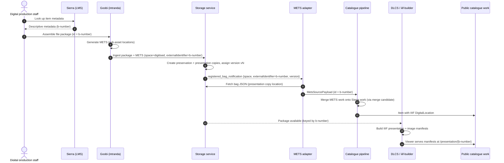
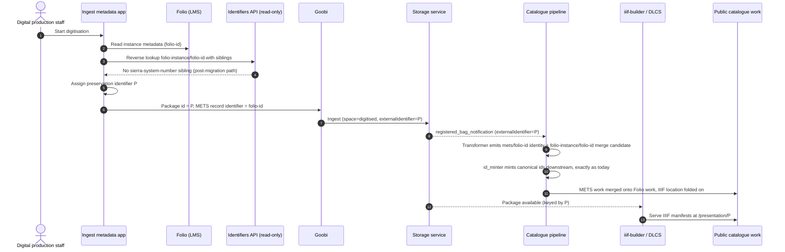

# RFC 091: Preservation identifiers across the LMS migration

## Purpose

Wellcome Collection is migrating its library management system from Sierra to Folio, and its archive management system from CALM to Axiell Collections. The Sierra b-number is embedded in storage locations, METS records, IIIF manifest URIs, and the join key that merges digitised content onto the public catalogue work. This RFC names that identifier role the **preservation identifier**, records the decision that preservation identifiers remain the canonical identifiers for digital objects (nothing is minted at ingest, and IIIF Manifest URIs do not move to the catalogue Work id), and sets out cross-migration and post-migration ingest paths covering both digitised and born-digital content.

An earlier draft of this RFC proposed minting catalogue-style identifiers at ingest through a secured extension to the Identifiers API. The review discussion on this RFC's pull request reversed that proposal; this version records the agreed direction and the reasoning. See [Alternatives considered](#alternatives-considered) for the rejected designs.

**Last modified:** 2026-08-05T14:00:00+00:00

**Related RFCs:**

- [RFC 089: Identifiers API](../089-identifiers-api/README.md): the read-only canonical to source identifier translation service over the ID Registry. The ingest app uses it to find predecessor identifiers. It stays read-only; the secured mint extension the earlier draft of this RFC proposed is withdrawn.
- [RFC 083: Stable identifiers following mass record migration](../083-stable_identifiers/README.md): the predecessor / many-to-one minting that keeps an old b-number resolving to the same canonical id.
- [RFC 081: Identifiers in iiif-builder: beyond the B number](../081-identifiers-in-iiif-builder/README.md): the DDS identity service. Its structural constraints shape the form of the new preservation identifier, but it is no longer a blocking gate on the ingest path.
- [RFC 085: Identifiers of and within IIIF resources after the migration](../085-IIIF-Identities-and-Migration/README.md): proposes that canonical IIIF URIs move to the Work id (open in [PR #143](https://github.com/wellcomecollection/docs/pull/143)). The decision recorded here inverts that position; amending RFC 085 is a named deliverable of this RFC (see [Next steps](#next-steps)).
- [RFC 088: Migrating identity, requesting and items APIs from Sierra to FOLIO](../088-folio-identity-requesting-migration/README.md): the wider identity and requesting half of the same Sierra to Folio migration.
- [RFC 090: CMS to LMS Sync](../090-axiell-folio-sync/README.md): the adjacent CMS to LMS synchronisation work (open in [PR #157](https://github.com/wellcomecollection/docs/pull/157)).
- RFC 002: Archival storage, <https://docs.wellcomecollection.org/developers/rfcs/002-archival_storage>.

## Table of contents

- [Context](#context)
  - [The preservation identifier](#the-preservation-identifier)
  - [Current ingest flows](#current-ingest-flows)
  - [How components are keyed on the preservation identifier](#how-components-are-keyed-on-the-preservation-identifier)
  - [The problem after migration](#the-problem-after-migration)
  - [Two kinds of ingest](#two-kinds-of-ingest)
  - [Predecessor identifiers (RFC 083)](#predecessor-identifiers-rfc-083)
  - [Merge behaviour after migration](#merge-behaviour-after-migration)
- [The decision](#the-decision)
  - [Preservation identifiers stay canonical](#preservation-identifiers-stay-canonical)
  - [The redirect contract](#the-redirect-contract)
- [Proposal](#proposal)
  - [Finding the predecessor](#finding-the-predecessor)
  - [Two ingest paths](#two-ingest-paths)
  - [Post-migration merge candidate](#post-migration-merge-candidate)
  - [METS works keep their own id](#mets-works-keep-their-own-id)
  - [The form of the new preservation identifier](#the-form-of-the-new-preservation-identifier)
  - [DDS and DLCS changes](#dds-and-dlcs-changes)
  - [Where each identifier lives after migration](#where-each-identifier-lives-after-migration)
  - [Worked examples](#worked-examples)
- [Alternatives considered](#alternatives-considered)
- [Impact](#impact)
  - [Risks](#risks)
  - [Backwards compatibility](#backwards-compatibility)
  - [Dependencies for each path](#dependencies-for-each-path)
  - [Open questions](#open-questions)
- [Next steps](#next-steps)

---

## Context

### The preservation identifier

Goobi, Archivematica and the storage service share one identifier for each digital object. It names the ingest package, the METS file and every sub-asset file, it is the storage `externalIdentifier` under which versions accumulate, and it is the string those systems emit when a workflow finishes. It is also, today, the canonical IIIF Manifest URI. For digitised content that identifier is the Sierra b-number; for born-digital archival content it is the CALM ref (e.g. `SABTS/A/2/10`). The role is the same in both cases even though the form differs, and the review discussion on this RFC settled on a name for it: the **preservation identifier**.

This RFC is about what the preservation identifier is once Sierra and CALM are gone, and how it relates to the other identifiers a digital object accumulates, namely its source ids in the new systems (the Folio instance id, the Axiell ref) and the public catalogue Work id.

### Current ingest flows

Digital production staff drive digitisation by hand. They pull descriptive metadata from Sierra (the LMS) and use Goobi (intranda) to assemble the file package for an item. Goobi uses the Sierra b-number as the ingest package identifier. It generates the METS files (which record the locations of the sub-assets within the package) and hands the package plus METS to the storage service for preservation. The storage service creates preservation and presentation copies.

From there, two consumers pick the package up:

- The **METS adapter** in the catalogue pipeline reacts to the storage registration and feeds the METS-sourced work into the catalogue pipeline. The pipeline merges that METS work onto the Sierra-sourced work, so the presentation fields (the IIIF location) appear on a single public-facing catalogue work.
- **DLCS / iiif-builder** reads the same package to generate the IIIF presentation and image manifests that the viewer serves.

A package can have several versions. Goobi updates the package, the storage service increments the version, and the latest version is what IIIF and the public catalogue use. The b-number is shared across all of these steps.

```mermaid
sequenceDiagram
    autonumber
    actor DP as Digital production staff
    participant Sierra as Sierra (LMS)
    participant Goobi as Goobi (intranda)
    participant Storage as Storage service
    participant METS as METS adapter
    participant Pipeline as Catalogue pipeline
    participant DLCS as DLCS / iiif-builder
    participant Public as Public catalogue work

    DP->>Sierra: Look up item metadata
    Sierra-->>DP: Descriptive metadata (b-number)
    DP->>Goobi: Assemble file package (id = b-number)
    Goobi->>Goobi: Generate METS (sub-asset locations)
    Goobi->>Storage: Ingest package + METS (space=digitised, externalIdentifier=b-number)
    Storage->>Storage: Create preservation + presentation copies, assign version vN
    Storage-->>METS: registered_bag_notification {space, externalIdentifier=b-number, version}
    METS->>Storage: Fetch bag JSON (presentation copy location)
    METS->>Pipeline: MetsSourcePayload (id = b-number)
    Pipeline->>Pipeline: Merge METS work onto Sierra work (via merge candidate)
    Pipeline->>Public: Item with IIIF DigitalLocation
    Storage-->>DLCS: Package available (keyed by b-number)
    DLCS->>DLCS: Build IIIF presentation + image manifests
    DLCS->>Public: Viewer serves manifests at /presentation/{b-number}
```

Born-digital archival material follows the same shape through Archivematica rather than Goobi. The package is identified by the CALM ref, the storage space is `born-digital` (e.g. `born-digital/SABTS/A/2/10`), the METS transformer falls back to a `calm-ref-no` merge candidate, and the manifest is served at `/presentation/SABTS/A/2/10`. There is no Sierra record and no b-number anywhere in that flow, which is worth keeping in view: a non-b-number preservation identifier is not a new idea, it is how half the estate already works.

There is one historical overlap between the two routes. Archival items digitised through Goobi were given Sierra b-numbers, so an item catalogued in CALM as `SB/1/1/298` can be preserved at `digitised/b19995271` and served at `/presentation/b19995271`. Those items keep their b-numbers forever, exactly like any other digitised item.

### How components are keyed on the preservation identifier

The preservation identifier threads through four components, each keying on it in a different way. The table shows the digitised (b-number) case; the born-digital case substitutes the CALM ref and the `born-digital` space throughout.

| Component | How it keys on the preservation identifier | Reference |
| --- | --- | --- |
| **Storage service** | A bag is the pair `(space, externalIdentifier)` with an auto-incremented version; the S3 path is `space/externalIdentifier/vN/...` (e.g. `digitised/b31497652/v2`). For digitised content the `externalIdentifier` **is** the b-number. On a successful store it publishes `{space, externalIdentifier, version, type}` to the `*_registered_bag_notifications` SNS topic. | `BagId.scala`; [RFC 002](https://docs.wellcomecollection.org/developers/rfcs/002-archival_storage) |
| **METS adapter** | Consumes the storage notification, filters to `space ∈ {digitised, born-digital}`, fetches the bag JSON, stores `MetsSourceData` in a DynamoDB VHS keyed by `Version(externalIdentifier, version)`, and publishes a `MetsSourcePayload` whose `id` is the `externalIdentifier`, the b-number. | `MetsAdapterWorkerService.scala` |
| **METS transformer** | The METS work's own identity is `mets/<b-number>` (`IdentifierType.METS`, lowercased), created as a `Work.Invisible` with `invisibilityReason` `MetsWorksAreNotVisible`. It exists only to merge onto the Sierra work, never to be seen on its own. | `MetsData.scala` |
| **IIIF / iiif-builder** | The manifest URI is keyed on the b-number and is self-identifying (e.g. `https://iiif.wellcomecollection.org/presentation/b28047345`, live, HTTP 200, not redirected to a Work id). The DLCS asset id is `{b-number}_{seq}` (e.g. `b28047345_0032`). iiif-builder loads the package by b-number. Legacy `wellcomelibrary.org/iiif/b…/manifest` URLs 301-redirect to the b-number URLs, so they are treated as permanent and must keep resolving. | n/a |

### The problem after migration

The b-number is embedded in several parts of the system. It appears in:

- the storage location (`digitised/<b-number>/vN`),
- the METS record identity and the merge candidate it emits,
- the IIIF manifest URI and the DLCS asset ids.

After the migration, library records live in Folio with new identifiers. The relationship between the old Sierra b-number and the new Folio identifier has to be carried explicitly, otherwise the digitised content (which still speaks b-number) loses its link to the public-facing record (which now speaks Folio). And for wholly new items there is no b-number at all, so something has to play the preservation identifier role for them.

The archival side is less disrupted on its face, because refs are expected to survive the CALM to Axiell move, but that expectation is itself unconfirmed (see [Open questions](#open-questions)).

### Two kinds of ingest

Two kinds of ingest matter here, and they need different handling:

- **Cross-migration ingest.** The item's record already existed in Sierra and has an old b-number, whether or not it was ever digitised before. The Folio record carries a predecessor relationship back to that b-number.
- **Post-migration ingest.** The item is new. It has no Sierra ancestry and no predecessor.

The presence or absence of a predecessor identifier is the signal we use to tell these two apart.

### Predecessor identifiers (RFC 083)

[RFC 083](../083-stable_identifiers/README.md) addresses the general migration problem: migrated records get new source identifiers, so a naive minter would mint a brand new public catalogue id for every migrated record and break every bookmark, citation, and link.

The fix is to make the minter many-to-one. A Folio or Axiell record that carries a predecessor pointer to its old Sierra b-number or CALM id inherits the existing canonical id instead of minting a new one. Multiple source identifiers share a canonical id only through explicit predecessor relationships. RFC 083 is explicit that "systems such as METS will continue to refer to old Sierra/CALM identifiers indefinitely."

The id_minter has been rewritten as a Python Lambda for this. It uses two tables: `canonical_ids(CanonicalId PK, Status ENUM('free','assigned'))` and `identifiers((OntologyType, SourceSystem, SourceId) PK, CanonicalId FK)`. It mints by claiming free ids from a pool with `SELECT ... FOR UPDATE SKIP LOCKED` and uses idempotent race detection.

The predecessor mechanism is what makes cross-migration ingest tractable: the old b-number keeps resolving to the same canonical id, so anything still keyed on the b-number stays correctly attached.

### Merge behaviour after migration

The merge that puts digitised content onto the public work runs through a merge candidate that resolves to the target work's canonical id:

1. The METS transformer decides the merge candidate by looking at the record identifier. If it matches the Sierra system-number regex it emits a merge candidate `sierra-system-number/<b-number>`, otherwise it falls back to `calm-ref-no` for born-digital (`MetsMergeCandidate.scala`).
2. The Sierra work's own `SourceIdentifier` is also `sierra-system-number/<b-number>`.
3. The id_minter mints both of those to the **same** canonical id. A canonical id is 8 characters from `[2-9a-z]` minus `o,i,l,1` with a letter first.
4. The matcher graphs works by shared canonical id.
5. The merger folds the METS digital item's `DigitalLocation` (the IIIF location) onto the Sierra item. A standalone METS work is never selected as a merge target; the Sierra work is always the target. The link is one-way, METS to Sierra; the Sierra work does not reference the METS work.

After the catalogue pipeline migrates to Folio there will be no Sierra-sourced works, and the records digitisations attach to will be Folio-sourced. Two considerations apply here, and they point in different directions.

**Canonical id continuity.** The canonical id does not change. The predecessor work in the id_minter (RFC 083) means a Folio work carrying a predecessor pointer to its old b-number inherits the *same* canonical id that the b-number had. The METS work still emits `sierra-system-number/<b-number>`, the id_minter still resolves that b-number to that canonical id, and the matcher still graphs by shared canonical id. So the METS work and the Folio work land in the same graph component, and the canonical id that works are redirected to is unchanged. Bookmarks and IIIF URIs keyed on the old id keep resolving.

**Required merger rule changes.** Target selection is coupled to Sierra. The merger picks a target from a fixed precedence list, and every entry in it is a non-Folio predicate: `ebscoWork`, `teiWork`, `singlePhysicalItemCalmWork`, `sierraDigitisedAv`, `physicalSierra`, `sierraWork` (`TargetPrecedence.scala`). Those predicates are defined by identifier type, for example `sierraWork = identifierTypeId(IdentifierType.SierraSystemNumber)` (`WorkPredicates.scala`). The rule that folds the METS digital location onto the target is likewise gated on Sierra: `mergeMetsIntoSierraTarget.isDefinedForTarget = sierraWork` (`ItemsRule.scala`). A Folio work would not satisfy any of these, so as the rules stand today it would not be selected as a target and the METS location would not be folded onto it.

The identifier type already exists: `IdentifierType.FolioInstance` (`id = "folio-instance"`) is defined in `IdentifierType.scala`. What is missing is a Folio predicate in `WorkPredicates`, an entry in `TargetPrecedence`, and a Folio target on the METS fold rule (the fold itself, `appendLocationsFrom`, is generic and does not care about source type). This is merger-rule work, not an id_minter or canonical-id change.

A consequence of this mechanism matters for everything that follows. Which public work a digital object's METS work merges onto is computed at merge time from mutable metadata, and can change when merge rules or the metadata change. The registry of source and canonical ids does not hold that outcome, and nothing upstream of the pipeline can know it at ingest time.

## The decision

### Preservation identifiers stay canonical

An earlier draft of this RFC proposed minting a catalogue-style id at ingest and working towards `presentation/{workId}` as the canonical IIIF URI (the position of [RFC 085](../085-IIIF-Identities-and-Migration/README.md)). The review discussion on [PR #159](https://github.com/wellcomecollection/docs/pull/159) reversed that proposal, for three independent reasons, each sufficient on its own:

1. **The pipeline constraint.** The METS-sourced work can never be given the public work's canonical id, because the merge that links them is computed downstream at merge time and its outcome is mutable. Baking a merge-derived id into immutable artefacts (S3 keys, METS filenames, JP2 names) would make permanent object names depend on a mutable join.
2. **Works and digital objects are not 1:1.** A merged work can aggregate multiple storage objects, so manifest to work was never guaranteed one-to-one. Keeping the id schemes visibly distinct avoids false expectations when merge rules change.
3. **URI consistency.** Canvas ids, image URIs and annotation targets derive from METS filenames and can never be redirected, because IIIF clients string-match ids inside the JSON rather than dereferencing them. Moving the manifest URI to the Work id would rename only the outer URI while everything inside every document keeps the preservation identifier, creating permanent internal inconsistency for old and new content alike. Keeping the preservation identifier canonical is the only arrangement where a manifest and its contents agree.

The agreed position is therefore:

- The preservation identifier stays the canonical IIIF Manifest URI, for old and new content alike. `https://iiif.wellcomecollection.org/presentation/b28855541` stays canonical forever, full of image links like `b28855541_0001.jp2`; a new item preserved under id `P` is served at `/presentation/P`, full of image links like `P_0001.jp2`.
- Nothing is minted at ingest. The catalogue pipeline continues to mint canonical ids downstream exactly as it does today; digital production assigns preservation identifiers but never touches the catalogue id space.
- The Work id never appears in a canonical digital-object URI. It appears only as a redirect source (see below).
- The Identifiers API ([RFC 089](../089-identifiers-api/README.md)) stays read-only.

The cost is deliberate and worth recording plainly. The work page (`/works/{workId}`) and the digital object it presents (`/presentation/{preservationId}`) permanently stop sharing a tail, trading URL elegance for internal consistency and a much smaller system. Nothing breaks, because the Work id form redirects and the catalogue API's digital locations carry the real manifest URI, so links are followed rather than constructed.

### The redirect contract

The DDS continues its redirect duty, and under this decision that duty becomes a committed contract covering all content: given a Work id, `/presentation/{workId}` redirects cheaply to `/presentation/{preservationId}`. For digitised content this is current behaviour. For born-digital it is new: today `/presentation/{workId}` for a born-digital item does not resolve at all, and it will start redirecting to the ref-based URI.

The binding that backs this redirect is merge-derived, so it cannot come from the ID Registry; which work a digital object merged into is catalogue knowledge. The DDS holds it in its own records (the identity service's stored `CatalogueId`, refreshed when a package is reprocessed), with the catalogue API as the authoritative source. The Identifiers API complements this with source-id to canonical-id translation but does not replace it.

## Proposal

Build a small application for digital production staff that creates the ingest package metadata from the Folio LMS (and, for archival digitisation, from Axiell Collections), determines the preservation identifier, and hands the package to Goobi. Nothing is minted at any point.

Behaviour splits on the predecessor signal:

- **Cross-migration ingest** (predecessor present): reuse the old b-number as the preservation identifier.
- **Post-migration ingest** (no predecessor): assign a new preservation identifier according to the scheme in [The form of the new preservation identifier](#the-form-of-the-new-preservation-identifier).

```mermaid
sequenceDiagram
    autonumber
    actor DP as Digital production staff
    participant App as Ingest metadata app
    participant Folio as Folio (LMS)
    participant IdAPI as Identifiers API (read-only)
    participant Goobi as Goobi
    participant Storage as Storage service
    participant Pipeline as Catalogue pipeline
    participant IIIF as iiif-builder / DLCS
    participant Public as Public catalogue work

    DP->>App: Start digitisation
    App->>Folio: Read instance metadata (folio-id)
    App->>IdAPI: Reverse lookup folio-instance/folio-id with siblings
    IdAPI-->>App: No sierra-system-number sibling (post-migration path)
    App->>App: Assign preservation identifier P
    App->>Goobi: Package id = P, METS record identifier = folio-id
    Goobi->>Storage: Ingest (space=digitised, externalIdentifier=P)
    Storage-->>Pipeline: registered_bag_notification (externalIdentifier=P)
    Pipeline->>Pipeline: Transformer emits mets/folio-id identity + folio-instance/folio-id merge candidate
    Pipeline->>Pipeline: id_minter mints canonical ids downstream, exactly as today
    Pipeline->>Public: METS work merged onto Folio work, IIIF location folded on
    Storage-->>IIIF: Package available (keyed by P)
    IIIF->>Public: Serve IIIF manifests at /presentation/P
```

On the cross-migration path the lookup finds a `sierra-system-number` sibling, `P` is that b-number, the METS record identifier is the b-number too, and the flow is indistinguishable from today's from Goobi onwards.

### Finding the predecessor

The predecessor signal is a registry lookup, not a Folio field read. The app calls the Identifiers API's reverse lookup for `folio-instance/<folio-id>` with siblings included; a `sierra-system-number` sibling is the old b-number, established by the RFC 083 predecessor relationship at migration time. The registry is the system of record for predecessor relationships, so this is the authoritative answer rather than a copy of it.

Where the Folio record also carries its own predecessor field, the app can cross-check the two. A disagreement between the registry and the record is a data-quality problem worth failing loudly on, not something to resolve silently in favour of either side.

### Two ingest paths

For **cross-migration ingest** we:

- Reuse the old b-number as the storage `externalIdentifier`, and
- Keep emitting `sierra-system-number/<old-b-number>` as the METS merge candidate.

That means **this path needs no change to the METS transformer** (`MetsMergeCandidate.scala`): a reused b-number still matches the Sierra system-number regex and emits `sierra-system-number/<b-number>` exactly as today. Because the predecessor relationship (RFC 083) keeps the old b-number resolving to the existing canonical id, the merge join key still lands on the right work. The storage version history is preserved because the bag identifier is unchanged. The post-migration path does add a `folio-instance` branch to the transformer (see [Post-migration merge candidate](#post-migration-merge-candidate)), but that branch is gated on the record identifier, so a cross-migration item carrying a b-number never reaches it; routing cross-migration through it instead would change the merge logic that governs whether digitised content reaches the public work, for no benefit over reusing the b-number.

This holds even though the target becomes a Folio work after migration. The METS work keeps emitting `sierra-system-number/<b-number>`, the id_minter keeps resolving that b-number to the existing canonical id through the predecessor link, and the matcher keeps graphing by shared canonical id. The one piece that does need updating is the merger's target selection, which is currently coupled to Sierra predicates (`TargetPrecedence.scala`, `WorkPredicates.scala`, `ItemsRule.scala`); it needs a `FolioInstance` predicate added so a Folio work can be picked as a target and the METS location folded onto it. See [Merge behaviour after migration](#merge-behaviour-after-migration).

Reuse applies whether or not the item was digitised before the migration. A record with a b-number predecessor that is digitised for the first time after migration still uses the b-number as its preservation identifier: it costs nothing, keeps the transformer untouched, and gives iiif-builder an identifier form it already understands.

For **post-migration ingest** there is no predecessor. The app assigns a new preservation identifier `P`, passes `P` to Goobi as the package id, and puts the Folio id in the METS record identifier. The next sections set out the mechanics.

### Post-migration merge candidate

For post-migration ingest the target is a Folio work and there is no b-number to match on, so the METS work must emit a `folio-instance/<folio-id>` merge candidate. We carry the Folio id in the METS record identifier, the same dual role the b-number plays today: it drives both the METS work's own identity (`mets/<folio-id>`) and the merge candidate (`folio-instance/<folio-id>`). No extra METS field is needed.

This needs a transformer change. `MetsMergeCandidate` today emits `sierra-system-number` for a b-number and otherwise falls back to `calm-ref-no`; it gains a `folio-instance` branch for record identifiers in the Folio id form, with the `calm-ref-no` fallback retained for archival refs. The branching is by shape, which is one of the constraints on identifier forms in [The form of the new preservation identifier](#the-form-of-the-new-preservation-identifier). `MetsData` builds the `mets/<folio-id>` own-identity as it builds `mets/<b-number>` today.

The merge runs through the merge candidate, not by the two works sharing a canonical id. The METS work has its own canonical id (see next section); its `folio-instance/<folio-id>` candidate resolves to the Folio work's own canonical id, which is the public Work id; the matcher connects them through that resolved id; the merger redirects the METS work onto the Folio work. The Folio-target merger changes in [Merge behaviour after migration](#merge-behaviour-after-migration) are what let the merger select the Folio work and fold the IIIF location on.

### METS works keep their own id

The METS-sourced work keeps its own canonical id, distinct from the public Work id, exactly as today, where `mets/<b-number>` already mints a canonical id distinct from the Sierra work's. We do not collapse anything onto the public Work id.

Nothing about that minting changes. The pipeline id_minter mints the METS work's canonical id downstream when the work first flows through, exactly as it does now. The preservation identifier `P` never enters the pipeline's identifier block at all: it reaches the pipeline only as the storage `externalIdentifier`, which the METS adapter uses as its versioning key, while the transformer works from the record identifier inside the METS XML. The earlier draft's pre-minting, its binding verification, and its fail-loud id_minter guard are all unnecessary once nothing upstream mints.

### The form of the new preservation identifier

For wholly new items something has to be assigned, and its form is the main remaining design decision. These strings become public, permanent, cited URLs, S3 keys, METS filenames, JP2 filenames and DLCS references, and they can never be renamed or reused. The review discussion (and the DDS-side review of it) produced a concrete set of requirements:

- **Unique forever and never reused**, assignable at ingest without a service round-trip.
- **Frozen at ingest.** A future migration must not touch it; the predecessor mechanism (RFC 083) is how a future system inherits it, exactly as Folio is inheriting b-numbers now.
- **Path-element safe as-is**, because it is stamped into S3 keys, METS filenames, IIIF URIs and DLCS string references on day one, upstream of any service.
- **Case-stable, defined lowercase from birth.** The one accepted risk in the DDS identity service today is CALM ref case-collision on a lowercased key; a new scheme should never inherit that problem.
- **Visibly distinct by shape** from the catalogue Work id scheme (8 chars of `[2-9a-z]` minus `o,i,l,1`), from the b-number regex, and from CALM refs including their underscore-written forms. Distinctness is what lets the METS transformer branch correctly, lets the DDS classify identifiers cheaply, and preserves the debugging property that a storage id and a work id can never be confused.
- **A defined multi-volume suffix convention.** Goobi stamps `<id>_0002`-style suffixes into METS and JP2 names for multi-volume items. `
_0002` must be unambiguously splittable into package id and volume suffix, and must not collide with CALM refs written with underscores (`PPCRI_A_1`). This cannot be left implicit.

Candidates, in current order of preference:

1. **The Folio instance HRID** (e.g. `in00012345`). Human-legible, provenance-visible, lowercase, path-safe, and distinct by shape from Work ids (wrong length and alphabet), b-numbers and CALM refs. It has a further structural benefit: the storage `externalIdentifier` and the METS record identifier become the same string again, restoring the property both have today with the b-number and collapsing open question 2. The apparent objection, that embedding an LMS id repeats the b-number problem, does not hold under this design. The b-number pain was identity coupling to a live system; a preservation identifier frozen at ingest is inherited by the next system via predecessors rather than replaced, exactly as b-numbers are being handled now. The id is a permanent name whose origin happens to be legible, not a live foreign key.
2. **A dedicated scheme** (e.g. a short prefix plus a random lowercase string). Maximally decoupled and easy to make shape-distinct, but opaque to the digital production staff who handle packages between digitisation and preservation, and it reintroduces the divergence between `externalIdentifier` and record identifier.
3. **A UUID.** Trivially unique and safe, but hostile in filenames and URLs, opaque, and also divergent.

The recommendation is the Folio HRID, with the Axiell ref playing the same role for archival digitisation as it already does for born-digital. This is open question 1 until confirmed.

### DDS and DLCS changes

iiif-builder today infers source system, generator and storage space from identifier shape: a b-number means Sierra, Goobi and the `digitised` space, anything else means CALM, Archivematica and `born-digital`. A new preservation identifier form breaks that inference, and post-migration even a ref-shaped identifier is ambiguous on its own, because an Axiell-catalogued item digitised through Goobi lands in `digitised` while a born-digital sibling lands in `born-digital`.

This is a much smaller problem than the full [RFC 081](../081-identifiers-in-iiif-builder/README.md) programme, and it is not a gate on this RFC's ingest paths. The DDS identity service already persists identities in its own table, and the facts the parser currently guesses all have authoritative sources at hand: the workflow message origin supplies the generator at ingest, a storage-service probe validates the space, and the Identifiers API resolves any known source identifier to its canonical id and labelled siblings. Shape-based inference shrinks to shape-based candidate generation, paid once per identifier. What remains genuinely local to the DDS is sub-package structure (volume suffixes, canvas naming), which no registry will ever answer, and which the suffix convention above is designed to keep trivial.

The corresponding open item is confirmation that DLCS and iiif-builder tolerate the storage `externalIdentifier` differing from the METS record identifier, which the recommended scheme would make moot by keeping them equal.

### Where each identifier lives after migration

Post-migration, with the recommended scheme (P = the Folio HRID):

| Identifier | What it is | Used for |
| --- | --- | --- |
| `folio-id` | The Folio instance id, carried in the METS record identifier | Drives the METS own-identity and the merge candidate, the dual role the b-number plays today |
| `P` | The preservation identifier, assigned at ingest | Package handle: storage `externalIdentifier`, METS and JP2 naming, DLCS asset ids, canonical IIIF URI `/presentation/P` |
| `mets/<folio-id>` | The METS work's source identity | Mints (downstream, as today) the METS work's own canonical id |
| `folio-instance/<folio-id>` | The Folio work's source identity, and the METS merge candidate | Resolves to the public Work id; this is the merge join |
| Public Work id | The Folio work's own canonical id | The public-facing catalogue work at `/works/{workId}`; `/presentation/{workId}` redirects to `/presentation/P` |

For cross-migration the same shape holds with the b-number as both `P` and the record identifier, and `sierra-system-number` in place of `folio-instance`, with no transformer change.

### Worked examples

Concrete identifier strings at every layer, for the four permutations. Work ids are illustrative.

**Digitised, cross-migration.** A book catalogued in Sierra as `b18035978`, its record now migrated to Folio instance `in00067890` with a predecessor relationship. It may or may not have been digitised before; either way the b-number is reused.

| Layer | Identifier |
| --- | --- |
| Folio record | `in00067890`, predecessor `b18035978` |
| Preservation identifier | `b18035978` (reused) |
| Storage | `digitised/b18035978/vN` (version history continues) |
| METS file / images | `b18035978.xml`, `b18035978_0001.jp2` |
| METS record identifier | `b18035978` |
| Merge candidate | `sierra-system-number/b18035978` |
| Public Work id | `zjytxny8` (inherited via predecessor) |
| Canonical manifest | `/presentation/b18035978` |
| Redirects | `/presentation/zjytxny8` redirects to `/presentation/b18035978` |

**Digitised, post-migration, Folio-catalogued.** A new printed book, catalogued only in Folio as `in00012345`.

| Layer | Identifier |
| --- | --- |
| Folio record | `in00012345`, no predecessor |
| Preservation identifier | `in00012345` (recommended scheme; substitute if open question 1 lands elsewhere) |
| Storage | `digitised/in00012345/v1` |
| METS file / images | `in00012345.xml`, `in00012345_0001.jp2` |
| METS record identifier | `in00012345` |
| Merge candidate | `folio-instance/in00012345` |
| Public Work id | `abcd3456` (newly minted, downstream) |
| Canonical manifest | `/presentation/in00012345` |
| Redirects | `/presentation/abcd3456` redirects to `/presentation/in00012345`; the work page is `/works/abcd3456` |

**Digitised, post-migration, Axiell-catalogued.** An archival item digitised through Goobi. Before the migration this item would have been given a b-number; now the ref plays the preservation identifier role, as it already does for born-digital.

| Layer | Identifier |
| --- | --- |
| Axiell record | ref `PPCRI/D/4/2`, no Sierra ancestry |
| Preservation identifier | `PPCRI/D/4/2` |
| Storage | `digitised/PPCRI/D/4/2/v1` |
| METS file / images | per ref, e.g. `PPCRI_D_4_2.xml`, `PPCRI_D_4_2_0001.jp2` |
| METS record identifier | `PPCRI/D/4/2` |
| Merge candidate | `calm-ref-no/PPCRI/D/4/2` (whether this stays `calm-ref-no` or becomes an Axiell type is part of open question 3) |
| Public Work id | `mkt6dqe2` (newly minted, downstream) |
| Canonical manifest | `/presentation/PPCRI/D/4/2` |
| Redirects | `/presentation/mkt6dqe2` redirects to `/presentation/PPCRI/D/4/2` |

**Born-digital, Axiell-catalogued.** Through Archivematica; unchanged from today except that the Work id redirect starts working.

| Layer | Identifier |
| --- | --- |
| Axiell record | ref `SABTS/A/2/10` |
| Preservation identifier | `SABTS/A/2/10` |
| Storage | `born-digital/SABTS/A/2/10/v1` |
| METS record identifier | `SABTS/A/2/10` |
| Merge candidate | `calm-ref-no/SABTS/A/2/10` |
| Public Work id | `h3jc4wga` |
| Canonical manifest | `/presentation/SABTS/A/2/10` |
| Redirects | `/presentation/h3jc4wga` starts redirecting to `/presentation/SABTS/A/2/10` (today it does not resolve) |

A fifth permutation, born-digital material catalogued in Folio, is expected eventually (it was the original driver for the DDS identity service in RFC 081). It takes the same shape as the second example with `born-digital` as the space and Archivematica as the generator, and needs no new mechanics beyond those above.

## Alternatives considered

**Use the Work id as the canonical manifest URI.** The position of RFC 085 as drafted, and of the earlier version of this RFC. Rejected for the three reasons in [The decision](#the-decision): the merge that binds a digital object to its public work is computed downstream from mutable metadata, so the Work id cannot be baked into immutable artefacts; works and digital objects are not reliably 1:1; and canvas ids, image URIs and annotation targets can never be redirected, so the flip would buy a matching URL tail at the cost of permanent internal inconsistency in every document.

**Mint catalogue-style ids at ingest.** The earlier draft of this RFC: a secured resolve-or-mint endpoint on the Identifiers API, a pre-minted canonical id C as the storage handle, the transformer carrying C into the identifier block, and a fail-loud id_minter guard verifying the binding. Withdrawn. Once the manifest URI does not need to be a catalogue-style id, the minted handle buys nothing the preservation identifier does not already provide, and the design carried real costs: a write path on an otherwise read-only API, a second minting client, new id_minter verification behaviour, a transformer change to carry the id, and a hard dependency on RFC 081's identity service before any post-migration item could be ingested.

**Feed the Folio id into Goobi as the package id for existing items.** The simplest option for cross-migration would be to use the Folio id where the b-number is used today. This breaks two independent mechanisms.

The first is storage versioning. The `externalIdentifier` is effectively immutable; there is no rename operation. Whether the storage service creates a new bag or updates an existing one is decided purely by whether the `(space, externalIdentifier)` pair already exists. Changing the identifier produces a different bag whose version counter starts again at v1, and the version history that IIIF and the catalogue rely on does not carry across.

The second, and more serious because it is silent, is the merge join key. If the package identifier moved off the b-number, `MetsMergeCandidate` would emit a non-matching candidate, the id_minter would mint a *different* canonical id, the matcher would leave the two works in separate graph components, and the digitised content would never reach the public work. The METS work stays invisible (`MetsWorksAreNotVisible`), so nothing is surfaced and no error is raised. The digitisation would be missing from the public record with no error and no obvious signal.

Neither mechanism applies to wholly new items, which have no history to reset and whose merge candidate is driven by the Folio id in any case. That is why the Folio HRID is a live candidate for the *new-item* scheme in [The form of the new preservation identifier](#the-form-of-the-new-preservation-identifier) while remaining rejected as a replacement identifier for existing ones.

## Impact

### Risks

The principal risk is unchanged from the earlier draft: a mis-handled package identifier leaves digitised content invisible on the public record with no error, because the METS work is invisible by design. The mitigation is now simpler. The cross-migration path reuses the b-number so the join key is untouched, and the post-migration path drives the merge from the METS record identifier exactly as today, so the failure mode reduces to a wrong or missing record identifier, the same class of error the current system already carries.

### Backwards compatibility

This decision is maximally conservative for existing URIs. Every `https://iiif.wellcomecollection.org/presentation/{b-number}` URL and every born-digital ref URL stays canonical rather than becoming a redirect, and the `wellcomelibrary.org` 301s keep resolving unchanged. External annotations whose targets embed b-number canvas ids remain consistent with the manifests that contain them. The new behaviour is additive: Work-id redirects extend to born-digital, and new items appear under new preservation identifiers with no pre-existing URLs to preserve.

### Dependencies for each path

After the catalogue pipeline migrates to Folio, **both** paths need the Folio-target merger rules: a predicate in `WorkPredicates`, an entry in `TargetPrecedence`, and a Folio target on the METS fold rule in `ItemsRule`. In both cases the work a digitisation attaches to is now a Folio work.

The **post-migration path additionally** depends on:

1. the preservation identifier scheme being agreed (open question 1), since Goobi stamps it into filenames on day one,
2. the `folio-instance` branch in the METS transformer (`MetsMergeCandidate`, plus the `mets/<folio-id>` own-identity in `MetsData`), and
3. the DDS recognising the new identifier form (shape-distinct classification plus the authoritative-source lookups in [DDS and DLCS changes](#dds-and-dlcs-changes)), coordinated with Digirati. This is a bounded DDS change, not the full RFC 081 programme.

Cross-migration needs none of these: it reuses the b-number, keeps the transformer on `sierra-system-number`, and gives iiif-builder an identifier it already understands.

### Open questions

1. **The form of the new preservation identifier.** The requirements are set out in [The form of the new preservation identifier](#the-form-of-the-new-preservation-identifier); the recommendation is the Folio HRID. The decision includes the multi-volume suffix convention, which must be defined alongside the form because Goobi stamps it into METS and JP2 filenames upstream of any service.
2. **Storage identifier and record identifier divergence.** Post-migration the storage `externalIdentifier` (P) need not be the same string as the METS record identifier (`folio-id`). Today both are the b-number, and whether iiif-builder and DLCS rely on the two being equal is unconfirmed: iiif-builder loads the package by its storage handle but derives Canvas and DLCS asset identifiers from file names recorded in the METS. Choosing the Folio HRID as P keeps the two equal and makes this question moot; any other scheme must answer it before the post-migration path ships.
3. **Axiell ref stability across the CALM migration.** The born-digital story above assumes archival refs survive the move to Axiell Collections identically, in which case born-digital needs no change, ever. If refs can be restructured in Axiell, born-digital needs the same predecessor mechanism as b-numbers, and that mechanism is currently only specified for Sierra to Folio. Related: whether the METS merge candidate for Axiell-catalogued material stays `calm-ref-no` or becomes an Axiell identifier type, which touches the same transformer fallback.

## Next steps

1. **Agree the preservation identifier scheme** (open question 1), including the multi-volume suffix convention, with digital production, the pipeline team and Digirati, since all three consume its shape.
2. **Build the digital production ingest app** that reads Folio (and Axiell) metadata, finds predecessors through the Identifiers API, and branches on the predecessor signal.
3. **Cross-migration first.** It is the lower-risk path: reuse the b-number, leave the METS transformer untouched, and lean on the RFC 083 predecessor relationship to keep canonical ids stable. It needs only the Folio-target merger rules (step 5).
4. **Add the `folio-instance` transformer branch** (`MetsMergeCandidate`, `MetsData`), shape-gated so b-numbers and refs are unaffected.
5. **Update the merger rules for Folio targets.** Add a `FolioInstance` predicate to `WorkPredicates`, an entry to `TargetPrecedence`, and a Folio target on the METS fold rule in `ItemsRule`, so that after migration a Folio work is selected as the merge target. Both paths need this; it does not touch the id_minter or the canonical id, and it is independent of the transformer change.
6. **Scope the DDS recognition change with Digirati**: shape-distinct classification of the new form, authoritative-source lookups for generator and space, and the extended Work-id redirect contract covering born-digital.
7. **Amend RFC 085** to invert its "Use the Work ID" position, as a deliverable of this RFC rather than a follow-up intention, so the two documents do not disagree in the interim.
8. **Resolve the open questions**, in particular Axiell ref stability (open question 3), which decides whether born-digital needs predecessor support at all.
9. **Keep existing IIIF URLs permanent.** Existing `iiif.wellcomecollection.org/presentation/{b-number}` URLs, born-digital ref URLs and the `wellcomelibrary.org` redirects stay canonical and keep resolving; this decision strengthens that guarantee rather than weakening it.

| Aspect | Cross-migration ingest | Post-migration ingest |
| --- | --- | --- |
| Predecessor present? | Yes | No |
| Signal | `sierra-system-number` sibling in the ID Registry (Identifiers API reverse lookup) | No sibling found |
| Preservation identifier (storage `externalIdentifier`) | Reused old b-number | Newly assigned P (recommended: the Folio HRID) |
| METS record identifier | b-number | `folio-id` |
| Minting at ingest | None | None |
| METS merge candidate | `sierra-system-number/<old-b-number>` | `folio-instance/<folio-id>` |
| Change to `MetsMergeCandidate.scala`? | No | Yes (`folio-instance` branch) |
| Folio-target merger rules | Required after migration | Required after migration |
| Public work canonical id | Inherited via RFC 083 predecessor link | Newly minted downstream from `folio-instance` |
| Canonical manifest URI | `/presentation/<b-number>` (unchanged) | `/presentation/
` |
| Storage version history | Preserved (id unchanged) | Starts at v1 (new item, expected) |
