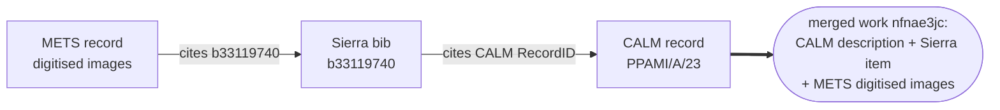
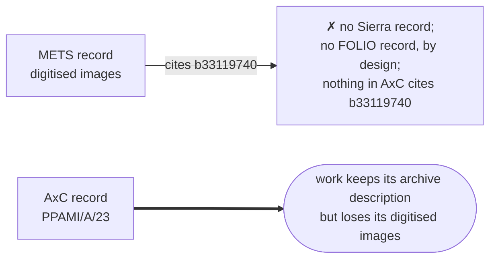
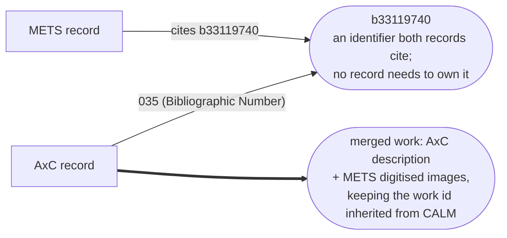

# RFC 092: Keeping digitised archive material connected after Sierra

## Purpose

Digitised archive material on wellcomecollection.org is connected to its archive description through the CALM-synced Sierra bib, and those bibs are deliberately not migrated to FOLIO. This RFC records how the connection works today, shows that the catalogue pipeline can maintain it with no Sierra or FOLIO record existing provided the Axiell Collections record cites the Sierra b number, and quantifies the gap (roughly 93% of digitised archive records carry no b number in Axiell). The proposed fix is to import the missing b numbers into Axiell Collections, matched on each record's public reference and verified through the CALM RecordID carried in the migration. It is the archive-side companion to RFC 091, which covers the library-side (FOLIO-target) half of post-migration digitisation merging.

**Last modified:** 2026-08-18T11:58:00+00:00

**Related RFCs:**

- [RFC 091: Preservation identifiers across the LMS migration](../091-digitisation-ingest-identifiers/README.md): the library-side half of the same problem. Its merge-behaviour section is written for FOLIO targets and states that the Sierra work is always the merge target; that holds for library material only, and this RFC records the archive-material case where a CALM or Axiell work is the target. Cross-referencing this from RFC 091 is a next step below.
- [RFC 083: Stable identifiers following mass record migration](../083-stable_identifiers/README.md): the predecessor mechanism that keeps public work ids stable across the migrations. The Axiell records' CALM RecordID predecessor is what preserves the work ids of everything discussed here.
- [RFC 090: CMS to LMS Sync](../090-axiell-folio-sync/README.md): the adjacent synchronisation work. The scoping decision that Axiell and FOLIO hold mutually exclusive record sets, which removes the Sierra bridge this RFC replaces, comes from that programme.

## Context

### How a digitised archive work is assembled today

A digitised archive work on wellcomecollection.org is three records merged into one. Taking [nfnae3jc](https://wellcomecollection.org/works/nfnae3jc) as the example:

Each hop uses a different identifier. The METS record knows only the b number. The Sierra bib knows the CALM RecordID (it was created by the CALM-to-Sierra sync). The CALM record is chosen as the face of the merged work and the other two redirect into it. There is no direct link between METS and CALM anywhere in the data; the Sierra bib is the only bridge.

The worry is that Sierra retires, the CALM-synced bibs are deliberately not migrated to FOLIO (Axiell and FOLIO are meant to hold mutually exclusive record sets), and the bridge disappears:

About 94,430 works with digitised content are in the Archives and manuscripts format.

### The pipeline needs only the identifier

The matcher connects records that cite the same identifier even when no record owns it. The identifier acts as a meeting point, and the merger can merge a METS record directly into a CALM or Axiell work with no Sierra record in the graph. Both behaviours are covered by tests, and born-digital material already depends on them in production: an Archivematica METS record and a CALM record meet on the RefNo, which neither of them owns as their own identifier, and merge with no Sierra record involved.

So the fix requires neither migrating the CALM-synced bibs into FOLIO nor any new pipeline feature. If the AxC record cites the b number, everything reconnects:

The Axiell transformer already turns an `035 (Bibliographic Number)` into exactly this link; it is the mechanism behind the GC179 merge test records, a small archive collection whose AxC records were seeded with b numbers during migration testing to prove the Sierra and Axiell merge (the only written trace is in [wellcomecollection/platform#6525](https://github.com/wellcomecollection/platform/issues/6525)).

### The missing b numbers

CALM has a Bnumber field, but it was filled in for only a small minority of records. In a sample of 676 digitised archive records, 47 (about 7%) have it, and nfnae3jc's CALM record has the field empty. The migration into AxC carried the b number where CALM had it and nowhere else. In the round-2 AxC load harvested 17 August, 6,999 of 210,846 records (3.3%) carry an `035 (Bibliographic Number)`, and the AxC record for our example, though otherwise rich, cites nothing that connects it to b33119740. For roughly 93% of digitised archive material, the day Sierra's records stop flowing, the images detach from the work.

### What we already have

The CALM RecordID did make it into AxC. The current data carries it (it surfaces as MARC 907, present on 209,544 of the 210,846 records in the round-2 load, 99.4%), and in round-1 testing 201,072 works landed on the same public work ids as production with zero mismatches, so work URLs are stable and every AxC record has a reliable key to match an import against.

We also hold the complete b number mapping. Production currently has 246,474 Sierra bibs merged into archive works, and each of those bibs cites the CALM RecordID it was synced from, so extracting (CALM RecordID, b number) pairs is a straightforward job against data we already have.

## Proposal

Generate the (CALM RecordID, b number) pairs from the current Sierra data and import the b numbers into the AxC records so they surface as `035 (Bibliographic Number)` in the harvest. From there the existing pipeline does the rest, with no Sierra or FOLIO record needed.

The Axiell import matches records on their object_number, which corresponds to the public reference (AltRefNo in CALM); the tooling to generate an input CSV uses the  CALM RecordID carried in the migration to derive and verify each record's reference before it becomes the match key. 

The agreed import format is `object_number,alternative_number,alternative_number.type`, for example `WT/D/1/20/1/35/95,b33174192,Bibliographic Number`, with the type column constant. That match key is the one collections staff specified for the Collections Import tool; it was verified collision-free across all 209,544 matched records before adoption.

Tooling for this lives in the catalogue-pipeline repo under `scripts/axiell_bnumber_import/` (wellcomecollection/catalogue-pipeline#3579). One script extracts the pairs from the Sierra source works' merge candidates; a second joins them against the 907 RecordIDs in the Axiell adapter store and emits the import CSV in the agreed format alongside conflict and unmatched reports, withholding rows where several AxC records would share the reference the import matches on. Both steps are read only and deterministic, and a delta mode emits only rows new since a previous CSV. The first cut, run 17 August against the round-2 store, extracted 246,204 pairs (exactly one bib per RecordID) and yields 197,090 importable rows, with 6,476 already present in AxC and 38 conflicts to review; every matched record carries a unique public reference, so nothing is withheld.

The data should live in AxC rather than be enriched in the pipeline. A pipeline enrichment step is feasible as a fallback, but it leaves the linkage invisible to every other consumer of the Axiell data, and where the linkage lives is exactly the kind of what-goes-where decision this RFC exists to record.

## Alternatives considered

- **Enrich in the catalogue pipeline.** Hold the (CALM RecordID, b number) mapping in the pipeline and inject the merge candidate during the Axiell transform. Workable and entirely under our control, but the linkage becomes invisible to every other consumer of the Axiell data (the FOLIO sync, reporting, any future re-migration), and the mapping ossifies in a place collections staff cannot see or maintain. Kept as the fallback if the import route fails.
- **Migrate the CALM-synced Sierra bibs into FOLIO after all.** This restores the bridge by keeping a successor record for every bib. It contradicts the agreed scoping (Axiell and FOLIO hold mutually exclusive record sets), creates tens of thousands of FOLIO records whose only purpose is to be merged over, and still needs the FOLIO-target merger work from RFC 091. Rejected as strictly more work for a worse data model.
- **TEI-style replacement records.** Manuscripts absent from AxC are getting TEI records that carry both the Calm ID and the Sierra b number, which is this same meeting-point mechanism in a different source. That route fits material that is being re-catalogued anyway; it is not a general answer for 200,000+ Axiell records that already exist.
- **Do nothing.** Roughly 93% of digitised archive material loses its images on cutover. The archive descriptions survive, so the loss is silent: no error, just works with the viewer gone.

## Impact

The import reconnects digitised images for the large majority of the ~94,430 digitised archive works, and does it before cutover rather than as a recovery job after. Public work ids are unaffected throughout; they are preserved by the CALM RecordID predecessor mechanism (RFC 083) independently of this change.

Risks and caveats:

- The mapping is a snapshot. Records digitised between extraction and cutover need a repeat pass, or the b number capture needs to become part of the digitisation workflow until Sierra actually stops. The extraction is cheap to re-run. Relatedly, about 42,600 of the extracted pairs have no AxC record yet, dominated by CALM records committed after the migration extract; those arrive with the final delta migration load and need a second import pass, which the tooling's delta mode covers.
- The coverage figures above were measured against the round-2 load of 17 August; a further load before cutover would need the same measurement repeated.
- Import quality depends on the CALM RecordID surviving in AxC, which round-1 testing supports (201,072 matched ids, zero mismatches), but the import job should report unmatched rows rather than dropping them.
- Digitised AV whose Sierra bib is not CALM-linked is out of scope and worse off: a METS record can never stand alone as a work, so if those bibs are migrated nowhere the works drop out of the catalogue entirely. That needs its own decision and owner.
- Old Sierra work ids currently redirect to the archive work; after cutover they will 404. The CALM record always came first for these, so few such links should be in the wild, but it is a real behaviour change.

## Next steps

1. Generate the (CALM RecordID, b number) CSV from current Sierra data: done, first cut 17 August via wellcomecollection/catalogue-pipeline#3579 (tracked in [wellcomecollection/platform#6525](https://github.com/wellcomecollection/platform/issues/6525)).
2. Agree the import route and format with collections staff: format agreed 17 August (`object_number,alternative_number,alternative_number.type`, matching on the public reference, the AltRefNo); Victoria Webb has confirmed importing b numbers into Axiell archive records is straightforward.
3. Finalise the import list from the measured gap (6,999 of 210,846 records carry the field in the 17 August load).
4. Run the import, re-harvest, and verify a sample of digitised archive works merge without their Sierra records.
5. Cross-reference this RFC from RFC 091 and soften its "the Sierra work is always the target" wording to the library-material case.
6. Find an owner for the non-CALM-linked digitised AV decision.
