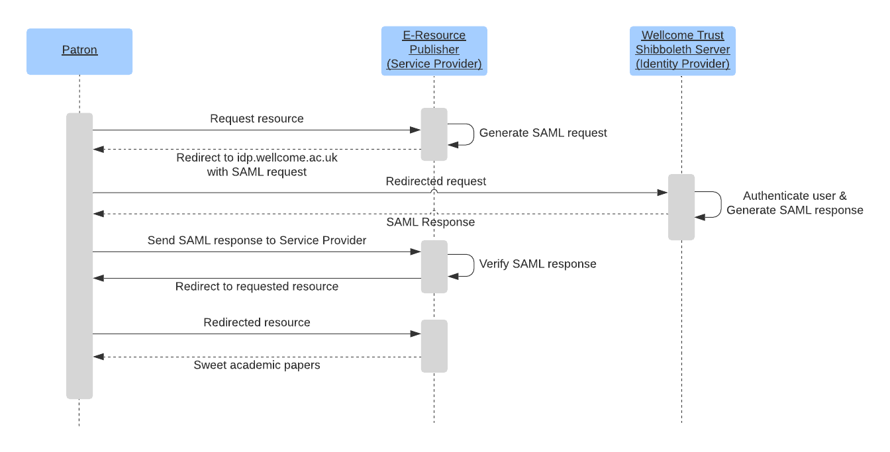
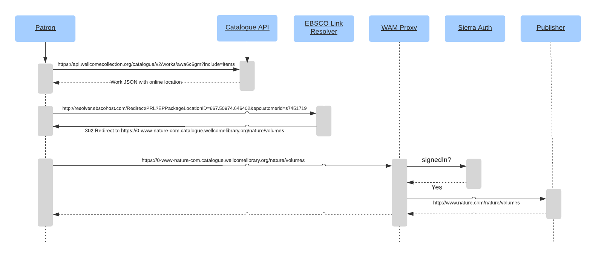

# E-Resource Authentication

Wellcome Collection like many other institutions offers its staff and patrons access to electronic journals & books offered by online databases/publishers.

The list of databases offered is [available on the Wellcome Collection site](https://wellcomecollection.org/pages/YDaP2BMAACUAT7DS).

The "Collections and Research" team handles relationships with publishers / database providers, negotiates terms of access and communicate changes in access requirements.

As part of decommissioning the Wellcome Library site we must ensure continuity of access to those resources for patrons and staff.

## E-resources in the Catalogue API

E-resources are currently available from the page linked above, but [can also be found](https://api.wellcomecollection.org/catalogue/v2/works?query=awa6c6gm&include=items) in the catalogue API.

Items will have an `online-resource` location, for example:

```json
{
  "@context": "https://api.wellcomecollection.org/catalogue/v2/context.json",
  "type": "ResultList",
  "pageSize": 10,
  "totalPages": 1,
  "totalResults": 1,
  "results": [
    {
      "id": "awa6c6gm",
      "title": "Nature",
      "alternativeTitles": [
        "Nature (Online)"
      ],
      "workType": {
        "id": "d",
        "label": "Journals",
        "type": "Format"
      },
      "items": [
        {
          "locations": [
            {
              "locationType": {
                "id": "online-resource",
                "label": "Online resource",
                "type": "LocationType"
              },
              "url": "http://resolver.ebscohost.com/Redirect/PRL?EPPackageLocationID=667.50974.646402&epcustomerid=s7451719",
              "linkText": "Connect to Nature Publishing Group",
              "accessConditions": [
                {
                  "status": {
                    "id": "licensed-resources",
                    "label": "Licensed resources",
                    "type": "AccessStatus"
                  },
                  "type": "AccessCondition"
                }
              ],
              "type": "DigitalLocation"
            }
          ],
          "type": "Item"
        }
      ],
      "availabilities": [
        {
          "id": "online",
          "label": "Online",
          "type": "Availability"
        }
      ],
      "type": "Work"
    }
  ]
}
```

The URL indexed is for the [EBSCO](https://www.ebsco.com/) Link Resolver
                           
EBSCO is a service used by "Collections and Research" to handle database/e-journal metadata.

### EBSCO link resolver

EBSCOhost etc.

## Current access methods

### Staff

Access for staff is via [Shibboleth](https://en.wikipedia.org/wiki/Shibboleth_Single_Sign-on_architecture), a profile of [SAML](https://en.wikipedia.org/wiki/Security_Assertion_Markup_Language).

We have an on-premises implementation hosted at [idp.wellcome.ac.uk](https://idp.wellcome.ac.uk/idp/shibboleth) and managed by [Overt](https://www.overtsoftware.com/overt-idp/). Staff users authenticate via Active Directory using their Wellcome accounts.

Staff access will be unaffected by the shut down of the Wellcome Library site. 

The sequence diagram for accessing a Shibboleth resource looks like:



Shibboleth relies on a [public/private key cryptography](https://en.wikipedia.org/wiki/Public-key_cryptography) to verify responses have been signed by a particular "identity provider".

Some service providers require that to use Shibboleth authentication you are a member of a trusted federation e.g. [Springer Nature](https://support.springernature.com/en/support/solutions/articles/6000079288-shibboleth-access-for-institutions).

The Wellcome Trust & Wellcome Sanger institute are members of the [UK Federation](https://www.ukfederation.org.uk/content/Documents/IdPInfoList), which holds some metadata on those institutions as "identity providers".

The UK Federation [publishes metadata](https://www.ukfederation.org.uk/content/Documents/MetadataPublicationService) about "identity providers" that hold membership, that service providers can use to determine where a user will sign-in.

#### Where Are You From (WAYF)

Some publishers provide "Where Are You From (WAYF)" pages that allow a user to specify their institution so as to be directed to the correct "identity provider" sign-in page.

Some examples:
- [Elsevier WAYF](https://id.elsevier.com/as/authorization.oauth2?platSite=SD%2Fscience&scope=openid%20email%20profile%20els_auth_info%20els_idp_info%20urn%3Acom%3Aelsevier%3Aidp%3Apolicy%3Aproduct%3Ainst_assoc&response_type=code&redirect_uri=https%3A%2F%2Fwww.sciencedirect.com%2Fuser%2Fidentity%2Flanding&authType=SINGLE_SIGN_IN&prompt=login&client_id=SDFE-v3&state=retryCounter%3D0%26csrfToken%3D6f6cfa12-6004-4123-b92a-136e9adbed72%26idpPolicy%3Durn%253Acom%253Aelsevier%253Aidp%253Apolicy%253Aproduct%253Ainst_assoc%26returnUrl%3Dhttps%253A%252F%252Fwww.sciencedirect.com%26prompt%3Dlogin%26cid%3Datp-86df350e-72da-42e8-acea-61be3e04e40d&dgcid=user-inst-login 
)
- [Springer Nature WAYF](https://wayf.springernature.com/?redirect_uri=https://www.nature.com/)

It is also possible to construct "WAYFless URLs" for publishers that specify which "identity provider" to use when accessing a resource.

### Patrons

Library patrons can get access to e-resources by the following methods.

#### Sierra WAM Proxy 

**WAM** is an acronym for [Web Access Management](https://en.wikipedia.org/wiki/Web_access_management). A "WAM Proxy" manages access to resources behind a proxy server, those resources trust that requests that come from the proxy server IP address are valid. 

Sierra implements a "WAM Proxy" service which authenticates users requesting resources via a custom integration with Sierra.

When a user accesses a resource behind the WAM Proxy they will use a WAM Proxy link which prepends the resource domain to a Wellcome Library domain, e.g.

**Resource link**
```
https://0-www-nature-com.catalogue.wellcomelibrary.org/nature/volumes
```

**WAM Proxy link for that resource**
```
https://0-www-nature-com.catalogue.wellcomelibrary.org/nature/volumes
```

Access to e-resources is achieved by providing publishers / database providers with the fixed IP of our WAM Proxy server through which resources will be accessed. 

Patrons who are not on library premises can currently get access by signing in to Wellcome Library using their OPAC/Sierra login and accessing resources via the WAM Proxy.

For users who are signed in the sequence diagram for accessing e-resources would look like:



Users authenticated with Sierra have their requests proxied from an on-premises IP recognised by a publisher.

A user who is not authenticated is redirected to sign in with Sierra at https://catalogue.wellcomelibrary.org/iii/cas/login and query parameters on that page direct users back to the proxied publisher URL if sign-in is successful.  

Patrons will no longer be able to use sign-in via Sierra when they switch to using the new SSO solution as their password will not be synchronised with Sierra, we would also seek to use the new SSO solution to authenticate users to maintain consistency in UI and process.

##### Kiosk access

Patrons who are on the library premises can get access from "kiosk" computers that sit on the Wellcome Collection network those users and anyone who is on the library wifi network will not be asked to sign in by the WAM Proxy server.

The kiosk access method must be maintained and should be unaffected by the shut down of the Wellcome Library site.

The EBSCO link resolver URL that is referenced in the Catalogue API results will provide you with a WAM Proxy link that does not require authentication.
