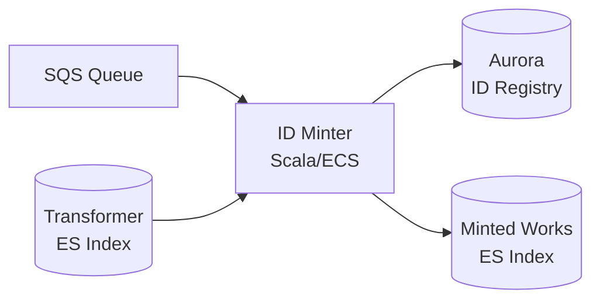
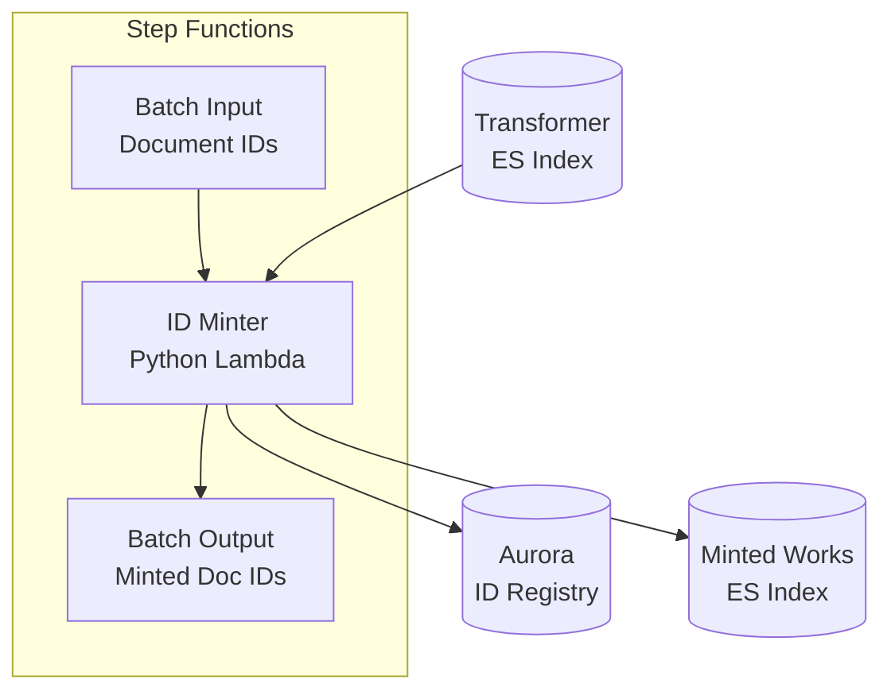
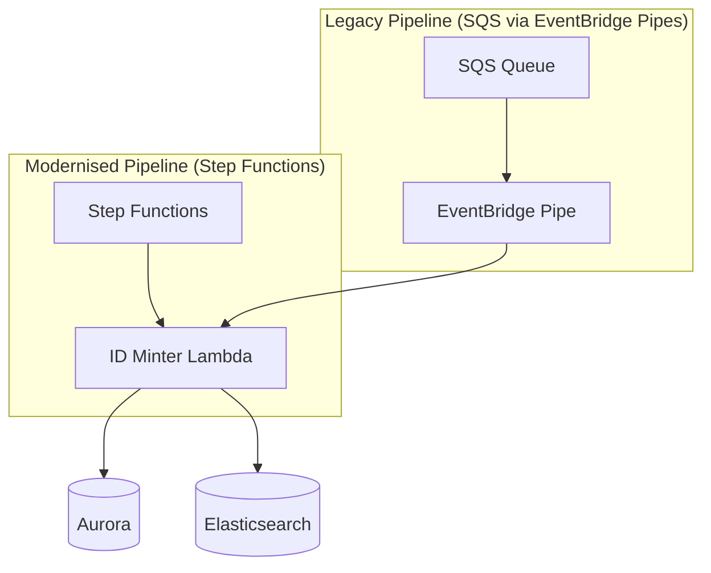

# Proposed solution: Support multiple source identifiers per catalogue ID

This document describes the proposed changes to the ID Minter to support stable public catalogue identifiers during the migration from CALM/Sierra to Axiell Collections/Folio.

## Overview

Modify the ID Minter to allow multiple source identifiers to map to the same public catalogue identifier. When a new Axiell Collections or Folio record arrives that references an old Sierra/CALM identifier (via a "predecessor" relationship), it should inherit the existing catalogue identifier rather than receiving a new one.

This is achieved through:
1. A new database schema that separates canonical ID management from source ID mappings
2. Support for pre-generating canonical IDs to improve minting performance
3. Transformer changes to emit predecessor source identifiers for migrated records
4. Rewriting the ID Minter as a Python Lambda following the catalogue pipeline modernisation pattern

## Current service architecture

The existing ID Minter is implemented as a Scala service running on ECS. It:

1. Consumes messages from an SQS queue containing document IDs to process
2. Retrieves corresponding work documents from the transformer's Elasticsearch index
3. Extracts source identifiers and merge candidates from the document
4. Mints or looks up canonical IDs for each identifier in the Aurora database
5. Annotates the work document with canonical IDs
6. Writes the annotated document to its own Elasticsearch index for downstream consumers



This architecture will be modernised as part of the broader catalogue pipeline migration to AWS Step Functions and Python Lambdas.

## Database schema

### Current schema

```sql
CREATE TABLE `identifiers` (
  `CanonicalId` varchar(255) NOT NULL,
  `OntologyType` varchar(255) NOT NULL,
  `SourceId` varchar(255) NOT NULL,
  `SourceSystem` varchar(255) NOT NULL,
  PRIMARY KEY (`CanonicalId`),
  UNIQUE KEY `UniqueFromSource` (`OntologyType`,`SourceSystem`,`SourceId`)
) ENGINE=InnoDB DEFAULT CHARSET=latin1;
```

The current schema enforces a 1:1 relationship between canonical IDs and source identifiers via the primary key on `CanonicalId`.

### Proposed schema

```sql
-- Canonical ID registry (enforces uniqueness, supports pre-generation)
CREATE TABLE `canonical_ids` (
  `CanonicalId` varchar(8) NOT NULL PRIMARY KEY,
  `Status` ENUM('free', 'assigned') NOT NULL DEFAULT 'free',
  `CreatedAt` TIMESTAMP DEFAULT CURRENT_TIMESTAMP,
  INDEX `idx_free` (`Status`, `CanonicalId`)
) ENGINE=InnoDB DEFAULT CHARSET=latin1;

-- Source ID → Canonical ID mappings
CREATE TABLE `identifiers` (
  `OntologyType` varchar(255) NOT NULL,
  `SourceSystem` varchar(255) NOT NULL,
  `SourceId` varchar(255) NOT NULL,
  `CanonicalId` varchar(8) NOT NULL,
  `CreatedAt` TIMESTAMP DEFAULT CURRENT_TIMESTAMP,
  PRIMARY KEY (`OntologyType`, `SourceSystem`, `SourceId`),
  FOREIGN KEY (`CanonicalId`) REFERENCES `canonical_ids`(`CanonicalId`),
  INDEX `idx_canonical` (`CanonicalId`)
) ENGINE=InnoDB DEFAULT CHARSET=latin1;
```

### Discovering aliases

When multiple source identifiers share a canonical ID, the original record can be distinguished from aliases by `CreatedAt` timestamp — the earliest row is the original, later rows are aliases:

```sql
-- Find all source identifiers for a canonical ID, with alias status
SELECT 
  i.*,
  CASE WHEN i.CreatedAt = earliest.MinCreatedAt THEN FALSE ELSE TRUE END AS IsAlias
FROM identifiers i
JOIN (
  SELECT CanonicalId, MIN(CreatedAt) AS MinCreatedAt 
  FROM identifiers 
  GROUP BY CanonicalId
) earliest ON i.CanonicalId = earliest.CanonicalId
WHERE i.CanonicalId = ?;
```

### Future migrations

This schema supports additional source system migrations without modification. If a future migration introduces another successor system (e.g. migrating from Folio to a new LMS), new records simply declare predecessors pointing to Folio source identifiers. Multiple aliases can chain: a canonical ID might have mappings from Sierra → Axiell → FutureSystem, all discoverable via the shared `CanonicalId` and ordered by `CreatedAt`.

### Schema design rationale

| Table | Purpose |
|-------|---------|
| `canonical_ids` | Registry of all canonical IDs in use, enforces global uniqueness, enables pre-generation of IDs |
| `identifiers` | Maps source identifiers to canonical IDs, allows multiple source IDs to share a canonical ID |

### Constraints

- **Canonical ID uniqueness**: The primary key on `canonical_ids.CanonicalId` ensures each catalogue ID is globally unique
- **Source ID uniqueness**: The primary key on `identifiers` ensures each source identifier maps to exactly one catalogue ID
- **Referential integrity**: The foreign key ensures all canonical IDs in `identifiers` exist in `canonical_ids`
- **Intentional sharing only**: Multiple source identifiers can only share a canonical ID through explicit predecessor relationships — accidental collisions are impossible

## ID pre-generation

The `canonical_ids` table supports pre-generating IDs to eliminate collision checking during minting.

### Pre-generation process

A background job maintains a pool of free IDs:

```sql
-- Check current pool size
SELECT COUNT(*) FROM canonical_ids WHERE Status = 'free';

-- Generate and insert new IDs if pool is below threshold
INSERT IGNORE INTO canonical_ids (CanonicalId, Status) VALUES 
  ('ab234cde', 'free'),
  ('xy789tuv', 'free'),
  ...;
```

### Claiming a free ID

```sql
START TRANSACTION;

SELECT CanonicalId 
FROM canonical_ids 
WHERE Status = 'free' 
LIMIT 1 
FOR UPDATE;

-- Application stores the selected ID

UPDATE canonical_ids 
SET Status = 'assigned' 
WHERE CanonicalId = ?;

COMMIT;
```

### Benefits of pre-generation

- **No collision retry loop**: Current minting generates a random ID, checks for collision, and retries if needed. With pre-generation, IDs are guaranteed unique at claim time.
- **Predictable performance**: Minting time is constant regardless of how full the ID space becomes.
- **Batch efficiency**: IDs can be generated in bulk during off-peak hours.

## ID Minter logic

### Lookup and minting flow

```
1. Query identifiers table by (OntologyType, SourceSystem, SourceId)
   → If found: return CanonicalId

2. If work has predecessor source identifier:
   a. Query predecessor by (OntologyType, SourceSystem, SourceId)
   b. If found: 
      - INSERT into identifiers with predecessor's CanonicalId (idempotent)
      - Return CanonicalId
   c. If not found:
      - Retry with exponential backoff
      - Predecessor record must be minted first

3. Claim a free ID from canonical_ids:
   a. SELECT ... FOR UPDATE WHERE Status = 'free'
   b. UPDATE Status = 'assigned'
   c. INSERT into identifiers with new CanonicalId (idempotent)
   d. If insert was a no-op (another process won):
      - SELECT actual CanonicalId from identifiers
      - Return unused ID to pool
      - Return the existing CanonicalId
   e. Return CanonicalId

4. If no free IDs available (fallback):
   a. Generate random ID
   b. INSERT into canonical_ids (will fail on collision)
   c. Retry on collision
   d. INSERT into identifiers (idempotent)
   e. Return CanonicalId
```

### Idempotent writes

All inserts to the `identifiers` table use idempotent writes to handle concurrent processes:

```sql
INSERT INTO identifiers (OntologyType, SourceSystem, SourceId, CanonicalId)
VALUES (?, ?, ?, ?)
ON DUPLICATE KEY UPDATE CanonicalId = CanonicalId;

-- Then SELECT to get the actual CanonicalId (may differ if another process won)
SELECT CanonicalId FROM identifiers 
WHERE OntologyType = ? AND SourceSystem = ? AND SourceId = ?;
```

### Returning unused IDs to the pool

When a claimed ID is not used (because another process won the race), return it to the pool:

```sql
UPDATE canonical_ids SET Status = 'free' WHERE CanonicalId = ?;
```

### Concurrency scenarios

#### Scenario 1: Same source identifier, two processes

| Step | Process A | Process B |
|------|-----------|-----------|
| 1 | Query `identifiers` for `sierra/b1234` → not found | Query `identifiers` for `sierra/b1234` → not found |
| 2 | Claim free ID `abc123` | Claim free ID `xyz789` |
| 3 | INSERT (idempotent) → succeeds | INSERT (idempotent) → no-op (row exists) |
| 4 | Return `abc123` | SELECT → gets `abc123`, returns `xyz789` to pool |
| 5 | | Return `abc123` |

**Outcome**: Both processes return the same canonical ID. The unused ID is returned to the pool.

#### Scenario 2: Different source IDs, same predecessor

| Step | Process A (`axiell/123`, predecessor `sierra/b1234`) | Process B (`axiell/456`, predecessor `sierra/b1234`) |
|------|-----------|-----------|
| 1 | Query `axiell/123` → not found | Query `axiell/456` → not found |
| 2 | Query predecessor `sierra/b1234` → `abc123` | Query predecessor `sierra/b1234` → `abc123` |
| 3 | INSERT `(axiell/123, abc123)` → succeeds | INSERT `(axiell/456, abc123)` → succeeds |
| 4 | Return `abc123` | Return `abc123` |

**Outcome**: Both source identifiers correctly share the same canonical ID. No conflict.

#### Scenario 3: Predecessor doesn't exist yet

| Step | Process A (predecessor record `sierra/b1234`) | Process B (successor `axiell/123`, predecessor `sierra/b1234`) |
|------|-----------|-----------|
| 1 | Query `sierra/b1234` → not found | Query `axiell/123` → not found |
| 2 | Claim ID, INSERT `(sierra/b1234, abc123)` | Query predecessor `sierra/b1234` → not found |
| 3 | Return `abc123` | **Retry with backoff** |
| 4 | | Query predecessor `sierra/b1234` → `abc123` |
| 5 | | INSERT `(axiell/123, abc123)` → succeeds |
| 6 | | Return `abc123` |

**Outcome**: Process B waits for the predecessor to be minted, then inherits the correct canonical ID.

### Predecessor source identifiers

Transformers for Axiell Collections and Folio will emit a **predecessor source identifier** when the record contains a reference to an old Sierra/CALM identifier. This is distinct from merge candidates:

- **Merge candidates**: "This record should be merged with these other records"
- **Predecessor**: "This record should inherit the catalogue ID of this old record"

Example: An Axiell Collections record migrated from Sierra might emit:
- Source identifier: `axiell-collections-id/12345`
- Predecessor: `sierra-system-number/b1161044x`

The ID Minter will look up the predecessor's catalogue ID and assign it to the new source identifier.

## Data migration

A runnable demonstration of the complete migration process is available in [`migration_demo.ipynb`](migration_demo.ipynb). The notebook walks through each step below using sample data from the current ID Minter database.

### Migration steps

```sql
-- 1. Create new canonical_ids table
CREATE TABLE canonical_ids (
  `CanonicalId` varchar(8) NOT NULL PRIMARY KEY,
  `Status` ENUM('free', 'assigned') NOT NULL DEFAULT 'free',
  `CreatedAt` TIMESTAMP DEFAULT CURRENT_TIMESTAMP,
  INDEX `idx_free` (`Status`, `CanonicalId`)
) ENGINE=InnoDB DEFAULT CHARSET=latin1;

-- 2. Populate canonical_ids from existing identifiers
INSERT INTO canonical_ids (CanonicalId, Status)
SELECT DISTINCT CanonicalId, 'assigned' FROM identifiers;

-- 3. Create new identifiers table
CREATE TABLE identifiers_new (
  `OntologyType` varchar(255) NOT NULL,
  `SourceSystem` varchar(255) NOT NULL,
  `SourceId` varchar(255) NOT NULL,
  `CanonicalId` varchar(8) NOT NULL,
  `CreatedAt` TIMESTAMP DEFAULT CURRENT_TIMESTAMP,
  PRIMARY KEY (`OntologyType`, `SourceSystem`, `SourceId`),
  FOREIGN KEY (`CanonicalId`) REFERENCES `canonical_ids`(`CanonicalId`),
  INDEX `idx_canonical` (`CanonicalId`)
) ENGINE=InnoDB DEFAULT CHARSET=latin1;

-- 4. Copy data to new identifiers table (existing records get current timestamp)
INSERT INTO identifiers_new (OntologyType, SourceSystem, SourceId, CanonicalId)
SELECT OntologyType, SourceSystem, SourceId, CanonicalId FROM identifiers;

-- 5. Swap tables
RENAME TABLE identifiers TO identifiers_old, identifiers_new TO identifiers;

-- 6. Pre-generate free IDs
-- (Run ID generation script to populate pool)

-- 7. Drop old table after verification
DROP TABLE identifiers_old;
```

## Service rewrite

The ID Minter will be rewritten as a Python Lambda function, following the pattern established by the modernisation of other catalogue pipeline services. The new service will be invoked as part of an AWS Step Functions state machine.

### Architecture



### Input/Output

The Lambda receives a batch of document IDs as input, matching the existing Scala interface:

```json
{
  "sourceIdentifiers": [
    "sierra-system-number/b1161044x",
    "axiell-collections-id/12345"
  ],
  "jobId": "2026-01-29T10:30:00Z"
}
```

The Lambda then:
1. Retrieves the work documents from the transformer Elasticsearch index using these document IDs
2. Extracts all source identifiers requiring minting (primary source ID, merge candidates, predecessor if present)
3. Mints or looks up canonical IDs for each identifier
4. Annotates the document with canonical IDs
5. Writes the annotated document to the minted works index

Output confirms which documents were successfully processed:

```json
{
  "processedIdentifiers": [
    "sierra-system-number/b1161044x",
    "axiell-collections-id/12345"
  ],
  "jobId": "2026-01-29T10:30:00Z"
}
```

### Responsibilities

The new Lambda retains all responsibilities of the current service:

| Responsibility | Description |
|----------------|-------------|
| **Document retrieval** | Fetch work documents from the transformer's Elasticsearch index using document IDs |
| **ID extraction** | Parse source identifiers, merge candidates, and predecessors from documents |
| **ID minting** | Mint new canonical IDs or look up existing ones from the Aurora database |
| **Predecessor inheritance** | Inherit canonical IDs from predecessor source identifiers during migration |
| **ID annotation** | Annotate source identifiers and merge candidates with their canonical IDs |
| **Document storage** | Write annotated documents to the minted works Elasticsearch index |

### Hybrid operation with legacy transformers

During the transition period, some transformers (TEI, METS, etc.) will continue to operate outside Step Functions while Sierra & CALM are replaced by Axiell Collections and Folio transformers. The ID Minter must support both invocation patterns:



**Strategy options:**

| Option | Description | Pros | Cons |
|--------|-------------|------|------|
| **[EventBridge Pipes](https://docs.aws.amazon.com/eventbridge/latest/userguide/eb-pipes.html)** | Serverless point-to-point integration connecting SQS to Lambda | No code, built-in batching/filtering/transformation, fully managed | Additional AWS service to configure |
| **[SQS event source mapping](https://docs.aws.amazon.com/lambda/latest/dg/with-sqs.html)** | Configure Lambda with both Step Functions and SQS triggers | Single service, simple | Lambda concurrency management more complex; no input transformation |
| **Migrate all transformers first** | Complete transformer modernisation before ID Minter rewrite | Clean cutover | Delays ID Minter work; may not be feasible |

**Recommended approach: [EventBridge Pipes](https://docs.aws.amazon.com/eventbridge/latest/userguide/eb-pipes-sqs.html)** — Pipes provide a serverless, zero-code bridge from SQS to Lambda with several advantages:

- **Input transformation**: Can transform legacy SQS message format to match Step Functions input format, keeping Lambda code unified
- **Batching controls**: Advanced batching configuration (batch size, batching window) without Lambda configuration changes
- **Filtering**: Can filter messages before invoking Lambda, reducing unnecessary invocations
- **Enrichment**: Optionally enrich events by calling another Lambda or API Gateway before the target
- **Error handling**: Built-in dead-letter queue support and retry configuration

This approach keeps the ID Minter Lambda identical regardless of invocation source — the Pipe handles any format differences between legacy SQS messages and Step Functions input.

## Pipeline changes required

### Transformer changes

1. **Axiell Collections transformer**: Emit predecessor source identifier when record contains Sierra B number reference
2. **Folio transformer**: Emit predecessor source identifier when record contains CALM reference number

### Merger changes

Update precedence rules to allow new source systems to take precedence:
- Axiell Collections > Sierra
- Folio > CALM

### ID Minter changes

1. Update database access layer for new schema
2. Add predecessor lookup logic
3. Implement free ID claiming from pool
4. Add fallback generation for empty pool

## Benefits

| Aspect | Current behaviour | Proposed behaviour |
|--------|-------------------|-------------------|
| Catalogue ID stability | New source ID = new catalogue ID | Migrated records inherit existing catalogue ID |
| Mass redirection | All migrated records redirect | No redirection for migrated records |
| External references | All break or redirect | Preserved |
| SEO | Reindexing required | No impact |
| Analytics continuity | Fragmented | Preserved |
| Minting performance | Collision retry loop | Pre-claimed IDs, no retries |

## Risks and mitigations

| Risk | Mitigation |
|------|------------|
| Free ID pool exhaustion | Trigger new pool generation on failure and retry; monitoring and alerts on pool size |
| Migration data integrity | Run migration in stages with verification; keep old table until confirmed |
| Incorrect predecessor extraction by transformer | Validate predecessor format; log all predecessor lookups for audit; reconciliation process to detect mismatches |
| Orphaned canonical IDs (marked free but actually assigned) | Verify ID not in `identifiers` table before returning to pool; periodic reconciliation job |

Note: Predecessor records (Sierra/CALM) will all be present in the database before any successor records (Axiell Collections/Folio) are processed. This is guaranteed by the source system switchover process — no new predecessor records will be created after switchover.
