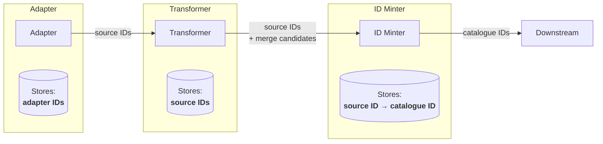
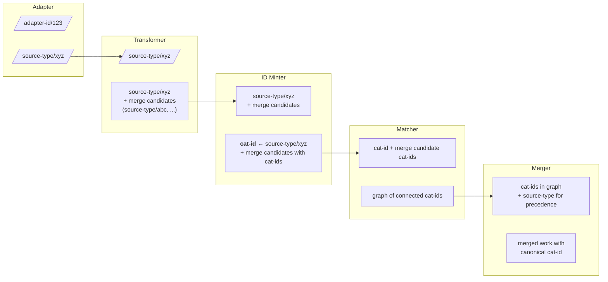
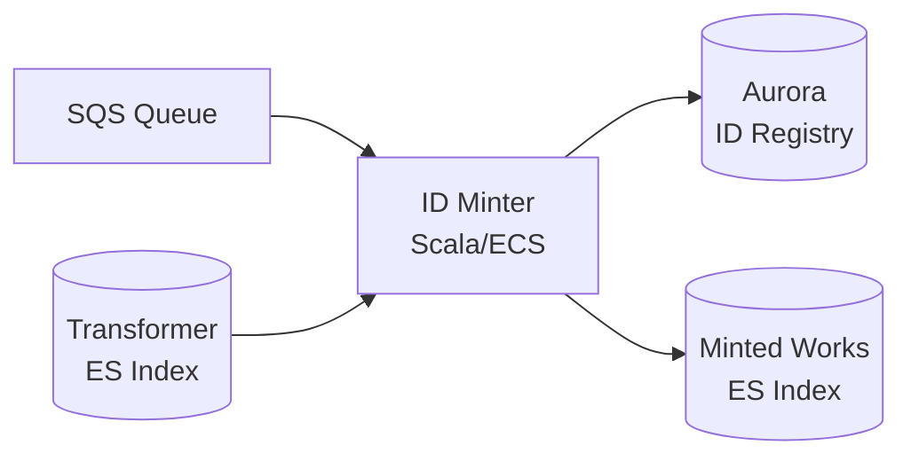
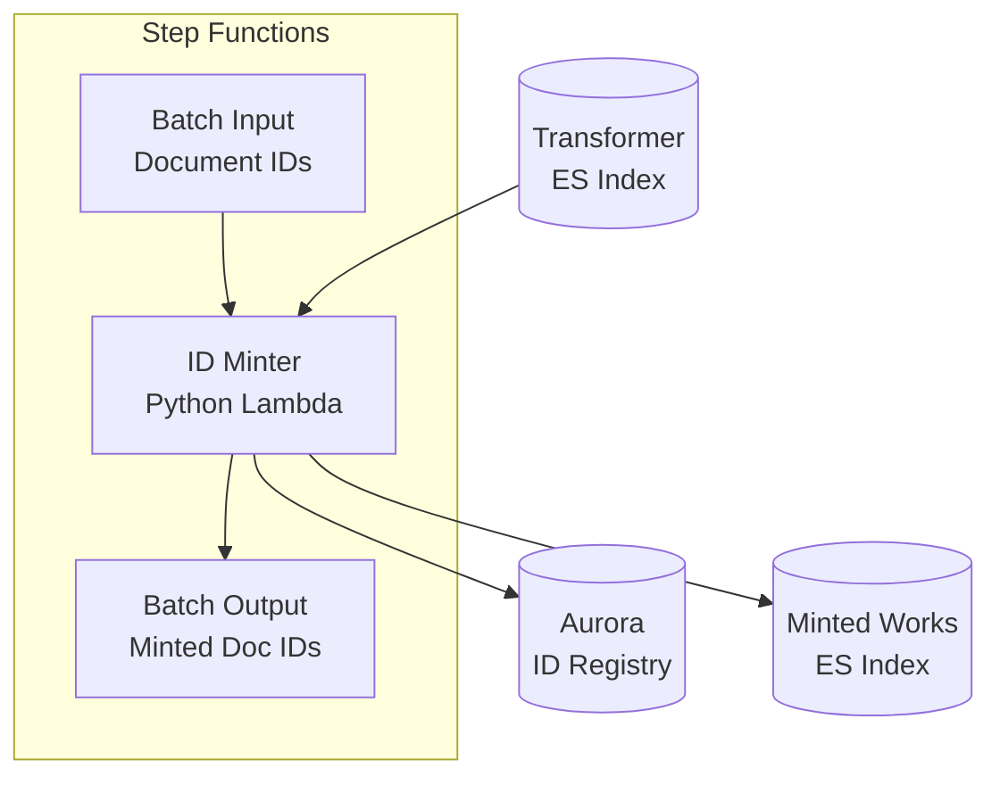
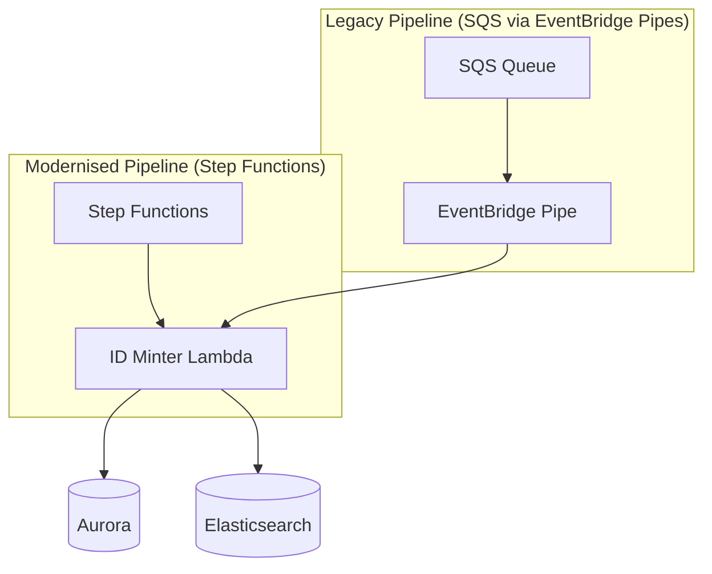
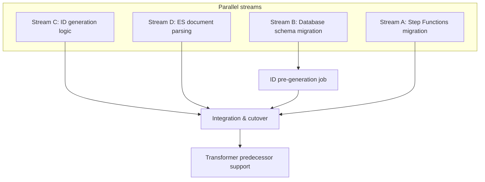

# RFC XXX: Stable identifiers following mass record migration

This RFC discusses what will happen to public catalogue identifiers following the mass migration of records from CALM/Sierra to Axiell Collection / Folio and how we can update the catalogue pipeline to accommodate this change.

**Last modified:** 2026-??-??T??:00+00:00

**Related issues:**
- [Discovery / Proposal for stable identifiers following Calm & Sierra migrations](https://github.com/wellcomecollection/platform/issues/6246)
- [Allow idminter to connect multiple source identifiers to one canonical identifier](https://github.com/wellcomecollection/platform/issues/6258)

## Table of contents

- [Context](#context)
- [Proposed solution](#proposed-solution)
- [Alternative solutions considered](#alternative-solutions-considered)
- [Implementation plan](#implementation-plan)
- [TL;DR](#tldr)

---

## Context

The catalogue pipeline currently generates public catalogue identifiers in the ID Minter step, with a one to one relationship between source identifiers retrieved by adapters and extracted by transformers (e.g. Sierra B numbers, CALM reference numbers) and public catalogue identifiers.



### Identifier types

We distinguish between three types of identifiers in the catalogue pipeline:

#### Adapter identifiers

Adapter identifiers are used to identify records within the adapter service and datastore. These identifiers may or may not correspond to source identifiers, but must uniquely identify records in the source system, in order to track which records have been updated.

**Use of adapter identifiers will not be affected by the migration of records between source systems.**

#### Source identifiers

Source identifiers are identifiers assigned by source systems and must be unique within those systems. Examples of source identifiers include:

- Sierra B numbers (e.g. "sierra-system-number/b1161044x")
- CALM Record IDs (e.g. "calm-record-id/77b9dab1-c5b0-4207-9876-da2b49b0306d")

These are extracted by the relevant transformer step and passed downstream in the pipeline.

The migration of records from CALM/Sierra to Axiell Collection/Folio will result in new source identifiers being assigned to records. **This means that records which were previously identified by Sierra B numbers or CALM Record IDs will now have different source identifiers in the new systems.** Records in the new systems will contain metadata referring to the old identifiers, but these will not be the primary source identifiers used in the catalogue pipeline.

#### Public catalogue identifiers

Public catalogue identifiers follow a set of rules to ensure they are stable, human readable, and unique. This issue discusses the requirements of the ID Minter at the inception of the service: https://github.com/wellcomecollection/platform/issues/31.

At time of writing the ID scheme is implemented in Scala, see [Identifiable.scala](Identifiable.scala). 

The rules for minting public catalogue identifiers are:

- Must be 8 characters long
- Uses characters a-z and 1-9
- Excludes confusing characters: 'o', 'i', 'l', '1'
- First character must be a letter (XML identifiers cannot start with numbers)

This results in an ID space of approximately 0.6 trillion unique identifiers, see [this notebook for details](identifiers.ipynb).

Public catalogue identifiers are generated in the ID Minter step of the catalogue pipeline, by looking up existing identifiers in the ID Registry (an Aurora database) or minting new ones as required by generating a random identifier and checking for collisions in the ID Registry.

Public catalogue identifiers are currently minted in a one to one relationship with source identifiers. This means that at present each source identifier corresponds to a unique public catalogue identifier.

**If we continue to use source identifiers as the basis for minting public catalogue identifiers, the migration of records from CALM/Sierra to Axiell Collection/Folio will result in records receiving new public catalogue identifiers.** This is because the source identifiers will change, and therefore the ID Minter will see them as new records requiring new public catalogue identifiers.

### Identifier usage in catalogue pipeline steps

This section describes how identifiers are used and transformed at each step of the catalogue pipeline.



#### Adapter

The adapter uses **adapter identifiers** internally to track records in its datastore. These are often the same as source identifiers, but may differ depending on the source system. For example, the Sierra adapter uses the record's internal database ID as the adapter identifier. The adapter outputs records tagged with a **source identifier** (e.g. `sierra-system-number/b1161044x`).

#### Transformer

The transformer receives records identified by their **source identifier**. It extracts structured data from the source record and outputs a transformed work document. Crucially, the transformer also identifies **merge candidates** — other records that should be merged with this one. Merge candidates are expressed as source identifiers (e.g. `miro-image-number/V0012345`).

The transformer outputs:
- The work's **source identifier** (the primary identity of this record)
- A list of **merge candidate source identifiers** (records to be merged with this work)

#### ID Minter

The ID Minter receives transformed works with source identifiers and merge candidates. For each source identifier (both the work's own identifier and all merge candidates), it either:

- Looks up an existing **public catalogue identifier** from the ID Registry, or
- Mints a new catalogue identifier if one doesn't exist

The minter maintains a one-to-one mapping between source identifiers and catalogue identifiers in the ID Registry (Aurora database). After processing, each source identifier on the document is enriched with its corresponding catalogue identifier.

The identifiers database enforces the following constraints:

| Column | Description |
|--------|-------------|
| `CanonicalId` | The public catalogue identifier (e.g. `a2345bcd`) |
| `OntologyType` | The type of entity (e.g. `Work`, `Image`) |
| `SourceSystem` | The source system type (e.g. `sierra-system-number`, `calm-record-id`) |
| `SourceId` | The identifier value within the source system (e.g. `b1161044x`) |

- **Primary key on `CanonicalId`**: Each catalogue identifier is globally unique and can only appear once in the registry.
- **Unique key on (`OntologyType`, `SourceSystem`, `SourceId`)**: Each source identifier (for a given ontology type) maps to exactly one catalogue identifier. This prevents the same source record from being assigned multiple catalogue identifiers.

The ID Minter outputs:
- The work with its **catalogue identifier** (mapped from its source identifier)
- Merge candidates enriched with their **catalogue identifiers**

#### Matcher

The matcher receives works with catalogue identifiers and uses the merge candidates to build a graph of connected works. It maintains an adjacency list (in DynamoDB) keyed by catalogue identifier, which tracks which catalogue identifiers should be merged together.

When a work arrives, the matcher:
1. Looks up existing connections for its catalogue identifier
2. Adds connections for any new merge candidate catalogue identifiers
3. Produces a subgraph of all transitively connected catalogue identifiers

The matcher operates entirely on **catalogue identifiers** — source identifiers are not used at this step.

#### Merger

The merger receives a set of connected catalogue identifiers from the matcher and retrieves the full work documents for each. It then applies merge rules to combine these works into a single merged work.

Importantly, the merger uses **source identifier types** (not the identifiers themselves) to determine precedence rules. For example, a Sierra record might take precedence over a METS record for certain fields. The merge rules are expressed in terms of source system types (e.g. "sierra-system-number" vs "mets-file").

The merger outputs:
- A single merged work with one canonical **catalogue identifier**
- The merged work contains the combined data from source records, based on field-level precedence rules determined by source types
- A set of redirected **catalogue identifiers** for all merged records not chosen as the target

#### Summary of identifier usage

| Step | Input identifiers | Output identifiers | Notes |
|------|-------------------|-------------------|-------|
| Adapter | Adapter IDs (internal) | Source IDs | Converts internal IDs to source system IDs |
| Transformer | Source IDs | Source IDs + merge candidate source IDs | Identifies related records for merging |
| ID Minter | Source IDs | Catalogue IDs | Maps source → catalogue IDs (1:1) |
| Matcher | Catalogue IDs | Graph of catalogue IDs | Builds merge graph using catalogue IDs only |
| Merger | Catalogue IDs + source types | Single catalogue ID | Uses source types for precedence rules |

### Impact of migration on public catalogue identifiers

If we make no changes to the ID Minter during the migration, the following will occur:

**All migrated records will receive new public catalogue identifiers.** When records are migrated from CALM/Sierra to Axiell Collections/Folio, they will be assigned new source identifiers by the new systems. Since the ID Minter maps source identifiers to catalogue identifiers on a one-to-one basis, these new source identifiers will result in new public catalogue identifiers being minted for every migrated record.

**Some source systems will continue to reference old identifiers.** Systems such as METS will continue to refer to old Sierra/CALM identifiers indefinitely in existing records. However, newer records in these systems will receive new identifiers from the new source systems.

**Pipeline changes are still required.** Even without modifying the ID Minter, the following changes would be necessary:

1. **Axiell Collections & Folio transformers** would need to emit merge candidates targeting the appropriate source identifiers from Sierra & CALM. This would allow the matcher to connect the new records to their corresponding old records in the merge graph.

2. **Merger precedence rules** would need updating to allow the new source systems (Axiell Collections, Folio) to take precedence over the old systems (Sierra, CALM) when determining the canonical record for merged works.

This approach would preserve the connection between old and new records through the merge graph, but users would see different public catalogue identifiers for what is conceptually the same record. Any existing bookmarks, citations, or external links to catalogue URLs would break unless redirects are maintained from old catalogue identifiers to new ones.

**Mass redirection on the public website.** Because the new source system records would take precedence in the merger, the old catalogue identifiers (from Sierra/CALM records) would become redirect targets rather than canonical identifiers. This would result in the majority of works on the public collection website being redirected to new URLs.

This is undesirable for several reasons:

1. **SEO impact.** Search engines would need to reindex the entire collection under new URLs. Even with proper 301 redirects in place, there would be a period of reduced search visibility and potential loss of page authority accumulated over time.

2. **Broken external references.** Academic citations, Wikipedia links, bookmarks, and partner integrations would all redirect to different URLs, creating user confusion and potentially failing in systems that don't follow redirects correctly.

3. **Analytics discontinuity.** Usage analytics and reporting would be fragmented, with historical data associated with old identifiers and new data with new identifiers.

4. **Redirect maintenance burden.** The redirect mappings would need to be maintained indefinitely.

---

## Proposed solution

Support multiple source identifiers per catalogue ID.

### Overview

Modify the ID Minter to allow multiple source identifiers to map to the same public catalogue identifier. When a new Axiell Collections or Folio record arrives that references an old Sierra/CALM identifier (via a "predecessor" relationship), it should inherit the existing catalogue identifier rather than receiving a new one.

This is achieved through:
1. A new database schema that separates canonical ID management from source ID mappings
2. Support for pre-generating canonical IDs to improve minting performance
3. Transformer changes to emit predecessor source identifiers for migrated records
4. Rewriting the ID Minter as a Python Lambda following the catalogue pipeline modernisation pattern

### Current service architecture

The existing ID Minter is implemented as a Scala service running on ECS. It:

1. Consumes messages from an SQS queue containing document IDs to process
2. Retrieves corresponding work documents from the transformer's Elasticsearch index
3. Extracts source identifiers and merge candidates from the document
4. Mints or looks up canonical IDs for each identifier in the Aurora database
5. Annotates the work document with canonical IDs
6. Writes the annotated document to its own Elasticsearch index for downstream consumers



This architecture will be modernised as part of the broader catalogue pipeline migration to AWS Step Functions and Python Lambdas.

### Database schema

#### Current schema

```sql
CREATE TABLE `identifiers` (
  `CanonicalId` varchar(255) NOT NULL,
  `OntologyType` varchar(255) NOT NULL,
  `SourceId` varchar(255) NOT NULL,
  `SourceSystem` varchar(255) NOT NULL,
  PRIMARY KEY (`CanonicalId`),
  UNIQUE KEY `UniqueFromSource` (`OntologyType`,`SourceSystem`,`SourceId`)
) ENGINE=InnoDB DEFAULT CHARSET=latin1;
```

The current schema enforces a 1:1 relationship between canonical IDs and source identifiers via the primary key on `CanonicalId`.

#### Proposed schema

```sql
-- Canonical ID registry (enforces uniqueness, supports pre-generation)
CREATE TABLE `canonical_ids` (
  `CanonicalId` varchar(8) NOT NULL PRIMARY KEY,
  `Status` ENUM('free', 'assigned') NOT NULL DEFAULT 'free',
  `CreatedAt` TIMESTAMP DEFAULT CURRENT_TIMESTAMP,
  INDEX `idx_free` (`Status`, `CanonicalId`)
) ENGINE=InnoDB DEFAULT CHARSET=latin1;

-- Source ID → Canonical ID mappings
CREATE TABLE `identifiers` (
  `OntologyType` varchar(255) NOT NULL,
  `SourceSystem` varchar(255) NOT NULL,
  `SourceId` varchar(255) NOT NULL,
  `CanonicalId` varchar(8) NOT NULL,
  `CreatedAt` TIMESTAMP DEFAULT CURRENT_TIMESTAMP,
  PRIMARY KEY (`OntologyType`, `SourceSystem`, `SourceId`),
  FOREIGN KEY (`CanonicalId`) REFERENCES `canonical_ids`(`CanonicalId`),
  INDEX `idx_canonical` (`CanonicalId`)
) ENGINE=InnoDB DEFAULT CHARSET=latin1;
```

#### Discovering aliases

When multiple source identifiers share a canonical ID, the original record can be distinguished from aliases by `CreatedAt` timestamp — the earliest row is the original, later rows are aliases:

```sql
-- Find all source identifiers for a canonical ID, with alias status
SELECT 
  i.*,
  CASE WHEN i.CreatedAt = earliest.MinCreatedAt THEN FALSE ELSE TRUE END AS IsAlias
FROM identifiers i
JOIN (
  SELECT CanonicalId, MIN(CreatedAt) AS MinCreatedAt 
  FROM identifiers 
  GROUP BY CanonicalId
) earliest ON i.CanonicalId = earliest.CanonicalId
WHERE i.CanonicalId = ?;
```

#### Future migrations

This schema supports additional source system migrations without modification. If a future migration introduces another successor system (e.g. migrating from Folio to a new LMS), new records simply declare predecessors pointing to Folio source identifiers. Multiple aliases can chain: a canonical ID might have mappings from Sierra → Axiell → FutureSystem, all discoverable via the shared `CanonicalId` and ordered by `CreatedAt`.

#### Schema design rationale

| Table | Purpose |
|-------|---------|
| `canonical_ids` | Registry of all canonical IDs in use, enforces global uniqueness, enables pre-generation of IDs |
| `identifiers` | Maps source identifiers to canonical IDs, allows multiple source IDs to share a canonical ID |

#### Constraints

- **Canonical ID uniqueness**: The primary key on `canonical_ids.CanonicalId` ensures each catalogue ID is globally unique
- **Source ID uniqueness**: The primary key on `identifiers` ensures each source identifier maps to exactly one catalogue ID
- **Referential integrity**: The foreign key ensures all canonical IDs in `identifiers` exist in `canonical_ids`
- **Intentional sharing only**: Multiple source identifiers can only share a canonical ID through explicit predecessor relationships — accidental collisions are impossible

### ID pre-generation

The `canonical_ids` table supports pre-generating IDs to eliminate collision checking during minting.

#### Pre-generation process

A background job maintains a pool of free IDs:

```sql
-- Check current pool size
SELECT COUNT(*) FROM canonical_ids WHERE Status = 'free';

-- Generate and insert new IDs if pool is below threshold
INSERT IGNORE INTO canonical_ids (CanonicalId, Status) VALUES 
  ('ab234cde', 'free'),
  ('xy789tuv', 'free'),
  ...;
```

#### Claiming a free ID

```sql
START TRANSACTION;

SELECT CanonicalId 
FROM canonical_ids 
WHERE Status = 'free' 
LIMIT 1 
FOR UPDATE;

-- Application stores the selected ID

UPDATE canonical_ids 
SET Status = 'assigned' 
WHERE CanonicalId = ?;

COMMIT;
```

#### Benefits of pre-generation

- **No collision retry loop**: Current minting generates a random ID, checks for collision, and retries if needed. With pre-generation, IDs are guaranteed unique at claim time.
- **Predictable performance**: Minting time is constant regardless of how full the ID space becomes.
- **Batch efficiency**: IDs can be generated in bulk during off-peak hours.

### ID Minter logic

#### Lookup and minting flow

```
1. Query identifiers table by (OntologyType, SourceSystem, SourceId)
   → If found: return CanonicalId

2. If work has predecessor source identifier:
   a. Query predecessor by (OntologyType, SourceSystem, SourceId)
   b. If found: 
      - INSERT into identifiers with predecessor's CanonicalId (idempotent)
      - Return CanonicalId
   c. If not found:
      - Retry with exponential backoff
      - Predecessor record must be minted first

3. Claim a free ID from canonical_ids:
   a. SELECT ... FOR UPDATE WHERE Status = 'free'
   b. UPDATE Status = 'assigned'
   c. INSERT into identifiers with new CanonicalId (idempotent)
   d. If insert was a no-op (another process won):
      - SELECT actual CanonicalId from identifiers
      - Return unused ID to pool
      - Return the existing CanonicalId
   e. Return CanonicalId

4. If no free IDs available (fallback):
   a. Generate random ID
   b. INSERT into canonical_ids (will fail on collision)
   c. Retry on collision
   d. INSERT into identifiers (idempotent)
   e. Return CanonicalId
```

#### Idempotent writes

All inserts to the `identifiers` table use idempotent writes to handle concurrent processes:

```sql
INSERT INTO identifiers (OntologyType, SourceSystem, SourceId, CanonicalId)
VALUES (?, ?, ?, ?)
ON DUPLICATE KEY UPDATE CanonicalId = CanonicalId;

-- Then SELECT to get the actual CanonicalId (may differ if another process won)
SELECT CanonicalId FROM identifiers 
WHERE OntologyType = ? AND SourceSystem = ? AND SourceId = ?;
```

#### Returning unused IDs to the pool

When a claimed ID is not used (because another process won the race), return it to the pool:

```sql
UPDATE canonical_ids SET Status = 'free' WHERE CanonicalId = ?;
```

#### Concurrency scenarios

##### Scenario 1: Same source identifier, two processes

| Step | Process A | Process B |
|------|-----------|-----------|
| 1 | Query `identifiers` for `sierra/b1234` → not found | Query `identifiers` for `sierra/b1234` → not found |
| 2 | Claim free ID `abc123` | Claim free ID `xyz789` |
| 3 | INSERT (idempotent) → succeeds | INSERT (idempotent) → no-op (row exists) |
| 4 | Return `abc123` | SELECT → gets `abc123`, returns `xyz789` to pool |
| 5 | | Return `abc123` |

**Outcome**: Both processes return the same canonical ID. The unused ID is returned to the pool.

##### Scenario 2: Different source IDs, same predecessor

| Step | Process A (`axiell/123`, predecessor `sierra/b1234`) | Process B (`axiell/456`, predecessor `sierra/b1234`) |
|------|-----------|-----------|
| 1 | Query `axiell/123` → not found | Query `axiell/456` → not found |
| 2 | Query predecessor `sierra/b1234` → `abc123` | Query predecessor `sierra/b1234` → `abc123` |
| 3 | INSERT `(axiell/123, abc123)` → succeeds | INSERT `(axiell/456, abc123)` → succeeds |
| 4 | Return `abc123` | Return `abc123` |

**Outcome**: Both source identifiers correctly share the same canonical ID. No conflict.

##### Scenario 3: Predecessor doesn't exist yet

| Step | Process A (predecessor record `sierra/b1234`) | Process B (successor `axiell/123`, predecessor `sierra/b1234`) |
|------|-----------|-----------|
| 1 | Query `sierra/b1234` → not found | Query `axiell/123` → not found |
| 2 | Claim ID, INSERT `(sierra/b1234, abc123)` | Query predecessor `sierra/b1234` → not found |
| 3 | Return `abc123` | **Retry with backoff** |
| 4 | | Query predecessor `sierra/b1234` → `abc123` |
| 5 | | INSERT `(axiell/123, abc123)` → succeeds |
| 6 | | Return `abc123` |

**Outcome**: Process B waits for the predecessor to be minted, then inherits the correct canonical ID.

#### Predecessor source identifiers

Transformers for Axiell Collections and Folio will emit a **predecessor source identifier** when the record contains a reference to an old Sierra/CALM identifier. This is distinct from merge candidates:

- **Merge candidates**: "This record should be merged with these other records"
- **Predecessor**: "This record should inherit the catalogue ID of this old record"

Example: An Axiell Collections record migrated from Sierra might emit:
- Source identifier: `axiell-collections-id/12345`
- Predecessor: `sierra-system-number/b1161044x`

The ID Minter will look up the predecessor's catalogue ID and assign it to the new source identifier.

### Data migration

A runnable demonstration of the complete migration process is available in [migration_demo.ipynb](migration_demo.ipynb). The notebook walks through each step below using sample data from the current ID Minter database.

#### Migration steps

```sql
-- 1. Create new canonical_ids table
CREATE TABLE canonical_ids (
  `CanonicalId` varchar(8) NOT NULL PRIMARY KEY,
  `Status` ENUM('free', 'assigned') NOT NULL DEFAULT 'free',
  `CreatedAt` TIMESTAMP DEFAULT CURRENT_TIMESTAMP,
  INDEX `idx_free` (`Status`, `CanonicalId`)
) ENGINE=InnoDB DEFAULT CHARSET=latin1;

-- 2. Populate canonical_ids from existing identifiers
INSERT INTO canonical_ids (CanonicalId, Status)
SELECT DISTINCT CanonicalId, 'assigned' FROM identifiers;

-- 3. Create new identifiers table
CREATE TABLE identifiers_new (
  `OntologyType` varchar(255) NOT NULL,
  `SourceSystem` varchar(255) NOT NULL,
  `SourceId` varchar(255) NOT NULL,
  `CanonicalId` varchar(8) NOT NULL,
  `CreatedAt` TIMESTAMP DEFAULT CURRENT_TIMESTAMP,
  PRIMARY KEY (`OntologyType`, `SourceSystem`, `SourceId`),
  FOREIGN KEY (`CanonicalId`) REFERENCES `canonical_ids`(`CanonicalId`),
  INDEX `idx_canonical` (`CanonicalId`)
) ENGINE=InnoDB DEFAULT CHARSET=latin1;

-- 4. Copy data to new identifiers table (existing records get current timestamp)
INSERT INTO identifiers_new (OntologyType, SourceSystem, SourceId, CanonicalId)
SELECT OntologyType, SourceSystem, SourceId, CanonicalId FROM identifiers;

-- 5. Swap tables
RENAME TABLE identifiers TO identifiers_old, identifiers_new TO identifiers;

-- 6. Pre-generate free IDs
-- (Run ID generation script to populate pool)

-- 7. Drop old table after verification
DROP TABLE identifiers_old;
```

### Service rewrite

The ID Minter will be rewritten as a Python Lambda function, following the pattern established by the modernisation of other catalogue pipeline services. The new service will be invoked as part of an AWS Step Functions state machine.

#### Architecture



#### Input/Output

The Lambda receives a batch of document IDs as input, matching the existing Scala interface:

```json
{
  "sourceIdentifiers": [
    "sierra-system-number/b1161044x",
    "axiell-collections-id/12345"
  ],
  "jobId": "2026-01-29T10:30:00Z"
}
```

The Lambda then:
1. Retrieves the work documents from the transformer Elasticsearch index using these document IDs
2. Extracts all source identifiers requiring minting (primary source ID, merge candidates, predecessor if present)
3. Mints or looks up canonical IDs for each identifier
4. Annotates the document with canonical IDs
5. Writes the annotated document to the minted works index

Output confirms which documents were successfully processed:

```json
{
  "processedIdentifiers": [
    "sierra-system-number/b1161044x",
    "axiell-collections-id/12345"
  ],
  "jobId": "2026-01-29T10:30:00Z"
}
```

#### Responsibilities

The new Lambda retains all responsibilities of the current service:

| Responsibility | Description |
|----------------|-------------|
| **Document retrieval** | Fetch work documents from the transformer's Elasticsearch index using document IDs |
| **ID extraction** | Parse source identifiers, merge candidates, and predecessors from documents |
| **ID minting** | Mint new canonical IDs or look up existing ones from the Aurora database |
| **Predecessor inheritance** | Inherit canonical IDs from predecessor source identifiers during migration |
| **ID annotation** | Annotate source identifiers and merge candidates with their canonical IDs |
| **Document storage** | Write annotated documents to the minted works Elasticsearch index |

#### Hybrid operation with legacy transformers

During the transition period, some transformers (TEI, METS, etc.) will continue to operate outside Step Functions while Sierra & CALM are replaced by Axiell Collections and Folio transformers. The ID Minter must support both invocation patterns:



**Strategy options:**

| Option | Description | Pros | Cons |
|--------|-------------|------|------|
| **[EventBridge Pipes](https://docs.aws.amazon.com/eventbridge/latest/userguide/eb-pipes.html)** | Serverless point-to-point integration connecting SQS to Lambda | No code, built-in batching/filtering/transformation, fully managed | Additional AWS service to configure |
| **[SQS event source mapping](https://docs.aws.amazon.com/lambda/latest/dg/with-sqs.html)** | Configure Lambda with both Step Functions and SQS triggers | Single service, simple | Lambda concurrency management more complex; no input transformation |
| **Migrate all transformers first** | Complete transformer modernisation before ID Minter rewrite | Clean cutover | Delays ID Minter work; may not be feasible |

**Recommended approach: [EventBridge Pipes](https://docs.aws.amazon.com/eventbridge/latest/userguide/eb-pipes-sqs.html)** — Pipes provide a serverless, zero-code bridge from SQS to Lambda with several advantages:

- **Input transformation**: Can transform legacy SQS message format to match Step Functions input format, keeping Lambda code unified
- **Batching controls**: Advanced batching configuration (batch size, batching window) without Lambda configuration changes
- **Filtering**: Can filter messages before invoking Lambda, reducing unnecessary invocations
- **Enrichment**: Optionally enrich events by calling another Lambda or API Gateway before the target
- **Error handling**: Built-in dead-letter queue support and retry configuration

This approach keeps the ID Minter Lambda identical regardless of invocation source — the Pipe handles any format differences between legacy SQS messages and Step Functions input.

### Pipeline changes required

#### Transformer changes

1. **Axiell Collections transformer**: Emit predecessor source identifier when record contains Sierra B number reference
2. **Folio transformer**: Emit predecessor source identifier when record contains CALM reference number

#### Merger changes

Update precedence rules to allow new source systems to take precedence:
- Axiell Collections > Sierra
- Folio > CALM

#### ID Minter changes

1. Update database access layer for new schema
2. Add predecessor lookup logic
3. Implement free ID claiming from pool
4. Add fallback generation for empty pool

### Benefits

| Aspect | Current behaviour | Proposed behaviour |
|--------|-------------------|-------------------|
| Catalogue ID stability | New source ID = new catalogue ID | Migrated records inherit existing catalogue ID |
| Mass redirection | All migrated records redirect | No redirection for migrated records |
| External references | All break or redirect | Preserved |
| SEO | Reindexing required | No impact |
| Analytics continuity | Fragmented | Preserved |
| Minting performance | Collision retry loop | Pre-claimed IDs, no retries |

### Risks and mitigations

| Risk | Mitigation |
|------|------------|
| Free ID pool exhaustion | Trigger new pool generation on failure and retry; monitoring and alerts on pool size |
| Migration data integrity | Run migration in stages with verification; keep old table until confirmed |
| Incorrect predecessor extraction by transformer | Validate predecessor format; log all predecessor lookups for audit; reconciliation process to detect mismatches |
| Orphaned canonical IDs (marked free but actually assigned) | Verify ID not in `identifiers` table before returning to pool; periodic reconciliation job |

Note: Predecessor records (Sierra/CALM) will all be present in the database before any successor records (Axiell Collections/Folio) are processed. This is guaranteed by the source system switchover process — no new predecessor records will be created after switchover.

---

## Alternative solutions considered

This section describes alternative approaches that were considered for maintaining stable public catalogue identifiers during the CALM/Sierra to Axiell Collections/Folio migration.

For background on the problem, see:
- [Discovery / Proposal for stable identifiers following Calm &amp; Sierra migrations](https://github.com/wellcomecollection/platform/issues/6246)
- [Allow idminter to connect multiple source identifiers to one canonical identifier](https://github.com/wellcomecollection/platform/issues/6258)

### Summary of approaches

| Approach | Description | Outcome |
|----------|-------------|---------|
| **Transformer ID swap** | Swap old/new IDs in transformer | Rejected — adds complexity, misleading source labels |
| **Many-to-one in ID Minter** | Allow multiple source IDs per canonical ID | **Selected** — see [Proposed solution](#proposed-solution) |
| **Database swap** | Replace old IDs with new IDs directly in database | Rejected — creates orphaned IDs, doesn't preserve history |
| **Runtime ID matching** | Minter identifies original source at runtime | Rejected — combines downsides of other approaches |

### Transformer ID swap

**Approach:** Handle identifier continuity in the transformer rather than the ID Minter. When a record in the new system (Axiell/Folio) has been migrated from the old system (Sierra/CALM), the transformer would:

1. Detect the old identifier stored as an alternative identifier in the new record
2. Swap the old and new identifiers, so the record continues to use its Sierra/CALM source identifier downstream
3. Pass the new Axiell/Folio identifier as an alternative identifier instead

**Example:**
- Adapter output: `axiell-collections-id/12345` (new identifier)
- Transformer output: `sierra-system-number/b1161044x` (old identifier, swapped to primary position)
- Alternative identifier: `axiell-collections-id/12345`

**Concerns identified:**

1. **Misleading source system labels**: Records coming from Folio would have Sierra B numbers and be labelled as `sierra-system-number` in their source identifier, which is confusing and dishonest about the record's actual source.

2. **Read-before-update required**: Handling deletions and updates would require reading the existing record to find the ID to propagate. This breaks the pure function nature of the transformer, impacting performance.

3. **Risk of drift**: The old identifier field in the new system is not a controlled identifier. It could be edited or removed at any point, potentially orphaning records downstream.

4. **Multiple potential old identifiers**: A former Sierra record might also contain a CALM ID. The transformer would need logic to identify which old ID is the "correct" one to use.

5. **Multiplies transformer concerns**: Keeping permanent information about ID history in the transformer is undesirable as it adds complexity to what should be a straightforward transformation.

**Outcome:** Rejected. While this approach would work, it adds significant complexity to the transformer and results in records that misrepresent their source system. The ID Minter is a more appropriate place to handle identifier mapping.

### Database swap

**Approach:** Make no application changes. Instead, directly modify the ID Minter database before the migration:

1. Generate a list of mappings between old (Sierra/CALM) and new (Axiell/Folio) source identifiers
2. Update the database to replace all old source identifiers with new source identifiers
3. The ID Minter continues operating with its 1:1 constraint, but now uses new identifiers

**Concerns identified:**

1. **Orphaned canonical IDs**: If we later want to retain the old identifiers (e.g. as alternative identifiers on works), we'd create pointless new canonical IDs for them. This essentially moves the problem rather than solving it.

2. **Loss of history**: The database would no longer record that a canonical ID was originally minted for a Sierra/CALM record.

3. **All-or-nothing migration**: Requires complete identifier mapping before switchover. Any records missed would get new canonical IDs.

4. **References to old identifiers break**: Other systems (like METS) that reference Sierra B numbers would no longer find matches unless we also update those references.

**Outcome:** Rejected. This approach "works" in the narrow sense of preserving canonical IDs, but creates problems for maintaining alternative identifiers and loses valuable history about record provenance. It was considered as a fallback option if the many-to-one approach proved too complex.

### Runtime ID matching in Minter

**Approach:** Allow a 1:many relationship between canonical IDs and source IDs, with the ID Minter determining the correct mapping at runtime:

1. When a new record arrives, the minter examines alternative identifiers in the record
2. If an alternative identifier matches an existing source ID in the database, use that canonical ID
3. Otherwise mint a new canonical ID

**Concerns identified:**

1. **Minter needs source system knowledge**: The minter would need to understand which alternative identifier to look up based on the source system, making it tightly coupled to transformer output format.

2. **Duplicate handling**: What happens if a record has multiple potential matches? Or if the alternative identifier value changes?

3. **Combines downsides**: Has the complexity of multiple approaches without their benefits — still requires alternative identifier handling in transformers, plus schema changes in the minter.

**Outcome:** Rejected. This approach was identified as having "all the downsides of both ideas" (transformer approach and many-to-one approach) without clear advantages. The cleaner solution is to handle predecessor relationships explicitly.

### Why many-to-one was selected

The key insight from the discussion was that **whatever approach we take, we probably want to remove the 1:1 relationship** in the ID Minter. This is because:

1. We want to retain old identifiers (Sierra/CALM) as alternative identifiers on works, at least in the short term, since there will be references elsewhere (including physical pieces of paper).

2. If we retain the old identifiers as alternatives but don't update the ID Minter, we'd create new canonical IDs for them — essentially recreating the problem.

3. The ID Minter is the correct place to manage identifier mappings, not the transformer.

The many-to-one approach with predecessor relationships cleanly solves these issues while maintaining clear data provenance and supporting future migrations.

---

## Implementation plan

This section outlines how the work can be split to enable parallel development and early release of changes before the source system migration.

### Work streams

The implementation can be split into independent work streams that proceed in parallel:



#### Stream A: Step Functions migration

Move the existing Scala minter from SQS-based invocation to Step Functions for all transformer → ID Minter pairs.

- Establishes the Step Functions infrastructure that the new Python minter will use
- Reduces scope of the Python rewrite (no need to support SQS directly)
- Provides a clean rollback path — can switch back to Scala minter if issues arise with Python version

#### Stream B: Database schema migration

Migrate the Aurora database to the new two-table schema while maintaining compatibility with the existing Scala minter. Set up a regular dump → load process to populate a test database with production data, enabling integration testing before cutover.

**Deliverable:** Database ready for new minter; ID pre-generation job running; test database with production data sync.

#### Stream C: ID generation logic

Implement and test the core minting logic in Python, independent of ES integration. Includes predecessor lookup, free ID claiming, fallback generation, and idempotent writes.

**Deliverable:** Tested Python module for ID minting operations.

#### Stream D: ES document parsing and annotation

Implement and test the Elasticsearch integration — reading from transformer index, extracting source identifiers, annotating documents with canonical IDs, writing to minted index.

**Deliverable:** Tested Python module for ES document handling.

### Integration and cutover

Once streams A-D are complete:

- Integrate Streams C and D into Lambda function
- End-to-end testing with Step Functions
- Shadow mode: run Python minter alongside Scala, compare outputs
- Configure EventBridge Pipes for any remaining legacy transformers (TEI, METS)
- Gradual rollout and Scala decommission

### Migration support

Enable predecessor inheritance for Axiell Collections and Folio records. This work can be prepared in advance but should not be deployed until source system migration timing is confirmed.

- Axiell Collections transformer: emit predecessor field for Sierra B numbers
- Folio transformer: emit predecessor field for CALM reference numbers
- Update merger precedence rules (Axiell > Sierra, Folio > CALM)

---

## TL;DR

**Problem:** When we migrate records from Sierra/CALM to Axiell Collections/Folio, every record will get a new source identifier. The current ID Minter maps source identifiers to public catalogue identifiers 1:1, so every migrated record would receive a new public URL. This would break all existing links, citations, and bookmarks, require mass redirects, harm SEO, and fragment analytics.

**Solution:** Modify the ID Minter to allow multiple source identifiers to share the same public catalogue identifier. When transformers emit a "predecessor" field linking new Axiell/Folio records to their old Sierra/CALM identifiers, the minter will look up the predecessor's catalogue ID and assign it to the new record. This preserves URLs, requires no redirects for migrated records, and supports future source system migrations without further schema changes.

**Implementation:** The work splits into four parallel streams: (A) moving the existing Scala minter to Step Functions, (B) migrating the database schema to support many-to-one mappings with ID pre-generation, (C) implementing the new minting logic in Python, and (D) implementing Elasticsearch document parsing. Once integrated, the new Python Lambda replaces the Scala service. Transformer changes to emit predecessor fields are prepared separately and deployed when source system migration begins.
