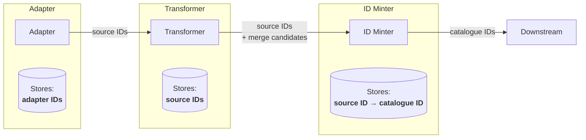
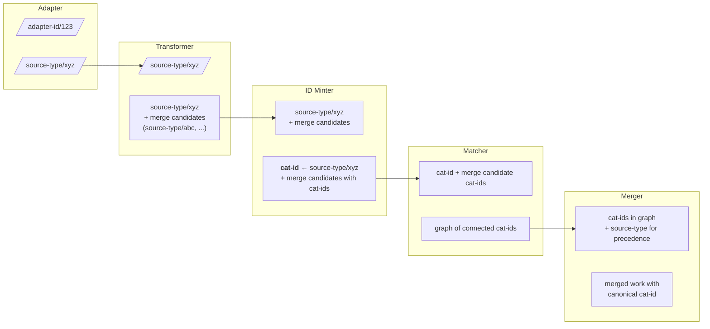

# RFC XXX: Stable identifiers following mass record migration

This RFC discusses what will happen to public catalogue identifiers following the mass migration of records from CALM/Sierra to Axiell Collection / Folio and how we can update the catalogue pipeline to accommodate this change.

**Last modified:** 2026-??-??T??:00+00:00

## Table of contents

- [Context](#context)
  - [Identifier types](#identifier-types)
    - [Adapter identifiers](#adapter-identifiers)
    - [Source identifiers](#source-identifiers)
    - [Public catalogue identifiers](#public-catalogue-identifiers)
  - [Identifier usage in catalogue pipeline steps](#identifier-usage-in-catalogue-pipeline-steps)
    - [Adapter](#adapter)
    - [Transformer](#transformer)
    - [ID Minter](#id-minter)
    - [Matcher](#matcher)
    - [Merger](#merger)
    - [Summary of identifier usage](#summary-of-identifier-usage)
  - [Impact of migration on public catalogue identifiers](#impact-of-migration-on-public-catalogue-identifiers)

## Context

The catalogue pipeline currently generates public catalogue identifiers in the ID Minter step, with a one to one relationship between source identifiers retrieved by adapters and extracted by transformers (e.g. Sierra B numbers, CALM reference numbers) and public catalogue identifiers.

### Identifier types

We distinguish between three types of identifiers in the catalogue pipeline:

#### Adapter identifiers

Adapter identifiers are used to identify records within the adapter service and datastore. These identifiers may or may not correspond to source identifiers, but must uniquely identify records in the source system, in order to track which records have been updated.

**Use of adapter identifiers will not be affected by the migration of records between source systems.**

#### Source identifiers

Source identifiers are identifiers assigned by source systems and must be unique within those systems. Examples of source identifiers include:

- Sierra B numbers (e.g. "sierra-system-number/b1161044x")
- CALM Record IDs (e.g. "calm-record-id/77b9dab1-c5b0-4207-9876-da2b49b0306d")

These are extracted by the relevant transformer step and passed downstream in the pipeline.

The migration of records from CALM/Sierra to Axiell Collection/Folio will result in new source identifiers being assigned to records. **This means that records which were previously identified by Sierra B numbers or CALM Record IDs will now have different source identifiers in the new systems.** Records in the new systems will contain metadata referring to the old identifiers, but these will not be the primary source identifiers used in the catalogue pipeline.

#### Public catalogue identifiers

Public catalogue identifiers follow a set of rules to ensure they are stable, human readable, and unique. This issue discusses the requirements of the ID Minter at the inception of the service: https://github.com/wellcomecollection/platform/issues/31.

At time of writing the ID scheme is implemented in Scala, see [Identifiable.scala](Identifiable.scala). 

The rules for minting public catalogue identifiers are:

- Must be 8 characters long
- Uses characters a-z and 1-9
- Excludes confusing characters: 'o', 'i', 'l', '1'
- First character must be a letter (XML identifiers cannot start with numbers)

This results in an ID space of approximately 0.6 trillion unique identifiers, see [this notebook for details](identifiers.ipynb).

Public catalogue identifiers are generated in the ID Minter step of the catalogue pipeline, by looking up existing identifiers in the ID Registry (an Aurora database) or minting new ones as required by generating a random identifier and checking for collisions in the ID Registry.

Public catalogue identifiers are currently minted in a one to one relationship with source identifiers. This means that at present each source identifier corresponds to a unique public catalogue identifier.

**If we continue to use source identifiers as the basis for minting public catalogue identifiers, the migration of records from CALM/Sierra to Axiell Collection/Folio will result in records receiving new public catalogue identifiers.** This is because the source identifiers will change, and therefore the ID Minter will see them as new records requiring new public catalogue identifiers.

### Identifier usage in catalogue pipeline steps

This section describes how identifiers are used and transformed at each step of the catalogue pipeline.

#### Adapter

The adapter uses **adapter identifiers** internally to track records in its datastore. These are often the same as source identifiers, but may differ depending on the source system. For example, the Sierra adapter uses the record's internal database ID as the adapter identifier. The adapter outputs records tagged with a **source identifier** (e.g. `sierra-system-number/b1161044x`).

#### Transformer

The transformer receives records identified by their **source identifier**. It extracts structured data from the source record and outputs a transformed work document. Crucially, the transformer also identifies **merge candidates** — other records that should be merged with this one. Merge candidates are expressed as source identifiers (e.g. `miro-image-number/V0012345`).

The transformer outputs:
- The work's **source identifier** (the primary identity of this record)
- A list of **merge candidate source identifiers** (records to be merged with this work)

#### ID Minter

The ID Minter receives transformed works with source identifiers and merge candidates. For each source identifier (both the work's own identifier and all merge candidates), it either:

- Looks up an existing **public catalogue identifier** from the ID Registry, or
- Mints a new catalogue identifier if one doesn't exist

The minter maintains a one-to-one mapping between source identifiers and catalogue identifiers in the ID Registry (Aurora database). After processing, each source identifier on the document is enriched with its corresponding catalogue identifier.

The identifiers database enforces the following constraints:

| Column | Description |
|--------|-------------|
| `CanonicalId` | The public catalogue identifier (e.g. `a2345bcd`) |
| `OntologyType` | The type of entity (e.g. `Work`, `Image`) |
| `SourceSystem` | The source system type (e.g. `sierra-system-number`, `calm-record-id`) |
| `SourceId` | The identifier value within the source system (e.g. `b1161044x`) |

- **Primary key on `CanonicalId`**: Each catalogue identifier is globally unique and can only appear once in the registry.
- **Unique key on (`OntologyType`, `SourceSystem`, `SourceId`)**: Each source identifier (for a given ontology type) maps to exactly one catalogue identifier. This prevents the same source record from being assigned multiple catalogue identifiers.

The ID Minter outputs:
- The work with its **catalogue identifier** (mapped from its source identifier)
- Merge candidates enriched with their **catalogue identifiers**

#### Matcher

The matcher receives works with catalogue identifiers and uses the merge candidates to build a graph of connected works. It maintains an adjacency list (in DynamoDB) keyed by catalogue identifier, which tracks which catalogue identifiers should be merged together.

When a work arrives, the matcher:
1. Looks up existing connections for its catalogue identifier
2. Adds connections for any new merge candidate catalogue identifiers
3. Produces a subgraph of all transitively connected catalogue identifiers

The matcher operates entirely on **catalogue identifiers** — source identifiers are not used at this step.

#### Merger

The merger receives a set of connected catalogue identifiers from the matcher and retrieves the full work documents for each. It then applies merge rules to combine these works into a single merged work.

Importantly, the merger uses **source identifier types** (not the identifiers themselves) to determine precedence rules. For example, a Sierra record might take precedence over a METS record for certain fields. The merge rules are expressed in terms of source system types (e.g. "sierra-system-number" vs "mets-file").

The merger outputs:
- A single merged work with one canonical **catalogue identifier**
- The merged work contains the combined data from source records, based on field-level precedence rules determined by source types
- A set of redirected **catalogue identifiers** for all merged records not chosen as the target

#### Summary of identifier usage

| Step | Input identifiers | Output identifiers | Notes |
|------|-------------------|-------------------|-------|
| Adapter | Adapter IDs (internal) | Source IDs | Converts internal IDs to source system IDs |
| Transformer | Source IDs | Source IDs + merge candidate source IDs | Identifies related records for merging |
| ID Minter | Source IDs | Catalogue IDs | Maps source → catalogue IDs (1:1) |
| Matcher | Catalogue IDs | Graph of catalogue IDs | Builds merge graph using catalogue IDs only |
| Merger | Catalogue IDs + source types | Single catalogue ID | Uses source types for precedence rules |

### Impact of migration on public catalogue identifiers

If we make no changes to the ID Minter during the migration, the following will occur:

**All migrated records will receive new public catalogue identifiers.** When records are migrated from CALM/Sierra to Axiell Collections/Folio, they will be assigned new source identifiers by the new systems. Since the ID Minter maps source identifiers to catalogue identifiers on a one-to-one basis, these new source identifiers will result in new public catalogue identifiers being minted for every migrated record.

**Some source systems will continue to reference old identifiers.** Systems such as METS will continue to refer to old Sierra/CALM identifiers indefinitely in existing records. However, newer records in these systems will receive new identifiers from the new source systems.

**Pipeline changes are still required.** Even without modifying the ID Minter, the following changes would be necessary:

1. **Axiell Collections & Folio transformers** would need to emit merge candidates targeting the appropriate source identifiers from Sierra & CALM. This would allow the matcher to connect the new records to their corresponding old records in the merge graph.

2. **Merger precedence rules** would need updating to allow the new source systems (Axiell Collections, Folio) to take precedence over the old systems (Sierra, CALM) when determining the canonical record for merged works.

This approach would preserve the connection between old and new records through the merge graph, but users would see different public catalogue identifiers for what is conceptually the same record. Any existing bookmarks, citations, or external links to catalogue URLs would break unless redirects are maintained from old catalogue identifiers to new ones.

**Mass redirection on the public website.** Because the new source system records would take precedence in the merger, the old catalogue identifiers (from Sierra/CALM records) would become redirect targets rather than canonical identifiers. This would result in the majority of works on the public collection website being redirected to new URLs.

This is undesirable for several reasons:

1. **SEO impact.** Search engines would need to reindex the entire collection under new URLs. Even with proper 301 redirects in place, there would be a period of reduced search visibility and potential loss of page authority accumulated over time.

2. **Broken external references.** Academic citations, Wikipedia links, bookmarks, and partner integrations would all redirect to different URLs, creating user confusion and potentially failing in systems that don't follow redirects correctly.

3. **Analytics discontinuity.** Usage analytics and reporting would be fragmented, with historical data associated with old identifiers and new data with new identifiers.

4. **Redirect maintenance burden.** The redirect mappings would need to be maintained indefinitely. 
