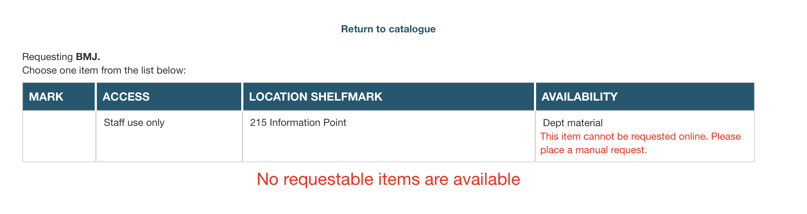
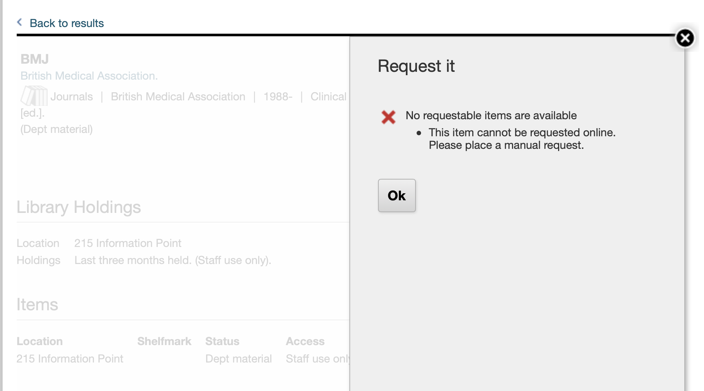

# How do we tell users how to find stuff?

**As part of the work to add physical items to [wellcomecollection.org](https://wellcomecollection.org), users should be able to work out how to find items.**

**This includes:**

*   **Where the item is** – in our closed stores, somewhere on the open shelves, in the reading room, among others
*   **How they find the item** – do they walk the shelves, make an online request, send us an email, and so on
*   **Whether they can see the item** – this covers both access conditions (e.g. does it require permission from a donor) and operational concerns (is it actually in our stores)

**This data is stored across multiple fields in Sierra. This RFC explains how we will combine this data to create an API that can be rendered on the front-end.**


## Principles

*   The API and UI for physical items serve a common purpose: showing physical items on the website.
    We should keep the two closely aligned, and only build things that serve that purpose.

*   Although this RFC only describes requesting items from Sierra, we should not presume the sole use of Sierra.
    Whatever design we choose should be flexible enough to support other catalogues in a future update.

*   The source data comes "as is".
    We can't require drastic changes to the source data.


## The existing approach

### Catalogue models

A *Work* has a list of *Items*, where an item is something that can be requested as a standalone thing.
Each item has a list of *Locations*.
A location is either physical or digital, and a physical location has the following fields:

```
PhysicalLocation {
  locationType: LocationType
  label: String
  license: License?
  shelfmark: String?
  accessConditions: List[AccessCondition]
}
```

Physical types are drawn from a fixed list:

*   Closed stores
*   Open shelves
*   On exhibition
*   On order

Access conditions are defined as follows:

```
AccessCondition {
  status: AccessStatus?
  terms: String?
  to: String?
}
```

Access statuses are drawn from a fixed list, based on the list in the [Wellcome Collection Access Policy §12 Research access](https://wellcomecollection.org/pages/Wvmu3yAAAIUQ4C7F#access-policy):

*   Open
*   Open with advisory
*   Restricted
*   By appointment
*   Temporarily unavailable
*   Unavailable
*   Closed
*   Licensed resources
*   Permission required

### Transformation for Calm records

For Calm records, we create a single item with a single location, with values drawn from the following fields:

*   The location type and label are always "Closed stores"
*   The access status is based on the `AccessStatus` field
*   The access condition terms use the `AccessConditions` field
*   For closed and restricted items, the access condition "to" date is drawn from `ClosedUntil` or `RestrictedUntil` (`UserDate1`) respectively.

### Transformation for Sierra records

For Sierra records, we create a single item per item record, with a single location whose values are drawn from the following fields:

*   We look at the Sierra location code/name, and use that to decide the location type
*   If the location type is Closed stores, we use that as the label; for other locations, we use the location name from Sierra
*   On the bib data, we use field 506 ǂa for the access condition terms, and ǂg for the access condition "to" date
*   We determine access status using three fields:

    -   If 506 first indicator is 0, the record is open
    -   Standard terminology in 506 ǂf
    -   The access condition terms from 506 ǂa

    If these don't agree, we log a warning and don't put any access conditions on the work.
    There are a small number of records where these don't agree.


## What data do we have available?

### The Sierra Rules for Requesting

The [Rules for Requesting](https://documentation.iii.com/sierrahelp/Content/sgasaa/sgasaa_requestrl.html) are a set of rules in Sierra that determine whether an item can be requested.
This determines whether the "Request" button appears in the OPAC, but it doesn't completely block requests.
(e.g. Natalie was able to place a hold on an open shelves item despite it being blocked by these rules.)

The [Sierra documentation](https://documentation.iii.com/sierrahelp/Content/sgasaa/sgasaa_requestrl.html) describes the syntax for these rules, for example:

```
q|b|^||i|=|0||
```

means "don't allow people to request a bib without any items".

These rules can also include user-visible messages, which are displayed in both the OPAC and Encore when somebody tries to request an item:





Our Rules for Requesting are based on the value of the following item fixed fields:

-   61 / Itype (e.g. exhibit, film, serial)
-   79 / location
-   87 / Loan rule
-   88 / status
-   97 / Imessage

### The Sierra Loan Rules

The Loan Rules determine whether an item can be loaned to staff members.

Since we won't expose a "Loan" button through the website, we can safely ignore this.

### Fixed field 88 (status)

This displays the status of an item, and we have the following values:

<table>
<tr><th>code</th><th>label</th><th>count</th></tr>
<tr>
<td><code>-</code></td>
<td>Available</td>
<td>614928</td>
</tr>
<tr>
<td><code>b</code></td>
<td>As above</td>
<td>34051</td>
</tr>
<tr>
<td><code>h</code></td>
<td>Closed</td>
<td>10038</td>
</tr>
<tr>
<td><code>c</code></td>
<td>As above</td>
<td>7579</td>
</tr>
<tr>
<td><code>r</code></td>
<td>Unavailable</td>
<td>5885</td>
</tr>
<tr>
<td><code>y</code></td>
<td>Permission required</td>
<td>5779</td>
</tr>
<tr>
<td><code>6</code></td>
<td>Restricted</td>
<td>5188</td>
</tr>
<tr>
<td><code>m</code></td>
<td>Missing</td>
<td>3556</td>
</tr>
<tr>
<td><code>w</code></td>
<td>Dept material</td>
<td>149</td>
</tr>
<tr>
<td><code>p</code></td>
<td>In cataloguing</td>
<td>47</td>
</tr>
<tr>
<td><code>!</code></td>
<td>On holdshelf</td>
<td>39</td>
</tr>
<tr>
<td><code>e</code></td>
<td>On exhibition</td>
<td>24</td>
</tr>
<tr>
<td><code>s</code></td>
<td>On search</td>
<td>16</td>
</tr>
<tr>
<td><code>z</code></td>
<td>Claims returned</td>
<td>10</td>
</tr>
<tr>
<td><code>x</code></td>
<td>Withdrawn</td>
<td>7</td>
</tr>
<tr>
<td><code>a</code></td>
<td></td>
<td>3</td>
</tr>
<tr>
<td><code>d</code></td>
<td>On display</td>
<td>3</td>
</tr>
<tr>
<td><code>t</code></td>
<td>In quarantine</td>
<td>2</td>
</tr>
<tr>
<td><code>0</code></td>
<td></td>
<td>1</td>
</tr>
<tr>
<td><code>f</code></td>
<td>Returned to vendor</td>
<td>1</td>
</tr>
</table>

This table excludes items that are suppressed/deleted, or which are linked to bibs that are suppressed/deleted – these will never be shown on wellcomecollection.org.

Questions:

*   What does "On search" mean?

### Fixed field 108 (opacmsg)

This returns a message which is displayed in the list of items in the OPAC.
We have the following values:

<table>
<tr><th>code</th><th>label</th><th>count</th></tr>
<tr>
<td><code>f</code></td>
<td>Online request</td>
<td>486909</td>
</tr>
<tr>
<td><code>o</code></td>
<td>Open shelves</td>
<td>112233</td>
</tr>
<tr>
<td><code>-</code></td>
<td>-</td>
<td>32342</td>
</tr>
<tr>
<td><code>n</code></td>
<td>Manual request</td>
<td>21950</td>
</tr>
<tr>
<td><code>u</code></td>
<td>Unavailable</td>
<td>10192</td>
</tr>
<tr>
<td><code>a</code></td>
<td>By appointment</td>
<td>8944</td>
</tr>
<tr>
<td><code>b</code></td>
<td>@ digitisation</td>
<td>5607</td>
</tr>
<tr>
<td><code> </code></td>
<td></td>
<td>5266</td>
</tr>
<tr>
<td><code>s</code></td>
<td>Staff use only</td>
<td>1788</td>
</tr>
<tr>
<td><code>i</code></td>
<td>Ask at desk</td>
<td>1543</td>
</tr>
<tr>
<td><code>q</code></td>
<td>Donor permission</td>
<td>362</td>
</tr>
<tr>
<td><code>x</code></td>
<td>--</td>
<td>139</td>
</tr>
<tr>
<td><code>e</code></td>
<td>Exhib. Gallery</td>
<td>27</td>
</tr>
<tr>
<td><code>d</code></td>
<td>New books</td>
<td>3</td>
</tr>
<tr>
<td><code>p</code></td>
<td>By approval</td>
<td>1</td>
</tr>
</table>

This table excludes items that are suppressed/deleted, or which are linked to bibs that are suppressed/deleted – these will never be shown on wellcomecollection.org.

### The holdCount field on items

Items in the Sierra API include a `holdCount` field, a number telling you how many holds there are on an item.

This is designed for a lending library, where multiple users might have a hold on the same item.
The way we use Sierra means this value almost always has one of two values:

-  `0` = no holds, a user can request this item
-  `1` = a user has this on hold, nobody else can request it right now

This is an opportunity to improve on the current UX.
If another user has requested the item, the OPAC show "1 hold" and hide the requesting button; the Encore hides the button with no explanation.
We can provide a better explanation here.

### The lifecycle of a requested item

Suppose we have an item in the closed stores.
It's available (status = `-`) and can be ordered with an online request (opacmsg = `Online request`).
What happens when somebody places an order?
This is my best understanding of what happens:

1.  A user looks at the item page in Encore.

    Sierra evaluates the Rules for Requesting, and determines this item can be requested.
    The `holdCount` of this item is 0, so Encore displays the "Request Item" button.

2.  The user clicks the "Request Item" button.

    This creates a hold record in Sierra, and increments the `holdCount` of this item to 1.
    A request slip gets printed in the library.

3.  At the next pickup time, somebody in LE&E picks up the slip, and fetches the item from the stores.

    The item gets scanned when it's picked up, and the `status` changes to `On holdshelf`.

4.  The user visits the library, does their research, and returns the item.

    They don't need it held for longer, and are ready for it to be returned to the stores.

5.  The item is moved to the quarantine shelf for 3 days as part of our COVID safety procedures.

    It gets scanned again, and the `status` changes to `In quarantine` (or `In transit`) at other times.

6.  The item completes quarantine, and is returned to stores.

    It gets scanned a final time, and the `status` changes to `Available`.
    The item is now ready to be requested by another user.


## Putting it all together

We have many ways to decide the status of an item in Sierra:

-   Access terms in field 506 on the bib
-   Is an item blocked by rules for requesting?
-   Fixed field 88 (status) on the item
-   Fixed field 108 (opacmsg) on the item
-   The hold count on the item