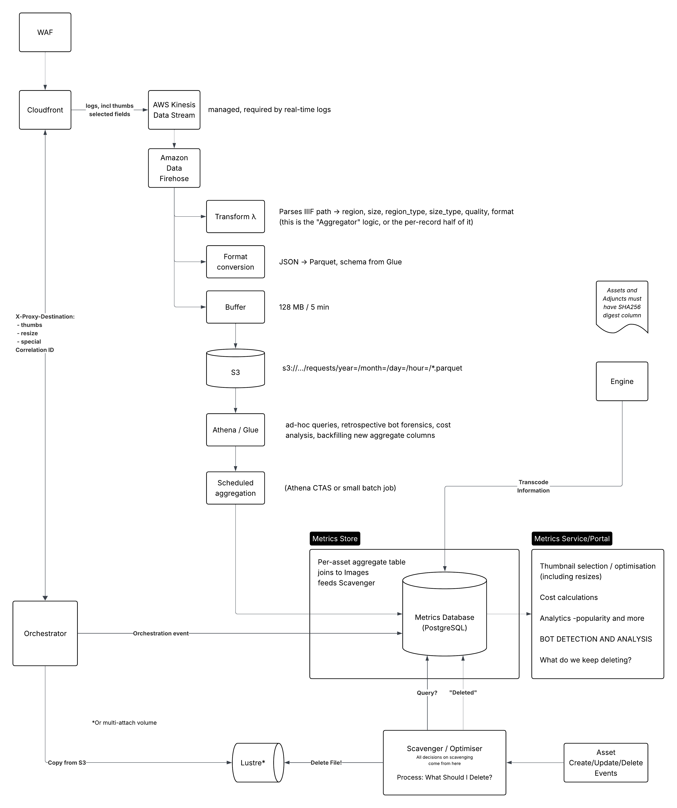

# RFC XXX: IIIF Metrics for efficiency, insight and bot defence

This RFC addresses two distinct problems, but they have overlapping solutions.

The first is better metrics for performance, cost saving, user experience. DLCS balances "hot" images in fast random access volumes, against "cold" images in S3. It augments this with various alternative approaches for _predicted_ common image size requests (e.g., thumbnails). Hot images are evicted from the fast disks by a fairly simple algorithm.

The second is the increasing challenge of bot traffic - automated, high volume requests. Typically, organisations exposing open APIs are troubled by bulk crawling of JSON documents like IIIF Manifests. At Wellcome, this isn't so much of a problem; Manifests are pre-generated and proxied from S3. Increased scraping traffic on these is still low-overhead, low-cost and while annoying for us, doesn't degrade the user experience. The real problem for the DLCS is IIIF Image API traffic: HTTP requests that return image responses. If these responses are dynamically generated by an image server, rather than simply proxied from existing images in S3, this traffic is very _computationally intensive_ and therefore expensive. High volume image crawling leads to scale-out, possible overload and sometimes too much pressure on our caching mechanisms (because the nice long-tail distribution to favour caching of those images that are actually popular with humans has been broken by automated traffic).

To some extent, we hope that generic anti-bot technologies sitting in front of our systems will kick in and protect our services - e.g., Web Application Firewall on AWS (WAF). But IIIF Image API traffic may not fit the patterns WAF is looking for. We may need our own additional custom heuristics as well. The same metrics store can, we hope, drive both use cases.

**Last modified:**  2026-06-01T17:00+00:00

## Context

What does DLCS do now? 

 - We serve the fixed-size thumbs that have been created by an image's configured  [`thumbs` delivery channel](https://dlcs.github.io/public-docs/api-doc/delivery-channels/#thumbs). These are proxied from S3; they are designed to service UIs that request a large number of thumbnails of known size. They do not hit an image server. Although this is called the thumbs delivery channel and the primary use case is UI that shows large numbers of thumbs at once, any size image may be a thumb, and we can store much larger images this way to drive _extremely responsive_ viewing UI [like this one](https://digirati-co-uk.github.io/st-louis-fed-exploded-viewer/?manifest=https://digirati-co-uk.github.io/st-louis-fed-exploded-viewer/b28047345.json).
 - Requests for /full/{size}/ that cannot be served by a static "thumb" are routed to a configured Cantaloupe instance: [SpecialServer](https://github.com/dlcs/protagonist/issues/30). This is configured to read from S3, but it still copies the file down to a Cantaloupe-managed local storage. This scales out under load, but suffers from a number of issues that make it not-ideal.
 - Other requests (typically tile requests from deep zoom clients) are forwarded to an instance or instances of Cantaloupe that have a mounted Lustre volume, which Cantaloupe (using Kakadu) can perform fast random-access reads on. If an image file is not on this volume, DLCS's Orchestrator proxy will copy it onto the volume from S3, holding up the triggering request in the process. The idea is that the Lustre volume fills up with the most-used images. But automated scraping traffic pollutes the cache: this idea, while sound until a few years ago, no longer holds.

We evict files from the Lustre volume on a simple least-recently-used basis, but when under heavy load, this eviction/scavenging process can fail to keep up with pressure on the volume, leading to more drastic indiscriminate eviction. The same issue affects the SpecialServer instances; although the "support S3 backends" they still need to copy the JP2 locally; each is effectively managing its own orchestration and cache eviction. Under load, eviction can fail to keep up and the box stalls.

## Principles

* The aim is not necessarily to provide the fastest possible response to all callers.

* Infrastructure costs money. _We are not your cache_.

* The aim is to provide a reasonable service to human and bot consumers, at reasonable cost to Wellcome. Otherwise, the entire collection of 60m JP2s would be on unlimited Lustre volumes, fronted by infinitely scaling image servers, and nobody would ever notice service degradation even when heavy scraping of images is happening. Such a setup would be ruinously expensive, not to mention having an appalling carbon footprint.

* We do not want to prevent computational consumption of the IIIF APIs, including the expensive Image API. That's (at least partly) what these APIs are for! They aren't just for humans to look at on web pages. There are all sorts of interesting applications of _Collections as Data_ that the IIIF APIs (alongside the semantic Catalogue API) enable.

* ...But humans looking at web pages is the priority performance area. Bot traffic should not impair the user experience for humans.

* Considerate, rate-limited, self-identifying bot traffic is welcome. Evasive, high traffic, inconsiderate bot traffic is not; if we deem it inconsiderate, we will attempt to block it. Organised distributed load, that attempts to disguise its distributed nature, is very much not welcome.

## Challenges

But how do we block or throttle the bad traffic and allow the good?

The Orchestrator component in DLCS is the "front of house" - it's a proxy to the underlying image servers, static thumbnails, transcoded AV and other resources. It enforces access control via the IIIF Authorization Flow API, it triggers file copies from S3 to the Lustre volume, it decides which downstream imaage server to route to.

After WAF and CLoudfront, it's the "real" DLCS application and could contain arbitrarily complex throttling or blocking strategies.

Throttling in Orchestrator is not a good idea. Delaying a response means holding the HTTP connection, the [Kestrel](https://learn.microsoft.com/en-us/aspnet/core/fundamentals/servers/kestrel?view=aspnetcore-10.0) request slot, and any upstream resources open for the duration. Under exactly the load conditions where we would want to throttle, "tar-pitting" multiplies our concurrency problem. The cheap responses are `429 Too Many Requests` with `Retry-After`, or outright blocking. Considerate bots will honour Retry-After; inconsiderate ones get escalated to blocking anyway.

Bursts of image requests for deep zoom tiles are normal IIIF traffic, generated by humans zooming into and panning around high resolution tiled images. We mustn't mistake these for automated traffic. But some bots/scripts imitate such traffic; it's trivial to write a IIIF tile-stitcher and unleash it against a collection. [There](https://docs.rs/crate/dezoomify-rs/latest) [are](https://labs.onb.ac.at/gitlab/labs-team/iiif-image-manipulation/-/tree/master/stitching) [many](https://github.com/baurls/TileStitcher) [examples](https://labs.onb.ac.at/gitlab/labs-team/iiif-image-manipulation/-/blob/6764e673fe95cf408dc396514076b428140858d9/iiif_modifier/IIIFImageStitcher.py).

One detection method might be a burst of requests for different images from same source (IP/User agent) that are not thumb requests. But this also might be a legitimate user interface that doesn't respect the advertised preferred [`sizes`](https://iiif.io/api/image/3.0/#53-sizes) property of an image service (Wellcome Manifests publish this per-image in the Manifest too). We'd want to be able to respond politely with the image pixels, but also a message "please use a value from the sizes array for bulk requesting".

If requests get through WAF, and Orchestrator (or some monitor of the metrics database) thinks they are problematic, how do they get blocked? Does Orchestrator do it? Or does Orchestrator tell WAF?

The latter is possible: AWS WAF IP sets are updatable via API, and rate-based rules can be scoped to URI patterns. A DLCS _Metrics Monitor_ (or whatever watches the metrics database) pushes offending IPs/CIDRs into an IP set with a TTL; CloudFront+WAF enforces it at the edge, before traffic ever reaches Orchestrator. This is much better than blocking in Orchestrator itself, because blocked traffic costs us nothing. Orchestrator-level decisions then only need to cover the softer responses (don't-orchestrate, degrade to slower path)


## Other people's problems

Within the IIIF Community, people seem to suffer from text-based crawling more than image-based crawling. Anyone who generates manifests dynamically (as Wellcome did at the beginning) will have serious problems from link-following crawlers in 2026.

However, high-profile targets _do_ suffer from excess automated image traffic. This seems targeted more often than not; scripted, not necessarily actively malicious, but often careless. The intent is get as much image content as possible, rather than an all-out denial of service.

## Other people's solutions

Most of these are not really dealing with Image API traffic, and are more conventional Web Application and Web API protection solutions.

- [Cloudflare](https://www.cloudflare.com/) - particularly [Cloudflare Turnstile](https://www.cloudflare.com/products/turnstile/) for human-initiated interactions.
- [Anubis](https://anubis.techaro.lol/)
- [Traefik](https://traefik.io/)
- [F5 Firewall](https://www.f5.com/solutions/web-app-and-api-protection)
- [Basic NGINX rate limiting](https://joshtronic.com/2025/11/09/rate-limiting-nginx/)

## Proposal



### Gather usage stats from CloudFront

All requests to Protagonist (current DLCS version) are via CloudFront. We already log access requests to S3, which we can query using Athena. CloudFront is already tracking usage requests - can we hook into this to get access requests? Can these be stored in a _Metrics Database_ - in PostgreSQL?

For a raw per-request table, Postgres will work at first but billions of rows of append-heavy, scan-heavy data is what *columnar* stores are for. In the diagram above, S3 recieves Cloudfront data in partitioned [Parquet](https://en.wikipedia.org/wiki/Apache_Parquet) format. This is queryable forever via Athena, and is very cheap. Then, an **Aggregator** ([Athena CTAS](https://docs.aws.amazon.com/athena/latest/ug/ctas.html) or a small batch job) writes per-asset rows to PostgreSQL. PostgreSQL is the right place for the per-asset aggregate table (~60m rows max) and for joins against the existing Images table. If we later need fast ad-hoc queries on raw events, we could use [ClickHouse](https://clickhouse.com/). But we may never need it if Athena-over-Parquet covers retrospective analysis and the aggregator covers near-real-time.

#### How can we get stats from CloudFront?

Orchestrator writes custom headers into the response that are very useful for such a metrics database. These include:

 - `x-proxy-destination` - which image server / static resource / thumb the request was routed to
 - `x-asset-id` - the image ID in DLCS
 - `x-orchestrated` - (??) whether this particular request triggered the copy from S3 to Lustre
 - `...` - (others)

Can Cloudfront use these? Lambda at edge? If we use origin response we will be able to determine how the image was served via x-proxy-destination header, and x-asset-id header for AssetId (do these 2 headers mean this is the preferred method?). Would/could this slow requests down as we are already using origin request lambda?

Orchestrator can add any additional headers to the response that will be useful in populating the hypothetical metrics structure below. This means that entries arrive at the metrics store _some time after the request has completed_, but also that Orchestrator has no metric-recording overheads of its own. We should be careful not to invent new headers for Orchestrator to emit that actually cost it significant overhead to determine.

However:

If we capture `x-proxy-destination` / `x-asset-id` via an origin-response Lambda, we only ever see requests that missed the CloudFront cache. For _cost analysis_ that's arguably the traffic we care about, but for bot detection we need the full request picture — a bot hammering a cached tile is invisible to origin-response. Viewer-response fires on every request but adds latency and cost to every request.

CloudFront real-time logs (Kinesis-native, no Lambda@Edge at all) record every request including cache hits, with `x-edge-result-type` telling you hit/miss. **BUT** They don't carry custom origin response headers!

How much is actually derivable from the URL path alone? Thumbs vs /full/*/ vs tile is path-shaped.  The **orchestration-specific** facts (orchestrated, which backend served it) could come from Orchestrator's own event stream instead, joined on a correlation ID or just on (asset, timestamp). That avoids Lambda@Edge entirely. It can't slow requests down as it's not in the requests path. But it does mean correlating Orchestrator information with Cloudfront information.

To repeat:

Real-time logs let you choose from a fixed field list (URI, IP, user-agent, result-type, response bytes, edge location…). They cannot carry custom origin response headers like `x-asset-id`. For DLCS that's _mostly_ fine, because asset ID and request type are derivable from the URI by the transform Lambda. But anything only Orchestrator knows (e.g. "this request triggered orchestration") must arrive by a separate path, such as Orchestrator's own events into the same Firehose or directly into Postgres, joined later on asset + time window, or more likely, Correlation ID. _This needs more design thought_.


### Per request information, from logs

_Scope to image requests only_

Amazon Data Firehose (formerly Kinesis Data Firehose) is a fully managed service that does one job: accept a stream of small records (in this case, Cloudfront logs), buffer them, and periodically flush the batch to a destination — S3, in this case. We don't run servers, manage consumers, or handle retries.

The core mechanic is the buffer. It has two thresholds:

  - Buffer size — e.g. 128 MB
  - Buffer interval — e.g. 300 seconds

Whichever is hit first triggers a flush: Firehose writes everything it has accumulated as one object in S3. This matters enormously for our metrics workload. CloudFront real-time logs for image traffic could be thousands of records per second; written naively that's thousands of tiny S3 objects per second, which is both expensive (PUT requests cost  money) and terrible to query (Athena's performance dies on millions of small files). Firehose turns a firehose of records into a steady drip of a few large, well-sized files per minute. 

CloudFront real-time logs are natively delivered to a Kinesis Data Stream, and Firehose can read straight from that stream. So the pipeline is:

CloudFront → Kinesis Data Stream → Firehose → Transform λ → S3

"Transform λ" is a custom lambda to transform each record in flight; this is where we parse the IIIF URL into region, size, region_type etc., before it's written.

#### Parquet: why not just JSON or CSV?

Firehose can write the records as-is (JSON lines), but it also has built-in record format conversion to Apache Parquet. Parquet is a columnar, compressed, binary format, perfect for the high volume expected here:

* Columnar layout. A JSON log file stores records row by row; to answer "count requests per asset_id last week", Athena must read every byte of every record — user agents, raw paths, all of it. A Parquet file stores each column's values contiguously, with metadata describing where each column lives. The same query reads only the asset_id and timestamp columns and skips the rest of the file entirely. For a wide table like the provisional schema below, this means a 10–50× reduction in data scanned. Athena charges per byte scanned ($5/TB).
* Compression. Parquet compresses each column independently. Columns full of repetitive values - which we expect (quality is almost always d, format almost always j, the same bot IP appears 50,000 times in a row) compress well, often 10–20× smaller than the equivalent JSON. A billion rows of this schema in Parquet is tens of GB in S3, costing pennies per month.
* Statistics and predicate pushdown. Each Parquet file carries min/max values per column per internal block. A query filtering on timestamp > X can skip whole blocks without decompressing them.

Format conversion needs a *schema*, which Firehose reads from a Glue Data Catalog table. Firehose uses it to convert incoming JSON records to typed Parquet. Athena then queries against that same Glue table. One schema definition, used by both ends.

#### Provisional Parquet schema

| Field        | Description and type                                               |
|--------------|--------------------------------------------------------------------|
| timestamp    |                                                                    |
| correlation  | correlation id                                                     |
| asset_id     | e.g., 2/5/b12345678_0037.jp2                                       |
| raw_path     | e.g., 2/5/b12345678_0037.jp2/256,256,256,256/256,256/0/default.jpg |
| region       | e.g., "full" or "256,256,256,256".                Store as string? |
| region_type  | (full / calculated tile / OSD sub-tile / other)    char f, t, s, o |
| size         | e.g., "max" or "256," or "256,256"                Store as string? |
| size_type    | (max / tile / OSD sub tile / other)                char m, t, s, o |
| rotation     | Store null for 0?, otherwise, numeric, float                       |
| quality      | (default / bitonal / grayscale ... )             char d, b, g, etc |
| format       | (jpg / png / ...)                                 char j, p, w etc |
| user_agent   | string                                                             |
| ip_address   | string                                                             |
| orchestrated | Did *this* request trigger orchestration?                          |
| destination  | CF / thumb / resize / specialserver / img server          char ... |


1. Region type, algorithm for computing this... simple: Is it square, power of two or from edge if not square? Better: Is it a valid tile from the image's info.json?
2. OSD sub tile. OSD makes (or at least used to make) a burst of requests smaller than the specified tile size, which just waste the server's time.
3. Destination - how did we service this request? Did it even reach orchestrator? Where did orchestrator route it to? (is this coming from Cloudfront?)
4. Do we want to query on quality.format (store a specific value for default.jpg, for example?) Or is that overoptimisation?
5. The incoming metrics aggregator could obtain and cache (in memory) the info.json which is needed to compute some of the above. If we are confident that we know what the `tiles` property of an info.json will be just from its height and width (fixed tiles, ignore any individual JP2 tile settings - like IIPImage) then we can answer the question "is this a valid tile request" from an algorithm (already implemented in iiif-net). This confidence is not necessarily justified - it depends on the image server (e.g., IIPImage will always generate a fixed 256 tile set, other image servers inspect the tiles and precincts of the actual JPEG 2000 to compute the ideal tile set(s)).


#### Partitioning

"Partitioned" means Firehose writes objects under a key structure like:

```
  s3://wc-iiif-metrics/requests/year=2026/month=06/day=12/hour=14/
      wc-metrics-1-2026-06-12-14-03-22-a1b2c3d4.parquet
      wc-metrics-1-2026-06-12-14-08-51-e5f6a7b8.parquet
```

The key=value path segments are Hive-style partition keys, and Athena understands them as virtual columns. A query with `WHERE day = '2026-06-12'` never even lists the other days' prefixes, let alone reads them. Without partitioning, every query scans the entire history; with date partitioning, a "what happened in the last hour" bot-hunting query touches a few files regardless of whether there are three months or three years of data.

Date/hour partitioning is Firehose's default behaviour and is the right choice here, since essentially every query (cost analysis, bot forensics, scavenger input) is time-bounded. (Firehose also supports dynamic partitioning on record fields, e.g. partitioning by destination, but **this is dangerous**, because partitioning on anything high-cardinality like asset_id would recreate the millions-of-tiny-files problem. Time alone is correct for this table.)

`ip_address` is personal data under UK GDPR. We could store a salted hash (or /24 truncation) in long-lived data and keep raw IPs only in a short-window table used for active bot response. Partitioning gives us retention and an approach to GDPR: an S3 lifecycle rule like "objects under requests/ transition to Glacier after 90 days, delete after 400". Deleting a partition prefix is how we can implement a GDPR requirement like "raw IPs only live N days."


#### Latency

Records appear in S3 a few minutes after the request (buffer interval + delivery). That's fine for the scavenger/optimiser and for retrospective analysis, but it is not a real-time bot-blocking path. For sub-minute reaction, that consumer should read the Kinesis stream directly (a second consumer alongside Firehose, Kinesis supports this natively) and keep its own short-window state. Same ingest, two consumers with different latency needs; this cleanly resolves the RFC's tension between "rich forensic store" and "fast enough to act."

#### Costs

Firehose is priced per GB ingested (~$0.03/GB plus a little for format conversion), the Kinesis stream a few cents per hour per shard, S3 storage very little at these compressed volumes. The recurring cost that needs watching is Athena scans — which is exactly what Parquet + partitioning minimise. There's no idle cost: nothing in this pipeline incurs costs when traffic is quiet.

#### Compared with current CF+Athena

This is different from the standard CloudFront access logs we already query with Athena. Those are free but delayed (minutes to hours, no SLA), gzipped TSV (slow/expensive to scan), and unpartitioned by default. The real-time-logs pipeline costs a little to run but gives us minutes-fresh, typed, columnar, partitioned data with IIIF-specific fields already parsed. We can keep both: standard logs as the free belt-and-braces archive, this pipeline as the working store.


### Per-asset aggregated table

This is where PostgreSQL takes over. The aggregated per-request data becomes per-asset data. Possibly the same asset can have multiple rows with different time spans.

| Field            | Description and type                                               |
|------------------|--------------------------------------------------------------------|
| asset_id         | e.g., 2/5/b12345678_0037.jp2                                       |
| start            | When the metrics for this row were captured from                   |
| end              | ...and to                                                          |
| requests         | total individual requests of any type                              |
| info_json        | number of info.json requests |
| tiles            | number of standard deep zoom tile requests |
| other_regions    | number of other non-full region requests |
| thumbs           | number of thumbnail requests |
| full_non_max     | number of requests for /full/(size)/ where size is not max |
| full_max         | number of requests for /full/max/ (or /full/full/) |
| distinct_full    | number of distinct /full/(size)/ by size |
| distinct_ip      | number of distinct IP addresses |
| distinct_ua      | number of distinct user agents |
| distinct_clients | number of distinct clients (how do we tell this?) |
| tile_clients     | number of clients making at least one standard tile request |
| thumb_clients    | number of clients making at least one thumb request |
| full_clients     | number of clients making at least one /full/*/ request |
| orchestrations   | number of times this file was orchestrated in the period (0..n) |
| deletions        | number of times this file was deleted in the period (0..n) |
| default_jpg      | number of requests for /default.jpg |
| default_png      | number of requests for /default.png |
| default_webp     | number of requests for /default.webp |
| default_other    | number of requests for /default.* (other) |
| other_quality    | number of requests where quality != default |
| sizes_???        | Some way of capturing the spread of sizes being asked for? |

This can join to the existing DLCS Images table for:

 - size
 - location(s) (nas?)
 - open/not open (affects cloudfront cache)

This table will be at least at big (eventually) as the number of rows in the DLCS Images table (~60m). But depending on our start/end partitioning approach, it could be multiples of this.

Notes

1. distinct_clients - "how do we tell this?" We can't, reliably; (IP, user_agent) tuples are the usual approximation and are spoofable. All client identity in this system is heuristic, which is fine because the consequences (slower service, rate limits) are proportionate.
2. sizes_??? - a JSONB histogram column ({"400,": 1200, "1024,": 80}) on the aggregate row, or a separate (asset_id, period, size, count) table if we want to query across it.
3. The fixed-column aggregate table is rigid — every new question ("how many WebP requests?") becomes a schema migration and a backfill problem. If raw events live cheaply in S3/Parquet, the aggregate table becomes a rebuildable materialisation rather than the system of record, and that rigidity stops mattering.

### Gather orchestration stats

Given that we can only gather standard Cloudfront information, we need another way to feed and correlate Orchestrator-specific information into the store.

TODO

Orchestrator could raise events? We need to guarantee delivery, a little late is likely fine.

 - Write direct to postgres?
 - Raise an SNS message?
 - Raise CloudWatch metric?

What other changes would be required for Orchestrator? 

Write to ImageLocation.nas location (allows multi diff locations)

No need to touch files - mtime doesn’t need to be accurate as scavenger service will track itself.

### Scavenger / Optimiser

This is a new service, responsible for looking at data entered into the Metrics Database and making a decision on what should go from the Lustre volume.

What is this? (dotnet/python). Is it part of Protagonist or separate? How does it make decisions? Does it use LRU/LFU or some combination of both?

This needs to feed deleted events back into the Metrics Database. Does it go in raw? Or does something manage io? Is this the master of the metrics db? (ie manages schema etc).

### Lustre Alternative

Should we consider EBS multi-attach volume? What are the pros/cons? 

Multiple volumes. The optimizer can move between (logic TBC - e.g. big artworks in one and smaller/easier churn in another). Above re: ImageLocation.s3 refers to this behaviour.

## Architectural alternative

The above gathers the metrics we need for analysis of traffic for costs, cache eviction (scavenger) and perhaps bot-detection (see below). But we still have the problem of _having to orchestrate_ - having to pollute our expensive cache for what might be a single drive-by request for a non-full region of an image, or a single view of a page that renders the top layer of tiles in OpenSeadragon that a user never zooms into. We have to orchestrate for these because we can only serve such requests from an image server that has the image mounted on a fast random access filesystem (not S3). If we naively use Cantaloupe with an S3 back end (because it appears to solve the problem) we will have terrible performance and no control over an optimal cache at all. 

(This applies to JP2s)

But...

What if performance for _tile-serving_ - not [SpecialServer](https://github.com/dlcs/protagonist/issues/30) `/full/*/` requests - was tolerable from an S3 back-end _with no local file copy_? That is, perceived as OK by users, even if it's not _as_ super smooth and fast as when served from a real disk. Then, we don't *have* to orchestrate the image file, we can hold off and *see what happens* - what other traffic for the image follows.

This would allow an orchestration decision to be based on retrospective metrics, rather than immediate need. A metrics monitor could have a candidate list of files to orchestrate as well as files to scavenge; if in the list, a subsequent request for the image would make orchestrator move it (even allowing traffic to pass through to the slower S3-direct server until the orchestration copy has been completed).

This restores the original benefit of the orchestrated cache. In the pre-bot era, this cache represents the left-hand peak of the [long-tail distribution of traffic generated by real people](https://github.com/dlcs/protagonist/issues/47). This worked well until only a few years ago and is still the architectural core principle of the DLCS. If we can identify one-off, drive-by or otherwise non-human looking traffic, even for requests that today MUST be orchestrated, we can serve them through slower image servers than can still scale out if necessary. We can still maintain a pool (e.g., 1TB or 2TB) of "hot" images, on fast SSDs mounted on the image server for random access. But this pool is much more stable. With bot traffic, the cache is in a constant state of churn.

This of course still requires the ability to differentiate the types of traffic.

> [!TIP]
> Deferred orchestration (serve first requests from a slower S3-backed image server, orchestrate only when metrics say the asset is genuinely popular) is the only proposal here that structurally fixes the cache-pollution problem rather than detecting and reacting to it. Every bot-detection heuristic will have false negatives; deferred orchestration makes undetected bots merely slow rather than cache-poisoning. It also converts the hardest requirement - real-time bot classification - into a softer one: we only need to distinguish human-ish from bot-ish traffic *eventually*, on a minutes timescale, to decide promotion into the hot pool. 

**TODO** - How do we make performance for tile-serving tolerable from an S3 back-end with no local file copy? We may have the answer...

## 🤖 Dealing with bots 🤖

If gathered from Cloudfront, the metrics data is post-request. This has benefits and weaknesses. 

Our instinct is that many examples of IIIF traffic, especially image traffic, could only be judged as "bad bot" after evaluating multiple requests. A tile-stitcher script would not be obvious from just one request. If the evaluation of traffic is happening reasonably quickly (i.e., not a once-a-month report generation), and we could decide that traffic is a bot so we can block, or at least not-orchestrate the image it's hitting.

How do we identify a bot?

 - retrospectively, from metrics
 - As it's happening

// TODO - one of the hard parts! - We now have the metrics but how do we use them to detect bots!!!

What do we do if we do identify one?

Bot detection now influences orchestration, so a false positive doesn't just rate-limit a user, it silently degrades image performance for them. The wellcomecollection.org viewer needs to be effectively unblockable (allowlist by origin/referer plus, if possible, the signed short-lived token idea hinted at in the API Keys section. Spoofable in principle, but it raises the bar and we only need it to gate priority, not access).

### Firewall strategies

What *general-purpose* services from WAF, Cloudflare, F5 Firewalls etc help us?

What can't they do because it's specific to IIIF traffic, especially image traffic?

#### IIIF Presentation API

This doesn't bother us so much at Wellcome, because Manifests are static and proxied. But is still a magnet for bots, and is problematic for dumb bots just following links in JSON. JSON-LD has a lot of links.

We need to ensure we *fail-fast* on requests that can't serve a response, e.g., Canvas `id`, Range `id` - don't waste resources on them (pattern match at Cloudfront?)

Discussion of current WAF rules for iiif.wellcomecollection.org

(redacted!)


#### IIIF Image API

Can WAF help us?

What do other people do?


## Scavenger

Decision to evict is based on:

 - performance for human users
 - cost

As the disk nears a threshold, we need to start deleting orchestrated files

Example bad case
 - a very large artwork that is viewed intermittently. But often enough that it keeps getting re-orchestrated just after it's been scavenged

Conversely a very small jp2 that won't free up much space and is occasionally viewed

### Scavenging based on retrospective metrics

Decisions to evict is not just a LRU touched time.

It's based on the metrics database... but if so, what is the eviction algorithm?


### Metrics Monitor

Is there something watching the metrics and determining 

- what files to orchestrate *to* the hot disk(s)
- what files to evict *from* the hot disk(s)

... and is this same watcher evaluating traffic for potential bots, and if so, what does it do when it detects one? This isn't happening at the firewall level, it's something adjacent to the normal HTTP flow. What component does it tell, and what information does it give it such that a subsequent request from that source will be blocked?


### API Keys

This is a possibility, others have done this.

This is NOT IIIF Auth, but something different.

The APIs are open, but traffic with a known API key is not rate-limited whereas other traffic is.

The problem with this approach is that we don't want to rate-limit human-generated traffic originating from wellcomecollection.org, and perhaps from any real viewer. But how do we identify such traffic - in a way that can't be spoofed/emulated by attackers? And how do we rate-limit traffic we think is something else?

Anonymous traffic gets a generous-but-real rate limit; registered keys get higher limits. We don't need to identify humans perfectly. We need the default limit set above what any human viewer generates, which the metrics will tell us.


## Alternatives Considered

Proof of work barriers

 - at the web page level, edge case - and that's for Wellcome to decide
 - at the API, absolutely not

IIIF Auth API on everything

 - Too much overhead, harms interoperability in practice, even if not in principle - "everyone can just implement a IIIF Auth client right?"


### Prometheus

Prometheus is built for *low-cardinality*, pre-aggregated numeric time series. Our raw table has asset_id (60m values), ip_address, and raw_path as dimensions. This is an event/analytics workload, not a metrics workload.

### PostgreSQL for per-request logging

For the raw per-request table, Postgres will work at first but billions of rows of append-heavy, scan-heavy data is more suited to a *columnar store*. 

Firehose → S3 in partitioned Parquet (queryable forever via Athena and very cheap, can keep for very long periods). The Aggregator writes only ... *aggregates* to Postgres. 
  

## Impact

(incl risks)

IP address is personal data under UK GDPR. There needs to be a privacy policy. We need a retention answer anyway; consider storing a salted hash (or /24 truncation) in long-lived data and keeping raw IPs only in a short-window table used for active bot response.

Cost of the pipeline itself: "super-rich metrics may be so costly... it's not worth it" — sampling is the standard mitigation, but note the asymmetry: cache optimisation tolerates sampling well, bot detection much less so. We might sample the raw archive while keeping the short-window bot table complete.

## Next Steps

A list of next steps for implementing the proposed solution, including any dependencies or prerequisites.

